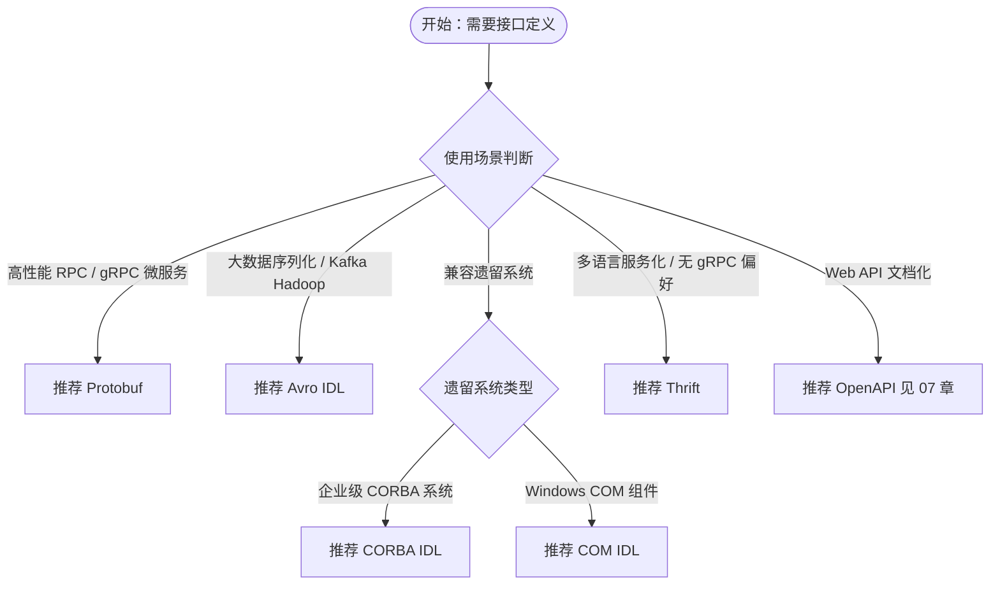

# 五、IDL 规范对比：多维度选型决策

## 对比维度说明

本章从前一章介绍的五大主流 IDL 规范中提炼出九个关键对比维度，覆盖**语法表达力**（语法风格、类型系统）、**序列化效率**（二进制格式、性能）、**长期可维护性**（Schema 演进）、**工程化能力**（工具链生态、学习曲线）、**传输适配性**（传输协议绑定）与**生态健康度**（社区活跃度）四个层面。维度选择依据为：在实际选型中，前两者决定"能不能用"，中两者决定"好不好维护"，后两者决定"团队能否长期承接"。维度间相互独立且对选型决策具有显著区分度，便于读者按场景快速定位关键约束。

## 多维度对比表格

| 维度 | Protobuf | Thrift | CORBA IDL | COM IDL | Avro IDL |
|---|---|---|---|---|---|
| 语法风格 | message/service 声明式 | struct/service 声明式 | interface/struct 声明式 | interface C 风格 | protocol/record 声明式 |
| 类型系统 | 强类型，支持 enum/oneof/map | 强类型，支持 enum/set/list | 强类型，支持 union/any | 强类型，基于 COM VARIANT | 强类型，schema 内嵌 |
| 二进制格式 | 二进制 + 长度前缀 | 多种（binary/compact/json） | CDR（Common Data Representation） | NDR（Network Data Representation） | 二进制，schema 不内嵌 |
| Schema 演进 | 强兼容（reserved 字段、字段编号） | 中等兼容 | 弱兼容（需 ORB 适配） | 弱兼容 | 强兼容（reader/writer schema 解析） |
| 工具链生态 | 极丰富（protoc/buf/多语言） | 丰富（thrift 编译器/多语言） | 中等（ORB 产品） | Windows 限定（MIDL/VS） | 中等（avro-tools/Schema Registry） |
| 学习曲线 | 低（语法简洁） | 低（语法简洁） | 高（OMG 规范复杂） | 中（COM 概念多） | 低（语法简洁） |
| 性能 | 高（紧凑二进制） | 高（多格式可选） | 中（CDR 开销） | 中（NDR 开销） | 高（无字段标签，更紧凑） |
| 传输协议绑定 | gRPC/HTTP-2 | 多种（TCP/HTTP） | IIOP/GIOP | DCOM RPC | 多种（HTTP/TCP/Kafka） |
| 社区活跃度 | 极高（Google + CNCF） | 中等（Apache 项目） | 低（遗留系统为主） | 低（Windows 限定） | 中等（大数据生态） |

## Mermaid 决策树

按典型使用场景推荐 IDL 方案。决策路径以"使用场景判断"为根节点，按业务约束逐层分流至具体规范推荐。

## 选型决策指南

### gRPC 微服务

推荐 **Protobuf**。Protobuf 是 gRPC 的原生接口定义语言，二者深度集成，HTTP/2 多路复用与 Protobuf 紧凑二进制相结合，在微服务间通信中性能最优。生态方面，`protoc`、`buf` 工具链与 CNCF 全家桶（Envoy、Istio、gRPC-Web）无缝衔接，多语言代码生成覆盖主流技术栈，是云原生场景下的默认选择。

### Facebook/Meta 生态或兼容遗留 Thrift 服务

推荐 **Thrift**。Thrift 起源于 Facebook，在 Meta 内部及其衍生项目（如 Cassandra、HBase 早期通信层、Scribe）中有大量部署。若团队已采用 Thrift 体系或需对接 Cassandra 等系统的原生接口，沿用 Thrift 可避免引入第二套 IDL 工具链。Thrift 提供多种传输与协议组合（binary、compact、json），灵活度较高。

### 企业遗留系统集成

推荐 **CORBA IDL**。金融、电信、工业控制等领域存在大量基于 CORBA 的遗留系统，其接口通过 IDL 描述并由 ORB（Object Request Broker）代理通信。新系统对接此类场景时，CORBA IDL 是唯一原生选项，需通过 IIOP/GIOP 协议与 ORB 桥接。鉴于 OMG 规范复杂、社区活跃度低，建议仅在集成遗留系统时使用，新项目不宜选型。

### Windows 生态组件开发

推荐 **COM IDL**。COM IDL（MIDL）是 Windows 平台组件对象模型的标准接口描述方式，广泛应用于 Office 自动化、Shell 扩展、ActiveX 控件、DCOM 分布式组件等场景。若开发目标为 Windows 系统级扩展或与 Office/IE 等原生组件交互，COM IDL 不可替代。其绑定由 MIDL 编译器与 Visual Studio 工具链生成，跨平台能力受限。

### 大数据/流式序列化

推荐 **Avro IDL**。Avro 是 Hadoop 生态的核心序列化格式，与 Kafka Schema Registry、Confluent Platform 深度集成，支持基于 reader/writer schema 的双向兼容解析，无需在二进制中内嵌字段标签即可实现紧凑编码与演进兼容。在流式数据管道、数据湖存储（Parquet/ORC 底层依赖）、Kafka 消息持久化等场景下，Avro IDL 是事实标准。

### 跨语言通信但无特定框架偏好

推荐 **Protobuf**。在没有 gRPC、Thrift 或特定生态约束时，Protobuf 综合最优：语法简洁、工具链最丰富、性能优秀、社区活跃度最高，且 Schema 演进机制成熟（reserved 字段、字段编号约束）。多语言代码生成覆盖超过 20 种编程语言，长期可维护性最佳，是"无偏好"场景下的稳妥默认。

## 补充参考：零拷贝序列化方案

除上述五大规范外，**FlatBuffers**（Google，2014）和 **Cap'n Proto**（Kenton Varda，2013）专注于零拷贝序列化，序列化结果可直接在内存中读取，无需解析步骤，适用于游戏、实时音视频、高频交易等对延迟极敏感的场景。两者均有各自的 IDL（FlatBuffers Schema、Cap'n Proto Schema），但生态规模小于 Protobuf/Thrift，工具链与多语言支持相对有限，因此不在本教程主要介绍范围内。读者可在掌握主流 IDL 后按需进一步研究。

---

**上一章**：[04 - 主要 IDL 规范介绍](04-major-idl-specs.md)  
**返回目录**：[00 - 概念总览](00-overview.md)  
**下一章**：[06 - IDL 编译流程与工具链](06-toolchain.md)
