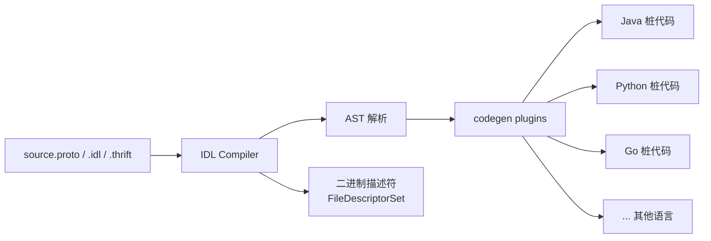

# 六、IDL 编译流程与工具链：从源文件到多语言桩代码

## 一、IDL 编译流程总览

IDL 编译器是连接"协议定义"与"多语言实现"的枢纽。其核心职责是：读取 IDL 源文件 → 解析为 AST（抽象语法树）→ 调用语言插件生成目标代码 → 同时输出二进制描述符（如 Protobuf 的 `FileDescriptorSet`），用于运行时反射或动态编解码。



关键点：

- **一份 IDL，多语言输出**：避免人工同步多份语言定义，降低漂移风险。
- **插件机制**：编译器主体只负责 AST，语言输出交给插件（如 `protoc-gen-go`、`protoc-gen-grpc-java`）。
- **描述符文件**：可被运行时加载，支持动态消息构造与反射（如 gRPC 反射服务）。

## 二、主流编译器介绍

### 1. protoc（Protobuf 编译器）

Protobuf 官方编译器，插件生态最丰富，支持 Go/Java/Python/C++/JS/TS/Rust 等 20+ 语言。通过 `--plugin` 指定插件，`--<lang>_out` 指定输出目录。

```bash
protoc --plugin=protoc-gen-go --go_out=. user.proto
protoc --java_out=java/ --python_out=py/ user.proto
```

### 2. thrift compiler（Thrift 编译器）

Thrift 官方编译器，支持 20+ 语言但插件机制不如 protoc 灵活，目标语言通过 `--gen <lang>` 内置指定。

```bash
thrift --gen py user.thrift
thrift --gen java:user_lib --gen go user.thrift
```

### 3. avro-tools（Avro 工具集）

Avro 提供 Java 工具集 jar，支持 schema 编译与 IDL→JSON Schema 转换。

```bash
java -jar avro-tools.jar compile schema user.avsc user/
java -jar avro-tools.jar idl2schemata user.avdl user/
```

### 4. MIDL（Microsoft IDL 编译器）

Windows 平台 COM/DCOM 接口编译器，Visual Studio 集成。生成 C/C++ 桩代码 + 类型库（`.tlb`）。

```bash
midl user.idl
midl /tlb user.tlb user.idl
```

### 5. idlj（CORBA IDL→Java 编译器）

JDK 自带，生成 Java 客户端桩与服务端骨架。

```bash
idlj -fall user.idl
idlj -fclient user.idl
```

## 三、构建系统集成

### 1. Maven（protobuf-maven-plugin）

```xml
<plugin>
  <groupId>org.xolstice.maven.plugins</groupId>
  <artifactId>protobuf-maven-plugin</artifactId>
  <version>0.6.1</version>
  <configuration>
    <protocArtifact>com.google.protobuf:protoc:3.25.0:exe:${os.detected.classifier}</protocArtifact>
    <pluginId>grpc-java</pluginId>
    <pluginArtifact>io.grpc:protoc-gen-grpc-java:1.60.0:exe:${os.detected.classifier}</pluginArtifact>
  </configuration>
</plugin>
```

执行 `mvn compile` 时自动下载 protoc、调用插件、把生成代码加入 source root。

### 2. Gradle（protobuf-gradle-plugin）

```kotlin
plugins {
  id("com.google.protobuf") version "0.9.4"
}

protobuf {
  protoc { artifact = "com.google.protobuf:protoc:3.25.0" }
  plugins { id("grpc") { artifact = "io.grpc:protoc-gen-grpc-java:1.60.0" } }
  generateProtoTasks { all().forEach { it.plugins { id("grpc") } } }
}
```

### 3. Bazel（proto_library 规则）

```python
proto_library(
    name = "user_proto",
    srcs = ["user.proto"],
)

java_proto_library(
    name = "user_java_proto",
    deps = [":user_proto"],
)
```

Bazel 通过 `proto_library` 定义协议源，再由 `java_proto_library` / `go_proto_library` / `py_proto_library` 等语言规则分别生成目标代码，天然支持多语言并存与增量编译。

## 四、Schema 演进与兼容性管理

### 1. 向前兼容（旧代码读新数据）

新增字段必须是 `optional` 或带默认值；删除字段时需保留编号（`reserved`），避免旧代码解析新数据时抛错。

### 2. 向后兼容（新代码读旧数据）

新增字段在旧数据中不存在时使用默认值；字段类型需可安全转换（如 `int32` → `int64`，反向不安全）。

### 3. 字段编号不可复用规则

Protobuf 中字段编号一旦使用就**永不复用**。复用会导致旧二进制数据被错误解析为其他字段，引发数据污染甚至服务崩溃。

### 4. Protobuf `reserved` 关键字

```protobuf
message User {
  reserved 3, 15;
  reserved "deprecated_field", "old_name";
  int32 id = 1;
  string name = 2;
}
```

`reserved` 同时保护编号与字段名，编译器会拒绝任何尝试复用的定义。

### 5. Buf 工具的 breaking change 检测

```bash
buf breaking --against ".git#branch=main"
buf breaking --against "git://github.com/example/repo.git#tag=v1.0.0"
```

`buf breaking` 对比两个版本 schema，检测字段删除、类型变更、编号复用等不兼容改动，是 CI 中守卫兼容性的利器。

### 6. 最佳实践

- **字段编号规划**：1–15 用 1 字节编码（留给高频字段），16–2047 用 2 字节，2048+ 谨慎使用。
- **版本化 package**：重大不兼容变更时升级 package（如 `userv1` → `userv2`），允许新旧并存灰度。
- **字段标签显式化**：避免依赖隐式默认值，关键字段显式标注 `optional` 或默认值。
- **CI 集成 breaking 检测**：在 PR 阶段运行 `buf breaking`，把不兼容变更拦截在合并前。

## 五、代码生成配置示例

### 1. 通过 IDL 内置 option 配置

```protobuf
syntax = "proto3";

package user.v1;

option java_package = "com.example.user";
option java_multiple_files = true;
option go_package = "github.com/example/userpb";
option csharp_namespace = "Example.User";
```

- `java_package`：覆盖 Java 生成包路径（默认由 package 推导）。
- `java_multiple_files`：每个消息生成独立文件，而非嵌套在外部类中。
- `go_package`：决定 Go 包导入路径，影响依赖引用。

### 2. 通过命令行配置

```bash
protoc \
  --go_out=paths=source_relative:. \
  --java_out=java/ \
  --python_out=py/ \
  user.proto
```

`paths=source_relative` 让 Go 输出目录与 `.proto` 源文件目录结构保持一致；`--java_out`、`--python_out` 分别指定各语言输出根目录。这些配置共同决定生成代码的包路径、文件组织方式与跨语言引用关系。

---

**上一章**：[05 - IDL 规范对比](05-comparison.md)  
**返回目录**：[00 - 概念总览](00-overview.md)  
**下一章**：[07 - 实际应用案例与最佳实践](07-use-cases.md)
