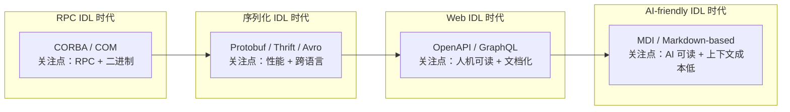

# 八、与现代接口描述方式对比：从 RPC IDL 到 Web IDL 与 AI-friendly IDL

## 传统 IDL vs 现代 IDL：边界划分

**传统 IDL**（CORBA/COM/Protobuf/Thrift/Avro）的核心关注点是**跨语言 RPC + 二进制序列化**，强调性能与紧凑性。它们诞生于分布式系统早期，解决的是"如何让不同语言编写的服务通过网络高效通信"的问题：接口定义需经编译器翻译为目标语言的桩代码，序列化产物为紧凑的二进制格式，传输效率高但人机可读性较差。

**现代接口描述格式**（OpenAPI/GraphQL Schema/JSON Schema/AsyncAPI）的核心关注点是 **Web API 文档化、人机可读、生态集成**（如 SDK 生成、Mock 服务、API 网关）。它们诞生于 Web 时代与 API 经济兴起之后，接口定义本身就是可读的 YAML/JSON 文档，可直接被工具链消费（渲染为交互式文档、生成多语言客户端、对接网关与 Mock 服务）。

需要指出的是，**边界并非泾渭分明**：

- gRPC（基于 Protobuf）兼顾 RPC 通信与 API 文档化，通过 `proto` 文件可生成 OpenAPI 描述与客户端 SDK
- OpenAPI 3.0 也支持 schema 演进（通过 `deprecated` 标记、版本号约定等机制）
- JSON Schema 既能用于校验，也可作为 OpenAPI 的子集描述数据结构

**演进本质**：从"机器优先"（紧凑二进制，性能至上）→ "人机并重"（YAML/JSON 可读 + 工具链成熟）→ AI 时代的"AI 友好"（如 MDI，Markdown 作为接口定义，最大化 LLM 上下文效率）。

## 对比表格

| 维度 | 传统 IDL（Protobuf/Thrift） | OpenAPI | GraphQL Schema | JSON Schema | AsyncAPI |
|---|---|---|---|---|---|
| 关注点 | 跨语言 RPC + 序列化 | REST API 文档与契约 | 客户端驱动的查询语言 | 数据结构校验 | 事件驱动架构 |
| 序列化格式 | 二进制（紧凑） | JSON/YAML（可读） | JSON | JSON | JSON/YAML |
| 传输协议 | RPC（IIOP/DCOM/gRPC over HTTP-2） | HTTP | HTTP | 无（数据层） | Kafka/MQTT/WebSocket 等 |
| 工具链生态 | 编译器 + 多语言绑定 | Swagger UI/Postman/SDK 生成器 | Apollo/Relay/graphql-codegen | ajv/多种校验器 | AsyncAPI Studio/代码生成 |
| AI 友好度 | 低（二进制格式难直接读写） | 中（JSON 可读但冗长） | 中（schema 可读但查询语法复杂） | 中（纯结构定义） | 中 |
| Schema 演进 | 强（reserved/字段编号） | 弱（无内建版本机制） | 中（字段可选性 + 弃用标记） | 中（附加字段策略） | 弱 |
| 典型场景 | gRPC 微服务、内部 RPC | 公开 REST API、API 网关 | 客户端灵活查询（如 BFF） | 配置校验、API 请求体校验 | 消息队列、事件总线 |

## 演进关系图

## 各格式适用场景说明

### OpenAPI

适用于 **REST API 文档化与 SDK 自动生成、API 网关契约、公开 API 发布**。优势是工具链成熟（Swagger UI 可交互式预览、Postman 一键导入、多语言 SDK 自动生成）；劣势是 YAML 冗长（一个简单的 CRUD 接口动辄数百行），性能不如二进制序列化方案，且对实时/流式场景支持有限。

### GraphQL Schema

适用于 **客户端驱动的灵活查询（如 BFF 层）、移动端按需取数**。优势是避免 over-fetching 与 under-fetching，客户端可精确指定所需字段；劣势是查询语法复杂，服务端需要实现解析器（resolver）层，缓存策略与 N+1 查询问题需额外治理，对小团队或简单 CRUD 场景属于过度设计。

### JSON Schema

适用于 **数据结构校验、API 请求/响应体校验、配置文件验证**。优势是与 JSON 原生兼容，ajv 等校验器性能优秀，可作为 OpenAPI 的子集复用；劣势是不含 RPC 概念，仅描述数据结构，无法独立表达完整的接口契约（需配合路径、方法等元信息）。

### AsyncAPI

适用于 **事件驱动架构（Kafka/RabbitMQ/MQTT）、消息契约定义**。优势是填补了事件驱动 API 文档的空白，与 OpenAPI 形成互补（一个描述同步 API，一个描述异步消息）；劣势是生态较新，工具链成熟度不及 OpenAPI，社区仍在快速演进中。

## 与 MDI（Markdown Interface）的关联

MDI 是项目内探索的 **"AI-friendly IDL"**，使用 Markdown 作为接口定义格式。项目复盘洞察（详见 [insight-extraction.md#L43-L47](../../../../retrospective/reports/project-reports/retrospective-mdi-project-completion-20260702/insight-extraction.md#L43-L47)）明确指出：

> "Markdown 是 LLM 最易理解与生成的格式，AI Agent 场景下 Markdown IDL 的上下文成本显著低于 YAML/JSON 格式的 OpenAPI 规范。"

**价值定位**：在 AI 协作开发场景下（如 AI Agent 工具定义、AI 辅助编程），Markdown 的"人类可读性"并非附加特性，而是**核心需求**——AI Agent 需要直接读写接口文档，Markdown 格式的上下文窗口占用最低，能让 LLM 在有限 token 预算内处理更复杂的接口契约。

**适用场景**：

- AI Skill 文档（如本项目 `.agents/` 下的 Skill 定义）
- AI Agent 工具接口（function calling 的工具描述）
- 内部 API 快速原型（无需完整 OpenAPI 工程化）
- CLI 工具定义（命令行接口的参数与返回值契约）

> 注：MDI 是探索性方案，**并非要取代 OpenAPI**，而是在 AI 原生场景下提供更轻量、更人类/AI 友好的选择。在生产级 API 网关、公开 API 发布等场景，OpenAPI 仍是更稳妥的工程化选择。

---

**上一章**：[07 - 实际应用案例与最佳实践](07-use-cases.md)  
**返回目录**：[00 - 概念总览](00-overview.md)  
**下一章**：[09 - 学习资源与参考资料](09-resources.md)
