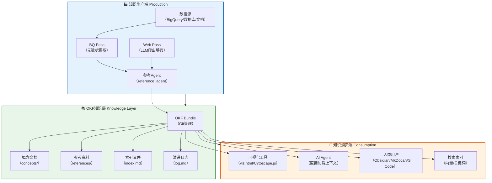

> **⚠️ 技术预览版提示**
> - Knowledge Catalog（原Dataplex）目前处于技术预览阶段
> - OKF开放知识格式目前处于**v0.2 Draft极早期阶段**（2026年6月首次发布）
> - 本教程基于官方开源仓库与公开信息整理，是趋势分析而非确定性预测
> - 建议结合[OKF开放知识格式完整指南](../okf-wiki/00-overview.md)学习，先小范围试点再考虑生产落地
> - 生态仍在快速演进中

# 00 Knowledge Catalog概述与知识地图

## 0.1 Knowledge Catalog是什么

Knowledge Catalog（原Google Cloud Dataplex）是Google Cloud推出的AI驱动数据目录与元数据管理平台。

**核心定位**：为所有结构化与非结构化数据构建动态知识图谱，为AI Agent提供语义层和业务上下文。

**本质**：一套完整的知识生产-消费-可视化解决方案，包含OKF开放知识格式规范、参考Agent实现、可视化工具链与示例数据集。

**一句话价值主张**：你的数据资产可被Git版本控制，你的AI Agent无需适配器即可解析，你的知识编审融入标准软件工程工作流，你的元数据再也不会被锁定在专有服务中。

> **📖 前置阅读**：OKF是Knowledge Catalog的核心知识表示格式，建议先阅读[OKF概述与知识地图](../okf-wiki/00-overview.md)了解OKF基础。

## 0.2 背景与动机

### 数据目录的演进需求
传统数据目录（如Unity Catalog、Collibra）多为中心化、专有系统，元数据被锁定在服务内部，难以被AI Agent直接消费。

### 知识层缺失的痛点
当前Agent栈三层（模型/MCP/Skills）缺少独立的知识层，知识散落在提示词、Skills描述和向量库中，缺乏统一的表示格式与治理机制。

### 生产与消费的割裂
知识生产（数据治理团队）与知识消费（Agent开发者、业务分析师）使用不同的工具与格式，协作成本高，知识更新难以同步。

### 软件工程化的知识管理
代码已经通过Git实现了版本控制、评审、协作的完整工作流，知识管理也需要同样的软件工程化能力。

## 0.3 学习目标

完成本教程后，你将能够：

1. 理解Knowledge Catalog的核心定位与整体架构，能向团队清晰解释Knowledge Catalog是什么
2. 掌握OKF开放知识格式的核心设计，理解Bundle/Concept/Frontmatter等核心概念
3. 了解参考Agent的双阶段工作流（BQ Pass + Web Pass），能运行参考Agent生成OKF Bundle
4. 使用可视化工具浏览知识图谱，理解交互式知识浏览器的功能
5. 剖析GA4、Stack Overflow、比特币等示例Bundle，设计适合自身团队的知识组织方案
6. 将Knowledge Catalog集成到现有数据治理与Agent工作流中，实现知识的版本控制与团队评审

## 0.4 前置知识要求

- **基础Markdown/YAML知识**：能编写Markdown文档，理解YAML键值对结构
- **AI Agent基本了解**：知道Agent是什么，理解工具调用、RAG等基本概念
- **版本控制（Git）基础**：理解commit/branch/PR等基本概念，OKF基于Git管理
- **数据目录与元数据管理基本概念**：了解数据目录、元数据、数据治理等基本术语
- **Google Cloud基础（可选）**：了解BigQuery、Vertex AI等Google Cloud服务有助于理解参考实现

## 0.5 9章导航表

| 章号 | 标题 | 核心内容 | 适合人群 | 预计阅读时间 |
|------|------|----------|----------|--------------|
| 00 | Knowledge Catalog概述与知识地图 | 背景动机、学习目标、导航表、阅读路径、知识生产-消费闭环架构图、核心组件全景图 | 所有读者 | 4分钟 |
| 01 | 核心概念与平台架构 | 知识图谱、动态元数据、Bundle/Concept/Frontmatter核心概念、平台组件架构、与Dataplex的关系 | 开发者/数据工程师 | 8分钟 |
| 02 | OKF开放知识格式规范深度解析 | OKF v0.2规范详解、frontmatter字段定义、信任层级与来源溯源、渐进式披露机制、链接规则 | 开发者/知识工程师 | 10分钟 |
| 03 | 参考Agent实现原理与运行指南 | BQ Pass与Web Pass双阶段工作流、生产端配置、单概念迭代开发、凭证配置、运行命令详解 | 开发者/数据工程师 | 9分钟 |
| 04 | 工具链与可视化系统 | 交互式知识图谱浏览器、Cytoscape.js图渲染、Markdown实时渲染、搜索与过滤机制、viz.html生成 | 开发者/前端工程师 | 7分钟 |
| 05 | 示例Bundle深度解析 | GA4电商数据集、Stack Overflow公开数据集、比特币区块链、Acme Retail示例剖析 | 所有读者 | 8分钟 |
| 06 | 集成模式与最佳实践 | 企业落地四阶段路径、与现有数据目录集成、Git工作流集成、知识生产消费解耦模式 | 架构师/技术负责人 | 8分钟 |
| 07 | 架构决策与方案对比 | 与Unity Catalog/Collibra等方案对比、OKF局限性分析、选型决策树、风险评估 | 架构师/决策者 | 7分钟 |
| 08 | 资源与术语表 | 30+核心术语定义、官方资源链接、OKF交叉引用、项目内wiki导航 | 所有读者 | 5分钟 |

## 0.6 三条阅读路径

### 路径一：快速上手路径（初学者/开发者）
**目标**：快速了解Knowledge Catalog并运行第一个示例Bundle

**阅读顺序**：00 → 01 → 02 → 05 → 08
**预计总时间**：约35分钟

### 路径二：深度开发路径（开发者/知识工程师/数据工程师）
**目标**：完整掌握OKF规范、参考Agent开发、工具链使用与集成方法

**阅读顺序**：00 → 01 → 02 → 03 → 04 → 05 → 06 → 08
**预计总时间**：约59分钟

### 路径三：架构决策路径（架构师/技术决策者/数据治理专家）
**目标**：判断Knowledge Catalog与OKF是否适合团队，做出技术选型决策

**阅读顺序**：00 → 01 → 02 → 06 → 07 → 08
**预计总时间**：约42分钟

## 0.7 知识生产-消费闭环架构全景图

## 0.8 Knowledge Catalog核心组件全景图

```mermaid
graph TD
    KC["Knowledge Catalog<br/>（原Dataplex）"] --> Format["📄 OKF开放知识格式<br/>（核心规范）"]
    KC --> Agent["🤖 参考Agent实现<br/>（reference_agent）"]
    KC --> Viz["📊 可视化工具链<br/>（visualize）"]
    KC --> Samples["📦 示例数据集<br/>（bundles/）"]
    
    Format --> Spec["SPEC.md<br/>（v0.2规范文档）"]
    Format --> Frontmatter["YAML Frontmatter<br/>（元数据字段）"]
    Format --> Markdown["Markdown Body<br/>（正文内容）"]
    Format --> Links["双向链接<br/>（知识图谱关系）"]
    
    Agent --> BQ["BQ Pass<br/>（BigQuery元数据提取）"]
    Agent --> Web["Web Pass<br/>（LLM文档爬取增强）"]
    Agent --> Enrich["enrich命令<br/>（生成OKF Bundle）"]
    Agent --> Single["--concept<br/>（单概念迭代）"]
    
    Viz --> Cyto["Cytoscape.js<br/>（力导向图）"]
    Viz --> Marked["marked.js<br/>（Markdown渲染）"]
    Viz --> SelfContained["自包含HTML<br/>（无后端依赖）"]
    Viz --> Search["搜索/过滤<br/>（类型筛选/关键词）"]
    
    Samples --> GA4["GA4电商数据集<br/>（bundles/ga4/）"]
    Samples --> SO["Stack Overflow<br/>（bundles/stackoverflow/）"]
    Samples --> BTC["比特币区块链<br/>（bundles/crypto_bitcoin/）"]
    Samples --> Acme["Acme Retail<br/>（bundles/acme_retail/）"]
    
    style KC fill:#f5f5f5,stroke:#333,stroke-width:2px
    style Format fill:#e8f5e9,stroke:#2e7d32
    style Agent fill:#e3f2fd,stroke:#1565c0
    style Viz fill:#fce4ec,stroke:#c2185b
    style Samples fill:#fff3e0,stroke:#e65100
```

## 0.9 为什么知识平台重要

- **模型是租的，可以换**：GPT换Claude换Gemini，随时切换
- **框架是工具，可以换**：LangChain换LlamaIndex换自研，工具而已
- **Skills是招式，可以学**：新技能可以快速开发、训练、迭代
- **数据与知识是企业自己的，是长期不被商品化的护城河**：业务概念、数据定义、指标口径、操作流程、决策逻辑、历史经验——这些才是真正沉淀下来、不可替代的核心资产

Knowledge Catalog与OKF要做的，就是让这些核心资产有一个开放、可移植、可演进、能被AI Agent直接消费的载体，让知识管理像代码管理一样工程化。

---

| 上一章 | 目录 | 下一章 |
|--------|------|--------|
| [README（目录）](./README.md) | [README](./README.md) | [01 核心概念与平台架构](./01-core-concepts.md) |
