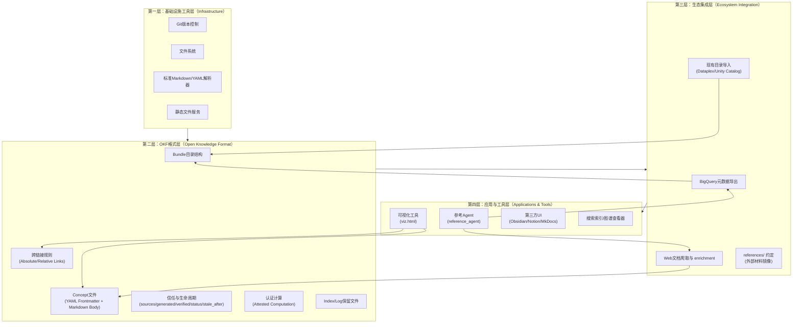
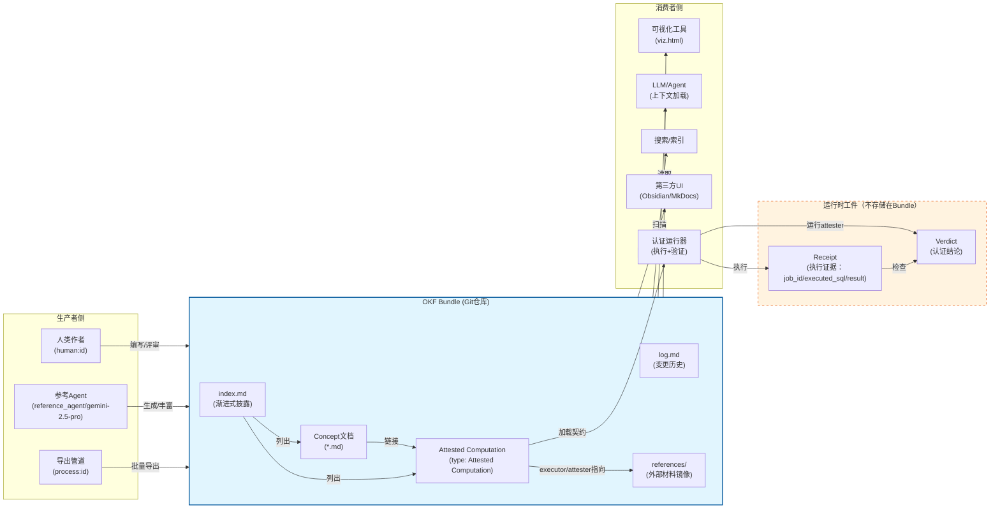

# 01 核心概念与平台架构

## 1.1 核心设计哲学

Knowledge Catalog 平台建立在三大设计哲学之上，这些哲学贯穿于格式定义、参考实现与生态工具的各个层面。

### 1.1.1 人与Agent共读（Human- and Agent-Readable）

知识表示格式必须同时对人类和智能体友好，无需专用SDK或查询语言即可直接访问：

- **人类可读**：工程师可以使用 `cat` 命令直接查看概念文档，无需安装专有工具；内容以标准Markdown编写，支持现有编辑器直接编辑。
- **Agent可解析**：智能体无需定制SDK即可解析YAML frontmatter提取结构化元数据，Markdown正文可直接注入LLM上下文窗口。
- **结构化优先**：鼓励使用标题、列表、表格、围栏代码块等结构化Markdown元素，而非自由文本——这既提升人类阅读体验，也显著提高RAG检索准确率，减少幻觉。

> **与OKF格式关系**：本平台采用 [Open Knowledge Format (OKF)](../okf-wiki/01-core-concepts.md) 作为底层知识表示格式。OKF的极简设计（Markdown + YAML frontmatter）正是实现人与Agent共读的基础。

### 1.1.2 Git原生（Git-Native Version Control）

知识管理应成为正常的软件工程活动，而非孤立的元数据存储：

- **天然版本控制**：Bundle以Git仓库形式分发，Pull Request、逐行diff、blame、代码评审等工作流开箱即用。
- **可审计变更**：每一次知识更新都有完整的提交历史，支持追溯"谁在何时修改了什么"。
- **协作标准化**：人类工程师、参考Agent、自动化流程可以像协作源代码一样在同一知识包上协作。
- **无中央服务器**：无需依赖专有元数据存储服务，知识包就是普通目录，可以通过tarball、静态文件服务器、任意Git托管平台分发。

### 1.1.3 生产消费解耦（Producer/Consumer Independence）

知识生产者与消费者彻底分离，格式是唯一契约：

- **多生产者支持**：人类手工编写、基于任意框架（Google ADK、LangChain、自定义）的Agent生成、现有数据目录（Dataplex、Unity Catalog、Collibra）导出管道、数据库扫描脚本——任何角色都可以产出OKF Bundle。
- **多消费者支持**：静态文件服务器、知识管理UI（Obsidian、Notion、MkDocs）、LLM上下文加载、搜索索引、图谱查看器——任何角色都可以消费同一Bundle。
- **避免平台锁定**：就像HTML不关心是VS Code还是Word编写，也不关心Chrome还是Safari打开，OKF不绑定特定Agent框架、模型供应商或服务系统。

## 1.2 核心概念体系

本节定义Knowledge Catalog平台的核心术语。其中格式层概念遵循 [OKF核心规范](../okf-wiki/01-core-concepts.md)。

### 1.2.1 Bundle（知识包）

**知识包（Knowledge Bundle）** 是自包含的知识文档层次集合，是分发和版本控制的基本单元。

- **物理形态**：一个Markdown文件目录树，可作为Git仓库、zip/tarball归档或monorepo子目录存在。
- **目录组织**：目录结构由生产者自行定义，平台不强制特定分类方式。
- **分发单元**：Bundle是跨系统、跨组织交换知识的最小单位。

**保留文件名**（任何层级均不得用作Concept文件名）：

| 文件名 | 用途 |
|--------|------|
| `index.md` | 目录内容列表，支持渐进式披露 |
| `log.md` | 该范围内的高层变更历史 |

### 1.2.2 Concept（概念文档）

**概念（Concept）** 是Bundle内的一个知识单元，对应一个UTF-8编码的Markdown文件。

- **描述对象**：可以描述有形资产（表、API端点）、抽象概念（指标、业务流程）或任何其他知识实体。
- **概念ID（Concept ID）**：文件在Bundle内的相对路径（去掉`.md`后缀），是概念的稳定标识符。
- **文件结构**：每个Concept由两部分组成：YAML frontmatter元数据块 + Markdown正文。

### 1.2.3 Frontmatter（元数据头）

**Frontmatter** 是文件开头以`---`分隔的YAML元数据块，承载结构化、可查询的字段。

**必填字段**：

| 字段 | 说明 |
|------|------|
| `type` | 概念类型（如`BigQuery Table`、`Metric`、`Playbook`、`Attested Computation`）。类型值不集中注册，由生产者自描述；消费者必须优雅容忍未知类型。 |

**推荐字段**：

| 字段 | 说明 |
|------|------|
| `title` | 人类可读名称，省略时消费者可从文件名推导 |
| `description` | 一句话摘要，用于索引生成、搜索片段、预览卡片 |
| `resource` | 所描述资产的规范URI（如BigQuery控制台链接），抽象概念可省略 |
| `tags` | YAML列表形式的横切分类标签 |

**可扩展字段**：生产者可添加任意自定义键值对，消费者往返处理时应保留未知字段，不得因无法识别的字段拒绝文档。

### 1.2.4 Source（来源与可信度信号）

**来源（Source）** 记录概念衍生自的材料（Bundle内部或外部），承载在`sources` frontmatter字段中，是对抗幻觉的关键机制。

每个来源条目包含：

| 字段 | 必填 | 说明 |
|------|------|------|
| `resource` | ✅ | 具体工件的可访问路径（绝对URL、Bundle相对路径、`references/`子目录路径）或范围描述符 |
| `id` | 推荐 | 稳定键，用于正文中的逐句归因（通过Markdown脚注关联） |
| `title` | 可选 | 来源的人类可读标签 |

**可信度信号**（客观、逐来源记录，供消费者推断信任度，而非存储主观评分）：

- `author`：来源的生产者（遵循Actor约定），权威性信号。
- `usage_count`：在`usage_window`内`resource`被使用的次数（仪表盘浏览量、查询执行次数、页面阅读量），采用度与活跃度信号。
- `last_modified`：来源本身最后变更日期（`YYYY-MM-DD`），时效性信号（与`generated.at`记录概念编写时间不同）。
- `usage_window`：`{ from, to }`日期范围，统一框定所有`usage_count`的统计窗口。

**逐句归因**：正文中的特定主张使用Markdown脚注标注，脚注标签为`sources[].id`，消费者通过匹配的条目解析归因，而非解析脚注文本。

### 1.2.5 Trust Tier（信任层级）

**信任层级（Trust Tier）** 是消费者从`verified`字段推导的可信度等级（建议性信号，非访问控制）：

| 层级 | 条件 |
|------|------|
| **unverified（未验证）** | 无`verified`键 |
| **machine-confirmed（机器确认）** | `verified`仅包含非`human:`执行者 |
| **human-reviewed（人类审核）** | `verified`包含`human:<id>`执行者 |

**相关字段**：

- `generated: { by, at }`：记录当前内容的生产者（`by`遵循Actor约定，`at`为ISO 8601时间）和最后有意义变更时间。
- `verified: [{ by, at }]`：验证事件列表，记录谁/什么对照来源或`resource`确认了内容；内容编写者与验证者分离。
- `status`：生命周期状态（`draft`/`stable`/`deprecated`），缺失时默认为`stable`。
- `stale_after`：绝对过期日期（`YYYY-MM-DD`），当`today >= stale_after`时概念视为过时。

**Actor约定**：

- Agent/工具：`<producer>/<version>`，如`reference_agent/gemini-2.5-pro`
- 人类：`human:<id>`，如`human:ahormati`
- 自动化流程：`process:<id>`，如`process:finance-nightly`

### 1.2.6 Attested Computation（认证计算）

**认证计算（Attested Computation）** 是一种特殊Concept类型（`type: Attested Computation`），不仅承载值的含义，还承载值的**受认可计算方式**，使消费者能够确认Agent运行了指定计算而非自行编造。

**核心设计动机**：

- 来源（Provenance）回答"这个主张从哪里来"；认证（Attestation）回答"这个数字是否按规定方式产生"。
- 一个计算可服务于多个消费者（指标、仪表盘概念、报表），作为独立Concept可一次定义多次引用。
- 信任状态按计算独立维护：收入、利润、毛利各自独立验证和认证。

**契约字段**（frontmatter）：

| 字段 | 必填 | 说明 |
|------|------|------|
| `runtime` | ✅ | 运行时类型（如`bigquery`、`postgres`、`dbt`、`python`、`Looker`），决定`parameters`语义、执行器和认证器解释方式 |
| `parameters` | 可选 | 类型化命名参数列表：`{ name, type, required }`；Agent只能为声明的参数提供值，不得编写或修改计算本身 |
| `computation` | 可选 | 指向计算文件的路径（替代正文内联围栏代码块）；缺失时正文`# Computation`围栏块为计算内容 |
| `executor` | 可选 | 执行方式：`resource`指向运行指令或代码，`receipt`声明运行必须返回的证据字段列表 |
| `attester` | 可选 | 确定性（无LLM）检查代码：`resource`指向接收receipt并返回结论的代码，在消费者侧运行 |

**计算提供方式**：

- **内联**：正文`# Computation`标题下的单个围栏代码块，适合短小、与契约一同评审的计算。
- **文件引用**：设置`computation`为路径并省略正文围栏，适合较长或生成的计算、或已作为真实文件与非OKF工具共享的计算。

**验证与认证的区别**：

- `verified`：确认定义仍符合策略，文档级别、慢速、记录在Bundle内。
- Attestation：确认单次运行按受认可方式产生值，每次调用、运行时、不存储在Bundle内。

### 1.2.7 Index/Log文件（索引与日志文件）

**索引文件（index.md）** 支持渐进式披露：

- 可出现在任何目录（包括Bundle根目录）。
- 无frontmatter（例外：Bundle根index.md可携带`okf_version`键）。
- 作用：让人类或Agent在打开单个文档前即可了解目录内容。
- 结构：按逻辑分组，列出Concept链接及description。
- 可自动生成，也可手写；无index.md时消费者可动态扫描合成。

**日志文件（log.md）** 记录高层变更历史：

- 可出现在任何层级，记录该范围的高层更新历史（类似CHANGELOG，非逐条commit记录）。
- 格式：按ISO日期（`YYYY-MM-DD`）倒序排列，每个日期下是条目。
- 条目通常以粗体动词开头（**Create**/**Update**/**Deprecation**），这是约定而非强制要求。

**log.md vs git log**：git log是细粒度提交历史（如"修复typo"）供开发者查看；log.md是高层摘要（如"5月新增客户指标表"）供人类/Agent快速浏览演变脉络。

## 1.3 平台架构分层

Knowledge Catalog平台采用四层架构，从底层格式到上层应用清晰分离：

### 1.3.1 第一层：基础设施工具层

平台不引入专有基础设施，完全构建在通用、成熟的工具之上：

- **Git**：提供版本控制、分发、协作评审能力。
- **文件系统**：Bundle就是普通目录，无需数据库或专有存储。
- **标准Markdown/YAML解析器**：任何语言的标准库解析器都可读取OKF，无专用SDK依赖。
- **静态文件服务**：可通过任意静态HTTP服务器托管Bundle。

### 1.3.2 第二层：OKF格式层

这是平台的核心契约层，定义知识表示的结构规则：

- Bundle目录结构规范与保留文件名约定。
- Concept文件的两部分结构（YAML Frontmatter + Markdown Body）。
- 跨链接规则（Bundle绝对链接/相对链接）与断链容忍策略。
- 信任来源与生命周期字段家族（sources/generated/verified/status/stale_after）。
- 认证计算类型的专用契约字段。

> **规范说明**：格式层的完整规范见 [OKF格式核心概念](../okf-wiki/01-core-concepts.md) 与OKF SPEC文档。

### 1.3.3 第三层：生态集成层

该层提供将外部世界知识转化为OKF Bundle的生产能力，以及约定性的组织模式：

- **BigQuery元数据导出**：从BigQuery数据集提取表、列、分区等元数据作为初始Concept。
- **Web文档爬取与enrichment**：参考Agent作为自主爬虫，抓取权威文档URL并丰富现有Concept。
- **现有目录导入**：从Dataplex、Unity Catalog、Collibra等现有数据目录批量导出为OKF。
- **`references/`目录约定**：将外部材料、运行指令、代码镜像为Bundle内的一类Concept，sources/executor/attester通常指向该目录。

### 1.3.4 第四层：应用与工具层

该层包含具体的生产者、消费者实现：

- **参考Agent（reference_agent）**：平台提供的概念验证生产者，分两阶段运行——BQ Pass（从BigQuery元数据生成初始Concept）和Web Pass（LLM自主爬取文档并丰富Concept）。
- **可视化工具（viz.html）**：自包含交互式HTML可视化，使用Cytoscape.js绘制力导向图谱、marked.js渲染Markdown，是概念验证消费者。
- **第三方UI集成**：Obsidian、Notion、MkDocs、Hugo、Jekyll等现有Markdown工具可直接浏览/编辑Bundle。
- **搜索索引/图谱查看器**：消费者可从frontmatter提取`type`、`tags`等字段构建搜索索引，或从跨链接构建关系图谱。

## 1.4 组件关系图

以下Mermaid图展示Knowledge Catalog平台核心组件之间的关系与数据流：

### 1.4.1 数据流说明

1. **生产阶段**：人类作者、参考Agent、自动化管道通过Git协作向Bundle贡献Concept文档；参考Agent支持单Concept迭代（`--concept`参数）。
2. **存储阶段**：所有知识以纯文本Markdown文件存储在Git仓库中，Index和Log文件提供导航和历史摘要。
3. **消费阶段**：
   - 可视化工具、LLM、搜索索引、第三方UI直接读取Bundle内容。
   - 认证运行器在运行时加载Attested Computation契约，绑定参数后通过executor执行，获得Receipt，再通过attester（确定性无LLM代码）检查Receipt产出Verdict。
4. **信任传播**：Receipt和Verdict是运行时工件，不存储在Bundle中；认证失败时消费者应拒绝显示或给出警告，而非静默丢弃。

### 1.4.2 参考Agent两阶段工作流

参考Agent作为平台提供的概念验证生产者，采用两阶段流水线：

1. **BQ Pass**：仅使用BigQuery元数据，为数据源 advertised 的每个Concept写入一个OKF文档。
2. **Web Pass**：LLM作为自主爬虫运行——接收种子URL列表，通过`fetch_url`工具抓取种子页面，根据出站链接是否看起来像现有Concept的权威文档决定是否跟进；对每个抓取页面选择（a）丰富现有Concept、（b）创建独立`references/<slug>`文档、（c）跳过。

Web Pass内置安全限制：硬上限`--web-max-pages`、同域允许主机过滤器（`--web-allowed-host`可配置），使用`--no-web`可跳过Web Pass。

| 上一章 | 目录 | 下一章 |
|--------|------|--------|
| [00 概述与知识地图](./00-overview.md) | [README](./README.md) | [02 OKF格式规范](./02-okf-specification.md) |
