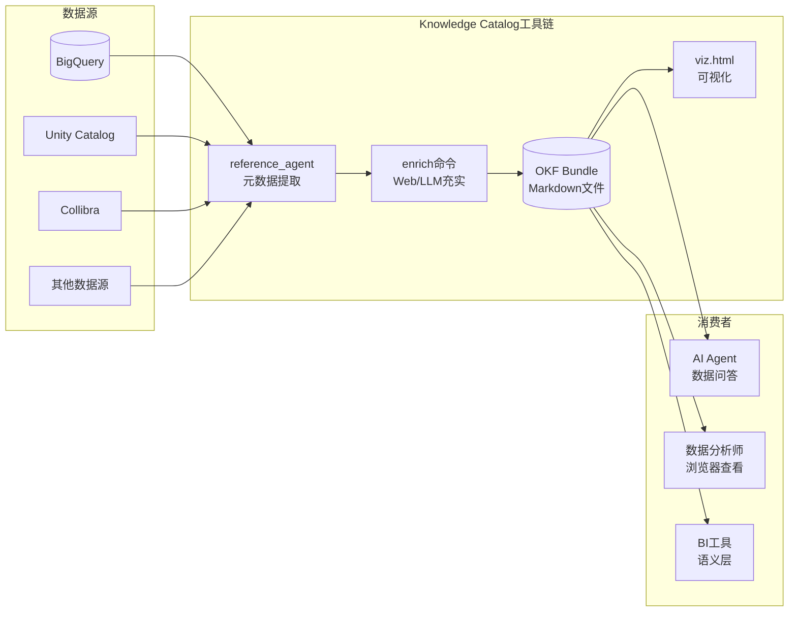
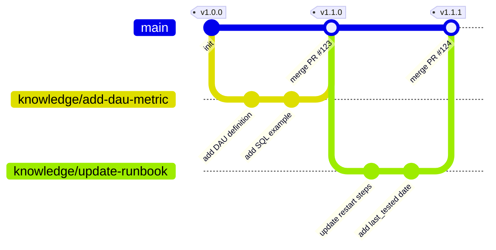

# 06 集成模式与最佳实践

> **本章定位说明**
> - 前五章分别介绍了Knowledge Catalog平台概述（[00 概述与知识地图](./00-overview.md)）、核心概念与架构（[01 核心概念与平台架构](./01-core-concepts.md)）、OKF规范（[02 OKF规范深度解析](./02-okf-specification.md)）、参考Agent实现（[03 参考Agent实现原理与运行指南](./03-reference-agent.md)）、工具链与可视化（[04 工具链与可视化系统](./04-toolchain-and-visualization.md)）和示例Bundle深度解析（[05 示例Bundle深度解析](./05-samples-and-bundles.md)）。
> - 本章聚焦**企业级集成模式与落地实践**——在掌握OKF基础用法后，如何将Knowledge Catalog真正融入企业现有技术栈和工作流，实现知识资产的可持续积累与演进。
> - 本章大量交叉引用OKF Wiki的使用模式（[okf-wiki 03 使用模式与最佳实践](../okf-wiki/03-usage-patterns.md)）和架构集成（[okf-wiki 05 架构定位与Agent集成](../okf-wiki/05-architecture-and-integration.md)），并结合Knowledge Catalog的工具能力进行深度展开。

---

## 6.1 企业落地四阶段路径

企业级知识管理平台的落地不能采用"大爆炸"式迁移，必须遵循渐进式路径。OKF Wiki在[架构集成章节](../okf-wiki/05-architecture-and-integration.md#56-企业落地四阶段路径)中提出了四阶段模型，本章结合Knowledge Catalog的工具能力进行细化。

### 6.1.1 阶段1：试点试水（2-4周）

**目标**：验证OKF理念可行性，建立团队认知，不追求完美。

**核心动作**：
- 选择一个**边界清晰、风险低、价值可见**的小领域作为试点：
  - 新上线微服务的API文档（替代零散的Confluence页面）
  - 一个内部工具的Agent使用说明
  - 一组核心业务指标的初步定义
- 新文档采用OKF格式编写，**不迁移任何旧文档**
- 使用[参考Agent](./03-reference-agent.md)从一个小型BigQuery数据集自动生成第一个Bundle
- 打开[可视化工具](./04-toolchain-and-visualization.md)查看生成的知识图谱，建立直观认知
- 参考[GA4示例Bundle](./05-samples-and-bundles.md#52-bundle-1ga4---ga4电商数据集)的结构作为模板

**成功标志**：
- 团队3-5人理解OKF基本思想（Markdown+frontmatter、交叉链接、Bundle组织）
- 写出第一个合格的Bundle（至少包含Dataset/Table/Reference三种核心类型）
- 有人开始主动用OKF写新文档，而不是觉得是额外负担

**反模式警告**：
- ❌ 一开始就想覆盖所有业务域
- ❌ 试图迁移旧文档到OKF
- ❌ 设计复杂的扩展字段体系
- ❌ 要求所有人立即切换

### 6.1.2 阶段2：团队级推广（1-3个月）

**目标**：在选定业务域形成完整知识体系，Agent可提供基础问答能力。

**核心动作**：
- 选定一个完整业务域（如数据团队的指标字典、SRE团队的服务Runbook）
- 该业务域的**所有新文档**必须采用OKF格式
- 基于[OKF扩展字段最佳实践](../okf-wiki/03-usage-patterns.md#32-frontmatter扩展字段最佳实践)，结合团队需求约定元数据规范：
  - 统一type命名约定（如`BigQuery Table`而非`table`或`bq-table`）
  - 确定必填扩展字段（owner、stale_after、verified等）
  - 制定tags分类规范
- 使用[参考Agent](./03-reference-agent.md)定期（如每周）从数据源同步元数据
- 运行[index自动生成脚本](../okf-wiki/03-usage-patterns.md#35-index自动化脚本)保持索引更新
- 参考[Stack Overflow示例Bundle](./05-samples-and-bundles.md#53-bundle-2stackoverflow---stack-overflow公开数据集)学习多表关系的文档化

**成功标志**：
- 该业务域形成完整Bundle（至少20+个Concept文档）
- 知识图谱viz.html中节点形成有意义的连接网络
- 团队Agent可以回答该领域80%的常见问题（"XX表的Schema是什么？"、"YY指标怎么算？"）
- 有明确的知识Owner和更新机制

### 6.1.3 阶段3：企业级集成（3-6个月）

**目标**：OKF知识接入Agent RAG流程，与现有系统深度集成，建立质量保障机制。

**核心动作**：
- 将OKF知识检索正式接入生产Agent的RAG流程，Agent回答问题时**优先查询OKF知识**
- 利用`verified`、`confidence`、`stale_after`等元数据做可信度筛选（参考[Agent消费流程](../okf-wiki/05-architecture-and-integration.md#54-agent如何消费okf-bundle)）
- 实现与现有数据目录（Unity Catalog/Collibra等）的双向同步（详见[6.4节](#64-与现有数据目录集成模式)）
- 引入Attested Computation模式，对核心业务指标建立可信计算链（参考[Acme Retail示例](./05-samples-and-bundles.md#55-bundle-4acme_retail---acme-retail企业级示例)）
- CI流水线集成OKF验证：frontmatter格式检查、断链检测、必填字段校验
- 参考[比特币区块链示例Bundle](./05-samples-and-bundles.md#54-bundle-3crypto_bitcoin---比特币区块链数据集)学习复杂关系和性能信息的文档化

**成功标志**：
- Agent回答业务问题时幻觉率明显下降（建议量化对比）
- 核心指标采用Attested Computation，结果可审计、可验证
- 知识更新通过PR流程，有评审、有回滚、有历史
- 与现有数据目录形成互补而非替代关系

### 6.1.4 阶段4：生态化治理（6个月+）

**目标**：建立组织级知识治理体系，知识成为可复用的企业资产，跨团队共享。

**核心动作**：
- 建立知识审核流程（RACI）：谁可以写、谁审核、谁批准发布
- 建立定期验证机制：`stale_after`过期自动提醒Owner复核
- 设立type命名规范委员会，统一跨团队概念类型定义
- 建立跨Bundle引用机制：团队A可以引用团队B Bundle中的Concept
- 开发企业内部OKF工具链：自定义可视化模板、IDE插件、知识健康度仪表盘
- 探索知识生态：内部OKF市场、认证Bundle、知识贡献激励机制

**成功标志**：
- 知识质量持续提升，过期知识自动识别和更新
- 跨团队知识复用率可度量
- OKF成为企业知识表示的事实标准
- 新团队入职时直接复用已有知识Bundle，无需从零开始

---

## 6.2 三种典型集成场景

OKF Wiki在[使用模式章节](../okf-wiki/03-usage-patterns.md#31-三种典型使用场景)中定义了三种基础场景，本节结合Knowledge Catalog工具能力进行深化。

### 6.2.1 场景1：数据目录同步

**适用场景**：企业已有数据仓库/数据湖，需要将技术元数据和业务元数据统一管理，为Agent提供数据上下文。

**架构模式**：



**实施步骤**：

1. **初始批量加载**：
   - 配置参考Agent连接BigQuery（参考[03参考Agent运行指南](./03-reference-agent.md)）
   - 运行`enrich --source bq --dataset <your-dataset>`生成初始Bundle
   - 这一步自动完成Dataset/Table级别的技术元数据文档化

2. **业务元数据充实**：
   - 准备`seeds.txt`种子URL列表，指向企业内部的数据字典、指标定义文档
   - 运行带Web抓取的enrich命令（`--web-seed-file`），让参考Agent自动补充业务背景
   - 人工编辑关键指标文档，添加业务定义、计算逻辑、示例SQL

3. **定期同步增量**：
   - 设置定时任务（如Cloud Scheduler + Cloud Functions）每日运行参考Agent
   - 参考Agent只更新有变化的表，提交到Git新分支
   - 数据Owner审核PR后合并到主分支

4. **关系文档化**：
   - 手工添加`references/joins/`目录，文档化核心表间连接路径（参考[Stack Overflow的joins设计](./05-samples-and-bundles.md#533-核心概念文档解析)）
   - 区分对等关联（双下划线`__`）和主从包含（三下划线`___`）关系

**核心价值**：
- 技术元数据自动提取，减少人工维护成本
- 业务元数据通过交叉链接形成知识网络，而非孤立的表格描述
- Agent查询数据时自动获得完整上下文（表结构、字段含义、关联关系、常用查询模式）

### 6.2.2 场景2：Agent知识库构建

**适用场景**：为内部AI Agent构建可维护、可演进的工具、API、领域知识、操作规范知识库。

**目录结构推荐**：

```
agent-knowledge/
├── index.md                     # 知识总索引
├── log.md                       # 变更日志
├── tools/                       # 工具文档（对应MCP Server提供的工具）
│   ├── index.md
│   ├── jira/
│   │   ├── create-ticket.md
│   │   ├── update-ticket.md
│   │   └── search-tickets.md
│   ├── github/
│   │   ├── create-pr.md
│   │   └── merge-pr.md
│   └── bigquery/
│       └── run-query.md
├── concepts/                    # 领域概念
│   ├── index.md
│   ├── incident-severity.md     # 故障等级定义
│   ├── ticket-status.md         # 工单状态枚举
│   └── deployment-envs.md       # 部署环境说明
├── policies/                    # 政策与规范
│   ├── index.md
│   ├── data-access-policy.md    # 数据访问政策
│   └── code-review-policy.md    # 代码评审规范
└── playbooks/                   # 操作手册
    ├── index.md
    ├── deploy-production.md
    └── rollback-deployment.md
```

**关键集成要点**：

1. **与MCP层互补**（参考[OKF vs MCP关系](../okf-wiki/05-architecture-and-integration.md#53-okf-vs-mcp-vs-skills互补而非竞争)）：
   - MCP Server解决"Agent怎么调用工具"（连接问题）
   - OKF知识库解决"Agent怎么知道有什么工具、什么时候用、参数怎么填"（知识问题）
   - 最佳实践：每个MCP Server对应一个OKF Bundle，放在Server代码旁边

2. **与Skills层互补**：
   - Skills是可执行的工作流程序
   - OKF是Skills需要的领域知识（参数含义、边界情况、常见错误）
   - 最佳实践：Skill代码旁边放OKF文档说明适用场景和使用注意事项

3. **可信度分层**：
   - 对工具API文档设置`verified: true`，必须经过人工测试验证
   - 对操作步骤设置`last_tested`记录上次演练时间
   - 对领域概念设置`confidence: high/medium/low`标记可信度
   - Agent消费时优先使用`verified: true`且未过期的知识（参考[Agent消费流程](../okf-wiki/05-architecture-and-integration.md#54-agent如何消费okf-bundle)）

### 6.2.3 场景3：企业Runbook/Playbook管理

**适用场景**：SRE/运维/技术支持团队记录故障处理流程、应急响应手册、标准操作程序。相比Confluence，OKF纯文本特性天然适合版本控制、CI检查、Agent可执行。

**Playbook文档标准模板**：

```markdown
---
title: "支付服务紧急重启"
type: "Playbook"
owner: sre-oncall@company.com
severity: critical
last_tested: 2026-07-15
estimated_minutes: 10
stale_after: P90D
tags: ["payment", "restart", "incident-response"]
verified: true
---

# 支付服务紧急重启

## 适用场景
什么时候执行这个Playbook：
- 支付服务错误率 > 5% 持续 3 分钟
- 支付成功率 < 95%
- 监控告警触发 P1 级别

## 前置检查
1. 确认需要重启（查看Grafana面板：https://grafana.company.com/d/payment）
2. 在#incidents频道发送通知："正在重启支付服务，预计影响<1分钟"
3. 确认最近30分钟没有正在进行的部署

## 执行步骤
1. 切换生产集群上下文：`kubectl ctx prod-use1`
2. 执行滚动重启：`kubectl rollout restart deployment/payment-service`
3. 等待滚动完成：`kubectl rollout status deployment/payment-service`
4. 等待2分钟，观察错误率指标恢复正常
5. 在#incidents频道通知："支付服务重启完成，错误率已恢复"

## 验证步骤
- [ ] 支付成功率恢复到99.9%以上
- [ ] 没有新增5xx错误
- [ ] 日志中无异常堆栈
- [ ] 监控告警已自动恢复

## 回滚方案
如果重启后问题没有解决：
1. 执行回滚：`kubectl rollout undo deployment/payment-service`
2. 立即升级：电话联系SRE Lead（+86-xxx-xxxx-xxxx）
3. 在#incidents频道同步状态

## 相关资源
- [支付服务架构文档](./payment-service-architecture.md)
- [数据库故障切换Playbook](./db-failover.md)
- [故障升级流程](../policies/escalation-policy.md)
```

**管理最佳实践**：

1. **定期演练验证**：
   - 每个Playbook必须每季度至少演练一次
   - 演练后更新`last_tested`字段，记录演练结果
   - 演练发现问题直接提交PR修订文档

2. **Agent辅助执行**：
   - Agent遇到故障时自动检索对应的Playbook
   - Agent可以按照Playbook中的步骤提示SRE，甚至自动执行低风险步骤
   - Playbook中的`estimated_minutes`帮助SRE预估处理时间

3. **与告警系统集成**：
   - 告警规则中关联对应Playbook的路径
   - 告警触发时自动将Playbook链接发送到通知频道
   - Agent可以根据告警内容直接推荐合适的Playbook

---

## 6.3 知识生产消费解耦模式

OKF Wiki在[架构集成章节](../okf-wiki/05-architecture-and-integration.md#55-生产者-消费者解耦架构)中提出了生产者-消费者解耦架构，这是OKF最核心的设计优势之一。Knowledge Catalog的工具链完美支持这一模式。

### 6.3.1 解耦架构全景

```mermaid
flowchart LR
    subgraph 生产端（Producers）
        direction TB
        P1[数据工程师<br/>手工编写指标定义]
        P2[reference_agent<br/>自动从BQ提取元数据]
        P3[Web Agent<br/>抓取官方文档充实]
        P4[SRE工程师<br/>编写Runbook]
        P5[定时Pipeline<br/>定期同步增量]
    end
    
    subgraph 中间契约（OKF Markdown）
        F[Bundle目录<br/>.md文件 + YAML frontmatter<br/>Git版本控制]
    end
    
    subgraph 消费端（Consumers）
        direction TB
        C1[人<br/>GitHub/VS Code阅读]
        C2[viz.html<br/>知识图谱可视化]
        C3[AI Agent<br/>RAG检索问答]
        C4[全文搜索引擎<br/>Elasticsearch/Meilisearch]
        C5[BI工具<br/>语义层集成]
        C6[IDE插件<br/>悬停提示文档]
    end
    
    P1 -->|PR提交| F
    P2 -->|自动PR| F
    P3 -->|自动充实| F
    P4 -->|PR提交| F
    P5 -->|定时更新| F
    
    F --> C1
    F --> C2
    F --> C3
    F --> C4
    F --> C5
    F --> C6
```

### 6.3.2 解耦优势详解

1. **生产者独立演进**：
   - 今天让人写文档，明天可以换成reference_agent自动生成，消费端完全不受影响
   - 数据源从BigQuery换成Snowflake，只需要改生产者端的提取逻辑
   - 新增Web抓取充实能力，不破坏现有知识结构

2. **消费者多样共存**：
   - 同一个Bundle，人用GitHub看、Agent用RAG读、搜索引擎索引、可视化工具画图
   - 新增消费者不需要改生产端，只要能解析Markdown+frontmatter即可
   - 这就是[OKF规范](./02-okf-specification.md)作为"厂商中立格式"的核心价值

3. **契约稳定**：
   - Markdown文件格式50年不变（相比专有数据目录的二进制/数据库格式）
   - Git作为存储后端，自带完整历史、版本、分支、回滚能力
   - 没有Vendor Lock-in，随时可以迁移到其他支持OKF的工具

### 6.3.3 生产端实现策略

| 生产者类型 | 适用场景 | 实现方式 | 频率 |
|-----------|---------|---------|------|
| reference_agent自动提取 | 技术元数据（表、字段、Schema） | `reference_agent enrich --source bq` | 每日定时 |
| Web Agent文档充实 | 官方文档、帮助中心内容 | `--web-seed-file`种子URL | 每周 |
| 人工编写评审 | 业务定义、政策、Playbook | Git + PR流程 | 持续 |
| Pipeline同步 | 从现有数据目录导出 | 自定义ETL脚本生成Markdown | 每日 |

---

## 6.4 与现有数据目录集成模式

很多企业已经部署了Unity Catalog、Collibra、Alation、DataHub等数据目录工具。OKF不是要替代它们，而是作为**上层知识编排层**互补共存。

### 6.4.1 定位差异与分工

| 维度 | 现有数据目录（Unity Catalog/Collibra等） | OKF/Knowledge Catalog |
|------|----------------------------------------|----------------------|
| **核心定位** | 技术元数据集中存储、访问控制、数据血缘 | 业务知识编排、Agent可消费语义层、跨系统知识连接 |
| **存储格式** | 专有数据库/内部格式 | 纯文本Markdown，Git版本控制 |
| **主要用户** | 数据治理团队、数据分析师 | AI Agent、工程师、知识工作者 |
| **知识粒度** | 表/字段/标签结构化元数据 | 从字段到业务政策的完整知识网络 |
| **可执行性** | 元数据描述，无执行能力 | 可包含Attested Computation、Playbook步骤，Agent可直接执行 |
| **变更流程** | 工具内UI操作 | Git PR代码评审流程 |
| **开放性** | 各厂商API不统一 | 开放规范，纯文本，无厂商锁定 |

### 6.4.2 推荐集成架构：双向同步互补模式

```mermaid
flowchart TD
    subgraph 现有数据目录（治理层）
        UC[Unity Catalog<br/>技术元数据/权限/血缘]
        Collibra[Collibra<br/>业务术语表/数据治理]
    end
    
    subgraph OKF知识层（语义层）
        Bundle[(OKF Bundle<br/>Git存储)]
        Links[双向链接<br/>resource字段指向UC/Collibra]
    end
    
    subgraph 消费端
        Agent[AI Agent<br/>优先访问OKF]
        Human[工程师<br/>Git/IDE/viz.html]
    end
    
    UC -->|1. 导出技术元数据| Bundle
    Collibra -->|2. 导出业务术语| Bundle
    Bundle -->|3. resource字段反向链接| UC
    Bundle -->|4. 反向链接| Collibra
    Bundle --> Agent
    Bundle --> Human
```

### 6.4.3 具体集成模式

**模式1：技术元数据单向同步（入门级）**

从现有数据目录定期导出技术元数据，生成OKF Bundle中的tables/部分：
- 优点：实施简单，不改动现有系统
- 缺点：单向同步，OKF中的业务注释不会写回
- 适用：阶段1-2试点阶段

```bash
# 示例：从Unity Catalog导出元数据生成OKF文档（伪代码逻辑）
# 1. 调用Unity Catalog API获取表列表
# 2. 为每个表生成tables/{table_name}.md
# 3. resource字段填写Unity Catalog UI链接
# 4. 自动提交PR
```

**模式2：双向链接跳转（进阶级）**

OKF文档中的`resource`字段指向现有数据目录的UI页面，同时在现有数据目录的"自定义描述"字段中放入OKF文档的Git链接：
- 优点：两个系统双向导航，用户可以选择习惯的工具
- 缺点：需要在数据目录中维护外部链接
- 适用：阶段2-3团队推广阶段

**模式3：业务知识回流（高级）**

OKF中人工编写的业务定义、指标说明、Attested Computation，定期同步回现有数据目录的描述字段：
- 优点：不强迫用户切换工具，数据目录中也能看到丰富的业务知识
- 缺点：需要写同步脚本，注意双向冲突解决
- 适用：阶段3企业级集成阶段

**模式4：OKF作为统一知识入口（生态级）**

Agent和工程师统一通过OKF访问知识，OKF通过resource链接跳转到各个底层系统（数据目录、BI工具、监控系统）：
- 优点：统一入口，知识网络连接所有系统
- 缺点：需要组织层面认可OKF作为知识标准
- 适用：阶段4生态化治理阶段

### 6.4.4 resource字段设计最佳实践

`resource`字段是连接OKF与外部系统的关键，推荐设计规范：

```yaml
---
# BigQuery表 - 直接链接到BigQuery控制台
resource: "https://console.cloud.google.com/bigquery?project=my-proj&d=sales&t=orders&page=table"

# Unity Catalog表 - 链接到UC UI
resource: "https://<databricks-workspace>/#unity-catalog/catalogs/main/schemas/sales/tables/orders"

# Collibra资产 - 链接到Collibra资产页面
resource: "https://<collibra-instance>/asset/12345678-1234-1234-1234-1234567890ab"

# Jira工单API - 链接到API文档 + 示例
resource: "https://developer.atlassian.com/cloud/jira/platform/rest/v3/api-group-issues/#api-rest-api-3-issue-post"
---
```

---

## 6.5 Git工作流集成

OKF纯文本Markdown的特性，让知识生产完全融入成熟的软件工程Git工作流。OKF Wiki在[使用模式章节](../okf-wiki/03-usage-patterns.md#36-与git工作流结合)介绍了基础做法，本节结合Knowledge Catalog展开。

### 6.5.1 知识分支策略

采用类GitHub Flow的简化分支模型，适合知识协作：



**分支命名约定**：
- 新增知识：`knowledge/add-<concept-name>`（如`knowledge/add-dau-metric`）
- 更新知识：`knowledge/update-<concept-name>`（如`knowledge/update-payment-runbook`）
- 修复问题：`knowledge/fix-<issue>`（如`knowledge/fix-broken-links`）
- 自动生成：`automated/sync-<date>`（参考Agent自动提交用）

### 6.5.2 PR评审流程：像代码评审一样审知识

知识PR评审Checklist：

| 评审项 | 检查内容 |
|--------|---------|
| **准确性** | 事实描述是否正确？SQL示例可运行吗？命令正确吗？ |
| **完整性** | frontmatter必填字段都有吗？相关链接都加了吗？ |
| **格式规范** | type命名符合约定吗？tags分类正确吗？路径用相对链接吗？ |
| **链接有效性** | 所有交叉链接有效吗？没有断链？ |
| **新鲜度** | stale_after设置合理吗？如果是更新，last_tested更新了吗？ |
| **可信度** | 应该verified的内容有人工审核标记吗？ |

**评审角色建议**：
- 业务知识（指标定义、政策）：业务Owner评审
- 技术文档（API、Runbook）：技术负责人评审
- 自动生成内容：数据工程师评审，确认同步逻辑正确

### 6.5.3 版本管理与SemVer

OKF Bundle采用[SemVer版本号](../okf-wiki/03-usage-patterns.md#37-semver版本管理建议)（MAJOR.MINOR.PATCH）：

| 版本层级 | 变更类型 | 示例 | 消费端处理 |
|---------|---------|------|-----------|
| **MAJOR** | 不兼容变更 | 删除Concept、重命名type、改必填字段含义 | 全量重新索引，通知消费者 |
| **MINOR** | 向后兼容新增 | 新增Concept、新增可选字段、补充内容 | 增量索引新增内容 |
| **PATCH** | 小幅修复 | 错别字、链接修复、内容微调 | 静默更新即可 |

**版本记录位置**：根目录`log.md`（CHANGELOG格式），每次版本更新记录：
- 版本号和日期
- 变更类型（MAJOR/MINOR/PATCH）
- 变更摘要
- 贡献者
- 相关PR链接

### 6.5.4 CI/CD流水线集成

在CI流水线中加入OKF质量检查，建议的检查项：

```yaml
# 示例CI步骤（GitHub Actions伪代码）
steps:
  - name: Checkout
    uses: actions/checkout@v4
  
  - name: Validate YAML frontmatter
    run: python scripts/validate_frontmatter.py bundles/
    # 检查：必填字段存在、type命名合法、日期格式正确
  
  - name: Check broken links
    run: python scripts/check_links.py bundles/
    # 检查：所有相对链接指向的文件存在
  
  - name: Check stale knowledge
    run: python scripts/check_stale.py bundles/
    # 检查：stale_after过期的概念，发出警告
  
  - name: Generate index
    run: python scripts/generate_index.py bundles/
    # 自动更新index.md，如果有变化PR会失败
  
  - name: Generate visualization
    run: reference_agent visualize --bundle bundles/
    # 重新生成viz.html，确保可视化与内容同步
```

---

## 6.6 扩展字段设计最佳实践

OKF规范只定义了核心字段，鼓励按需扩展，但扩展字段设计需要遵循一定原则。OKF Wiki在[使用模式章节](../okf-wiki/03-usage-patterns.md#32-frontmatter扩展字段最佳实践)给出了基础字段表，本节提供设计方法论。

### 6.6.1 扩展字段设计原则

**原则1：只加真正需要的字段（YAGNI）**
- ❌ 错误："这个字段可能有用，先加上"
- ✅ 正确："现在有一个具体消费者需要用这个字段做X决策，所以加"

**原则2：每个字段必须明确回答三个问题**
1. 谁写入这个字段？（人工/Agent/Pipeline）
2. 谁消费这个字段？（Agent/可视化/CI/人）
3. 消费方用这个字段做什么决策？
- 答不上来的字段不要加

**原则3：优先复用已有标准字段**
- OKF核心字段（title/type/description/tags/sources/verified等）能满足就不要加自定义字段
- 参考[Acme Retail示例](./05-samples-and-bundles.md#55-bundle-4acme_retail---acme-retail企业级示例)中使用的标准字段（owner/stale_after/verified等）

### 6.6.2 企业级推荐扩展字段集

结合三种典型场景，推荐以下扩展字段：

| 字段名 | 类型 | 适用场景 | 谁写 | 谁消费 | 用途 |
|--------|------|---------|------|--------|------|
| `owner` | string/email | 所有场景 | 人工 | Agent/CI | 问题联系谁，过期提醒谁 |
| `stale_after` | ISO 8601 Duration | 所有场景 | 人工/Agent | CI/Agent | 知识过期提醒，Agent不信任过期知识 |
| `verified` | boolean | 工具/Playbook/指标 | 人工 | Agent | 高可信度筛选，verified=true才用于生产 |
| `last_tested` | date | Playbook/工具API | 人工 | Agent/人 | 确认文档经过实际测试 |
| `confidence` | enum(high/medium/low) | 自动生成内容 | Agent | Agent | 区分人工审核内容和LLM生成内容 |
| `severity` | enum(critical/high/medium/low) | Playbook/Incident | 人工 | Agent/人 | 故障响应优先级排序 |
| `estimated_minutes` | integer | Playbook | 人工 | 人/Agent | 预估执行时间 |
| `version` | SemVer | 指标/计算 | 人工/Agent | 消费者 | 版本兼容性判断 |
| `deprecated` | boolean | 所有场景 | 人工 | Agent/人 | 标记废弃概念 |
| `replaced_by` | relative path | 所有场景 | 人工 | Agent/人 | 废弃概念指向替代文档 |
| `permissions` | enum(public/internal/confidential) | 所有场景 | 人工 | Agent/搜索 | 访问权限控制 |
| `generated_by` | string | 自动生成内容 | Agent | 人 | 标记是哪个Agent/脚本生成的 |
| `generated_at` | datetime | 自动生成内容 | Agent | 人 | 生成时间，判断新鲜度 |

### 6.6.3 字段命名约定

- 用下划线命名（snake_case），不要用驼峰（camelCase）或连字符（kebab-case）
- 布尔类型字段用肯定语气：`verified`而不是`not_verified`，`deprecated`而不是`active`
- 时间字段统一后缀：`_at`（时间点）、`_after`（过期时间）、`_date`（日期）
- 枚举值统一用小写英文：`high`/`medium`/`low`，不要用`High`或`HIGH`

### 6.6.4 反模式：这些字段不要加

| 反模式字段 | 问题 | 替代方案 |
|-----------|------|---------|
| `created_by`/`created_at` | Git已经记录了 | 用`git log`/`git blame` |
| `updated_by`/`updated_at` | Git已经记录了 | 同上 |
| `views`/`rating` | 纯文本无法统计 | 用外部分析工具 |
| `id`手动指定 | 文件路径就是天然ID | 用相对路径作为概念标识 |
| 大量自定义枚举 | 过度设计 | 先用tags，等有明确消费需求再升格为字段 |

---

## 6.7 核心最佳实践清单

以下10条最佳实践浓缩了Knowledge Catalog/OKF企业落地的核心经验：

1. **渐进式落地，不要跳阶段**
   - 从试点开始，阶段1没做好不要推进到阶段2
   - 新文档用OKF，旧文档最后再考虑迁移
   - 参考：[6.1节企业落地四阶段路径](#61-企业落地四阶段路径)

2. **OKF是补充，不是替代**
   - 不要试图推翻现有数据目录
   - 与Unity Catalog/Collibra等共存互补，用resource字段双向链接
   - 参考：[6.4节与现有数据目录集成模式](#64-与现有数据目录集成模式)

3. **像管理代码一样管理知识**
   - 用Git分支、PR评审、CI检查、SemVer版本
   - 知识更新走PR，至少1人review，重要知识2人review
   - 参考：[6.5节Git工作流集成](#65-git工作流集成)

4. **生产者消费者解耦**
   - Markdown文件是稳定的中间契约
   - 生产者可以今天让人写、明天换Agent生成，消费者不受影响
   - 参考：[6.3节知识生产消费解耦模式](#63-知识生产消费解耦模式)

5. **扩展字段遵循YAGNI**
   - 只加有明确消费者和明确用途的字段
   - 优先复用标准字段，不要预加"可能有用"的字段
   - 参考：[6.6节扩展字段设计最佳实践](#66-扩展字段设计最佳实践)

6. **从reference_agent自动生成开始**
   - 先自动从BigQuery生成基础Bundle，再人工补充业务知识
   - 不要一开始就手工写所有文档
   - 参考：[03参考Agent实现原理](./03-reference-agent.md)

7. **可信度分层管理**
   - 生产环境Agent只依赖`verified: true`且未过期的知识
   - 用confidence字段区分人工审核内容和自动生成内容
   - stale_after过期的知识明确标记，不要让Agent盲目信任
   - 参考：[okf-wiki Agent消费流程](../okf-wiki/05-architecture-and-integration.md#54-agent如何消费okf-bundle)

8. **重视可视化的认知价值**
   - 经常打开viz.html，用知识图谱建立全局视野
   - 图中稠密连接的节点是核心概念，稀疏孤立的节点可能需要补充链接
   - 参考：[04工具链与可视化系统](./04-toolchain-and-visualization.md)

9. **Playbook要可执行可演练**
   - Runbook/Playbook中的命令必须可以直接复制粘贴执行
   - 每季度演练一次，更新last_tested字段
   - 演练发现问题直接提PR修订，不要等"以后再改"

10. **从Acme Retail学习企业级特性**
    - 核心业务指标一定要用Attested Computation模式
    - 建立policy→metric→computation→skill→attester完整信任链
    - 财务、合规、对外披露数据尤其需要
    - 参考：[05 Acme Retail企业级示例解析](./05-samples-and-bundles.md#55-bundle-4acme_retail---acme-retail企业级示例)

---

## 6.8 本章小结与延伸阅读

### 6.8.1 关键要点总结

**企业落地路径**：
1. 四阶段渐进式：试点（2-4周）→团队级（1-3月）→企业级（3-6月）→生态化（6月+）
2. 不要跳阶段，不要一开始就迁移旧文档
3. 每个阶段都有明确的成功标志，达到后再进入下一阶段

**三种集成场景**：
1. **数据目录同步**：reference_agent自动提取+人工充实，与现有数据目录双向链接
2. **Agent知识库构建**：tools/concepts/policies/playbooks目录结构，与MCP/Skills互补
3. **Runbook/Playbook管理**：可执行、可演练、可版本控制，Agent辅助故障处理

**核心架构模式**：
1. 生产者-消费者解耦：Markdown作为稳定中间契约
2. 与现有数据目录互补共存，OKF作为上层知识编排层
3. 完全融入Git工作流，PR评审+CI检查+SemVer版本

### 6.8.2 交叉引用与延伸阅读

**OKF Wiki核心章节**：
- OKF三种基础使用场景：[okf-wiki 03 使用模式与最佳实践](../okf-wiki/03-usage-patterns.md#31-三种典型使用场景)
- OKF扩展字段基础：[okf-wiki 03 Frontmatter扩展字段最佳实践](../okf-wiki/03-usage-patterns.md#32-frontmatter扩展字段最佳实践)
- OKF Git工作流基础：[okf-wiki 03 与Git工作流结合](../okf-wiki/03-usage-patterns.md#36-与git工作流结合)
- OKF Agent四层架构：[okf-wiki 05 Agent技术栈四层架构](../okf-wiki/05-architecture-and-integration.md#51-agent技术栈四层架构)
- OKF生产消费解耦：[okf-wiki 05 生产者-消费者解耦架构](../okf-wiki/05-architecture-and-integration.md#55-生产者-消费者解耦架构)
- OKF企业落地四阶段：[okf-wiki 05 企业落地四阶段路径](../okf-wiki/05-architecture-and-integration.md#56-企业落地四阶段路径)
- Agent消费OKF流程：[okf-wiki 05 Agent如何消费OKF Bundle](../okf-wiki/05-architecture-and-integration.md#54-agent如何消费okf-bundle)

**Knowledge Catalog Wiki相关章节**：
- OKF规范type字段定义：[02 OKF开放知识格式规范深度解析](./02-okf-specification.md)
- reference_agent使用指南：[03 参考Agent实现原理与运行指南](./03-reference-agent.md)
- 可视化工具使用：[04 工具链与可视化系统](./04-toolchain-and-visualization.md)
- 四个官方示例Bundle深度解析（特别是Acme Retail企业级示例）：[05 示例Bundle深度解析](./05-samples-and-bundles.md)
- 架构决策与方案对比（选型参考）：[07 架构决策与方案对比](./07-architecture-decisions.md)（下一章）

---

| 上一章 | 目录 | 下一章 |
|--------|------|--------|
| [05 示例Bundle深度解析](./05-samples-and-bundles.md) | [README](./README.md) | [07 架构决策与方案对比](./07-architecture-decisions.md) |
