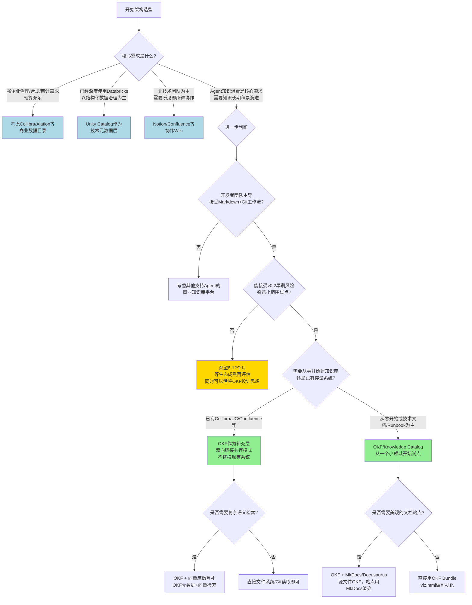

# 07 架构决策与方案对比

> **本章定位说明**
> - 前六章分别介绍了平台概述（[00 概述与知识地图](./00-overview.md)）、核心概念（[01 核心概念与平台架构](./01-core-concepts.md)）、OKF规范（[02 OKF规范深度解析](./02-okf-specification.md)）、参考Agent（[03 参考Agent实现原理与运行指南](./03-reference-agent.md)）、工具链可视化（[04 工具链与可视化系统](./04-toolchain-and-visualization.md)）、示例Bundle（[05 示例Bundle深度解析](./05-samples-and-bundles.md)）和集成模式（[06 集成模式与最佳实践](./06-integration-patterns.md)）。
> - 本章从**架构师/技术决策者**视角出发，客观分析OKF/Knowledge Catalog的局限性与风险，与主流替代方案做全面对比，提供选型决策框架和风险缓解建议。
> - 本章内容与[okf-wiki 04 局限性与方案对比](../okf-wiki/04-limitations-and-comparison.md)形成互补：OKF Wiki侧重OKF格式本身的对比，本章结合Knowledge Catalog完整工具链（参考Agent、可视化、示例Bundle等）做整体方案对比。

> ⚠️ **理性技术选型原则**：任何技术方案都有其适用边界和成熟度风险。本章不预设"Knowledge Catalog一定更好"的立场，而是提供客观的分析框架，帮助决策者基于自身场景、团队能力和风险承受能力做出理性选择。

---

## 7.1 OKF/Knowledge Catalog v0.2 已知局限性与风险

OKF Wiki在[局限性章节](../okf-wiki/04-limitations-and-comparison.md#41-⚠️-v02-版本状态与风险提示)已对OKF格式本身的早期风险做了说明，本节从完整平台（Knowledge Catalog工具链）角度做全面梳理。

### 7.1.1 版本成熟度风险

| 风险维度 | 具体情况 | 影响程度 |
|---------|---------|---------|
| **规范版本** | OKF v0.2 Draft，2026年6月首次发布，截至编写时仅2个月 | ⚠️ 高 |
| **规范变更风险** | v0.x阶段可能发生不兼容变更（字段重命名、type体系调整、Bundle结构变化） | ⚠️ 高 |
| **参考实现状态** | reference_agent是示例性质的代码，非生产级质量 | ⚠️ 中高 |
| **工具链完整性** | 只有基础的元数据提取和viz.html可视化，缺少企业级管理控制台 | ⚠️ 中 |
| **生产案例** | Google官方宣传为主，公开可查的大规模生产落地案例极少 | ⚠️ 中高 |
| **社区生态** | 社区规模小，第三方工具/适配器/插件几乎没有 | ⚠️ 中 |

**Google产品历史客观提示**：
Google有停止早期产品的历史先例（Google Reader、Inbox、Wave、Knol、Stadia等）。这不是预判Knowledge Catalog一定会被放弃，但这是技术选型必须考虑的风险因素。建议策略：小范围试点，保持可退出性，避免All-in重投入。

### 7.1.2 技术架构局限性

从Knowledge Catalog完整工具链角度，目前存在以下架构层面的局限：

1. **存储层缺失**
   - OKF本身只是文件格式规范，没有内置的存储/索引/查询服务
   - 你需要自行解决：全文检索、向量检索、权限控制、高并发访问
   - 参考Agent只负责生成Markdown，不提供运行时服务

2. **缺少企业级功能**
   - 无内置访问控制/权限模型（依赖文件系统/Git权限，无细粒度字段级/概念级权限）
   - 无实时协作编辑能力（纯文本Git工作流，不支持多人同时编辑）
   - 无审批工作流引擎（需要基于Git PR自行构建）
   - 无审计日志（除Git历史外，无专门的知识访问审计）
   - 无多语言规范支持（规范目前是英文为主，国际化/i18n方案缺失）

3. **二进制资源处理未明确**
   - 规范对图片、附件、二进制文件的处理方案没有明确规定
   - 参考Agent不处理非结构化文档（PDF、Word等）的二进制资源关联
   - 需要自行设计二进制资源的存储和引用方案

4. **查询与检索能力有限**
   - 本身只是文件，没有内置查询语言
   - viz.html只有基础的搜索过滤，不支持复杂查询（如"找所有owner是XX且verified=true的指标"）
   - 复杂检索需要额外集成Elasticsearch/Meilisearch或向量数据库

5. **参考Agent功能边界**
   - 目前只支持BigQuery作为数据源，Snowflake/Redshift/Databricks等需要自行扩展
   - Web Pass的网页抓取和充实功能比较基础，复杂的网页结构可能解析不准确
   - 增量同步逻辑简单，冲突处理策略需要自行完善
   - 没有内置的质量校验规则引擎，需要自行在CI中实现

### 7.1.3 组织与生态局限性

1. **学习曲线与团队接受度**
   - Markdown+YAML frontmatter对开发者友好，但对非技术团队（业务、产品、运营）门槛较高
   - Git工作流（分支、PR、评审）对非工程团队不友好
   - 需要内部推广和培训，建立团队认知

2. **知识治理框架缺失**
   - 规范不提供知识治理流程（RACI、审核机制、生命周期管理）
   - 需要企业自行建立治理流程和组织保障
   - type命名、tags分类、扩展字段等规范需要团队约定并执行

3. **与现有系统集成成本**
   - 与Unity Catalog/Collibra等现有数据目录的双向同步需要自行开发
   - 与企业SSO/权限系统集成需要自行实现
   - 与BI工具、监控系统、告警系统的集成需要定制开发

---

## 7.2 不适用场景（明确什么时候不该用）

基于上述局限性，以下场景**不建议**采用OKF/Knowledge Catalog：

| 场景类型 | 原因 | 推荐替代方案 |
|---------|------|-------------|
| **需要强一致、高并发、低延迟的在线知识服务** | OKF不是数据库，纯文件无法满足高并发低延迟要求 | 专门的知识图谱数据库、搜索引擎优化后的知识库 |
| **复杂的本体推理、语义推理场景** | OKF没有形式化语义和推理能力 | OWL/RDF知识图谱、专业语义网技术栈 |
| **非技术团队为主，需要所见即所得编辑** | Markdown+Git门槛高，没有WYSISYG编辑器 | Notion、Confluence、飞书文档 |
| **个人知识管理/笔记场景** | OKF的互操作性和Agent优势个人场景体现不出价值 | Obsidian、Logseq、Notion |
| **已经成熟运行的Notion/Confluence生态，无Agent集成需求** | 迁移成本高，收益不明显 | 继续用现有工具，保持观望 |
| **需要细粒度权限、复杂审批工作流、实时协作** | OKF原生不支持这些企业协作功能 | Confluence、SharePoint、专门的Wiki平台 |
| **二进制资源为主的知识库（媒体资产、设计文件）** | 规范对二进制资源处理缺失 | 专门的数字资产管理（DAM）系统 |
| **要求开箱即用、SLA保障、商业支持** | 目前是开源早期项目，无商业支持 | Collibra、Alation、Unity Catalog等商业产品 |
| **团队完全没有Git/工程能力** | Git工作流是基础前提，无法绕过 | 低代码/无代码知识管理平台 |

---

## 7.3 OKF/Knowledge Catalog vs 8种主流方案客观对比

本节采用统一对比框架，从8个维度对9种方案（含OKF/Knowledge Catalog）进行客观对比。对比框架参考[okf-wiki 04局限性与方案对比](../okf-wiki/04-limitations-and-comparison.md)，但覆盖更全面的企业级方案。

### 7.3.1 对比维度说明

- **成熟度**：产品/规范的稳定性、生产案例、社区生态
- **Agent友好度**：AI Agent无需定制适配器即可消费的程度
- **开放性**：数据格式开放、无厂商锁定、可导出迁移
- **企业级功能**：权限、审计、工作流、协作等企业特性
- **开发者体验**：Git友好、可集成CI/CD、可编程扩展
- **非技术用户体验**：所见即所得、易用性、学习曲线
- **数据目录能力**：技术元数据管理、血缘、数据治理特性
- **成本**：许可费用、基础设施成本、运维人力成本

---

### 7.3.2 方案1：传统RAG向量库（仅切块无元数据）

典型代表：LangChain + Pinecone/Weaviate/Chroma自建RAG，仅做文本分块嵌入，无结构化元数据。

| 维度 | 传统RAG向量库（仅切块） | OKF/Knowledge Catalog |
|------|------------------------|----------------------|
| **成熟度** | ✅ 成熟，大量生产案例 | ⚠️ v0.2早期，案例少 |
| **Agent友好度** | ⚠️ 只有向量相似度，无法区分可信度/来源/时效性，幻觉严重 | ✅ 有类型、可信度、来源、时效性元数据，Agent可验证答案 |
| **开放性** | ⚠️ 向量库格式各异，迁移有成本 | ✅ 纯Markdown，Git存储，零锁定 |
| **企业级功能** | ❌ 基本没有，需要全部自建 | ⚠️ 基础框架有，企业功能需要自建 |
| **开发者体验** | ⚠️ 嵌入流水线复杂，切块策略难调优 | ✅ Markdown+Git，开发者熟悉 |
| **非技术用户体验** | ❌ 完全是技术方案，非技术用户无法使用 | ❌ 需要Markdown，非技术用户门槛高 |
| **数据目录能力** | ❌ 完全没有，只有文本块 | ⚠️ 有框架，需要reference_agent或自行集成 |
| **成本** | 💰 向量库成本+开发成本+嵌入成本 | 💰 几乎零成本（纯文件+Git），人力成本在知识整理 |
| **核心优势** | 实现简单、语义检索效果立竿见影、支持任意文档 | 知识来源可追溯、可信度分层、类型系统支持路由、Git版本化、人和Agent共读 |
| **核心劣势** | 无元数据、无结构、幻觉问题严重、知识无法演进维护 | 需要前期结构化投入、早期阶段风险、查询需要额外构建 |
| **关系** | **互补而非竞争**。OKF不是替代向量检索，OKF提供元数据和结构层，向量库做检索层。最佳实践：OKF Markdown切块后存入向量库，检索时带回元数据做可信度过滤 | |
| **适用场景** | 快速原型、文档变化频繁不值得结构化、对准确率要求不高的场景 | 需要可信知识、来源追溯、结构化Agent消费、需要知识演进的团队场景 |

---

### 7.3.3 方案2：Notion/Obsidian等文档工具

典型代表：Notion（团队协作）、Obsidian（个人知识管理）。

| 维度 | Notion/Obsidian | OKF/Knowledge Catalog |
|------|-----------------|----------------------|
| **成熟度** | ✅ 非常成熟，海量用户 | ⚠️ v0.2早期 |
| **Agent友好度** | ❌ Notion API限流且功能有限；Obsidian无统一标准，每个Vault约定不同 | ✅ 开放规范，Agent无需定制适配器即可理解结构 |
| **开放性** | ❌ Notion平台锁定，导出困难；Obsidian本地文件但无统一互操作标准 | ✅ 纯Markdown开放格式，零锁定 |
| **企业级功能** | ✅ Notion有完善的权限、协作、分享；Obsidian企业功能弱 | ❌ 原生不支持，需要自建 |
| **开发者体验** | ❌ Notion API难用、Git无法diff、无法和代码同仓；Obsidian插件开发者体验尚可 | ✅ Git原生支持、可和代码同仓、PR评审、CI集成 |
| **非技术用户体验** | ✅ Notion所见即所得，体验优秀；Obsidian编辑体验好 | ❌ Markdown+frontmatter门槛高 |
| **数据目录能力** | ❌ 基本没有，需要自己建数据库模板 | ⚠️ 有框架，reference_agent可自动生成 |
| **成本** | 💰 Notion按人头收费，团队规模大了成本高；Obsidian个人免费商业付费 | 💰 零许可成本，纯人力成本 |
| **核心优势** | 编辑体验极佳、生态成熟、插件丰富、上手快 | 开放无锁定、Git-native、Agent友好、可执行知识（Playbook/Attested Computation） |
| **核心劣势** | Agent集成困难、平台锁定、Git不友好、知识无法被Agent可靠消费 | 编辑体验差、无实时协作、需要自建企业功能 |
| **适用场景** | 非技术团队为主、重视编辑体验、实时协作需求强、Agent需求弱或无 | 开发者优先、需要Agent集成、Git工作流、知识需要版本化演进、需要和代码同仓 |

**特别说明-Obsidian相似性**：OKF核心理念与Obsidian非常相似（本地Markdown+frontmatter+双向链接），核心区别在于OKF有最小互操作标准和统一类型系统，确保Agent跨Vault消费知识时的一致性。如果是个人使用，Obsidian足够好；如果是团队+Agent消费场景，OKF的标准化价值才体现出来。

---

### 7.3.4 方案3：Unity Catalog（Databricks）

典型代表：Databricks Unity Catalog，云原生数据目录与治理方案。

| 维度 | Unity Catalog | OKF/Knowledge Catalog |
|------|---------------|----------------------|
| **成熟度** | ✅ 商业产品，成熟稳定，大量生产案例 | ⚠️ v0.2早期开源项目 |
| **Agent友好度** | ⚠️ 有API但不是为Agent设计的，需要定制适配器 | ✅ 原生为Agent设计，格式自描述 |
| **开放性** | ❌ Databricks生态内开放，跨云/跨平台有限 | ✅ 完全开放，厂商中立，无生态绑定 |
| **企业级功能** | ✅ 非常完善：细粒度权限、审计、血缘、审批 | ❌ 原生不支持，需要自建 |
| **开发者体验** | ⚠️ SQL/API方式，Git集成弱，无法和代码同PR评审 | ✅ Markdown+Git，和代码同仓同工作流 |
| **非技术用户体验** | ✅ UI完善，数据分析师可用 | ❌ Markdown门槛高，主要面向开发者 |
| **数据目录能力** | ✅ 业界领先：技术元数据、血缘、访问控制、数据治理 | ⚠️ 框架层面，需要同步UC元数据补充业务知识 |
| **成本** | 💰💰 商业许可成本高，Databricks平台绑定 | 💰 零许可成本 |
| **核心优势** | 企业级治理能力完善、和Databricks生态深度集成、商业支持SLA | 业务知识层灵活、Agent友好、Git版本化、可包含Playbook/Attested Computation等执行型知识、可跨系统连接 |
| **核心劣势** | 锁定Databricks生态、成本高、主要面向结构化数据、业务知识表达能力弱、Agent消费需要定制 | 无原生权限/审计/治理、需要自行集成、无商业支持 |
| **关系** | **互补共存，定位不同**。UC是技术元数据治理层，OKF是业务知识编排与Agent消费层。最佳实践：UC管技术元数据+权限+血缘，OKF补充业务定义、Playbook、指标计算逻辑，双向链接（详见[06集成模式章节](./06-integration-patterns.md#64-与现有数据目录集成模式)） | |
| **适用场景** | 已经深度使用Databricks、需要强数据治理与权限控制、以结构化数据为主、预算充足 | 需要Agent消费知识、需要跨系统连接知识、开发者团队主导、需要将知识和代码放在一起管理、预算有限 |

---

### 7.3.5 方案4：Collibra/Alation（企业级数据目录）

典型代表：Collibra、Alation，传统企业级数据治理与数据目录商业产品。

| 维度 | Collibra/Alation | OKF/Knowledge Catalog |
|------|-----------------|----------------------|
| **成熟度** | ✅ 业界领先的成熟商业产品，大量500强案例 | ⚠️ v0.2早期开源项目 |
| **Agent友好度** | ❌ 传统产品，API不是为Agent设计，定制适配器复杂 | ✅ 原生Agent友好 |
| **开放性** | ❌ 商业产品，数据锁定在专有数据库，导出困难 | ✅ 完全开放，纯Markdown |
| **企业级功能** | ✅ 极其完善：权限、审批、工作流、审计、数据血统、治理框架、RACI | ❌ 几乎没有，需要全部自建 |
| **开发者体验** | ❌ 企业软件风格，API笨重，Git集成差，定制开发成本高 | ✅ Markdown+Git，开发者友好，可编程扩展 |
| **非技术用户体验** | ✅ 企业级UI，业务用户可用（但学习曲线也不低） | ❌ 面向开发者，非技术用户门槛高 |
| **数据目录能力** | ✅ 业界顶级：业务术语表、数据血缘、数据质量、治理工作流、认证体系 | ⚠️ 框架层面，可作为补充层 |
| **成本** | 💰💰💰 非常昂贵，百万级/年起，按用户/资产收费 | 💰 零许可成本，纯人力成本 |
| **核心优势** | 企业级数据治理能力完整、商业支持SLA、行业最佳实践内置、适合合规要求高的大型企业 | 轻量、灵活、Agent原生、开放无锁定、Git工作流、低门槛起步、可包含执行型知识 |
| **核心劣势** | 极其昂贵、实施周期长（6-12个月）、笨重不灵活、Agent时代适应性弱、定制成本高、锁定风险 | 无企业级治理功能、需要自建、无商业支持、早期风险 |
| **关系** | **互补而非替代**。Collibra/Alation适合作为企业级数据治理的系统-of-record，OKF适合作为敏捷的上层知识编排与Agent消费层，两者通过resource字段双向链接（参考[06章集成模式](./06-integration-patterns.md#642-推荐集成架构双向同步互补模式)） | |
| **适用场景** | 超大型企业、强合规要求（金融/医疗/政府）、预算充足、有专门的数据治理团队、已经采购或正在采购此类产品 | 敏捷团队、需要快速落地、Agent需求优先、开发者主导、预算有限、希望先试点再规模化 |

---

### 7.3.6 方案5：Confluence（企业Wiki）

典型代表：Atlassian Confluence，企业级Wiki与协作平台。

| 维度 | Confluence | OKF/Knowledge Catalog |
|------|------------|----------------------|
| **成熟度** | ✅ 非常成熟，企业Wiki事实标准 | ⚠️ v0.2早期 |
| **Agent友好度** | ❌ 页面结构不统一，宏/插件导致HTML结构复杂，Agent解析困难，API限流 | ✅ 结构统一，Markdown易解析，frontmatter元数据自描述 |
| **开放性** | ❌ 数据锁定在Confluence，导出为乱码，迁移困难 | ✅ 纯文件开放标准，零锁定 |
| **企业级功能** | ✅ 完善：空间权限、页面权限、审批插件、审计日志 | ❌ 原生无，需要自建 |
| **开发者体验** | ❌ 专有存储格式、Git无法diff/merge、无法和代码同PR评审、定制开发复杂 | ✅ Git-native，和代码同仓同工作流，PR评审，CI集成 |
| **非技术用户体验** | ✅ 所见即所得编辑器，企业用户熟悉 | ❌ Markdown+Git门槛高 |
| **数据目录能力** | ❌ 基本没有，需要自行用页面模板组织，无自动元数据提取 | ⚠️ 有框架，reference_agent可自动生成 |
| **成本** | 💰 按用户收费，中大规模团队成本不低 | 💰 零许可成本 |
| **核心优势** | 企业用户熟悉度高、编辑体验好、生态插件丰富、和Jira深度集成、协作能力强 | Git版本化、知识可演进、Agent友好、可执行Playbook、可和代码同仓、零锁定 |
| **核心劣势** | Agent无法可靠消费知识、知识结构混乱（每个人写法不同）、无法版本化管理、和代码割裂、无自动元数据同步 | 无实时协作、非技术用户门槛高、无内置权限审批 |
| **关系** | **可以共存/逐步迁移**。不建议一下子把Confluence全部迁走。推荐策略：新文档用OKF，Confluence作为历史归档和非技术团队协作平台，双向链接跳转；Playbook/技术文档/Agent知识优先用OKF | |
| **适用场景** | 非技术团队为主、企业通用Wiki、需要和Jira深度集成、重视协作编辑、Agent需求弱 | 技术文档、Runbook/Playbook、Agent知识库、需要和代码同仓管理、需要版本化演进、Agent消费场景 |

---

### 7.3.7 方案6：MkDocs/Docusaurus（静态文档站点）

典型代表：MkDocs（Material主题）、Docusaurus，开发者文档静态站点生成器。

| 维度 | MkDocs/Docusaurus | OKF/Knowledge Catalog |
|------|-------------------|----------------------|
| **成熟度** | ✅ 非常成熟，开源文档站点标准方案 | ⚠️ v0.2早期 |
| **Agent友好度** | ⚠️ 输出HTML，Agent可以爬但缺乏结构化元数据和类型系统 | ✅ 源文件就是带元数据的Markdown，Agent直接消费源文件 |
| **开放性** | ✅ Markdown源文件，开放 | ✅ 开放标准Markdown |
| **企业级功能** | ❌ 静态站点，基本没有企业功能 | ❌ 原生也没有 |
| **开发者体验** | ✅ Markdown+Git，开发者友好，CI/CD构建发布 | ✅ 同样Markdown+Git，源文件兼容，可以用MkDocs渲染OKF Bundle |
| **非技术用户体验** | ⚠️ 阅读体验好，但编写还是Markdown | ⚠️ 同样Markdown |
| **数据目录能力** | ❌ 只是文档站点，无数据目录能力 | ⚠️ 有框架，reference_agent可自动生成 |
| **成本** | 💰 免费开源，托管成本低 | 💰 免费 |
| **核心优势** | 站点渲染美观、搜索内置、主题成熟、阅读体验好、适合对外文档 | 有统一类型系统、元数据标准、Agent消费约定、知识图谱可视化、reference_agent自动生成 |
| **核心劣势** | 缺乏知识类型系统、元数据约定不统一、无Agent消费标准、无自动元数据提取、无知识图谱 | 本身不提供站点渲染（但可以用MkDocs来渲染OKF Bundle） |
| **关系** | **可以叠加使用**。OKF负责知识的结构化表示（类型、元数据、链接约定），MkDocs/Docusaurus负责渲染成美观的文档站点供人阅读。两者源文件都是Markdown，可以共存 | |
| **适用场景** | 对外产品文档、开发者文档站点、只需要人阅读不需要Agent深度消费的场景 | 需要Agent消费、需要知识图谱、需要类型化元数据、需要自动从数据源生成知识 |

---

### 7.3.8 方案7：dbt docs（数据文档自动生成）

典型代表：dbt docs，从dbt项目自动生成的数据模型文档站点。

| 维度 | dbt docs | OKF/Knowledge Catalog |
|------|----------|----------------------|
| **成熟度** | ✅ 成熟，dbt生态标准组件 | ⚠️ v0.2早期 |
| **Agent友好度** | ❌ 生成的是HTML站点，源文件是schema.yml，结构固定但缺乏业务知识扩展能力 | ✅ 开放格式，可扩展，Agent友好 |
| **开放性** | ✅ 基于dbt项目，开放 | ✅ 开放Markdown |
| **企业级功能** | ❌ 无，只是文档生成 | ❌ 原生无 |
| **开发者体验** | ✅ 和dbt紧密集成，自动生成，开发者体验好 | ✅ Markdown+Git，可通过脚本从dbt生成OKF文档 |
| **非技术用户体验** | ⚠️ 只适合数据团队使用 | ❌ 开发者导向 |
| **数据目录能力** | ⚠️ 仅覆盖dbt管理的数据模型，自动血缘不错，但范围有限 | ⚠️ 可覆盖更广范围，dbt模型只是其中一种Concept类型 |
| **成本** | 💰 dbt Core免费开源，Cloud付费 | 💰 免费 |
| **核心优势** | 零额外成本自动生成、和dbt管道无缝集成、自动血缘、字段级文档、数据团队熟悉 | 可描述非dbt资产、可扩展到业务知识/Playbook/Attested Computation、定制性强、Agent友好、跨系统知识连接 |
| **核心劣势** | 只覆盖dbt模型、无法描述非dbt资产、无法表达业务概念/指标/政策、定制性差、Agent消费需要定制解析 | 没有自动生成（需要写脚本从dbt同步）、需要维护元数据 |
| **关系** | **可以共存/互补**。dbt docs继续作为dbt模型的自动文档，OKF补充更广泛的业务知识、跨系统概念、Playbook、指标计算逻辑。可以写脚本从dbt schema.yml自动生成OKF的tables/部分，双向链接（参考[okf-wiki对比章节](../okf-wiki/04-limitations-and-comparison.md#448-okf-vs-dbt-docs数据文档)） | |
| **适用场景** | 以dbt为核心的数据转换管道、只需要数据模型文档、数据团队内部使用 | 需要统一管理数据资产+业务知识+Agent知识库、需要跨系统知识连接、需要Playbook和可执行知识 |

---

### 7.3.9 方案8：其他Agent知识方案（如MemGPT、LlamaIndex文档）

典型代表：各Agent框架自带的知识库方案（MemGPT记忆管理、LlamaIndex/LangChain文档加载器、自定义Agent记忆模块）。

| 维度 | 其他Agent知识方案 | OKF/Knowledge Catalog |
|------|------------------|----------------------|
| **成熟度** | ⚠️ 各框架成熟度不一，大多是快速迭代中 | ⚠️ 同样早期，但有明确规范 |
| **Agent友好度** | ✅ 为Agent设计，但各框架格式不兼容，Vendor Lock-in | ✅ 为Agent设计，厂商中立开放标准 |
| **开放性** | ❌ 各框架自定义格式，绑定特定框架 | ✅ 开放Markdown标准，不绑定任何Agent框架 |
| **企业级功能** | ❌ 基本没有，都是技术组件 | ❌ 原生无 |
| **开发者体验** | ⚠️ 框架内体验好，但换框架成本高，和Git/CI集成弱 | ✅ Markdown+Git，任何框架都能消费，和现有工程工作流集成 |
| **非技术用户体验** | ❌ 纯技术组件，非技术用户无法参与 | ❌ 同样开发者导向 |
| **数据目录能力** | ❌ 没有，只是Agent的记忆/检索组件 | ⚠️ 有完整框架和工具链 |
| **成本** | 💰 免费开源，但集成和迁移成本高 | 💰 免费开源 |
| **核心优势** | 和特定Agent框架深度集成、功能专一、开箱即用 | 跨Agent框架互操作、人Agent共读、Git版本化、知识图谱可视化、reference_agent自动生成、不锁定框架 |
| **核心劣势** | 框架锁定、人无法方便阅读编辑、缺乏知识治理能力、无法和代码同工作流、无法跨团队共享 | 框架无关意味着需要自己做框架集成、工具链相比成熟框架还简单 |
| **关系** | **互补**。OKF是知识表示与存储层标准，不绑定具体Agent框架。你的Agent可以用LlamaIndex/LangChain做检索编排，但知识源用OKF格式存储，这样未来换Agent框架时知识资产不用迁移 | |
| **适用场景** | 快速原型验证、特定框架深度定制、不需要跨团队共享知识、不需要人参与编辑 | 需要知识资产长期积累、跨框架可迁移、人Agent共读、跨团队共享、需要版本化治理 |

---

## 7.4 选型决策树

基于上述对比分析，提供以下决策树帮助理性选型：

### 7.4.1 决策路径解读

**路径1：直接适合采用OKF/Knowledge Catalog（绿色节点）**
- 核心需求是Agent知识消费
- 开发者团队主导，接受Markdown+Git
- 能接受早期风险，愿意小范围试点
- 推荐：从边界清晰的小领域开始（如一个新服务的文档、一组Agent工具说明、一个数据团队的指标字典）

**路径2：OKF作为补充层共存（绿色节点）**
- 已有Collibra/Unity Catalog/Confluence等投资
- 不替换现有系统，OKF作为Agent友好的业务知识层
- 通过resource字段双向链接
- 这是绝大多数企业的推荐路径（详见[06章6.4节](./06-integration-patterns.md#64-与现有数据目录集成模式)）

**路径3：观望等待（黄色节点）**
- 认可OKF方向，但担心早期风险
- 建议：先学习OKF设计思想（即使不用OKF，这些思想也能指导你的知识管理），等v1.0或有更多生产案例后再评估
- 可以在小的非关键项目中非正式试用，积累经验

**路径4：选择其他方案（蓝色节点）**
- 有明确的强需求（企业治理、Databricks生态、非技术协作），其他方案更匹配
- 这是理性选择，没有"万能方案"

---

## 7.5 风险评估与缓解建议

### 7.5.1 风险矩阵评估

| 风险类别 | 具体风险 | 发生概率 | 影响程度 | 风险等级 |
|---------|---------|---------|---------|---------|
| **规范风险** | v0.x阶段发生不兼容变更，导致已有Bundle需要迁移 | 高 | 中 | ⚠️ 中高 |
| **产品风险** | Google未来放弃Knowledge Catalog/OKF，停止投入 | 中 | 中 | ⚠️ 中 |
| **生态风险** | 生态发展缓慢，工具链长期不成熟 | 中高 | 中 | ⚠️ 中 |
| **技术风险** | 参考Agent功能不足，需要大量自行开发 | 高 | 低中 | ⚠️ 中 |
| **组织风险** | 团队不接受Markdown+Git工作流，推广失败 | 中 | 中高 | ⚠️ 中高 |
| **集成风险** | 与现有系统集成成本超预期 | 中 | 中 | ⚠️ 中 |
| **知识质量风险** | 缺乏治理导致知识质量低下、过期无人维护 | 高 | 中 | ⚠️ 中高 |
| **锁定风险** | 投入大量后发现不合适，迁移成本高 | 低 | 低 | ✅ 低（因为纯Markdown） |

### 7.5.2 核心风险缓解策略

#### 风险1：规范不兼容变更（中高风险）

**缓解措施**：
1. **锁版本**：在Bundle中明确标记`okf_version_target: "v0.2"`，不盲目追新版本
2. **抽象层**：在自己的代码中封装OKF解析逻辑，规范变更时只改一处
3. **关注变更**：Watch官方GitHub仓库，提前了解变更计划，不要盲目升级
4. **纯文本优势**：因为是Markdown，即使规范变更，知识内容本身不会丢失，只是调整frontmatter格式，迁移成本可控

#### 风险2：Google停止投入（中风险）

**缓解措施**：
1. **不All-in**：不要把所有知识都放在OKF上，先从非关键领域试点
2. **保持可退出性**：因为是纯Markdown+Git，即使OKF死了，你的知识还是你的，只是少了专门工具，损失有限
3. **避免依赖专有扩展**：尽量只用规范核心字段，不要过度依赖Google特定工具的专有功能
4. **社区参与**：如果认可方向，可以参与社区建设，降低单厂商依赖风险

#### 风险3：团队接受度低（中高风险）

**缓解措施**：
1. **从开发者团队开始**：先在SRE、数据工程、平台工程等Markdown/Git友好的团队推广，不要一开始就推给业务团队
2. **展示价值**：先做出一个成功案例（如Agent基于OKF知识回答问题准确率明显提升），用价值说服人
3. **降低门槛**：提供模板、示例、CLI工具、IDE插件，减少手工写frontmatter的成本
4. **不强制切换**：旧文档保留在Confluence，新文档用OKF，自然过渡，不搞"大迁移"

#### 风险4：知识质量低下（中高风险）

**缓解措施**：
1. **明确Owner**：每个Concept必须有owner字段，责任到人
2. **过期机制**：强制设置stale_after，CI检查过期知识并提醒
3. **可信度分层**：verified=true的知识才能进入生产Agent的RAG，其他仅供参考
4. **PR评审**：知识更新必须走PR，至少1人review，重要知识2人review
5. **定期演练**：Playbook每季度演练，验证可执行性
6. **健康度仪表盘**：定期统计知识覆盖率、过期率、verified比例，可视化质量状况

#### 风险5：集成成本超预期（中风险）

**缓解措施**：
1. **最小集成**：第一阶段只用OKF+Git+viz.html，不做任何系统集成，验证价值
2. **分阶段集成**：试点阶段→团队阶段→企业阶段，每个阶段集成必要的系统，不提前集成
3. **复用参考设计**：参考[06章集成模式](./06-integration-patterns.md)中的架构，不要从零设计
4. **利用互补关系**：不替换现有系统，而是双向链接共存，减少集成范围

### 7.5.3 试点阶段风险控制Checklist

开始试点前，确认以下风险控制措施到位：

- [ ] 试点领域边界清晰、风险低、价值可见（不是核心业务系统）
- [ ] 试点团队3-5人，都是开发者或Git友好人员
- [ ] 明确试点成功标准和2-4周的时间盒
- [ ] 不迁移任何旧文档，只有新文档用OKF
- [ ] 锁OKF v0.2版本，不追求最新
- [ ] 不做复杂系统集成，只用基础功能
- [ ] 明确试点失败的退出条件和退出方案
- [ ] 团队理解这是早期技术试点，不保证未来不变
- [ ] 有专门的Owner负责试点推进
- [ ] 制定了知识质量基本规则（owner、stale_after、verified）

---

## 7.6 理性总结与行动建议

### 7.6.1 OKF/Knowledge Catalog核心价值再确认

在讲了这么多风险和对比之后，需要客观承认：OKF/Knowledge Catalog的**设计哲学方向是正确的**：
- 开放、厂商中立的知识表示格式（Markdown+frontmatter）
- Git-native，人和Agent共读共写
- 知识像代码一样版本化、可评审、可回滚
- 生产者-消费者解耦，稳定中间契约
- 类型系统+元数据让Agent能可靠消费知识

这些理念在AI Agent时代是有前瞻性的，即使你最终不采用OKF，这些设计思想也值得借鉴。

### 7.6.2 当前阶段（2026年8月）的理性策略

**最理性的策略是"战略上重视，战术上谨慎"**：

1. **不要全盘否定**：
   - 不要因为"v0.2"、"Google可能放弃"就完全无视
   - 学习其设计思想，理解为什么这样设计
   - 即使不用OKF，这些思想可以指导你构建自己的Agent知识体系

2. **不要All-in重投入**：
   - 不要上来就把整个公司知识库迁移到OKF
   - 不要一开始就做大量定制开发和系统集成
   - 不要强迫非技术团队立即切换

3. **小范围试点验证**：
   - 选一个边界清晰、风险低的小领域（如一个新服务的文档、一组Agent工具说明、SRE的Runbook）
   - 2-4周时间盒，验证核心价值：Agent是否真的能更好地消费知识？团队是否能接受工作流？
   - 试点成功再考虑扩大范围，失败了损失也很小

4. **互补共存，不搞替换**：
   - 已有Confluence/Collibra/Unity Catalog投资的，不要推倒重来
   - OKF作为补充层，专门面向Agent消费和技术知识场景
   - 通过resource字段双向链接，用户可以选择自己习惯的工具

5. **保持可退出性**：
   - 这是OKF最大的安全网：纯Markdown+Git，即使放弃OKF，知识资产完全保留
   - 不要过度依赖专有工具和扩展，保持知识本身的可移植性

### 7.6.3 下一步行动建议

根据你的角色，给出具体行动建议：

**如果你是架构师/技术决策者**：
1. 花1-2小时快速浏览整个Wiki，理解OKF的核心理念
2. 评估团队场景是否符合OKF适用范围
3. 如果符合，安排一个2-4周的小范围试点
4. 试点后基于实际效果再决策是否扩大

**如果你是AI Agent开发者**：
1. 直接从[00概述](./00-overview.md)→[02OKF规范](./02-okf-specification.md)→[03参考Agent](./03-reference-agent.md)开始
2. 下载一个示例Bundle（如[GA4示例](./05-samples-and-bundles.md)），跑起来看看效果
3. 用OKF格式写你自己的Agent工具文档，体验工作流
4. 对比一下纯向量RAG和加了OKF元数据后的效果差异

**如果你是数据工程师/数据治理专家**：
1. 重点阅读[06集成模式章节](./06-integration-patterns.md)，理解OKF与现有数据目录的互补关系
2. 考虑用reference_agent从BigQuery生成一个数据集的OKF Bundle，体验自动生成
3. 评估双向链接模式是否适合你的组织

---

## 7.7 本章小结与延伸阅读

### 7.7.1 关键要点总结

**风险认知**：
1. OKF v0.2确实是早期版本，存在规范变更、生态不成熟、缺少企业功能等风险
2. Google产品历史风险需要考虑，但纯Markdown特性提供了天然的退出安全网
3. 风险是可控的，关键是不要All-in，小范围试点

**方案对比**：
1. OKF不是要替代所有方案，而是有明确的适用场景（开发者、Agent消费、Git工作流）
2. 与绝大多数现有方案（Unity Catalog、Collibra、Confluence、dbt docs等）是互补关系而非竞争
3. 传统纯向量RAG缺少元数据层，OKF+向量库是互补组合

**选型决策**：
1. 核心判断标准：是否需要Agent可靠消费知识？团队是否接受Markdown+Git？是否能接受早期风险？
2. 绝大多数企业推荐路径：现有系统保留，OKF作为补充层双向链接共存
3. 不要从零开始大建，从一个小领域试点开始

**风险缓解**：
1. 锁版本、不All-in、保持可退出性、明确Owner、PR评审、分阶段集成
2. 试点阶段必须有时间盒、明确成功/失败标准、退出方案

### 7.7.2 交叉引用与延伸阅读

**OKF Wiki核心章节**：
- OKF局限性基础分析：[okf-wiki 04 局限性与方案对比](../okf-wiki/04-limitations-and-comparison.md)（本章的基础，侧重OKF格式本身）
- OKF三种使用场景：[okf-wiki 03 使用模式与最佳实践](../okf-wiki/03-usage-patterns.md#31-三种典型使用场景)
- OKF企业落地路径：[okf-wiki 05 企业落地四阶段路径](../okf-wiki/05-architecture-and-integration.md#56-企业落地四阶段路径)
- Agent消费OKF流程：[okf-wiki 05 Agent如何消费OKF Bundle](../okf-wiki/05-architecture-and-integration.md#54-agent如何消费okf-bundle)

**Knowledge Catalog Wiki相关章节**：
- 集成模式与现有系统共存方案：[06 集成模式与最佳实践](./06-integration-patterns.md)（特别是6.4节与现有数据目录集成）
- 四个官方示例Bundle学习企业级用法：[05 示例Bundle深度解析](./05-samples-and-bundles.md)（特别是Acme Retail示例）
- 参考Agent运行指南快速体验：[03 参考Agent实现原理与运行指南](./03-reference-agent.md)
- 核心概念回顾：[01 核心概念与平台架构](./01-core-concepts.md)
- 资源与术语表：[08 资源与术语表](./08-resources-and-glossary.md)（下一章）

---

| 上一章 | 目录 | 下一章 |
|--------|------|--------|
| [06 集成模式与最佳实践](./06-integration-patterns.md) | [README](./README.md) | [08 资源与术语表](./08-resources-and-glossary.md) |
