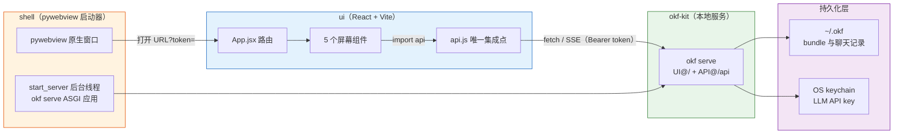

# 00 概述与知识地图

## 0.1 okf-desktop 是什么

okf-desktop 是 [okf-kit](https://github.com/vinodborole/okf-kit)（OKF 生态的官方便携工具链）的**轻量级桌面客户端**，由 Vinod Borole 开发，AGPL-3.0 协议开源。

它的核心功能可以概括为四个动作：

1. **Browse** —— 浏览 okf-kit 的 registry（登记中心），发现社区发布的 bundle
2. **Install** —— 一键 `get` 安装 OKF bundle（应用内称之为"书"/books）
3. **Read** —— 像读书一样阅读 bundle：目录树 + Markdown 正文 + 标题锚点 + 前后翻页
4. **Chat** —— 与知识对话（完全离线，或接入自有 LLM），回答带引用，点击直达原文章节

## 0.2 在 OKF 生态中的定位

OKF 生态可分为四层，okf-desktop 位于**消费层**：

| 层次 | 代表 | 作用 |
|------|------|------|
| **规范层** | [OKF 格式规范](../okf-wiki/README.md) | 定义 bundle/概念/frontmatter 的极简格式 |
| **工具链层** | okf-kit CLI（`okf serve`/`get`/`chat`） | bundle 的发布、注册、服务、检索 |
| **消费层** | **okf-desktop** | 面向最终用户的图形界面 |
| **知识层** | 各个 OKF bundle + `~/.okf` | 被消费的知识本体 |

> okf-desktop 的关键设计取舍：它**不重复实现** okf-kit 的任何逻辑，而是把 okf-kit 的本地 API 直接"穿"上一层 GUI。这使它天然保持轻量，并随 okf-kit 升级而免费进化。

## 0.3 核心架构原则：零逻辑客户端

这是理解 okf-desktop 最重要的一句话：

> **okf-desktop 不包含任何 okf-kit 逻辑。** UI 是纯 React，运行在 okf-kit 的本地 API（`okf serve`）之上；shell 只负责启动服务器并打开窗口。

由此衍生出三条架构决策：

1. **唯一集成点**：`ui/src/api.js` 是 UI 与后端唯一的交互处，其余所有屏幕组件都通过 `api` 对象调用 fetch。
2. **单源无 CORS**：`okf serve` 把 UI 托管在 `/`、把 API 托管在 `/api`，同源请求，无需处理跨域。
3. **进程内服务器**：shell 用后台线程在进程内跑 `okf serve`（而非子进程），这是它能被 PyInstaller 冻结为单文件的前提。

## 0.4 学习目标

完成本教程后，你将能够：

1. 向团队清晰解释 okf-desktop 的定位与「零逻辑客户端」架构哲学
2. 独立完成从源码构建与运行 okf-desktop，并安装、阅读、对话一个 bundle
3. 复述三层架构（shell → UI → okf serve）的分工与 token 传递机制
4. 理解 SSE 流式交互（安装进度、token 流式回答）与引用深链的实现原理
5. 掌握用 PyInstaller 把「Python 服务 + React UI」冻结为单文件的完整策略

## 0.5 六大章节导航表

| 章号 | 标题 | 核心内容 | 适合人群 | 预计阅读时间 |
|------|------|----------|----------|--------------|
| 00 | 概述与知识地图 | 生态定位、零逻辑客户端哲学、导航表、阅读路径、架构流程图 | 所有读者 | 4 分钟 |
| 01 | 架构深度解析 | 三层架构、shell 实现、api.js 集成点、单源无 CORS、进程内服务器、token | 开发者/架构师 | 8 分钟 |
| 02 | 安装与快速入门 | 预构建包下载、从源码构建、三平台启动、首次使用流程 | 使用者/开发者 | 6 分钟 |
| 03 | 五大界面详解 | Library/Discover/Read/Chat/Settings 逐一拆解 | 使用者/前端开发者 | 8 分钟 |
| 04 | API 与数据流 | 端点全景、SSE 协议、链接分类、数据存储 | 开发者 | 7 分钟 |
| 05 | 跨平台打包 | PyInstaller 冻结、依赖排除、平台差异、签名 | 开发者/发布者 | 6 分钟 |
| 06 | FAQ 与术语表 | 常见问题、核心术语、资源链接 | 所有读者 | 4 分钟 |

## 0.6 三条阅读路径

### 路径一：快速上手路径（使用者）
**目标**：下载、运行、装一本书、读一读、聊一聊
```
00 → 02 → 03
```
**预计**：约 15 分钟

### 路径二：架构理解路径（开发者）
**目标**：理解「零逻辑客户端 + 进程内服务器」为何能冻结为单文件
```
00 → 01 → 04 → 05
```
**预计**：约 30 分钟

### 路径三：完整学习路径
**目标**：完整掌握架构、界面、API、打包
```
00 → 01 → 02 → 03 → 04 → 05 → 06
```
**预计**：约 40 分钟

## 0.7 整体架构流程图



数据流自右向左：UI 组件 → `api.js` → `okf serve` → `~/.okf` 与 OS keychain。shell 在后台把 `okf serve` 跑在随机回环端口，并把带 token 的 URL 交给 pywebview 窗口。

## 0.8 目录结构

```
okf-desktop/
├─ ui/             React + Vite —— 5 个屏幕（Library/Discover/Read/Chat/Settings）
│  ├─ src/api.js   唯一集成点：对 okf serve API 的 fetch 封装
│  ├─ src/links.js 链接归一化与资源映射（引用深链的核心）
│  ├─ src/App.jsx  顶层路由与全局状态
│  ├─ src/screens/ 5 个屏幕组件
│  └─ src/theme.css 设计系统（Newsreader/Libre Franklin/IBM Plex Mono）
├─ shell/          pywebview 启动器（app.py + requirements.txt）
├─ build.sh        打包脚本
├─ okf-desktop.spec PyInstaller 配置
└─ version_info.txt Windows 版本资源
```

## 0.9 为什么这种架构值得学习

- **职责极简**：GUI 是 GUI，逻辑是逻辑，二者通过 HTTP API 解耦，任何一端都可独立替换或升级。
- **零 CORS 负担**：用同一服务器托管静态资源和 API，规避了桌面 webview 里常见的跨域痛点。
- **可冻结性**：把服务器跑在进程内线程上，PyInstaller 才能把「Python 后端 + React 前端」打包成一个可执行文件。
- **离线优先**：字体自托管、无 CDN、无外部网络依赖，bundle 与聊天都落在本地 `~/.okf`。

这是一个优秀的「本地优先（local-first）桌面应用」参考实现：以最少的胶水代码，把成熟的 CLI 工具链转化为面向普通用户的图形产品。

---

| 上一章 | 目录 | 下一章 |
|--------|------|--------|
| （无，是第一章） | [README](./README.md) | [01 架构深度解析](./01-architecture.md) |