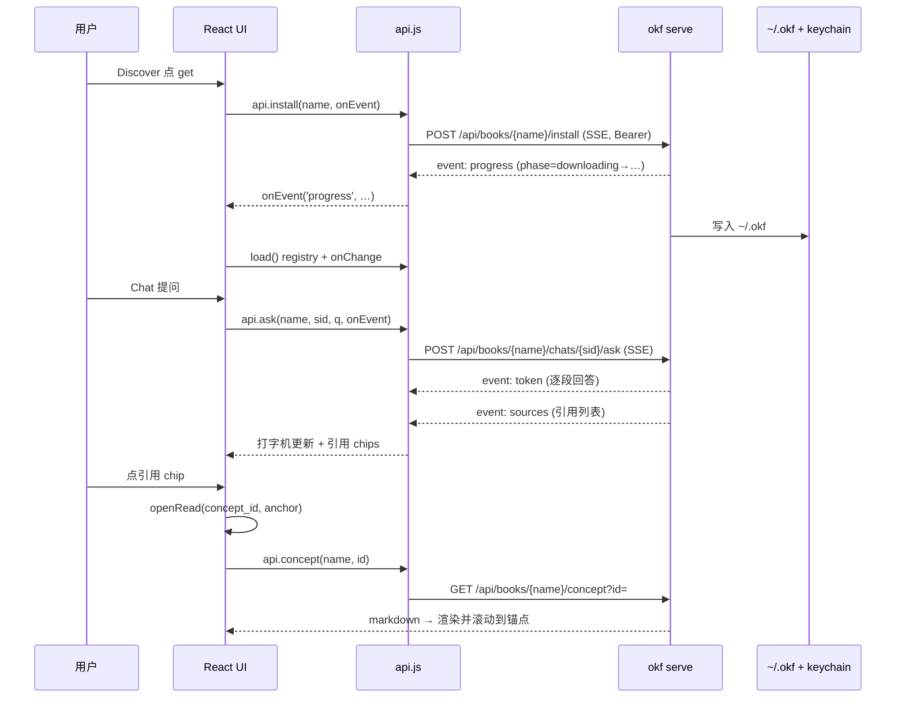

# 04 API 与数据流

## 4.1 端点全景

`api.js` 暴露的方法与屏幕、HTTP 端点的映射如下（端点前缀 `/api`，均带 `Authorization: Bearer`）：

| 屏幕 | 方法 | HTTP 端点 | 类型 |
|------|------|-----------|------|
| 通用 | `status()` | `GET /api/status` | JSON |
| 通用 | `health()` | `GET /api/health` | JSON |
| Library | `books()` | `GET /api/books` | JSON |
| Library | `book(name)` | `GET /api/books/{name}` | JSON |
| Library | `removeBook(name)` | `DELETE /api/books/{name}` | 204 |
| Discover | `registry()` | `GET /api/registry` | JSON |
| Discover | `install(name, onEvent)` | `POST /api/books/{name}/install` | **SSE** |
| Read | `toc(name)` | `GET /api/books/{name}/toc` | JSON |
| Read | `concept(name, id)` | `GET /api/books/{name}/concept?id=` | JSON |
| Chat | `chats(name)` | `GET /api/books/{name}/chats` | JSON |
| Chat | `newChat(name)` | `POST /api/books/{name}/chats` | JSON |
| Chat | `chat(name, sid)` | `GET /api/books/{name}/chats/{sid}` | JSON |
| Chat | `delChat(name, sid)` | `DELETE /api/books/{name}/chats/{sid}` | 204 |
| Chat | `ask(name, sid, q, onEvent)` | `POST /api/books/{name}/chats/{sid}/ask` | **SSE** |
| Settings | `settings()` | `GET /api/settings` | JSON |
| Settings | `saveSettings(body)` | `PUT /api/settings` | JSON |

> 约定：`req` 对 `204 No Content` 返回 `null`，对含 JSON 的返回解析后的对象；`stream` 对 SSE 接口逐事件回调。

## 4.2 两种数据通道：JSON vs SSE

okf-desktop 只有两类数据交互：

1. **请求-响应 JSON**：适用于一次性查询（书库、registry、toc、concept、settings），用 `req`。
2. **服务端推送 SSE**：适用于长时/增量场景（安装进度、对话回答），用 `stream`。

### SSE 事件约定

Speech 接口通过 `event:` 行区分事件类型，`data:` 行携带 JSON 载荷：

```
event: progress
data: {"phase":"downloading"}

event: token
data: {"text":"…片段…"}

event: sources
data: {"sources":[...]}
```

前端 `stream` 的解析逻辑：按 `\n\n` 分帧 → 逐行提取 `event:` 与 `data:` → 有 `event` 就回调 `onEvent(name, data)`。

## 4.3 链接分类算法

阅读器与对话里"点击引用直达原文"是 okf-desktop 体验的核心，其技术底座在 `links.js`。

### 三个纯函数

```javascript
// GitHub 风格标题 slug，匹配 okf serve 的 concept 标题锚点
function slug(text) {
  return text.trim().toLowerCase().replace(/[^\w\s-]/g, "")
             .replace(/[\s_]+/g, "-").replace(/^-+|-+$/g, "");
}

// 归一化 URL：去协议/query/fragment/尾部斜杠/index.html
function normUrl(u) {
  try {
    const x = new URL(u);
    const p = x.pathname.replace(/\/(index\.html?)?$/i, "/").replace(/\/+$/, "");
    return (x.host + (p || "/")).toLowerCase();
  } catch { return (u || "").toLowerCase(); }
}

// 拍平 TOC 树，只留 concept 叶子
function flattenConcepts(nodes, out = []) {
  for (const n of nodes) {
    if (n.kind === "concept") out.push(n);
    else flattenConcepts(n.children, out);
  }
  return out;
}

// 原始 URL → concept id 映射
function buildResourceMap(toc) {
  const m = new Map();
  for (const c of flattenConcepts(toc)) if (c.resource) m.set(normUrl(c.resource), c.id);
  return m;
}
```

### 分类判定

对于一个正文里的链接 `raw`：

1. `raw.startsWith("#")` → **anchor**（页内锚点，滚动即可）
2. 否则用 `new URL(raw, c.resource)` 解析成绝对 URL（相对链接相对于当前概念的 `resource`）
3. 归一化后查 `resourceMap`：命中 → **concept**（书内跳转）；未命中 → **external**（系统浏览器）

这套机制使"任何指向本书内页面的链接，无论是阅读器还是对话，都能应用内跳转；只有真正的外部网站才开浏览器"。作者在 `links.js` 顶部注释即点明：共享给 reader 与 chat 两处使用。

## 4.4 数据存储位置

okf-desktop 自己不维护后端，数据全部由 okf-kit 落盘：

| 数据 | 位置 | 说明 |
|------|------|------|
| bundle 本体 | `~/.okf` | 安装的"书" |
| 聊天记录 | `~/.okf/chats` | Chat 底部文案明确标注 |
| LLM API key | OS keychain | 系统钥匙串，不在 bundle 内 |

`~/.okf` 是 okf-kit 的默认数据目录，bundle 以"书"的形式在这里组织。

## 4.5 一次完整交互的数据流（时序）

以"安装一本书并提问"为例：



## 4.6 一个设计要点：真正的流式是后续项

README 的 Notes 里坦率说明：目前后端 `ask` 是**把完整答案分块**返回（chunk the finished answer），而非真正的 token 级流式；"True token streaming" 被列为 okf-kit v1 的改动。但前端已经按 token 事件逐段渲染，所以一旦后端实现真流式，UI 无需改动即可享受——这正是「零逻辑客户端」带来的升级红利。

---

| 上一章 | 目录 | 下一章 |
|--------|------|--------|
| [03 五大界面详解](./03-ui-screens.md) | [README](./README.md) | [05 跨平台打包](./05-packaging.md) |