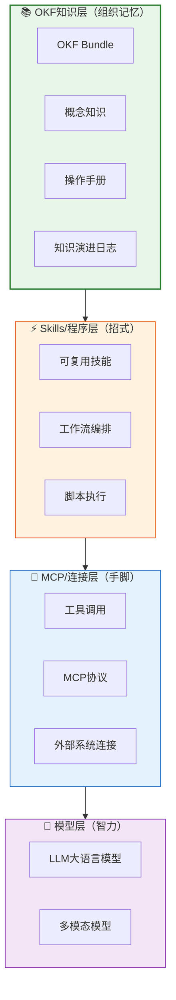
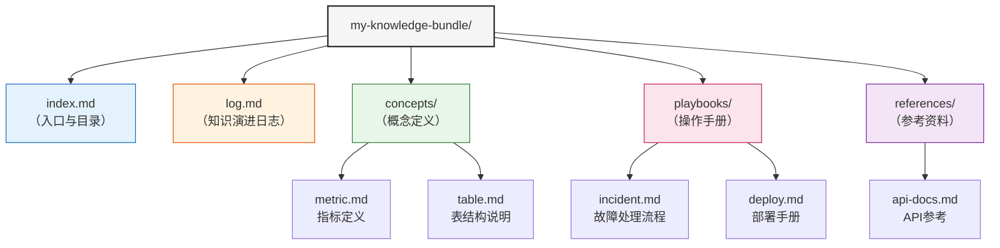

> **⚠️ 版本早期警示**
> - OKF目前处于**v0.2 Draft极早期阶段**（2026年6月首次发布）
> - 本教程基于现有公开信息整理，是趋势分析而非确定性预测
> - Google历史上有多个早期产品被终止的先例（Reader/Inbox/Knork等）
> - 建议先小范围试点，不建议All-in重投入
> - 生态仍在快速演进中

# 00 OKF概述与知识地图

## 0.1 OKF是什么

OKF（Open Knowledge Format）是Google Cloud 2026年6月发布的开放知识表示规范。

**核心定位**："AI时代的HTML"——面向人和Agent共读、极简、可Git管理的知识格式。

**本质**：一组带元数据、互相链接、可被Git管理的Markdown文件。

**一句话价值主张**：你的AI Agent无需适配器即可解析，你的团队可在Git中评审，你的文档再也不会在上下文之外腐烂。

## 0.2 背景与动机

### 知识碎片化问题
各平台格式不兼容、知识锁定在专有系统，跨平台迁移成本极高。

### 传统RAG的局限
仅做文本切块，缺乏来源、可信度、结构元数据，回答质量依赖检索运气。

### Agent知识层缺失
当前Agent栈三层（模型/MCP/Skills）缺少独立的知识层，知识散落在提示词、Skills描述和向量库中。

### HTML时刻类比
HTML让网页可互操作，OKF想让知识可互操作——就像浏览器统一解析HTML，Agent可统一解析OKF。

## 0.3 学习目标

完成本教程后，你将能够：

1. 理解OKF的核心定位与设计哲学，能向团队清晰解释OKF是什么
2. 掌握OKF Bundle的目录结构与核心文件（index.md/log.md/concepts/playbooks）
3. 独立编写符合OKF v0.2规范的知识条目，正确使用YAML frontmatter字段
4. 设计适合自身团队的知识组织方案，区分concepts/playbooks/references三类内容
5. 将OKF集成到现有Agent工作流中，实现知识的版本控制与团队评审

## 0.4 前置知识要求

- **基础Markdown/YAML知识**：能编写Markdown文档，理解YAML键值对结构
- **AI Agent基本了解**：知道Agent是什么，理解工具调用、RAG等基本概念
- **版本控制（Git）基础**：理解commit/branch/PR等基本概念，OKF基于Git管理

## 0.5 8章导航表

| 章号 | 标题 | 核心内容 | 适合人群 | 预计阅读时间 |
|------|------|----------|----------|--------------|
| 00 | OKF概述与知识地图 | 背景动机、学习目标、导航表、阅读路径、Agent四层架构图、Bundle结构图 | 所有读者 | 3分钟 |
| 01 | 核心概念与设计哲学 | 三大设计原则、术语表、Bundle/Concept/Frontmatter规范、链接规则、索引/日志、引用规范、3个完整示例 | 开发者/知识工程师 | 8分钟 |
| 02 | 5分钟快速入门 | 零依赖、6步创建Agent工具知识库Bundle、三规则验证、下一步建议 | 初学者/开发者 | 5分钟 |
| 03 | 使用模式与最佳实践 | 三种典型场景（数据目录/Agent知识库/Runbook）、扩展字段、链接设计、渐进式文档化、自动化脚本、Git工作流、版本管理 | 开发者/架构师 | 7分钟 |
| 04 | 局限性与方案对比 | V0.2风险提示、已知局限性、不适用场景、8种方案客观对比、选型决策树 | 架构师/决策者 | 6分钟 |
| 05 | 架构定位与Agent集成 | 四层架构详解、OKF vs MCP vs Skills、Agent消费流程、生产消费解耦、企业落地四阶段路径 | 架构师/技术负责人 | 7分钟 |
| 06 | FAQ与最佳实践 | 12个常见问题、8条核心最佳实践、生产上线10项检查清单 | 所有读者 | 5分钟 |
| 07 | 资源与术语表 | 29个核心术语定义、官方资源链接、相关标准、知乎参考文章、交叉引用 | 所有读者 | 4分钟 |

## 0.6 三条阅读路径

### 路径一：快速上手路径（初学者/开发者）
**目标**：快速了解OKF并写出第一个Bundle

**阅读顺序**：00 → 01 → 02 → 06
**预计总时间**：约21分钟

### 路径二：深度开发路径（开发者/知识工程师/架构师）
**目标**：完整掌握OKF规范、最佳实践与集成方法

**阅读顺序**：00 → 01 → 02 → 03 → 05 → 06 → 07
**预计总时间**：约39分钟

### 路径三：架构决策路径（架构师/技术决策者）
**目标**：判断OKF是否适合团队，做出技术选型决策

**阅读顺序**：00 → 01 → 04 → 05 → 06 → 07
**预计总时间**：约33分钟

## 0.7 Agent四层架构全景图

## 0.8 OKF Bundle结构示意图

## 0.9 为什么知识层重要

- **模型是租的，可以换**：GPT换Claude换Gemini，随时切换
- **框架是工具，可以换**：LangChain换LlamaIndex换自研，工具而已
- **Skills是招式，可以学**：新技能可以快速开发、训练、迭代
- **知识是企业自己的，是长期不被商品化的护城河**：业务概念、操作流程、决策逻辑、历史经验——这些才是真正沉淀下来、不可替代的核心资产

OKF要做的，就是让这些核心资产有一个开放、可移植、可演进的载体。

## 0.10 官方参考实现：Knowledge Catalog

Google Cloud官方提供了OKF的完整参考实现和工具链——**Knowledge Catalog**，包含参考Agent、可视化工具、enrichment/mdcode工具箱以及示例Bundle解析。如果你想直接上手实践OKF，可以参考 [Knowledge Catalog概述](../knowledge-catalog-wiki/00-overview.md) 获取完整的工具链指南和实操示例。

---

| 上一章 | 目录 | 下一章 |
|--------|------|--------|
| （无，是第一章） | [README](./README.md) | [01 核心概念](./01-core-concepts.md) |
