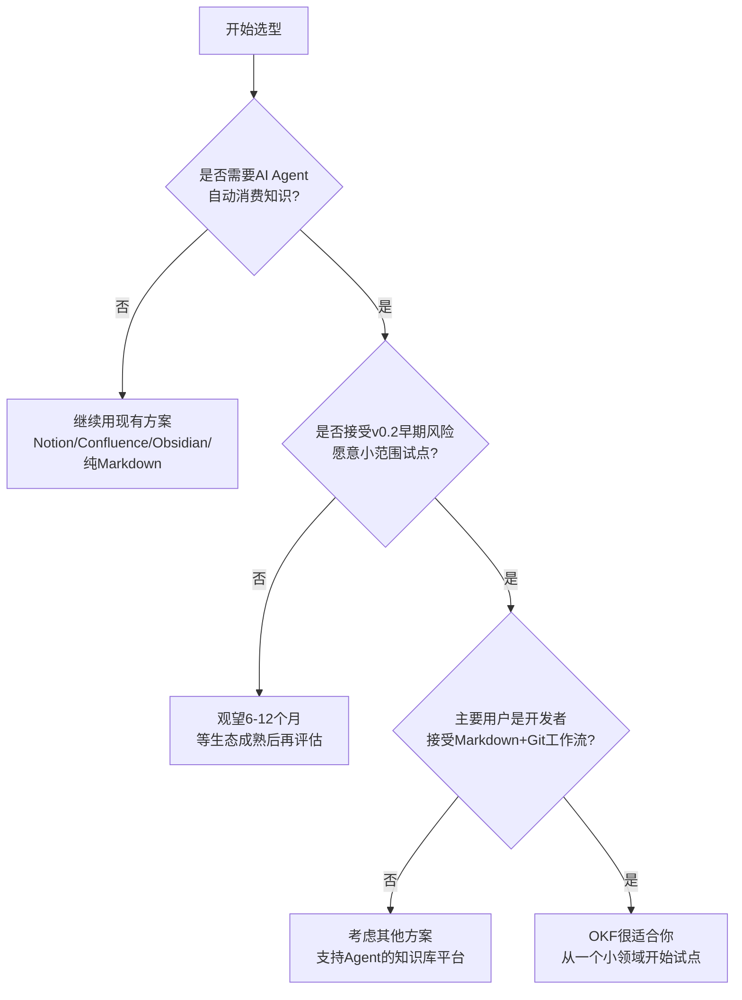

# 04 局限性与方案对比

> ⚠️ **理性看待OKF**：本教程在介绍OKF价值的同时，有责任客观呈现其局限性和风险。任何技术选型都应基于自身场景评估，不要因为"Google出品"或"AI新概念"就盲目追随。

## 4.1 ⚠️ V0.2 版本状态与风险提示

**必须放在最前面，醒目清晰**

- **发布时间**：2026年6月首次发布，截至本教程编写（2026年8月）仅2个月
- **当前版本**：v0.2 Draft，规范仍可能发生不兼容变更
- **生态现状**：
  - 工具链极少（只有在线验证器和简单Skill）
  - 社区案例几乎没有（主要是Google自己的宣传和早期尝鲜者）
  - 没有成熟的生产级落地案例可参考
  - 最佳实践仍在形成中
- **Google产品历史风险（必须客观提及）**：
  - Google有放弃早期产品的历史先例：Google Reader、Google Inbox、Google Wave、Google Knol、Google Stadia等
  - 这不是说OKF一定会被放弃，但这是必须考虑的风险因素
  - 建议：不要All-in重投入，先小范围试点，保持可退出性
- **规范不完整**：v0.2仍缺少很多细节（如权限模型、二进制资源处理、多语言规范等）

---

## 4.2 已知局限性（Non-Goals深度解读）

OKF明确不做的事情（既是设计选择也是局限性）：

1. **不定义固定的类型分类体系**：type字段自由填写，可能导致同一概念不同团队命名不一致，需要额外治理
2. **不规定存储/查询/服务基础设施**：OKF只是文件格式，你需要自己解决：
   - 如何提供服务（HTTP API？直接文件系统？）
   - 如何做全文检索/向量检索
   - 如何做权限控制
   - 如何做大规模Bundle的性能优化
3. **不替代领域特定Schema**：
   - 不替代Protobuf/Avro（数据序列化）
   - 不替代OpenAPI（API规范）
   - 不替代SQL DDL（数据库Schema）
   - OKF补充这些格式的业务上下文、使用说明、交叉引用，但不替代它们
4. **不内置访问控制/权限模型**：纯文本文件，权限靠底层文件系统/仓库权限，没有细粒度的字段级/概念级权限
5. **没有强制的二进制资源处理方案**：图片/附件/二进制文件怎么处理，规范目前没有明确规定
6. **查询能力有限**：本身只是文件，没有内置查询语言，需要额外工具支持复杂查询

---

## 4.3 不适用场景

明确说明什么时候**不应该**用OKF：

- 需要强一致、高并发、低延迟的在线知识服务场景（OKF不是数据库）
- 复杂的知识推理、本体推理场景（考虑OWL/RDF等专业知识图谱格式）
- 已经成熟运行的Notion/Confluence生态，团队已经习惯且没有Agent集成需求（没必要迁移）
- 个人笔记场景（Obsidian已经足够好，OKF的互操作性优势个人用不上）
- 需要细粒度权限、审批工作流、实时协作编辑的场景（考虑专门的Wiki平台）
- 二进制资源为主的知识库（如媒体资产管理）

---

## 4.4 OKF vs 8种替代方案（客观对比表格）

### 4.4.1 OKF vs 纯Markdown无结构

| 维度 | 纯Markdown无结构 | OKF |
|------|------------------|-----|
| **优势** | 最简单、零门槛、任何编辑器都支持 | 有类型区分、元数据可机器读取、链接约定、Agent可自动路由 |
| **劣势** | 无类型区分、无元数据、Agent无法自动路由、没有链接约定 | 需要学习frontmatter约定、有初期组织成本 |
| **适用场景** | 个人笔记、简单文档、不需要Agent集成的场景 | 需要Agent自动处理的团队知识库 |

---

### 4.4.2 OKF vs Notion/Confluence（闭源Wiki）

| 维度 | Notion/Confluence | OKF |
|------|-------------------|-----|
| **优势** | 所见即所得编辑、实时协作、权限管理、丰富的块类型、生态成熟 | 开放格式无锁定、Git原生支持、可与代码同仓、Agent集成简单、零成本 |
| **劣势** | 平台锁定、数据导出困难、API有限且限流、Agent需要定制适配器、成本随人数增长、Git无法diff | 无实时协作、需要自己搭编辑体验、权限靠文件系统、没有所见即所得 |
| **适用场景** | 非技术团队、需要实时协作、重视编辑体验、预算充足 | 开发者优先、需要Git管理、要和代码放一起、Agent集成需求强、不怕Markdown |

---

### 4.4.3 OKF vs Obsidian（个人知识管理）

| 维度 | Obsidian | OKF |
|------|----------|-----|
| **优势** | 编辑体验好、插件生态丰富、双向链接、本地文件、可视化图谱 | 有最小互操作标准、统一类型系统、Agent消费约定清晰 |
| **劣势** | 主要面向个人，缺乏团队/企业治理特性、Vault约定不统一、Agent互操作性无标准 | 编辑体验不如Obsidian、没有内置图谱可视化 |
| **注意** | OKF核心理念和Obsidian很像（本地markdown+frontmatter+链接），区别主要在OKF有最小互操作标准和类型系统 | |
| **适用场景** | 个人知识管理、个人笔记、研究笔记 | 团队知识库、Agent消费场景 |

---

### 4.4.4 OKF vs 专有向量库RAG（仅切块无元数据）

| 维度 | 纯向量库RAG（仅切块） | OKF + 向量检索（互补） |
|------|----------------------|------------------------|
| **优势** | 实现简单、语义检索效果好、支持大文档 | OKF提供元数据和结构、知识来源可追溯、可信度/时效性可标记、Agent可验证答案来源 |
| **劣势** | 只有文本切块，不知道知识来源、可信度、时效性、类型；没有结构；幻觉问题严重；Agent无法验证答案来源 | 需要前期结构化投入 |
| **关系** | **互补，不是竞争**。OKF不是替代向量检索，OKF提供元数据和结构，向量库做检索 | |
| **适用场景** | 快速原型、对准确率要求不高、文档变化频繁不值得结构化 | 需要可信知识、来源追溯、结构化Agent消费 |

---

### 4.4.5 OKF vs 知识图谱/本体（RDF/OWL）

| 维度 | RDF/OWL | OKF |
|------|---------|-----|
| **优势** | 形式化语义、逻辑推理能力强、严格的Schema、W3C标准 | 简单、Markdown编辑、Git友好、开发者容易接受、敏捷迭代 |
| **劣势** | 学习曲线极陡、编辑成本高、开发者体验差、不适合敏捷迭代、需要专门的图数据库 | 没有形式化推理能力，语义精度低 |
| **适用场景** | 学术研究、需要复杂推理、严格语义要求的场景（如医疗、金融合规） | 工程团队、敏捷迭代、实用主义场景 |

---

### 4.4.6 OKF vs OpenAPI/Swagger（API规范）

| 维度 | OpenAPI | OKF |
|------|---------|-----|
| **优势** | API领域事实标准、工具链极丰富、自动生成SDK/文档/测试 | 可描述业务概念、指标、流程、Playbook、跨系统知识 |
| **劣势** | 仅描述API，不描述业务概念、指标、流程、Playbook | 不替代API规范本身 |
| **关系** | **互补，不是竞争**。OKF可以链接到OpenAPI文件，补充业务上下文、使用注意事项、错误处理Playbook | |
| **最佳实践** | API用OpenAPI写，API的业务说明、调用示例、故障处理用OKF写，互相链接 | |

---

### 4.4.7 OKF vs Protobuf/Avro（数据序列化Schema）

| 维度 | Protobuf/Avro | OKF |
|------|---------------|-----|
| **优势** | 二进制性能好、Schema演进机制强、代码生成、RPC集成 | 补充业务上下文、指标定义、数据质量规则、使用场景说明 |
| **劣势** | 只描述数据结构，不描述业务含义、计算逻辑、使用场景 | 不替代数据序列化Schema |
| **关系** | **互补**。OKF不替代`.proto`文件，而是补充业务上下文 | |
| **最佳实践** | 数据Schema用Protobuf，数据字典、指标说明、数据质量SLA用OKF写 | |

---

### 4.4.8 OKF vs dbt docs（数据文档）

| 维度 | dbt docs | OKF |
|------|----------|-----|
| **优势** | 自动从dbt项目生成、和数据管道紧密集成、自动血缘 | 可描述非dbt资产、可扩展到业务知识/Playbook、定制性强、Agent友好 |
| **劣势** | 只覆盖dbt管理的数据模型、无法描述非dbt资产、定制性差、Agent消费需要定制 | 没有自动生成，需要手动维护或写脚本同步 |
| **关系** | **可以共存**。dbt生成的文档可以导出或链接到OKF，OKF补充更广泛的业务知识、Playbook、跨系统概念 | |

---

## 4.5 选型决策树

**决策建议解读**：
- **不选**：没有Agent需求、非技术团队为主、需要实时协作所见即所得
- **观望**：认可方向但担心生态成熟度，可先学习设计思想，等v1.0再评估
- **试点**：开发者团队、有Agent集成需求、能接受Markdown，选边界清晰的小领域开始

---

## 4.6 理性总结

OKF的设计哲学是对的：极简、开放、Git-native、人和Agent共读，这些都是正确的方向。

但现在（2026年8月）确实还非常早期，生态不成熟是事实。

**最理性的策略**：

1. **不要全盘否定**：保持关注，理解其设计思想（即使不用OKF，这些思想也可以指导你的知识管理）
2. **不要All-in重投入**：不要上来就把整个公司知识库迁移到OKF
3. **小范围试点**：选一个边界清晰的小领域（如某个新服务的文档、一组Agent工具说明），试用OKF，积累经验
4. **保持可退出性**：因为OKF就是纯Markdown，即使未来放弃，你的知识也不会被锁定，损失只是组织方式的调整成本

**一句话总结**：**战略上重视（方向正确），战术上谨慎（早期试点）**

---

| 上一章 | 目录 | 下一章 |
|--------|------|--------|
| [03 使用模式与最佳实践](./03-usage-patterns.md) | [README](./README.md) | [05 架构定位与Agent集成](./05-architecture-and-integration.md) |
