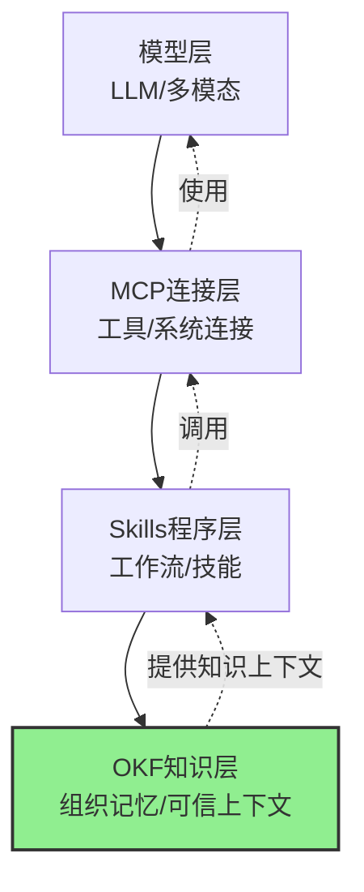
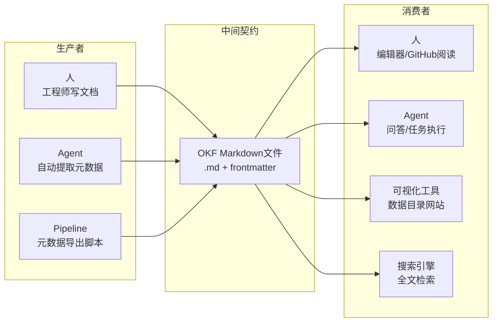

# 05 架构定位与Agent集成

## 5.1 Agent技术栈四层架构

当前Agent技术栈正在快速分层，OKF补全了长期缺失的第四层：

| 层级 | 名称 | 作用 | 商品化风险 | 企业护城河？ |
|------|------|------|-----------|-------------|
| 第一层 | 模型层（智力） | LLM、多模态模型，提供推理能力 | 🔴 高（模型趋同、价格战） | ❌ 模型是租的，可随时换 |
| 第二层 | MCP/连接层（手脚） | 工具调用、外部系统连接、协议适配 | 🟡 中（协议标准化中） | ❌ 连接是通用的 |
| 第三层 | Skills/程序层（招式） | 可复用技能、工作流、提示词模板 | 🟡 中（很多开源Skill可用） | ❌ 招式可以学 |
| **第四层** | **OKF知识层（组织记忆）** | 结构化可信知识、业务上下文、领域术语、流程规范 | 🟢 低（高度企业特定） | ✅ **知识是企业自己的，长期不被商品化** |

> **核心洞察（来自七概念方法论萃取）**：
> 现在很多团队还在卷模型、卷Harness编排框架，但真正长期构成企业护城河的，是结构化的组织知识。模型会进步、框架会换代、协议会标准化，但你积累的关于自己业务、数据、流程、客户的知识，是别人拿不走的。

## 5.2 四层架构依赖关系图



下层为上层提供能力支撑，上层依赖下层；OKF知识层为Skills和Agent提供可信的领域上下文。

## 5.3 OKF vs MCP vs Skills：互补而非竞争

澄清常见误解：它们不是竞争关系，是互补关系。

**OKF和MCP的关系：**
- MCP解决"Agent怎么连接外部工具/系统"（手脚问题）
- OKF解决"Agent怎么知道有什么工具、工具怎么用、什么时候用什么工具"（大脑里的知识）
- 类比：MCP是手，可以拿锤子；OKF是知识，告诉你锤子长什么样、能用来干什么、钉钉子的步骤是什么
- 最佳实践：MCP Server旁边放一个OKF Bundle文档化它提供的所有工具

**OKF和Skills的关系：**
- Skills是"程序"：可执行的工作流、步骤、提示词模板
- OKF是"知识"：Skills需要用到的事实、定义、规则、上下文
- 类比：Skill是菜谱（可执行步骤），OKF是食材百科（什么是盐、油温多少度算七成热、常见食材搭配）
- 最佳实践：Skill代码旁边放OKF文档说明适用场景、参数含义、常见错误
- 具体例子：你有一个"数据库查询Skill"，OKF知识告诉它有哪些表、表之间什么关系、哪些字段是敏感的、常用查询模式是什么

## 5.4 Agent如何消费OKF Bundle

Agent读取和使用OKF知识的典型流程：

1. **发现**：读取Bundle根目录的`index.md`，知道有哪些概念可用
2. **路由**：根据Concept的`type`字段，决定如何处理（Metric要计算、Table要查表、Playbook要执行步骤）
3. **导航**：通过交叉链接从一个概念跳转到相关概念（像人浏览Wiki一样）
4. **验证**：检查`status`、`verified`、`timestamp`字段判断知识可信度和新鲜度
5. **追溯**：通过`citations`/`sources`追溯知识来源，回答"你怎么知道的"
6. **行动**：基于获取的知识回答问题或执行动作

**伪代码示例：**

```python
def agent_use_okf(bundle_path, user_question):
    # 1. 发现：读取索引
    index = read_markdown(f"{bundle_path}/index.md")
    concepts = parse_concept_list(index)
    
    # 2. 路由：检索相关概念
    relevant = [c for c in concepts if semantic_match(c, user_question)]
    
    # 3. 导航：读取具体概念文档
    knowledge = {}
    for concept in relevant:
        doc = read_markdown(concept.path)
        # 4. 验证：检查可信度
        if doc.frontmatter.status == "stable" and doc.frontmatter.verified:
            knowledge[concept.id] = parse_concept(doc)
    
    # 5. 追溯：加载引用来源
    sources = load_sources(knowledge)
    
    # 6. 行动：基于知识回答
    return generate_answer(user_question, knowledge, sources)
```

## 5.5 生产者-消费者解耦架构



生产者和消费者完全独立，可以单独替换。你可以今天让人写，明天让Agent自动生成，不需要改消费者端。Markdown文件是稳定的中间契约。

## 5.6 企业落地四阶段路径

渐进式落地，不要"大爆炸"式迁移：

| 阶段 | 名称 | 具体动作 | 预期时间 | 成功标志 |
|------|------|---------|---------|---------|
| **阶段1** | 试点试水 | 选一个边界清晰的小领域（如新服务文档、一组Agent工具说明），新文档开始用OKF格式写；不需要迁移旧文档 | 2-4周 | 团队理解OKF基本思想，写出第一个合格的Bundle |
| **阶段2** | 单领域推广 | 选定一个业务域（如数据团队的指标字典、SRE的Runbook），该领域新文档全部用OKF，补充元数据规范（约定type命名、必填扩展字段） | 1-3个月 | 该领域知识形成完整Bundle，Agent可以回答该领域基本问题 |
| **阶段3** | Agent集成 | 让Agent在回答问题/执行任务时优先访问OKF知识；将OKF检索接入Agent RAG流程；利用sources/verified元数据做可信度筛选 | 3-6个月 | 明显减少Agent幻觉，知识复用率提升 |
| **阶段4** | 治理体系 | 建立知识审核流程（谁可以写、谁审核）；定期验证流程（stale_after过期提醒）；自动化index生成；CI集成OKF验证；建立type命名规范委员会 | 6个月+ | 知识质量持续提升，形成组织级知识资产 |

**阶段建议：**
- 不要跳阶段，阶段1没做好不要推进到阶段2
- 每个阶段都可以停止，成本低，不会被锁定（因为就是markdown）
- 迁移旧文档永远放在最后，等新流程跑顺了再考虑

## 5.7 与SpecWeave现有知识库的结合思考

本项目的知识库（`.agents/docs/knowledge/`）和OKF思想有天然契合点：
- 已经在用Markdown+frontmatter的方式组织知识，和OKF核心理念一致
- 现有wiki原子化结构、frontmatter元数据、交叉链接，都符合OKF思想
- 可以逐步引入更多OKF约定：更明确的type字段、sources引用、verified状态、log.md变更历史
- 不需要"迁移到OKF"，因为方向本身是对的，逐步对齐最佳实践即可

---

| 上一章 | 目录 | 下一章 |
|--------|------|--------|
| [04 局限性与方案对比](./04-limitations-and-comparison.md) | [README](./README.md) | [06 FAQ与最佳实践](./06-faq-and-best-practices.md) |
