# Ch01 - 系统架构与设计理念

本章深入分析 TVM FFI 的系统架构分层、设计哲学、C ABI 稳定性保证、对象系统模式和内存模型。理解这些设计决策对于高效使用 TVM FFI 至关重要。

## 架构总览

TVM FFI 采用经典的**分层架构**，从最底层的稳定 C ABI 到最上层的语言绑定和可选扩展，每一层都建立在下层提供的保证之上。

```mermaid
flowchart TB
    subgraph Addons["扩展层 (Addons)"]
        direction LR
        CUDA["CUDA 支持<br/>extra/cuda/"]
        ORCJIT["ORCJIT JIT<br/>addons/tvm_ffi_orcjit/"]
        DLPACK["DLPack 张量<br/>c_api.h DLPack*"]
    end
    subgraph Bindings["语言绑定层 (Language Bindings)"]
        direction LR
        PY["Python<br/>Cython bindings<br/>python/tvm_ffi/"]
        RUST["Rust<br/>native crate<br/>rust/"]
    end
    subgraph Extra["扩展功能层 (Extra)"]
        direction LR
        JSON["JSON 序列化<br/>extra/json.h"]
        SER["Serialization<br/>extra/serialization.h"]
        STL["STL 适配<br/>extra/stl.h"]
        MOD["动态模块<br/>extra/module.h"]
        BASE["Extra Base<br/>extra/base.h"]
        DC["Dataclass<br/>extra/dataclass.h"]
        STRUCT["Structural<br/>structural_hash/equal/visit"]
        DTYPEEXT["Dtype 扩展<br/>extra/dtype.h"]
    end
    subgraph Reflection["反射层 (Reflection)"]
        direction LR
        REG["Registry<br/>reflection/registry.h"]
        CREATOR["Creator<br/>reflection/creator.h"]
        ACCESSOR["Accessor<br/>reflection/accessor.h"]
        OVERLOAD["Overload<br/>reflection/overload.h"]
        ENUM["Enum Def<br/>reflection/enum_def.h"]
        ACCPATH["Access Path<br/>reflection/access_path.h"]
    end
    subgraph Containers["容器层 (Containers)"]
        direction LR
        ARRAY["Array&lt;T&gt;<br/>container/array.h"]
        LIST["List&lt;T&gt;<br/>container/list.h"]
        MAP["Map&lt;K,V&gt;<br/>container/map.h"]
        DICT["Dict<br/>container/dict.h"]
        TUPLE["Tuple<br/>container/tuple.h"]
        TENSOR["Tensor<br/>container/tensor.h"]
        SHAPE["Shape<br/>container/shape.h"]
        VARIANT["Variant&lt;Ts...&gt;<br/>container/variant.h"]
        STR["String<br/>string.h"]
    end
    subgraph Core["C++ 核心层 (C++ Core)"]
        direction LR
        ANY["Any / AnyView<br/>any.h"]
        OBJ["Object / ObjectRef<br/>object.h"]
        FUNC["Function<br/>function.h"]
        ERR["Error<br/>error.h"]
        CAST["Cast/TypeTraits<br/>cast.h / type_traits.h"]
        OPT["Optional<br/>optional.h"]
        EXP["Expected<br/>expected.h"]
        MEM["Memory<br/>memory.h"]
        ENUMC["Enum<br/>enum.h"]
        DTYPE["DType<br/>dtype.h"]
    end
    subgraph ABI["C ABI 层 (Stable C ABI)"]
        direction LR
        CAPI["c_api.h<br/>TVMFFIAny / TVMFFIObject<br/>TVMFFISafeCallType<br/>C Functions"]
        DLP["DLPack<br/>3rdparty/dlpack/"]
    end
    ABI --> Core
    Core --> Containers
    Containers --> Reflection
    Reflection --> Extra
    Extra --> Bindings
    Core --> Bindings
    Containers --> Bindings
    Extra --> Addons
    Containers --> Addons
    Core --> Addons
    Bindings --> Addons
    style ABI fill:#ffcccc
    style Core fill:#ffe6cc
    style Containers fill:#fff2cc
    style Reflection fill:#d9ead3
    style Extra fill:#cfe2f3
    style Bindings fill:#d9d2e9
    style Addons fill:#f4cccc
```



### 层级说明

| 层级 | 目录/头文件 | 职责 | 稳定性 |
|------|------------|------|--------|
| **C ABI 层** | `include/tvm/ffi/c_api.h` | 定义 POD 结构体、C 函数签名，跨编译器二进制兼容保证 | **最稳定**，一旦发布不再变更 |
| **C++ 核心层** | `include/tvm/ffi/*.h`（不含 container/、extra/、reflection/） | Any/Object/Function 的 C++17 类型安全封装 | 稳定，API 向前兼容 |
| **容器层** | `include/tvm/ffi/container/`、`string.h` | 内置容器类型（Array/List/Map/Dict/Tuple 等） | 稳定 |
| **反射层** | `include/tvm/ffi/reflection/` | 类型反射、字段/方法注册、动态创建 | 稳定 |
| **扩展功能层** | `include/tvm/ffi/extra/` | JSON、序列化、STL 适配、模块加载、结构比较等可选功能 | 较稳定，可按需引入 |
| **语言绑定层** | `python/`、`rust/` | Python（Cython）和 Rust 语言绑定 | 跟随核心层演进 |
| **扩展层** | `addons/`、`include/tvm/ffi/extra/cuda/` | CUDA、ORCJIT 等可选加件 | 独立版本化 |

## 设计哲学

TVM FFI 的设计围绕以下五条核心原则展开：

### 1. 稳定 C ABI 优先

**一切跨语言、跨编译单元的交互都必须经过 C ABI 层。** 这是 TVM FFI 区别于 pybind11 等方案的根本设计决策。

- C ABI 是所有现代编程语言都能理解和生成的"通用语"
- POD 结构体布局在 `c_api.h` 中精确定义，不依赖编译器实现细节
- C++ 类（`Any`、`Object`、`Function`）是对 C ABI 的零开销封装，不改变内存布局
- **STL 类型绝不跨越 ABI 边界**——没有 `std::string`、`std::vector`、`std::shared_ptr` 出现在 `extern "C"` 函数签名中

### 2. 容器核心采用 Header-only 设计

核心容器（Array、Map、String 等）的实现在头文件中，这带来了几个关键好处：

- 编译器可以内联小操作（如引用计数增减、访问器），消除函数调用开销
- 模板容器（`Array<T>`、`Map<K,V>`）可以在编译期特化，无需运行时类型分发
- 用户无需链接额外的容器库，核心功能仅依赖 `libc`/`libc++`
- 复杂功能（序列化、CUDA、ORCJIT）作为可选编译单元放在 `src/` 中

### 3. 类型擦除换取灵活性

通过 `Any` 统一值表示，TVM FFI 在 ABI 边界上不需要知道具体类型：

- 函数签名统一为 `(const AnyView* args, int32_t num_args, Any* rv)`
- 新类型可以在运行时动态注册（`kTVMFFIDynObjectBegin = 128` 以上的类型索引）
- 跨语言函数调用不需要为每种参数类型生成桥接代码
- 代价是运行时需要类型检查（`as<T>()` / `cast<T>()`），但这在实践中开销可忽略

### 4. 引用计数保障内存安全

- **侵入式引用计数**：ref-count 字段存储在对象头部（`TVMFFIObject::combined_ref_count`），而非外部控制块
- **强/弱引用分离**：低 32 位强引用控制对象析构，高 32 位弱引用控制内存释放
- **原子操作**：引用计数增减使用原子操作，线程安全
- **跨语言一致**：Python/Rust 绑定使用相同的 ref-count 机制，避免循环引用和双重释放

### 5. 打包调用约定

- 所有函数使用相同的 `TVMFFISafeCallType` 签名，无需为不同函数生成不同的 trampoline
- `TVM_FFI_SAFE_CALL_BEGIN/END` 宏在 C ABI 边界自动捕获 C++ 异常并转换为错误码
- C ABI 层使用 TLS（线程局部存储）传递异常对象，而非通过返回值传递
- 支持 `safe_call`（异常安全，返回错误码）和 `cpp_call`（直接 C++ 异常传播，仅 C++ 内部使用）双路径

## C ABI 稳定性详解

C ABI 层（`c_api.h`）是 TVM FFI 稳定性的根基。理解其设计约束有助于理解上层 API 的某些设计选择。

### TVMFFIAny：16 字节的通用值载体

```c
// c_api.h:289-335
typedef struct {
  int32_t type_index;           // offset 0: 类型标记
  union {                       // offset 4: 4 bytes
    uint32_t zero_padding;      //   必须为 0（SmallStr 除外）
    uint32_t small_str_len;     //   短字符串长度（≤7）
  };
  union {                       // offset 8: 8 bytes
    int64_t v_int64;            //   整数值
    double v_float64;           //   浮点值
    void* v_ptr;                //   无类型指针
    const char* v_c_str;        //   C 字符串（非持有）
    TVMFFIObject* v_obj;        //   引用计数对象指针
    DLDataType v_dtype;         //   DLPack 数据类型
    DLDevice v_device;          //   DLPack 设备
    char v_bytes[8];            //   小字符串/字节内联存储
    uint64_t v_uint64;          //   无符号整数（用于哈希）
  };
} TVMFFIAny;
```

**关键设计约束：**

1. **固定大小 16 字节**：在所有 64 位平台上 `sizeof(TVMFFIAny) == 16`，32 位平台为 12 字节（ABI 文档明确说明）
2. **无 C++ 依赖**：整个结构体在 C 模式下可编译
3. **类型索引分段**：
   - `[0, 64)`：栈上 POD 类型（None/Int/Bool/Float/OpaquePtr/DataType/Device/DLTensorPtr/RawStr/ByteArray/RValueRef/SmallStr/SmallBytes）
   - `[64, 128)`：静态对象类型（Object/Str/Bytes/Error/Function/Shape/Tensor/Array/Map/Module/OpaquePyObject/List/Dict/...）
   - `[128, +∞)`：动态注册类型（用户自定义对象）
4. **小值优化（SVO）**：int、float、bool、指针等直接内联存储，零堆分配；≤7 字节的短字符串使用 `kTVMFFISmallStr` 内联存储

### TVMFFIFunction 签名

```c
// c_api.h:493-494
typedef int (*TVMFFISafeCallType)(
  void* handle,
  const TVMFFIAny* args,
  int32_t num_args,
  TVMFFIAny* result
);
```

这个签名是所有跨语言函数调用的统一入口，设计要点：

- **`handle`**：函数对象自身的指针（类似 `this`），支持闭包和有状态函数
- **`args`**：`TVMFFIAny` 数组指针，数组元素在调用期间有效
- **`num_args`**：参数个数，允许变参
- **`result`**：输出参数，调用者必须将 `result->type_index` 初始化为 `kTVMFFINone`
- **返回值**：`0` 表示成功，`-1` 表示异常（从 TLS 获取错误对象）

### ABI 边界禁止项

以下 C++ 特性**绝不会**出现在 `extern "C"` 函数签名或 POD 结构体中：

- ❌ STL 类型（`std::string`、`std::vector`、`std::shared_ptr` 等）
- ❌ C++ 引用（`T&`）
- ❌ 虚函数表指针（依赖编译器 RTTI 和 vtable 布局）
- ❌ C++ 异常（在边界处通过 `TVM_FFI_SAFE_CALL_BEGIN/END` 宏捕获并转换为错误码）
- ❌ 继承关系（POD 结构体之间不使用继承，使用组合+公共前缀模式）

## 对象系统：FooObj + Foo 双层模式

TVM FFI 的对象系统采用独特的**数据对象 + 引用包装**双层模式，这是理解所有 TVM FFI 类型的关键。

### 模式概览

对于每个概念上的类型 `Foo`，代码中存在两个类：

| 类名 | 角色 | 内存位置 | 继承 | 生命周期 |
|------|------|----------|------|----------|
| `FooObj` | 数据载体，存储实际字段 | 堆上（继承自 `Object`） | `: public Object`（或父级 Obj） | 由引用计数管理 |
| `Foo` | 引用句柄，提供类型安全的访问方法 | 栈上（或作为其他对象的成员） | `: public ObjectRef`（或父级 Ref） | RAII，析构时自动 DecRef |

### 代码示例：定义一个自定义对象

```cpp
#include <tvm/ffi/tvm_ffi.h>

namespace tvm {
namespace ffi {

// 第一步：定义数据对象类（FooObj）
class MyPointObj : public Object {
 public:
  double x;  // 数据字段
  double y;

  // 声明对象类型信息：类型键、自身类、父类
  TVM_FFI_DECLARE_OBJECT_INFO("demo.MyPoint", MyPointObj, Object);
};

// 第二步：定义引用包装类（Foo）
class MyPoint : public ObjectRef {
 public:
  // 构造：从 ObjectRef 转换
  TVM_FFI_DEFINE_OBJECT_REF_METHODS_NOTNULLABLE(MyPoint, ObjectRef, MyPointObj);

  // 类型安全的访问方法
  double x() const { return operator->()->x; }
  double y() const { return operator->()->y; }

  // 工厂方法
  static MyPoint make(double x, double y) {
    auto ptr = make_object<MyPointObj>();
    ptr->x = x;
    ptr->y = y;
    return MyPoint(ptr);
  }
};

}  // namespace ffi
}  // namespace tvm
```

### 核心宏解析

**`TVM_FFI_DECLARE_OBJECT_INFO(type_key, TypeName, ParentType)`**

定义在对象类（`FooObj`）内部，负责：
- 声明静态类型索引 `_type_index`
- 声明类型键字符串 `_type_key`
- 声明 `_type_final`、`_type_child_slots` 等类型元数据
- 注册类型初始化逻辑（在首次使用时通过 `TVMFFITypeGetOrAllocIndex` 分配运行时类型索引）

**`TVM_FFI_DEFINE_OBJECT_REF_METHODS_NOTNULLABLE(TypeName, ParentType, ObjectName)`**

定义在引用类（`Foo`）内部，负责：
- 定义从 `ObjectPtr<ObjectName>` 构造的构造函数
- 定义从 `ObjectRef` 进行类型检查后转换的构造函数
- 定义 `operator->()` 访问底层对象（`const ObjectName*`）
- 定义 `operator*()` 解引用
- NOTNULLABLE 变体表示该引用不允许为空（类似 Rust 的 `&T`）；NULLABLE 变体允许为空（类似 `Option<&T>`）

### 内置类型示例

| Obj 类 | Ref 类 | 头文件 | 类型键 |
|--------|--------|--------|--------|
| `StringObj` | `String` | `string.h` | `ffi.String`（静态索引 65） |
| `ArrayObj` | `Array<T>` | `container/array.h` | `ffi.Array`（静态索引 71） |
| `MapObj` | `Map<K,V>` | `container/map.h` | `ffi.Map`（静态索引 72） |
| `FunctionObj` | `Function` | `function.h` | `ffi.Function`（静态索引 68） |
| `ErrorObj` | `Error` | `error.h` | `ffi.Error`（静态索引 67） |
| `TensorObj` | `Tensor` | `container/tensor.h` | `ffi.Tensor`（静态索引 70） |
| `ListObj` | `List<T>` | `container/list.h` | `ffi.List`（静态索引 75） |
| `DictObj` | `Dict` | `container/dict.h` | `ffi.Dict`（静态索引 76） |

### 创建对象

使用 `make_object<T>(args...)` 工厂函数创建堆对象：

```cpp
// 创建一个 StringObj 并返回 String 引用
String s = String("hello");

// 创建自定义对象
MyPoint p = MyPoint::make(1.0, 2.0);

// make_object 分配内存 + 构造对象 + 初始化引用计数为 1
// ObjectRef 构造时 IncRef（引用计数变为 2），析构时 DecRef
// 当最后一个强引用释放时，调用 deleter 析构对象
```

## 内存模型

TVM FFI 的内存管理设计兼顾性能和安全性，由以下三个核心机制构成。

### 1. 侵入式引用计数

```c
// c_api.h:253 — 组合引用计数器
uint64_t combined_ref_count;
// 低 32 位: strong_ref_count
// 高 32 位: weak_ref_count
```

**为什么使用侵入式计数（而非 `std::shared_ptr` 的控制块方式）？**

1. **单次原子操作**：强引用计数增减可以使用 `+1`/`-1` 原子操作（低 32 位），无需像非侵入式方案那样额外读取弱引用计数字段来决定是否释放内存
2. **跨 ABI 兼容性**：引用计数直接在对象头部，C 语言可以直接通过 `TVMFFIObjectIncRef`/`TVMFFIObjectDecRef` 操作，无需理解 C++ 智能指针布局
3. **缓存局部性**：ref-count 和 type_index 在同一缓存行（前 16 字节），访问对象类型信息时已加载 ref-count
4. **更小的内存开销**：每个 `ObjectRef` 只需一个指针（8 字节），不像 `shared_ptr` 需要两个指针（对象指针 + 控制块指针）

**引用计数操作规则：**

- 新创建的对象 `strong_ref_count = 1, weak_ref_count = 1`
- `ObjectRef` 拷贝构造/赋值：IncRef（strong +1）
- `ObjectRef` 析构：DecRef（strong -1），若 strong 变为 0：调用 deleter 析构对象，weak -1；若 weak 也变为 0：释放内存
- `WeakRef` 拷贝/析构操作 weak 计数，不阻止对象析构

### 2. Any 中的小值优化（SVO）

`TVMFFIAny` 的 16 字节布局内联存储了多种小值类型，完全避免堆分配：

| type_index | 存储方式 | 堆分配 |
|------------|----------|--------|
| `kTVMFFINone` (0) | 空值 | 无 |
| `kTVMFFIInt` (1) | `v_int64` 内联 | 无 |
| `kTVMFFIBool` (2) | `v_int64` 内联 | 无 |
| `kTVMFFIFloat` (3) | `v_float64` 内联 | 无 |
| `kTVMFFIOpaquePtr` (4) | `v_ptr` 内联 | 无（指针由调用方管理） |
| `kTVMFFIDataType` (5) | `v_dtype` 内联 | 无 |
| `kTVMFFIDevice` (6) | `v_device` 内联 | 无 |
| `kTVMFFIDLTensorPtr` (7) | `v_ptr` 内联 | 无（托管张量由 DLPack 管理） |
| `kTVMFFIRawStr` (8) | `v_c_str` 非持有指针 | 无（字符串由外部管理，仅 AnyView 使用） |
| `kTVMFFISmallStr` (11) | `v_bytes[8]` + `small_str_len` | 无（≤7 字节内联） |
| `kTVMFFISmallBytes` (12) | `v_bytes[8]` + `small_str_len` | 无（≤7 字节内联） |
| `kTVMFFIObjectRValueRef` (10) | `v_obj` 右值引用 | 无（移动语义，不增减引用） |
| 对象类型（≥64） | `v_obj` 指针 | 有（堆上 Object，引用计数管理） |

这意味着：**使用 TVM FFI 传递整数、浮点数、布尔值等基本类型时，零堆分配、零引用计数开销**，效率接近原生 C 函数调用。

### 3. 容器 Copy-on-Write（COW）

不可变容器（`Array<T>`、`Map<K,V>`、`String`）采用 Copy-on-Write 语义：

```cpp
Array<int> a = Array<int>{1, 2, 3};
Array<int> b = a;       // O(1): 仅拷贝指针 + IncRef，共享底层数据
a.push_back(4);         // O(n): 触发 COW，拷贝底层数据后修改副本
// b 仍然是 [1, 2, 3]，不受影响
```

COW 实现要点：
- 容器对象通过 `unique()` 方法（检查 `use_count() == 1`）判断是否独占
- 如果非独占且需要修改，则深拷贝底层数据
- 如果独占，则直接原地修改（无拷贝开销）
- 读取操作（`operator[]`、`size()`、迭代）永远不触发拷贝
- 可变容器（`List<T>`、`Dict`）不使用 COW，始终原地修改（类似 `std::vector`）

## 错误处理模型

TVM FFI 的错误处理在 C++ 层和 C ABI 层采用不同机制，但通过宏无缝衔接：

### C++ 层：异常

```cpp
// error.h
TVM_FFI_THROW(TypeError) << "Cannot convert from type `" << from_type << "` to `" << to_type << "`";
TVM_FFI_THROW(InternalError) << "Unexpected null pointer";
```

- `Error` 类继承自 `Object`，包含 `kind`（错误类型）、`message`（消息）、`backtrace`（调用栈）、`cause_chain`（因果链）
- 使用 `TVM_FFI_THROW(Kind)` 宏抛出，支持 `<<` 流式拼接消息
- 自动捕获调用栈（通过 `libbacktrace`），支持 Python 风格的最近调用优先顺序

### C ABI 层：错误码 + TLS

```c
// c_api.h:479-486
// 返回 0 成功，-1 错误（从 TLS 获取）
// TVMFFIErrorMoveFromRaised: 从 TLS 取出错误对象并清除
// TVMFFIErrorSetRaised: 将错误对象放入 TLS
```

- 跨 ABI 边界不使用 C++ 异常（因为异常的 ABI 在不同编译器间不稳定）
- `TVM_FFI_SAFE_CALL_BEGIN()` / `TVM_FFI_SAFE_CALL_END()` 宏自动包裹函数体，捕获异常并存入 TLS
- C 语言调用者通过返回值判断是否出错，若出错从 TLS 提取错误对象

```
C++ caller ──→ cpp_call ──→ [throws Error] ──→ C++ caller (catches via try/catch)
C/Python/Rust caller ──→ safe_call ──→ [TVM_FFI_SAFE_CALL_BEGIN: try { ... } catch → TLS] ──→ returns -1 ──→ caller checks ret, gets error from TLS
```

## 源码参考

| 文件 | 说明 |
|------|------|
| `external/ffi/tvm-ffi/include/tvm/ffi/c_api.h` | C ABI 完整定义：TVMFFIAny、TVMFFIObject、TVMFFIFunctionCell、TVMFFISafeCallType、所有 C API 函数 |
| `external/ffi/tvm-ffi/include/tvm/ffi/any.h` | Any/AnyView C++ 类，类型转换和 cast/as 方法 |
| `external/ffi/tvm-ffi/include/tvm/ffi/object.h` | Object/ObjectRef 定义，DECLARE/DEFINE 宏，make_object，引用计数操作 |
| `external/ffi/tvm-ffi/include/tvm/ffi/function.h` | Function/FunctionObj 定义，TVM_FFI_SAFE_CALL 宏，打包调用机制 |
| `external/ffi/tvm-ffi/include/tvm/ffi/tvm_ffi.h` | 核心 API 伞头文件 |
| `external/ffi/tvm-ffi/include/tvm/ffi/container/array.h` | Array 容器实现（COW 逻辑示例） |
| `external/ffi/tvm-ffi/include/tvm/ffi/string.h` | String/Bytes 对象（SmallStr 优化示例） |
| `external/ffi/tvm-ffi/include/tvm/ffi/error.h` | Error 类和 TVM_FFI_THROW 宏 |
| `external/ffi/tvm-ffi/AGENTS.md` | 项目架构概念说明 |

---

上一章 [00-overview.md](00-overview.md) | 下一章 → [02-cpp-core-api.md](02-cpp-core-api.md)
