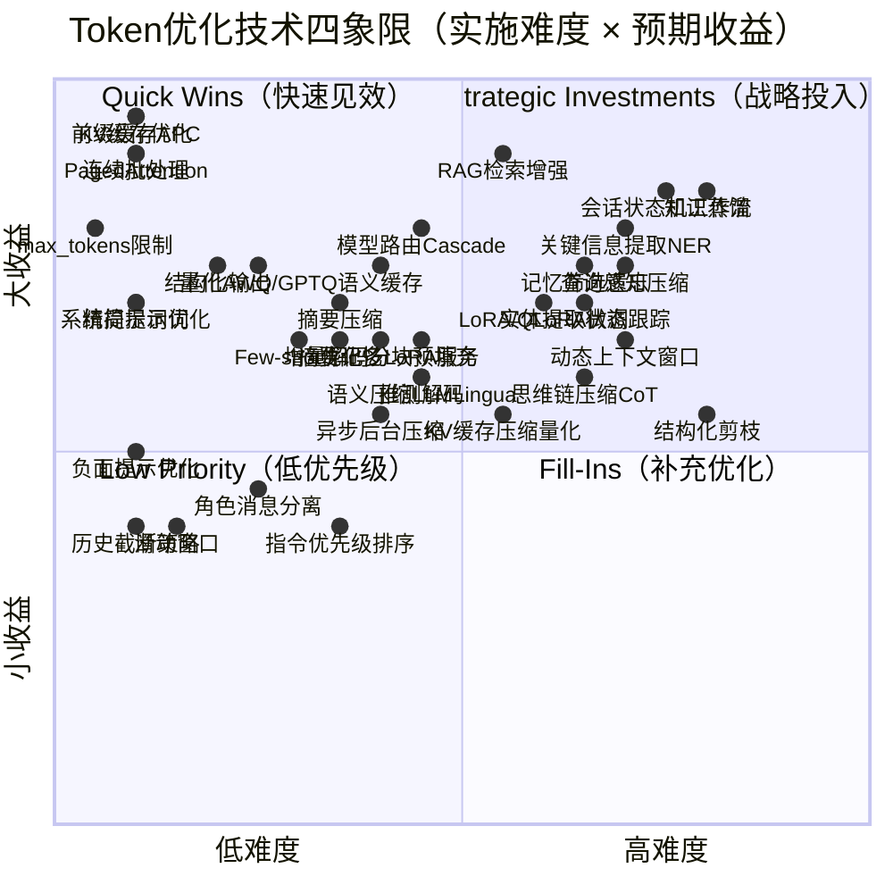
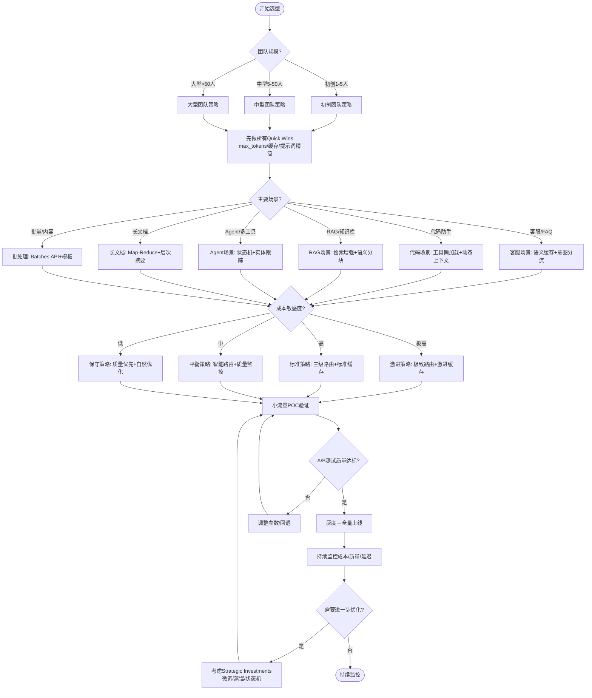

# Token优化技术选型矩阵

> 本文档对35种优化技术按实施难度和预期收益进行四象限分类，提供Quick Wins优先推荐清单、团队规模分层推荐、成本敏感度分层策略。

---

## 四象限分类矩阵

### 矩阵说明

---

### 象限二：Quick Wins（低难度高收益）—— 立即实施 ⭐⭐⭐

> 这是投资回报率最高的区域，所有团队必须优先实施，无需复杂架构改造，1-2周即可见效。

| 排名 | 技术名称 | 本质路径 | 实施难度 | 预期收益 | 质量影响 | 实施周期 |
|------|---------|---------|---------|---------|---------|---------|
| 1 | **max_tokens严格限制** | 减少 | 极低 | 输出token-30-60%，避免失控生成 | 无（合理设置时） | 1天 |
| 2 | **KV缓存优化** | 复用 | 极低 | 解码速度+10-100x，无损 | 无损 | 1天（升级vLLM） |
| 3 | **前缀缓存（Prompt Caching/APC）** | 复用 | 极低 | 缓存命中成本-75-90%，TTFT-50-80% | 无损 | 2-3天 |
| 4 | **PagedAttention（vLLM）** | 复用 | 极低 | 内存浪费→<4%，吞吐+2-4x | 无损 | 3-5天（迁移推理引擎） |
| 5 | **连续批处理** | 复用 | 极低 | GPU利用率→80-95%，吞吐+5-10x | 无损 | 随vLLM自动启用 |
| 6 | **精简提示词（Prompt Pruning）** | 减少 | 极低 | 输入token-20-40% | <3% | 3-5天（审计所有prompt） |
| 7 | **系统提示词优化（静态前缀结构）** | 减少+复用 | 极低 | 提示-20-50%+缓存90%折扣 | 无（正确结构化时） | 2-3天 |
| 8 | **结构化输出（JSON Schema）** | 减少 | 低-中 | 输出token-30-60%，解析更可靠 | <5%（解析提升） | 3-7天 |
| 9 | **量化（AWQ/GPTQ 4-bit）** | 压缩 | 低-中 | 体积-50-75%，吞吐+2-4x | <2%（校准后） | 1周 |
| 10 | **负面提示优化** | 减少 | 极低 | 约束性输出-30-50% | 遵循率+10-20% | 1-2天 |

**Quick Wins预期总收益**：综合成本降低50-70%，吞吐量提升5-10倍，1-2周完成。

---

### 象限一：Strategic Investments（高难度高收益）—— 规模化阶段投入 ⭐⭐

> 这些技术能带来显著收益，但需要架构改造或ML能力，适合月调用量>100万token或有明确ROI时投入。

| 排名 | 技术名称 | 本质路径 | 实施难度 | 预期收益 | 质量影响 | 实施周期 | 适用阶段 |
|------|---------|---------|---------|---------|---------|---------|---------|
| 1 | **RAG检索增强生成** | 减少 | 中-高 | 单请求token-60-90%，准确率+10-34% | 质量提升 | 2-4周 | 有知识库/长上下文需求时 |
| 2 | **知识蒸馏** | 减少 | 高 | 推理成本-70-95% | 性能保留85-95% | 1-3月 | 超高并发、特定任务 |
| 3 | **会话状态机与工作流压缩** | 压缩+减少 | 高 | token-80-95%，任务完成率提升 | 提升（流程化更可靠） | 1-2月 | 任务型对话/Agent |
| 4 | **关键信息提取（NER/三元组）** | 压缩 | 高 | token-80-95% | 关键事实>85%准确 | 1-2月 | 长对话/知识库场景 |
| 5 | **查询感知压缩** | 减少+压缩 | 高 | token-70-90% | <5% | 3-6周 | RAG/长文档场景 |
| 6 | **LoRA/QLoRA参数高效微调** | 减少+复用 | 中-高 | 提示缩短30-60%，效果+5-15% | 效果提升 | 2-4周 | 核心任务稳定后 |

---

### 象限四：Fill-Ins（低难度小收益）—— 补充优化 ⭐

> 这些技术实施简单但收益有限，建议在Quick Wins完成后作为补充。

| 技术名称 | 本质路径 | 实施难度 | 预期收益 | 备注 |
|---------|---------|---------|---------|------|
| 历史截断策略 | 减少 | 低 | 控制在预算内 | 简单粗暴，注意质量风险 |
| 滑动窗口 | 减少 | 低 | 控制在预算内 | 简单对话可用，复杂任务风险高 |
| 角色消息分离与优先级标记 | 减少 | 低-中 | 关键信息保留+30-50% | 对话系统推荐实施 |
| 指令优先级排序 | 减少 | 中 | 输入-15-30% | 遵循率提升，收益中等 |
| 异步后台压缩 | 压缩 | 中 | 压缩延迟=0（用户感知） | 长会话场景推荐 |

---

### 象限三：Low Priority（高难度小收益）—— 谨慎投入 ⚠️

> 这些技术实施复杂但收益有限或场景特定，除非有明确需求否则不优先。

| 技术名称 | 本质路径 | 实施难度 | 预期收益 | 为什么优先级低 | 适用场景 |
|---------|---------|---------|---------|--------------|---------|
| 结构化剪枝 | 减少 | 高 | 参数-30-50%，速度+30-80% | 质量损失3-8%，不如量化+蒸馏通用 | 边缘部署、极端资源受限 |
| 思维链压缩（CoT Compression） | 压缩+减少 | 中-高 | 推理token-40-70% | 质量损失5-10%，复杂推理风险高 | 简单推理任务可尝试 |
| KV缓存压缩与量化（INT4） | 压缩+复用 | 中-高 | KV内存-50-75% | 质量有损失，不如模型本身量化 | 超长上下文（>100K）场景 |
| 记忆筛选与遗忘机制 | 减少+压缩 | 高 | token-70-90% | 实现复杂，容易误删关键信息 | 超长对话（>50轮） |

---

## 按团队规模推荐技术栈

### 🚀 初创团队（1-5人工程师，月API费用<$1000）

**核心策略**：只做Quick Wins，零/低代码改造，1周内完成。

| 优先级 | 技术 | 预期收益 |
|--------|------|---------|
| P0（必做） | max_tokens限制 | 输出-30-50% |
| P0 | 精简提示词+系统提示优化 | 输入-20-40% |
| P0 | 选择支持Prompt Caching的API（Anthropic/OpenAI新版） | 缓存-90% |
| P0 | 结构化输出JSON | 输出-30%+解析可靠 |
| P1（推荐） | 接入轻量可观测性（Helicone免费层/Portkey） | 知道钱花在哪 |
| P1 | 简单模型路由（分类/提取用Haiku/mini） | 成本-30-50% |
| P2（可选） | 语义缓存（GPTCache简单版） | 重复请求-100% |

**预期总收益**：成本降低50-70%，1周内完成，无需架构改造。

**不要做**：RAG自建、微调、蒸馏、多LoRA服务——这些投入产出比对初创团队不划算。

---

### 🏢 中型团队（5-50人工程师，月API费用$1K-$10K）

**核心策略**：Quick Wins + 基础设施升级 + 场景化优化，2-4周完成。

| 优先级 | 技术 | 预期收益 |
|--------|------|---------|
| P0（必做） | 全部初创团队P0/P1项 | 基础50-70% |
| P0 | 升级推理引擎到vLLM（自托管）或选择现代推理提供商 | 吞吐+5-10x |
| P0 | 启用完整可观测性栈（Langfuse自建/Helicone付费版） | 精细化成本归因 |
| P0 | 重试限制+熔断机制 | 消除浪费调用 |
| P1（推荐） | RAG架构（如有知识库场景） | token-60-90% |
| P1 | 语义缓存生产级（Redis+向量库） | 缓存命中-100%，整体-20-40% |
| P1 | 三级模型路由（轻量/中端/顶级） | 成本再-30-50% |
| P1 | 自动上下文压缩阈值触发 | 长会话-60-80% |
| P2（可选） | AWQ 4-bit量化部署 | 自托管成本-50-75% |
| P2 | A/B测试框架搭建 | 质量保障 |

**预期总收益**：成本降低70-85%，2-4周完成。

---

### 🏛️ 大型团队（>50人工程师，月API费用>$10K）

**核心策略**：全栈优化 + 自研能力 + 持续迭代，1-3月达到最优。

| 优先级 | 技术 | 预期收益 |
|--------|------|---------|
| P0（必做） | 全部中型团队P0/P1项 | 基础70-85% |
| P0 | 建立token成本中心+实时监控看板 | 成本透明化 |
| P0 | 完善A/B测试+灰度发布体系 | 安全迭代 |
| P1（推荐） | LoRA微调核心任务 | 提示缩短+效果提升 |
| P1 | 会话状态机/工作流引擎（Agent场景） | token-80-95% |
| P1 | 实体提取+状态跟踪（对话场景） | 记忆压缩-70-90% |
| P1 | 多LoRA服务（多任务场景） | GPU利用率+5-20x |
| P1 | 知识蒸馏（超高并发场景） | 成本再-70-90% |
| P2（投入） | 推测解码 | 速度+1.5-3x |
| P2 | 查询感知压缩（RAG场景） | token再-20-30% |
| P2 | 动态上下文窗口自适应 | 平均-40-70% |

**预期总收益**：成本降低85-95%，支撑百万级用户规模。

---

## 按成本敏感度推荐策略

### 🔴 成本敏感度极高（创业公司/个人开发者/免费产品）

**预算约束**：每一块钱都要省，ROI>10才投入。

| 策略 | 具体做法 | 预期节省 |
|------|---------|---------|
| 极致模型路由 | 80%+请求用最小模型（Haiku/mini/Flash），仅<5%用顶级 | -70-80% |
| Prompt Caching最大化 | 重构所有prompt为"大静态前缀+小动态后缀"，目标缓存命中率>80% | -50-70%（前缀部分） |
| 零容错重试 | 重试最多1次，超时立即降级/失败 | 消除10-30%浪费 |
| 非实时全走Batches API | 所有离线任务用批处理，50%折扣 | -50%（离线部分） |
| 严格max_tokens | 分类10-20，摘要150-200，内容500以内 | 输出-40-60% |
| 语义缓存激进阈值 | 相似度阈值调低，覆盖更多重复 | 命中请求-100% |

**目标成本降低**：80-90%

**风险提示**：过于激进的路由和缓存可能导致质量下降，必须保留快速回滚机制。

---

### 🟠 成本敏感度高（中小企业/ToB产品/规模化阶段）

**预算约束**：成本是重要考量，但不能显著影响用户体验。

| 策略 | 具体做法 | 预期节省 |
|------|---------|---------|
| 三级模型路由 | 60%简单任务用小模型，30%中等，10%顶级 | -50-60% |
| Prompt Caching标准配置 | 缓存命中率目标60-70% | -30-50%（前缀部分） |
| 重试限制2-3次 | 带退避和熔断 | 消除5-15%浪费 |
| 离线任务用Batches | 非用户等待的任务走批处理 | -50%（离线部分） |
| RAG替代全量上下文 | 知识库场景必须用检索 | -60-90%（知识库部分） |
| vLLM推理引擎 | 自托管升级，吞吐+5-10x | 基础设施成本-70-80% |
| 量化部署 | AWQ 4-bit，质量损失<2% | 自托管成本-50-75% |

**目标成本降低**：70-85%

---

### 🟡 成本敏感度中（中型企业/成熟产品/体验优先）

**预算约束**：成本需要控制，但用户体验和质量是第一位。

| 策略 | 具体做法 | 预期节省 |
|------|---------|---------|
| 智能模型路由 | 基于任务复杂度自动选择，不预设固定比例 | -30-50% |
| Prompt Caching优雅配置 | 自然静态前缀即可，不刻意重构 | -20-40%（前缀部分） |
| 标准重试机制 | 2-3次退避，不做极严格限制 | 消除3-8%浪费 |
| 可选Batches | 真正非实时的任务才用批处理 | -50%（适用部分） |
| RAG优化（如有） | 分块+重排+查询感知，追求质量和成本平衡 | -50-70%（知识库部分） |
| 现代推理引擎 | vLLM/TensorRT-LLM标准配置 | 吞吐+3-5x |
| 语义缓存保守阈值 | 高相似度阈值，避免错误复用 | 命中请求-100% |
| A/B测试所有优化 | 质量不下降才推广 | 保障体验 |

**目标成本降低**：50-70%

---

### 🟢 成本敏感度低（大型企业/高价值场景/质量绝对优先）

**预算约束**：成本不是问题，质量、可靠性、合规性优先。

| 策略 | 具体做法 | 预期节省 |
|------|---------|---------|
| 保守模型路由 | 仅极明确简单任务用小模型，默认用可靠模型 | -10-30% |
| Prompt Caching基础配置 | 保持代码整洁即可，不做激进优化 | -10-20%（自然命中） |
| 完善的重试和降级 | 可靠性优先，重试次数相对宽松 | 不刻意省这部分 |
| 不刻意用Batches | 用户体验优先，实时返回 | 仅真正的后台任务用 |
| RAG质量优先 | 多召回+重排，不激进压缩上下文 | -30-50%（但质量最高） |
| 企业级推理基础设施 | 稳定性>利用率，适当资源冗余 | 成本可接受 |
| 全面质量监控 | 错误率、幻觉率、满意度实时监控 | 质量保障 |
| 灰度+金丝雀发布 | 所有优化经过充分验证 | 风险最小化 |

**目标成本降低**：20-40%（自然获得，不刻意追求）

---

## 35种技术完整分类表

| 分类 | 技术名称 | 难度 | 收益 | 象限 | 初创 | 中型 | 大型 |
|------|---------|------|------|------|------|------|------|
| **提示词工程** | 精简提示词 | 低 | 中高 | Quick Wins | ✅ | ✅ | ✅ |
| | 结构化输出 | 低-中 | 高 | Quick Wins | ✅ | ✅ | ✅ |
| | Few-shot示例优化 | 中 | 中高 | Fill-Ins | ❌ | ✅ | ✅ |
| | 思维链压缩CoT | 中-高 | 中 | Low Priority | ❌ | ❌ | ⚠️ |
| | 系统提示词优化 | 低 | 高 | Quick Wins | ✅ | ✅ | ✅ |
| | 指令优先级排序 | 中 | 中低 | Fill-Ins | ❌ | ✅ | ✅ |
| | 负面提示优化 | 低 | 中 | Quick Wins | ✅ | ✅ | ✅ |
| **上下文压缩** | 摘要压缩 | 中 | 高 | Fill-Ins | ⚠️ | ✅ | ✅ |
| | RAG检索增强优化 | 中-高 | 极高 | Strategic | ❌ | ✅ | ✅ |
| | 滑动窗口 | 低 | 中低 | Fill-Ins | ✅ | ⚠️ | ❌ |
| | 记忆筛选与遗忘机制 | 高 | 高 | Low Priority | ❌ | ❌ | ⚠️ |
| | 语义压缩LLMLingua | 中 | 中高 | Fill-Ins | ❌ | ⚠️ | ✅ |
| | 关键信息提取NER | 高 | 极高 | Strategic | ❌ | ❌ | ✅ |
| | 查询感知压缩 | 高 | 极高 | Strategic | ❌ | ❌ | ✅ |
| **模型微调蒸馏** | LoRA/QLoRA微调 | 中-高 | 高 | Strategic | ❌ | ⚠️ | ✅ |
| | 知识蒸馏 | 高 | 极高 | Strategic | ❌ | ❌ | ✅ |
| | 小模型路由Cascade | 中 | 高 | Quick Wins | ✅ | ✅ | ✅ |
| | 推测解码 | 中 | 中高 | Fill-Ins | ❌ | ⚠️ | ✅ |
| | 量化AWQ/GPTQ | 低-中 | 高 | Quick Wins | ❌ | ✅ | ✅ |
| | 结构化剪枝 | 高 | 中 | Low Priority | ❌ | ❌ | ⚠️ |
| | 多LoRA服务 | 中 | 中高 | Fill-Ins | ❌ | ❌ | ✅ |
| **推理缓存** | KV缓存优化 | 低 | 极高 | Quick Wins | ✅* | ✅ | ✅ |
| | 前缀缓存APC | 低 | 极高 | Quick Wins | ✅ | ✅ | ✅ |
| | PagedAttention vLLM | 低 | 极高 | Quick Wins | ❌ | ✅ | ✅ |
| | 增量解码分块预填充 | 中 | 中高 | Fill-Ins | ❌ | ✅ | ✅ |
| | 语义缓存 | 中 | 高 | Quick Wins | ⚠️ | ✅ | ✅ |
| | KV缓存压缩量化 | 中-高 | 中 | Low Priority | ❌ | ❌ | ⚠️ |
| | 连续批处理 | 低 | 极高 | Quick Wins | ❌ | ✅ | ✅ |
| **对话管理** | 历史截断策略 | 低 | 中低 | Fill-Ins | ✅ | ⚠️ | ❌ |
| | 摘要记忆Summary | 中 | 中高 | Fill-Ins | ❌ | ✅ | ✅ |
| | 实体提取状态跟踪 | 中-高 | 高 | Strategic | ❌ | ❌ | ✅ |
| | 会话状态机工作流 | 高 | 极高 | Strategic | ❌ | ❌ | ✅ |
| | 动态上下文窗口 | 高 | 中高 | Strategic | ❌ | ❌ | ✅ |
| | 角色消息分离优先级 | 低-中 | 中 | Fill-Ins | ❌ | ✅ | ✅ |
| | 异步后台压缩 | 中 | 中 | Fill-Ins | ❌ | ⚠️ | ✅ |
| **通用配置** | max_tokens限制 | 极低 | 高 | Quick Wins | ✅ | ✅ | ✅ |
| | Batches API批处理 | 极低 | 高 | Quick Wins | ✅ | ✅ | ✅ |

✅ = 推荐实施，⚠️ = 场景化可选，❌ = 不推荐/优先度低
* KV缓存优化在使用托管API时自动获得，自托管时需升级vLLM

---

## 选型决策流程图

---

## 🔗 相关资源

- [⬅️ 返回：决策框架总览](00-framework-overview.md)
- [➡️ 下一篇：最佳实践模式](03-patterns.md)
- [🔧 技术方法总览](../02-methods/00-methods-overview.md)

---

<!-- created by extraction-cmd on 2026-08-01 -->
