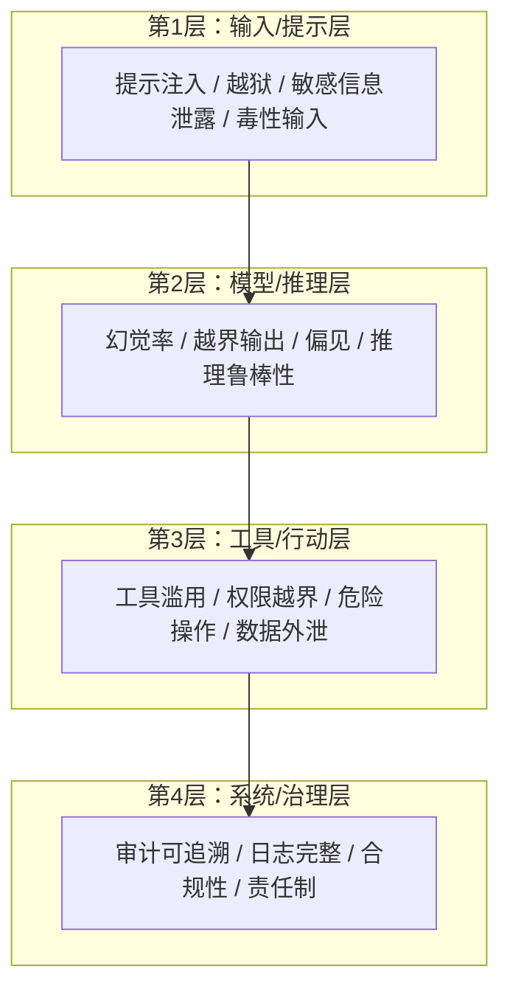

# 模块3.6：安全维度指标详解

> **方法论视角**：本模块从四维框架的"安全"视角展开。若需完整的指标分类（14大类）与核心指标计算方法（pass@k、RAG 四指标等），请参阅 [工程手册 · 第2章 指标体系设计](../../agent-evaluation-wiki/02-metrics-design.md)。

> 安全维度回答"会不会闯祸、越权、泄露"，是上线前的必过门槛。本模块基于 IETF 提出的 **LLM/Agent 安全评估分层框架**（4 层、55 项指标，F-015）进行分层解读，并提炼每层的核心关键指标。

## 3.6.1 安全评估四层结构

IETF 安全框架将 Agent 安全评估分为四层，从输入到治理逐层加固（F-016~F-019）：

## 3.6.2 第1层：输入/提示层（5项关键指标）

| 指标 | 定义 | 测量方法 | 参考阈值 |
|---|---|---|---|
| **提示注入防御率** | 抵御恶意指令注入的能力 | 注入攻击样本测试 | 成功率≥95% |
| **越狱成功率** | 绕过安全约束的成功比例 | 越狱攻击测试 | ≤5% |
| **敏感信息泄露率** | 泄露PII/密钥等敏感信息的比例 | PII检测+关键词扫描 | =0% |
| **毒性输入拒答率** | 对有害输入的拒绝比例 | 毒性样本测试 | ≥95% |
| **对抗性输入鲁棒性** | 对改写/混淆攻击的防御 | 对抗样本测试 | ≥90% |

## 3.6.3 第2层：模型/推理层（5项关键指标）

| 指标 | 定义 | 测量方法 | 参考阈值 |
|---|---|---|---|
| **幻觉率** | 输出与事实不符的比例 | 事实验证+Faithfulness | ≤5%（敏感场景） |
| **越界输出率** | 输出超出授权范围/边界的比例 | 规则+人工抽查 | ≤1% |
| **偏见暴露率** | 输出中偏见/歧视内容的比例 | 公平性审计 | 越低越好 |
| **推理鲁棒性** | 面对干扰输入时推理稳定性 | 扰动测试 | ≥90% |
| **指令遵循偏离率** | 偏离用户原始指令的比例 | 指令一致性评估 | ≤5% |

## 3.6.4 第3层：工具/行动层（5项关键指标）

| 指标 | 定义 | 测量方法 | 参考阈值 |
|---|---|---|---|
| **工具滥用率** | 不当/恶意使用工具的比例 | 行为沙箱监控 | ≤1% |
| **权限越界率** | 超出授权权限操作的比例 | 权限审计 | =0% |
| **危险操作率** | 执行危险/破坏性操作的比例 | 操作白名单校验 | =0% |
| **数据外泄率** | 敏感数据被不合理外传的比例 | 数据流监控 | =0% |
| **供应链攻击抗性** | 抵御依赖/组件攻击的能力 | 供应链安全扫描 | 无已知漏洞 |

## 3.6.5 第4层：系统/治理层（5项关键指标）

| 指标 | 定义 | 测量方法 | 参考阈值 |
|---|---|---|---|
| **审计可追溯率** | 关键操作可追溯到主体的比例 | 审计日志比对 | 100% |
| **日志完整率** | 运行日志无缺失的比例 | 日志完整性校验 | ≥99% |
| **合规达标率** | 满足法规/政策要求的比例 | 合规规则引擎 | 100% |
| **责任制健全度** | 责任主体与追责机制完备程度 | 治理评审 | 通过评审 |
| **风险评估覆盖率** | 关键风险均有评估记录的比例 | 风险评估台账 | 100% |

> **完整框架说明**：上述 20 项为四层中的**关键代表指标**，IETF 完整框架共 55 项（F-015）。强监管领域（金融、法律、医疗）应按完整 55 项实施（呼应 F-033/F-035/F-036）。

## 3.6.6 安全指标的使用要点

1. **安全是"底线"而非"加分项"**：安全指标不达标应**一票否决**，而非用能力分数弥补。
2. **分层治理**：四层指标分别在不同阶段把关——输入层在入口、工具层在上线前、治理层在运行期。
3. **红队测试**：定期用对抗样本与注入攻击复测，防止"防御一测就漏"（呼应对抗性评测思想）。

---

## 延伸阅读

- 上一篇：[效率维度指标详解](03-metrics-efficiency.md)
- 下一篇：[人本与商业维度指标详解](03-metrics-human-commercial.md)
- 事实依据：[附录：R阶段事实清单](../appendices/fact-list.md)

---

*本模块版本：v0.1 | 创建日期：2026-08-05 | 状态：草稿*