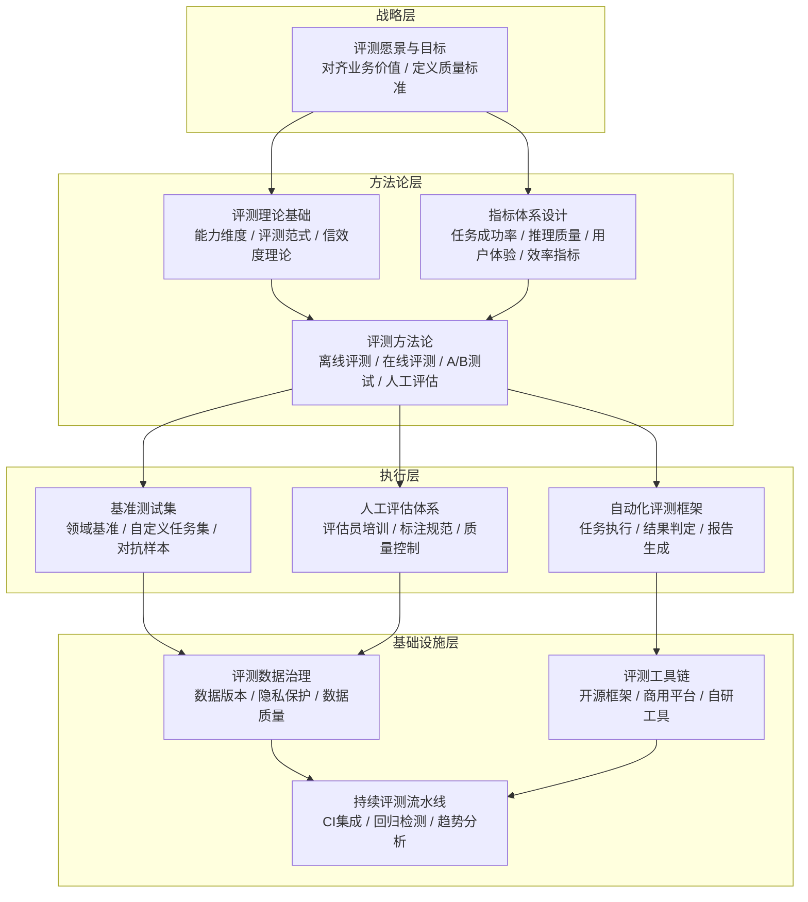

# AI Agent 评测体系化建设方法论教程

## 教程简介

AI Agent 评测是保障智能体系统质量、指导迭代优化、建立用户信任的核心工程实践。随着 Agent 技术从简单对话向复杂任务执行、多步推理、工具使用、多智能体协作演进，传统的模型级评测（如 MMLU、GSM8K）已无法充分衡量 Agent 在真实场景中的端到端表现——一个在基准测试上得分很高的模型，可能在实际 Agent 工作流中因工具调用错误、记忆管理失效、多步规划失误而表现糟糕。

本教程系统讲解 AI Agent 评测的体系化建设方法论，从评测理论基础到工程实践，从指标设计到工具选型，从离线基准到在线持续评测，覆盖 Agent 评测全生命周期。通过本教程的学习，读者将能够设计完整的 Agent 评测方案、构建自动化评测流水线、建立数据驱动的质量保障体系。

## AI Agent 评测体系层次结构

评测体系自顶向下分为四层：战略层定义评测目标与质量愿景，方法论层提供理论指导与评测方法，执行层落地具体评测活动，基础设施层提供数据、工具与流水线支撑。四层协同形成完整的评测闭环。

## 章节导航

| 章节 | 标题 | 内容概要 | 文件 |
|---|---|---|---|
| 0 | 教程总览 | 教程简介、体系结构、导航、目标读者、阅读路径 | [00-overview.md](00-overview.md) |
| 1 | 评测理论基础 | Agent能力维度、评测范式演进、信效度理论、评测伦理 | [01-theory-foundations.md](01-theory-foundations.md) |
| 2 | 指标体系设计 | 任务成功率、推理质量、工具使用、用户体验、效率与成本指标 | [02-metrics-design.md](02-metrics-design.md) |
| 3 | 基准测试构建 | 领域基准选型、自定义任务集设计、对抗样本构造、基准维护策略 | [03-benchmark-construction.md](03-benchmark-construction.md) |
| 4 | 自动化评测框架 | LLM-as-Judge、规则判定、执行轨迹分析、多维度评分、报告生成 | [04-automated-evaluation.md](04-automated-evaluation.md) |
| 5 | 人工评估方法论 | 评估维度设计、标注规范制定、评估员培训、一致性检验、质量控制 | [05-human-evaluation.md](05-human-evaluation.md) |
| 6 | 评测数据治理 | 数据采集与标注、版本管理、隐私保护、数据质量保障、数据集迭代 | [06-data-governance.md](06-data-governance.md) |
| 7 | 行业实践案例 | Coding Agent、RAG Agent、多工具Agent、多Agent协作的评测实践 | [07-industry-practices.md](07-industry-practices.md) |
| 8 | 评测工具链选型 | 开源框架对比、商用平台评估、自研框架设计、工具链集成方案 | [08-toolchain-selection.md](08-toolchain-selection.md) |
| 9 | 持续评测体系 | CI/CD集成、回归检测、版本对比、趋势分析、评测驱动开发 | [09-continuous-evaluation.md](09-continuous-evaluation.md) |
| 10 | 术语表与参考资源 | 术语表、权威论文、开源项目、行业报告、项目内交叉引用 | [10-resources.md](10-resources.md) |

## 目标读者

本教程适合以下读者：

- **AI Agent 工程师**：负责 Agent 系统开发，需要建立评测流程保障代码质量
- **LLM 应用开发者**：构建基于大模型的应用，需要评估模型与 Prompt 的实际效果
- **质量保障（QA）工程师**：负责 AI 系统质量保障，需要设计 AI 时代的评测方案
- **技术负责人 / 架构师**：规划团队评测体系建设，制定质量标准与工程规范
- **AI 产品经理**：需要理解 Agent 评测方法论，定义产品质量指标与验收标准

**前置知识要求**：具备 AI/LLM 基础知识，了解 Agent 基本概念（工具使用、记忆、规划），有一定软件工程实践经验。

## 阅读路径建议

### 入门路径（评测新手）

按线性顺序阅读，建立评测体系的完整认知：

1. 先理解 **为什么需要评测** 与 **评测的基本范式**（第1章）
2. 学习 **如何设计评测指标**，知道"评测什么"（第2章）
3. 了解 **如何构建测试集**，准备评测数据基础（第3章）
4. 掌握 **自动化评测方法**，快速实现可复现的评测（第4章）
5. 理解 **人工评估的价值与方法**，处理自动化无法覆盖的维度（第5章）
6. 学习 **数据治理**，保障评测数据质量（第6章）
7. 通过 **行业案例** 加深理解（第7章）
8. 了解 **工具选型**（第8章），搭建 **持续评测流水线**（第9章）
9. 利用 **参考资源** 持续深入（第10章）

### 进阶路径（有基础的实践者）

按需选择章节，解决实际工作中的具体问题：

- 需要设计评测方案 → 重点阅读 [第2章](02-metrics-design.md) + [第3章](03-benchmark-construction.md)
- 需要搭建自动化评测 → 直接阅读 [第4章](04-automated-evaluation.md) + [第8章](08-toolchain-selection.md)
- 需要组织人工评估 → 重点阅读 [第5章](05-human-evaluation.md) + [第6章](06-data-governance.md)
- 需要建立持续评测体系 → 阅读 [第9章](09-continuous-evaluation.md)
- 需要参考行业最佳实践 → 查阅 [第7章](07-industry-practices.md)

### 专家路径（体系建设者）

聚焦战略与体系层面，交叉引用相关领域知识：

- 从 [第1章理论基础](01-theory-foundations.md) 建立评测的理论框架
- 结合 adversarial-review（对抗性评审）方法论，构建鲁棒的评测体系
- 参考 harness-engineering（Harness工程）思想，将评测深度嵌入工程流水线
- 参考 seven-concepts（七概念方法论），建立评测驱动的迭代闭环

## 项目内关联指引

本教程是 Agent 工程方法论系列的重要组成部分，与其他 wiki 形成知识网络：

**前置基础**：
- [harness-engineering-wiki](../harness-engineering-wiki/00-overview.md) — Harness 工程方法论，评测是 Harness 体系的核心观测组件，建议先理解 Harness 四铁律与六模式
- [harness-seven-components-wiki](../harness-seven-components-wiki/00-overview.md) — Harness 七大组件，其中可观测性（Observability）组件与评测体系直接相关

**互补方法论**：
- [adversarial-review-wiki](../adversarial-review-wiki/00-overview.md) — 对抗性评审方法论，其红队测试、认知偏差防御思想可直接应用于对抗性评测用例设计
- [agent-skills-wiki](../agent-skills-wiki/00-overview.md) — Agent 技能体系，评测需覆盖各类技能的掌握程度与组合能力

**评测驱动的工程实践**：
- [seven-concepts-prompt-wiki](../seven-concepts-prompt-wiki/00-overview.md) — 七概念方法论，其中"复盘（R）-洞察（I）-萃取（E）"闭环依赖评测数据作为输入
- [karpathy-llm-coding-guidelines](../karpathy-llm-coding-guidelines/00-overview.md) — Karpathy LLM 编码指南，其倡导的"先写测试"思想与评测驱动开发高度契合

---

> **开始阅读**：[第 1 章 — 评测理论基础 →](01-theory-foundations.md)
