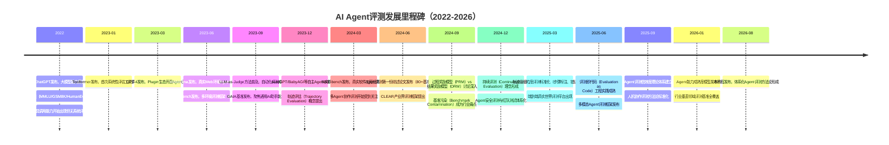
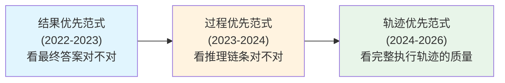

# 第1章：评测理论基础

> **方法论视角**：如需从"为什么评测/评测成熟度与误区"的方法论链路视角理解本主题，可参阅 [方法论Wiki · 模块1 方法论概述](../agent-eval-methodology-wiki/01-overview/01-methodology-overview.md)。

---

## 1.1 Agent评测标准定义（Wikipedia风格）

**AI Agent评测**（AI Agent Evaluation）是评估、衡量和验证自主智能体系统在给定任务环境中完成指定目标的能力、质量与安全性的系统性过程。它通过设计标准化的任务场景、测量指标与评估方法，对智能体的感知、推理、规划、工具使用、记忆管理、环境交互及最终产出进行多维度量化与质性分析，为系统迭代优化、能力边界界定、风险识别与用户信任建立提供数据支撑。

> **通俗解释**：Agent评测就像给自动驾驶汽车安排一场"路考"——不仅看它能不能到达目的地（结果），还要看它怎么开过去的（过程）、会不会违反交通规则（安全）、遇到突发情况怎么处理（鲁棒性）。

与传统软件测试不同，Agent评测的核心对象是**非确定性智能系统**：同一输入可能产生不同输出，同一目标可能通过多条路径达成，评测需同时覆盖**结果正确性、过程合理性、行为安全性**三个层面。

根据评测目的不同，可分为：
- **形成性评测**（Formative Evaluation）：开发过程中持续进行，用于发现问题、指导迭代
- **总结性评测**（Summative Evaluation）：版本发布前进行，用于验收与能力定级
- **比较性评测**（Comparative Evaluation）：多系统横向对比，用于选型与竞争分析
- **对抗性评测**（Adversarial Evaluation）：构造边界与恶意场景，用于风险探测与鲁棒性验证

---

## 1.2 Agent评测 vs 传统LLM评测：本质区别

传统大语言模型（LLM）评测以**单轮输入-输出对**为核心，而Agent评测是**多步交互-动态环境-端到端任务**的系统性评估。二者存在五个本质维度的差异：

| 维度 | 传统LLM评测 | Agent评测 |
|---|---|---|
| **交互模式** | 单轮问答，静态输入输出 | 多轮交互，动态决策序列 |
| **核心考察** | 答案正确性、知识覆盖、语言流畅度 | 任务完成度、推理链条质量、工具使用效率、环境适应性 |
| **环境依赖** | 无外部环境，纯文本域 | 需与外部工具/API/环境交互，状态随时间变化 |
| **评估对象** | 最终输出文本 | 完整执行轨迹（Trajectory）——思考过程、工具调用、中间结果、错误恢复 |
| **成功标准** | 单一答案匹配（Exact Match/F1） | 多维复合标准——成功率、步数效率、成本消耗、安全合规、用户体验 |

> **关键洞察**：一个在MMLU（多任务语言理解基准）上得分95%的模型，可能在Agent场景中表现糟糕——它可能不知道何时调用计算器、无法从错误API返回中恢复、在多步推理中"遗忘"初始目标。传统基准衡量"模型知道什么"，Agent评测衡量"模型能用知道的东西做什么"。

### 本质区别详解

1. **多步推理（Multi-step Reasoning）**：Agent任务通常需要5-50步决策链，任何一步出错都可能导致整体失败。评测需识别错误发生位置与类型（规划错误/工具选择错误/参数错误/解读错误），而非仅判定最终对错。

2. **工具调用（Tool Use）**：Agent通过调用外部工具（搜索引擎、代码解释器、数据库等）扩展能力边界。评测需考察：工具选择是否合理、参数是否正确、结果解读是否准确、工具组合是否高效。

3. **环境交互（Environment Interaction）**：Agent在动态环境中行动，环境状态随Agent行为改变。评测需考虑：观察是否完整、行动是否合法、状态跟踪是否一致、对环境反馈的响应是否恰当。

4. **轨迹评估（Trajectory Evaluation）**：这是Agent评测最核心的特征。完整轨迹（Trajectory）包含：用户输入→Agent思考→工具调用→观察结果→再思考→...→最终回答。仅评估最终答案会遗漏90%的质量信息——"碰巧答对"和"通过正确推理答对"在能力层面有天壤之别。

---

## 1.3 Agent评测发展时间线



---

## 1.4 Agent能力维度框架

学术界与产业界从不同视角提出了Agent能力评估框架，二者互补形成完整的能力评估坐标系。

### 1.4.1 学术界：五维平衡框架

学术研究中，Agent能力通常从五个核心维度进行平衡评估：

```mermaid
radar
    title Agent能力五维平衡框架
    axis 推理与规划能力, 工具使用与执行能力, 记忆与知识管理, 环境交互与适应性, 安全与对齐
    "基础模型" [3, 2, 4, 1, 2]
    "通用Agent" [4, 4, 3, 4, 3]
    "成熟Agent系统" [5, 5, 5, 5, 5]
```

1. **推理与规划能力（Reasoning & Planning）**：任务分解、多步推理、目标管理、动态 replanning 能力。代表指标：思维链（CoT）质量、子目标划分合理性、错误检测与恢复率。

2. **工具使用与执行能力（Tool Use & Execution）**：工具选择、参数填充、API调用、结果解析、工具组合能力。代表指标：工具选择准确率、调用成功率、工具使用效率。

3. **记忆与知识管理（Memory & Knowledge Management）**：短期上下文跟踪、长期记忆存取、知识检索、RAG质量、遗忘控制。代表指标：信息检索准确率、上下文一致性、长期记忆召回率。

4. **环境交互与适应性（Environment Interaction & Adaptability）**：观察理解、行动生成、状态跟踪、试错学习、分布外泛化。代表指标：环境状态识别准确率、合法行动比例、新颖场景成功率。

5. **安全与对齐（Safety & Alignment）**：指令遵循、无害性、诚实性、隐私保护、拒答边界。代表指标：有害内容生成率、幻觉率、越权行为比例、指令遵循准确率。

> **五维平衡原则**：单一维度突出不代表系统优秀——一个推理能力强但频繁调用危险工具的Agent，比均衡平庸的Agent风险更高。评测需关注维度间的均衡与trade-off。

### 1.4.2 产业界：CLEAR框架

产业实践中，CLEAR框架因更贴合业务场景被广泛采用：

| 维度 | 英文 | 含义 | 业务关注点 |
|---|---|---|---|
| **C** | Completion | 任务完成度 | 端到端成功率、用户意图达成率 |
| **L** | Latency | 响应效率 | 首Token延迟、完成总时长、步数效率 |
| **E** | Efficiency | 资源效率 | Token消耗、工具调用次数、API成本 |
| **A** | Accuracy | 结果准确性 | 答案正确率、事实一致性、错误率 |
| **R** | Robustness | 鲁棒性 | 异常处理、重试成功率、边界场景表现 |

CLEAR框架强调**业务可感知的质量属性**——每个维度都能直接映射到用户体验或成本指标，便于产品团队设定验收标准。

---

## 1.5 评测范式演进

Agent评测方法论经历了三次范式跃迁：



### 1.5.1 结果优先范式（Outcome-First）

- **核心假设**：最终答案正确即代表能力达标
- **典型方法**：Exact Match（精确匹配）、F1 Score、BLEU/ROUGE、选择题准确率
- **局限性**：无法区分"真会"和"蒙对"，无法定位错误原因，奖励投机取巧（如编造理由获得正确答案）
- **适用场景**：事实性问答、简单单步任务

### 1.5.2 过程优先范式（Process-First）

- **核心假设**：正确的过程是结果可靠的前提，过程质量比单次结果更重要
- **典型方法**：思维链（CoT）评估、步骤正确性检查、过程奖励模型（PRM）、错误步骤定位
- **进步性**：能够识别推理链条中的具体错误点，区分不同能力水平
- **局限性**：仅关注显式推理文本，忽略工具调用、环境交互等实际行动
- **适用场景**：数学推理、逻辑问题、多步规划任务

### 1.5.3 轨迹优先范式（Trajectory-First）

- **核心假设**：完整执行轨迹（思考→行动→观察循环）才是Agent能力的真实载体，需进行全链路细粒度评估
- **典型方法**：轨迹级标注、步骤类型分类（思考/工具调用/观察/回答）、错误模式分析、关键节点评估、效率-质量权衡分析
- **核心优势**：
  - 精确定位错误类型与发生位置
  - 评估错误恢复能力（从失败中学习调整）
  - 分析效率与质量的权衡
  - 识别能力短板的具体环节
- **挑战**：标注成本高、评估维度复杂、缺乏统一的轨迹评估标准

> **范式演进启示**：从"看结果"到"看过程"再到"看全链路轨迹"，评测的本质是从"黑盒测试"走向"白盒/灰盒测试"，从"判断对错"走向"理解能力"。

---

## 1.6 信效度理论

评测体系的科学性建立在信度与效度两大基石之上，这是心理测量学在AI评测领域的迁移应用。

### 1.6.1 信度（Reliability）

**信度**（Reliability，通俗解释：评测结果的稳定性和一致性）指评测结果的可靠、稳定与一致程度——如果同一系统在相同条件下多次评测结果差异很大，说明信度不足。

主要信度类型：

| 信度类型 | 含义 | 检验方法 | Agent评测中的常见问题 |
|---|---|---|---|
| **重测信度** | 同一系统、同一测试集、不同时间结果一致性 | 两次独立评测结果相关系数 | LLM温度参数导致的随机性、API服务波动 |
| **评分者信度** | 不同评估员/评估方法对同一样本打分一致性 | Cohen's Kappa、Fleiss' Kappa | LLM-as-Judge的prompt敏感性、人工评估主观性 |
| **内部一致性信度** | 测试集内部题目测量同一能力的一致性 | Cronbach's α系数 | 测试题质量参差不齐、题目维度混杂 |
| **复本信度** | 两个平行测试版本结果一致性 | 版本A/B评测结果相关系数 | 测试集划分偏差、难度不匹配 |

**提升信度的方法**：
- 固定评测参数（temperature=0、固定随机种子）
- 多次运行取平均值并报告方差
- LLM-as-Judge使用多次采样+多数投票
- 制定详细的标注规范并进行评估员培训
- 使用充足的样本量减少随机误差

### 1.6.2 效度（Validity）

**效度**（Validity，通俗解释：评测是否真的测到了它想测的东西）指评测实际测量到目标能力的程度——如果你的数学测试其实主要考阅读理解，那效度就有问题。

主要效度类型：

1. **内容效度**（Content Validity）：测试题是否覆盖了目标能力的所有重要方面。
   - 检验方法：专家评审、任务维度-题目覆盖矩阵
   - 反例：只测单步工具调用的Agent基准，无法代表真实场景中多工具组合能力

2. **结构效度**（Construct Validity）：评测分数与理论能力结构的吻合程度。
   - 检验方法：因子分析、与其他已知基准的相关性分析
   - 关键问题："任务成功率"这个分数，真的能代表"Agent综合能力"吗？

3. **效标效度**（Criterion Validity）：评测分数与外部效标的相关性。
   - **同时效度**：与当前已认可的其他评测结果相关性
   - **预测效度**：预测未来真实场景表现的能力
   - 反例：在合成基准上得分很高的Agent，在真实用户场景中表现糟糕（预测效度差）

4. **表面效度**（Face Validity）：从表面看测试是否合理（非严格统计概念，但影响评测可信度与用户接受度）。

### 1.6.3 评测偏差来源

评测偏差会同时损害信度与效度，常见来源包括：

| 偏差类型 | 表现 |  mitigation策略 |
|---|---|---|
| **基准污染偏差** | 测试数据已进入模型训练集，导致分数虚高 | 动态生成测试题、时间分割验证、污染检测 |
| **任务分布偏差** | 测试任务与真实场景分布不匹配 | 真实用户日志采样、领域专家参与任务设计 |
| **评判者偏差** | LLM-as-Judge或人工标注存在偏好/偏见 | 多评判者交叉、双盲评估、偏见校准 |
| **难度偏差** | 测试题过难或过易，区分度不足 | 难度梯度设计、区分度分析、IRT项目反应理论 |
| **指标偏差** | 单一指标无法代表真实质量 | 多指标复合、维度均衡分析、业务指标对齐 |
| **交互偏差** | 评测环境与真实交互环境不一致 | 高保真仿真环境、在线A/B测试验证 |

---

## 1.7 评测伦理考虑

Agent评测不仅是技术问题，也涉及重要的伦理维度——评测本身可能带来 harm，或为有害系统背书。

### 1.7.1 核心伦理原则

1. **不伤害原则（Non-maleficence）**：
   - 评测场景设计不得包含诱导Agent生成有害内容的"钓鱼式"测试（除非是受控红队测试）
   - 评测过程不得对外部环境造成真实损害（如真实发送垃圾邮件、真实调用付费API造成巨额账单）
   - 公开评测报告需谨慎表述，避免误导用户高估系统能力导致误用

2. **公平性原则（Fairness）**：
   - 测试集需覆盖不同语言、文化、地域、用户群体，避免对特定群体的系统性偏见
   - 评测指标需考虑弱势群体的使用场景，不奖励"多数人正确但少数人受害"的优化
   - 对比评测需在相同条件下进行，不得故意设置不利于竞品的测试条件

3. **透明度原则（Transparency）**：
   - 评测方法、测试集、指标、局限性需完整公开（受商业机密限制的部分需说明）
   - 禁止"选择性报告"——只报好的结果，不报失败案例和能力边界
   - 分数解释需清晰，避免夸大排名/分数的实际意义

4. **隐私保护原则（Privacy）**：
   - 评测数据不得包含真实用户隐私信息
   - 人工评估中评估员与被试的隐私需得到保护
   - 生产环境评测需进行数据脱敏与合规审查

### 1.7.2 评测伦理的常见陷阱

- **过度声称能力**：基于有限基准得分宣称"通用人工智能"或"超越人类"
- **安全评测悖论**：为评测安全性而生成大量有害内容，本身可能造成内容传播风险
- **评测驱动的"应试教育"**：过度针对公开基准优化，损害通用能力（类似"过拟合"）
- **双重用途风险**：强大的评测工具也可用于发现和利用系统漏洞进行攻击

---

## 1.8 五大核心挑战

Agent评测在2026年仍面临五大未完全解决的核心挑战：

### 挑战一：基准污染（Benchmark Contamination）

随着模型训练数据规模扩大，几乎所有公开基准测试题都可能已被包含在训练集中，导致评测分数虚高。

- **具体表现**：模型"记住"答案而非"学会"能力，在新任务上性能骤降
- **当前应对**：动态生成测试题、Holdout验证集（封闭保留）、污染检测算法、零样本/少样本设置下的真实能力测试
- **未解决难题**：无法100%确定某个数据点是否被污染，污染程度难以量化

### 挑战二：轨迹评估（Trajectory Evaluation）

全链路轨迹评估是Agent评测的核心，但细粒度轨迹标注成本极高、评估标准不统一。

- **具体表现**：同一轨迹不同评估者给出矛盾评分；"好轨迹"vs"坏轨迹"边界模糊；存在多种合理路径完成同一任务
- **当前应对**：LLM辅助标注、关键节点采样评估、错误模式分类法、过程奖励模型（PRM）
- **未解决难题**：如何定义"最优轨迹"？如何评估"创造性路径"的价值？效率与质量如何权衡？

### 挑战三：环境一致性（Environment Consistency）

Agent在评测环境中的表现与真实生产环境的表现常存在巨大差距（"评测-现实鸿沟"）。

- **具体表现**：合成环境中表现完美，真实环境中因API变化、网络问题、异常输入等频繁失败
- **当前应对**：高保真环境仿真、生产流量回放、混沌工程注入故障、在线A/B测试
- **未解决难题**：真实环境的开放性与无限状态空间难以完全仿真；环境本身在持续变化

### 挑战四：成本效率（Cost-Efficiency）

充分的Agent评测成本高昂——多步任务执行消耗大量Token，人工标注成本高，大规模评测周期长。

- **具体表现**：完整回归测试一次花费数千美元；人工评估1000条轨迹需要数人周；评测速度跟不上迭代速度
- **当前应对**：评测子集筛选（核心用例优先）、LLM-as-Judge自动化、分层评测策略（快速冒烟测试→完整评测）、缓存与并行化
- **未解决难题**：如何在有限成本下保证评测覆盖度；如何平衡评测速度与置信度

### 挑战五：安全对齐（Safety Alignment）

Agent的行动能力越强，安全评测难度越大——传统内容安全审核无法覆盖Agent的工具调用、行动后果等风险。

- **具体表现**：Agent可能被诱导调用危险工具、泄露敏感信息、执行破坏性操作；安全能力评测难以穷举所有风险场景
- **当前应对**：红队测试（Red Teaming）、安全基准（如HarmBench、RealToxicityPrompts）、权限沙箱、行为监控
- **未解决难题**：如何评测"未知的未知"风险；安全与能力的权衡如何量化；多Agent协作的涌现风险如何评估

---

## 章节导航

| 上一章 | 当前章节 | 下一章 |
|---|---|---|
| [← 第0章：教程总览](00-overview.md) | **第1章：评测理论基础** | [第2章：指标体系设计 →](02-metrics-design.md) |

---

> **本章小结**：评测理论是Agent质量保障体系的基石。理解Agent评测与传统LLM评测的本质区别，掌握能力维度框架与评测范式演进规律，善用信效度理论指导评测设计，重视伦理与安全挑战，才能构建科学、有效、可靠的Agent评测体系。下一章我们将进入实操层面，学习如何设计具体的评测指标体系。
