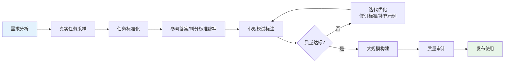
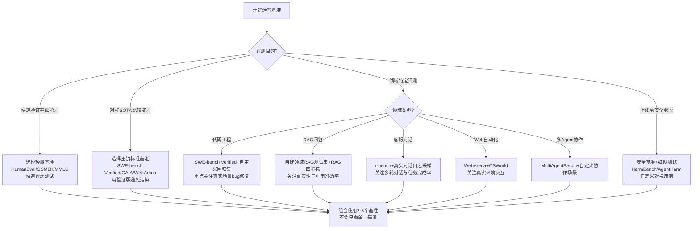

# 第3章：基准测试构建

> **方法论视角**：如需从"评测框架测什么/用什么环境/怎么判定"的方法论视角对比 HELM/MT-Bench/AgentBench 等框架，可参阅 [方法论Wiki · 模块2 核心评测框架对比](../agent-eval-methodology-wiki/02-frameworks/02-core-frameworks.md)。

---

## 3.1 基准测试概述

**基准测试**（Benchmark，通俗解释：Agent的"标准化考卷"）是标准化的任务集合与评测环境，用于公平比较不同系统的能力、跟踪模型迭代进展、验证优化措施是否有效。一个高质量基准需具备：**代表性**（覆盖真实场景）、**区分度**（能区分能力差异）、**可复现性**（结果稳定一致）、**无污染**（测试数据未泄露到训练集）。

基准按真实性可分为三个层级：
- **合成基准**：人工设计的简化任务，易评测但真实性低
- **半真实基准**：基于真实数据但进行了标准化处理，平衡真实性与可评测性
- **真实世界基准**：直接使用真实用户任务与环境，真实性最高但评测难度大

---

## 3.2 六大类主流基准详解

### 3.2.1 代码工程类：SWE-bench（重点）

**SWE-bench**（Software Engineering Benchmark，通俗解释：给Agent"真实GitHubissue"让它修bug的考试）是2024年发布的软件工程领域里程碑式基准，彻底改变了代码Agent的评测范式。

- **核心设计**：从GitHub真实Python仓库中提取已解决的issue（问题）和对应的PR（修复提交），给Agent提供issue描述+完整代码仓库，要求它生成修复补丁，然后运行原仓库的测试用例验证是否修复成功
- **规模**：原始版2294个任务，来自12个流行Python仓库（Django、scikit-learn、spaCy等）
- **原始版问题**：存在基准污染（部分PR已被模型在训练中见过）、测试环境配置复杂、部分任务定义模糊
- **SWE-bench Verified（验证版）的重要性**：
  - 由人类专家从原始版中筛选出500个高质量任务
  - 确保每个任务：环境可重现、问题描述清晰、测试用例能准确验证修复、确实未被污染
  - 是当前代码Agent评测的"黄金标准"
- **SOTA数据参考（2026年中）**：
  - 原始SWE-bench：顶尖模型约35-45%
  - SWE-bench Verified：顶尖模型约25-35%
  - 人类开发者水平：约70-80%（仍有显著差距）

> **关键洞察**：SWE-bench的革命性在于它不是"写一段代码"，而是"理解真实代码库→定位bug→理解上下文→生成补丁→验证修复"的完整软件工程流程。HumanEval/MBPP等传统代码基准只考"写函数"，SWE-bench考"做工程"。

### 3.2.2 通用推理类：GAIA

**GAIA**（General AI Assistants benchmark，通俗解释：考Agent"常识+推理+工具使用"的综合智商测试）是2023年发布的通用AI助手基准。

- **设计理念**：真实世界中人类觉得简单但对AI很难的任务——需要结合搜索、计算、推理、多模态理解等多种能力
- **任务类型**：事实查询、推理计算、文件处理、网页浏览、多步推理
- **难度分级**：Level 1（简单）、Level 2（中等）、Level 3（困难）
- **特点**：问题需要多步工具调用，单一模型无法直接回答，必须使用工具
- **SOTA参考**：GPT-4约15-20%，Claude 3 Opus约12-18%，人类水平>90%（差距巨大，说明通用Agent仍有很长的路）

### 3.2.3 Web交互类：WebArena

**WebArena**（通俗解释：给Agent一个真实可交互的网站环境，让它完成"买东西""查邮件""订机票"这类真任务）是真实Web环境Agent评测基准。

- **核心设计**：搭建了四个高度仿真的Web环境（电商网站、论坛、GitLab代码托管、在线地图），给Agent自然语言指令，要求它在浏览器中通过点击、输入、导航等操作完成任务
- **任务示例**："帮我找一下价格低于50美元的无线耳机，按评分排序，加入购物车"
- **评测方式**：自动验证最终状态（如购物车中是否确实有正确商品）
- **特点**：环境是真实可交互的，不是静态文本；Agent需要理解网页结构、处理导航、应对意外弹窗
- **SOTA参考**：顶尖模型约15-25%任务成功率，大部分操作在早期步骤就会失败

### 3.2.4 综合能力类：AgentBench

**AgentBench**（通俗解释：Agent的"高考"——8个不同科目一起考）是2023年发布的多环境综合评测框架。

- **覆盖8个场景**：
  1. 操作系统（OS）：在真实Linux终端中完成任务
  2. 数据库（DB）：用SQL查询和操作数据库
  3. 知识图谱（KG）：图数据库查询与推理
  4. 卡牌游戏（DCG）：策略决策
  5. 文字冒险游戏（ALFWorld）：居家环境交互
  6. 网页浏览（WebShop）：网购任务
  7. 网络安全（Puzzle）：CTF类题目
  8. 居家机器人（Mind2Web）：网页操作指令
- **价值**：可以评估Agent的跨领域泛化能力——是"偏科生"还是"全能选手"

### 3.2.5 对话类：τ-bench（tau-bench）

**τ-bench**（tau-bench，通俗解释：在真实对话场景中考Agent的"对话能力"）是聚焦多轮对话与工具使用的基准。

- **核心特点**：不是单轮问答，而是**有状态的多轮对话**——对话历史会影响后续任务
- **覆盖领域**：零售客服、航空订票、电信服务等真实对话场景
- **关键指标**：不仅看最终任务完成率，还看对话轮次效率、用户体验、错误恢复能力
- **创新点**：引入"对话状态追踪"评估，考察Agent是否能正确理解和维护对话上下文

### 3.2.6 安全类：GuardianAgentBench

**GuardianAgentBench**（通俗解释：Agent的"安全驾驶考试"——专门考危险场景下的表现）是Agent安全评测基准。

- **覆盖风险维度**：
  - 提示注入攻击（Prompt Injection）
  - 工具滥用检测（检测是否调用危险工具）
  - 隐私信息保护（是否泄露敏感数据）
  - 越权操作防御（是否执行未授权的高风险操作）
  - 有害内容拒答（是否正确拒绝生成危险内容）
- **特点**：包含大量对抗性测试用例，专门"设陷阱"诱导Agent犯错

---

## 3.3 20+主流基准列表与适用场景

| 基准名称 | 发布年份 | 任务类型 | 核心考察能力 | 适用场景 |
|---|---|---|---|---|
| **SWE-bench Verified** | 2024 | 软件工程 | 代码库理解、bug修复、测试验证 | Coding Agent评测、软件工程能力 |
| **HumanEval/MBPP** | 2021/2022 | 代码生成 | 单函数生成能力 | 基础代码能力快速测试 |
| **GAIA** | 2023 | 通用助手 | 多步推理、工具使用、常识 | 通用Agent综合能力评测 |
| **WebArena** | 2023 | Web交互 | 网页浏览、表单填写、导航 | Web Agent、浏览器助手 |
| **AgentBench** | 2023 | 多环境综合 | 跨领域泛化、环境适应 | 综合能力评估、横向对比 |
| **τ-bench** | 2024 | 对话交互 | 多轮对话、状态追踪、客服 | 对话Agent、客服机器人 |
| **MMLU** | 2021 | 知识问答 | 多学科知识覆盖 | 基础知识能力（非Agent专用） |
| **GSM8K/MATH** | 2021/2023 | 数学推理 | 多步数学推理 | 推理能力基础测试 |
| **ALFWorld** | 2020 | 具身交互 | 居家环境文本交互 | 具身Agent、顺序决策 |
| **WebShop** | 2022 | 网购任务 | 商品搜索、筛选、购买 | 电商场景Web Agent |
| **Mind2Web** | 2023 | 网页操作 | 元素定位、操作执行 | 通用网页操作能力 |
| **ToolBench** | 2023 | 工具使用 | 大规模API调用、工具组合 | 工具使用能力专项评测 |
| **API-Bank** | 2023 | API调用 | API选择、参数填充、调用 | 工具调用基础能力 |
| **HarmBench** | 2024 | 安全评测 | 有害内容拒答、红队测试 | 安全能力评测 |
| **RealToxicityPrompts** | 2020 | 内容安全 | 毒性内容生成检测 | 基础内容安全 |
| **AgentHarm** | 2024 | Agent安全 | Agent对抗攻击防御 | Agent安全红队测试 |
| **MultiAgentBench** | 2024 | 多Agent协作 | 通信、分工、协作 | 多智能体系统评测 |
| **CUA Benchmark** | 2025 | 计算机使用 | GUI操作、桌面应用使用 | 计算机使用Agent |
| **OSWorld** | 2024 | 操作系统 | 真实Ubuntu环境任务执行 | 操作系统Agent |
| **TravelPlanner** | 2024 | 旅行规划 | 信息查询、行程规划、预订 | 复杂规划任务Agent |

---

## 3.4 基准污染问题详解

**基准污染**（Benchmark Contamination，通俗解释：考试前学生已经见过甚至背过答案，考分高但没真本事）是当前LLM/Agent评测面临的最严重问题之一。

### 3.4.1 污染的三种类型

1. **输入-输出污染**：测试题的完整问题和答案都出现在训练数据中
   - 表现：模型能一字不差背出答案，但稍微改题就不会了
   - 检测：n-gram重叠度检测

2. **输入污染**：测试题问题出现在训练数据中（即使没有标准答案）
   - 表现：模型因为见过这个问题，能"凭印象"答对，而非推理得出
   - 危害：比全污染更隐蔽，更难检测

3. **元数据污染**：与测试题相关的讨论、解析、相似题出现在训练数据中
   - 表现：模型虽没见过原题，但见过相关知识点的讨论，获得了不公平优势
   - 危害：最难检测和防范

### 3.4.2 为什么需要Verified版本？

原始公开基准普遍存在污染问题，导致：
- 分数虚高：模型在污染基准上得分很高，但在新任务上表现骤降
- 进步幻觉：以为模型能力"又提升了"，其实只是"又记住了更多题"
- 方向误导：针对污染基准优化会损害通用能力（类似"应试教育"）

**Verified版本（验证版）的核心价值**：
- 由专家逐一审核，确保题目确实未被污染
- 环境可重现、评测标准明确
- 通常作为Holdout集（封闭保留），不公开完整测试数据
- 是真正能衡量能力进步的"黄金标准"

### 3.4.3 污染检测与缓解策略

| 策略 | 具体方法 | 优缺点 |
|---|---|---|
| **时间分割** | 用基准发布日期之后训练的模型才算有效 | 简单易操作，但无法检测预训练数据中的污染 |
| **n-gram检测** | 计算测试数据与训练语料的n-gram重叠率 | 能检测直接复制，但改述就检测不到 |
| **嵌入相似度** | 用文本嵌入计算语义相似度 | 能检测相似题，但误报率高 |
| **扰动测试** | 对题目做微小改动（改数字、改名字、语序调整），看性能是否骤降 | 实用有效——真会的题怎么改都应该会，背答案的题稍微改就不会了 |
| **Holdout验证集** | 保留一部分不公开的测试数据，定期用于最终验证 | 最可靠，但数据规模有限 |
| **动态生成** | 每次评测实时生成新题目（如用LLM生成变种题） | 从根本上避免污染，但题目质量控制难度大 |

---

## 3.5 自定义任务集设计方法

当公开基准无法满足特定领域需求时，需要构建自定义任务集。以下是标准化设计流程：



### 3.5.1 任务设计原则

1. **真实性优先**：优先从真实用户日志中采样任务，而非完全人工编造
2. **难度梯度**：包含简单（20%）、中等（60%）、困难（20%）三个层级
3. **覆盖度**：覆盖核心使用场景的80%以上，同时包含边界case
4. **可评测性**：每个任务都要有明确的成功/失败判定标准
5. **多样性**：避免任务雷同，覆盖不同的任务类型和错误模式

### 3.5.2 任务格式标准

每个任务样本应包含以下字段：

```yaml
task_id: "唯一标识符"
category: "任务分类（如：bug修复/信息查询/工具组合）"
difficulty: "easy/medium/hard"
instruction: "给Agent的用户指令"
environment: "环境配置要求（如需要哪些工具/数据/初始状态）"
reference_answer: "参考答案或成功判定标准"
test_cases: "自动验证用例（如测试脚本、状态断言）"
success_criteria: "详细的成功判定规则"
notes: "标注注意事项、边界case说明"
```

---

## 3.6 对抗样本构造技术

**对抗样本**（Adversarial Examples，通俗解释：专门设计的"陷阱题"，用来测试Agent在异常场景下的鲁棒性）是发现系统脆弱性的关键。

### 3.6.1 常见对抗类型

| 对抗类型 | 构造方法 | 测试目的 |
|---|---|---|
| **指令扰动** | 错别字、语序混乱、模糊表述、方言/口语化表达 | 鲁棒性——对不完美输入的理解能力 |
| **误导信息** | 在上下文中插入无关但可信的错误信息 | 抗干扰能力——能否区分相关与无关信息 |
| **陷阱诱导** | 诱导Agent选择错误工具、生成有害内容、泄露信息 | 安全对齐——能否拒绝诱惑/识破陷阱 |
| **边界case** | 极端参数、空输入、超长输入、特殊字符 | 错误处理——能否优雅处理异常输入 |
| **多任务干扰** | 一个指令包含多个冲突或嵌套的任务 | 指令理解——能否正确解析复杂意图 |
| **环境异常** | 工具返回错误、网络超时、API格式变化 | 容错恢复——能否从异常中恢复 |

### 3.6.2 红队测试方法

红队测试（Red Teaming，通俗解释：专门组织人"扮演黑客"来找漏洞）是对抗样本构造的系统化方法：
1. 组织专门的红队成员（可以是安全专家、领域专家，甚至是"门外汉"视角）
2. 设定攻击目标（如：诱导Agent泄露信息、让Agent调用危险工具）
3. 进行多轮尝试，记录成功的攻击路径
4. 将成功的攻击用例转化为永久回归测试用例
5. 修复漏洞后重新测试，确保防御有效

---

## 3.7 基准维护策略

基准不是一次性产物，需要持续维护：

### 3.7.1 版本管理

- 使用语义化版本号（如v1.0.0、v1.1.0、v2.0.0）
- 每次更新发布详细的变更日志（新增了什么、移除了什么、修复了什么）
- 保留历史版本，保证旧实验结果可复现
- 重大版本变更需重新做基线测试（所有模型重新跑一遍）

### 3.7.2 数据更新

- **定期更新**：每季度/每半年补充一批新任务（反映最新的使用场景）
- **从生产中采样**：持续从真实用户请求中采样好的case加入测试集
- **失败case回归**：把用户反馈的bad case、评测中发现的失败模式转化为永久测试用例
- ** retire过时任务**：移除不再有区分度、太简单或已过时的任务

### 3.7.3 去污染维护

- 每次模型训练数据更新后，重新检测污染情况
- 定期替换可能已被污染的题目
- 保留一部分"秘密测试集"永远不公开，只用于最终验收
- 对可疑的高分样本进行扰动测试，验证是真能力还是记忆

---

## 3.8 基准选择指南

选择基准时按以下决策树进行：



> **选择原则**：不要只看一个基准！至少组合使用：①一个通用能力基准（看综合水平）、②一个领域专用基准（看场景适配）、③一组自定义回归测试（看自己的核心需求是否满足）。就像招聘不能只看高考分数，还要看专业技能和实操测试。

---

## 章节导航

| 上一章 | 当前章节 | 下一章 |
|---|---|---|
| [← 第2章：指标体系设计](02-metrics-design.md) | **第3章：基准测试构建** | [第4章：自动化评测框架 →](04-automated-evaluation.md) |

---

> **本章小结**：基准是Agent评测的"标准化考卷"。六大类主流基准覆盖代码工程、通用推理、Web交互、综合能力、对话、安全六大领域；SWE-bench Verified代表了代码Agent评测的黄金标准；基准污染是当前最严峻的挑战，必须使用Verified版本和污染检测策略；自定义任务集需遵循真实性、难度梯度、可评测性原则；对抗样本和红队测试是发现脆弱性的关键；基准需要持续维护更新。下一章我们将学习如何用自动化评测框架来执行这些基准测试——从"出考卷"到"自动阅卷"。
