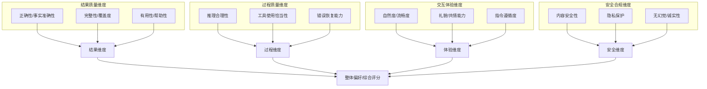
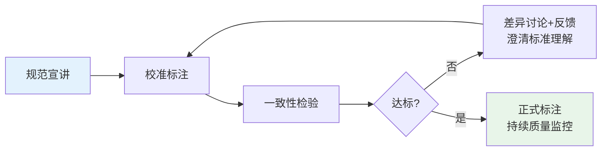
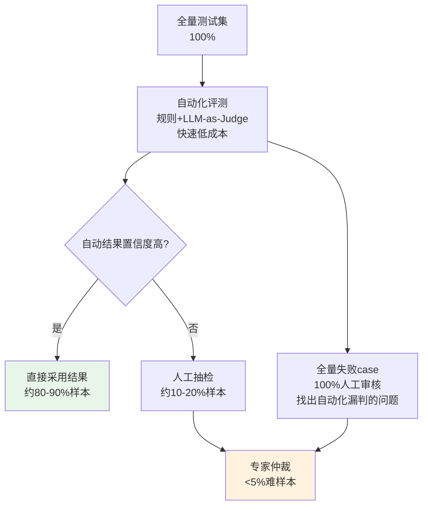

# 第5章：人工评估方法论

---

## 5.1 人工评估概述

**人工评估**（Human Evaluation，通俗解释：让人来当"考官"评判Agent表现）是评测体系中不可或缺的一环，尽管自动化评测发展迅速，但在很多维度上人类判断仍然是"黄金标准"（Gold Standard）。

### 5.1.1 人工评估的不可替代性

自动化评测无法覆盖以下关键维度：

| 维度 | 为什么自动化不行 | 人工评估的价值 |
|---|---|---|
| **主观质量** | 回答是否有用、自然、有帮助？这类问题没有客观标准答案 | 人类用户才是最终裁判，用户觉得好才是真的好 |
| **用户体验** | 对话是否流畅？Agent是否理解了用户真实意图？交互是否自然？ | 自动化指标无法模拟真实用户的心理感受 |
| **创造性/开放性** | 创意写作、方案设计、头脑风暴等开放性任务的质量 | 评判创造性需要审美、经验和常识，当前LLM仍不及人类专家 |
| **复杂事实核查** | 需要深度领域知识、交叉验证的事实判断 | 垂直领域专家的判断准确率远超通用LLM |
| **安全/伦理判断** | 内容是否合规？是否存在隐性偏见？是否有伦理风险？ | 伦理判断涉及文化、价值观、情境理解，自动化容易误判 |
| **边界case判定** | "这个回答算对还是错？"在模糊边界上的判断 | 人类可以理解模糊性，做出符合常识的判定 |
| **校准自动化Judge** | 需要人类标注来验证和校准LLM-as-Judge的准确性 | 人工标注是自动化评测的"度量衡" |

> **关键洞察**：人工评估和自动化评测不是替代关系，而是互补关系——自动化负责规模化、高频次、标准化的评测；人工负责黄金标准、校准、主观维度、边界case。二者结合形成高效可靠的人机协作评测体系。

---

## 5.2 评估维度设计

人工评估前首先要明确评什么——定义清晰的评估维度和评分标准。

### 5.2.1 常见评估维度分类

### 5.2.2 维度设计原则

1. **相互独立，完全穷尽（MECE原则）**：维度之间不要重叠，合起来覆盖所有关心的方面
2. **可感知**：每个维度必须是评估员能直接观察和判断的，不要抽象概念
3. **粒度适中**：3-7个维度最佳——太少覆盖不全，太多评估员注意力分散
4. **先分项，后整体**：先评各分项维度，最后给整体评分/偏好，避免晕轮效应（ Halo Effect，对一个维度的印象影响其他维度评分）

### 5.2.3 评分量表设计

常用的评分量表：

| 量表类型 | 说明 | 优点 | 缺点 | 适用场景 |
|---|---|---|---|---|
| **二元量表** | 对/错、好/坏、接受/拒绝 | 简单、评估员间一致性高 | 太粗糙，区分度低 | 质量门禁、安全审核、核心功能验收 |
| **Likert 5级** | 1=很差，2=较差，3=一般，4=较好，5=优秀 | 平衡了区分度和易用性 | 存在中间倾向（大家都打3分） | 大多数主观质量评估 |
| **Likert 4级** | 去掉中间项：1=差，2=一般，3=好，4=优秀 | 强迫评估员做出偏向判断 | 评估员压力较大 | 需要明确区分优劣的场景 |
| **排序/偏好** | A比B好 / B比A好 / 平局 | 对比敏感度高，适合AB对比 | 无法评估绝对水平 | A/B测试、模型对比、版本对比 |
| **错误标注** | 标注错误类型、错误位置、严重程度 | 诊断性强，直接指导优化 | 标注成本高 | 错误分析、数据标注、训练Judge模型 |

> **最佳实践**：验收场景用二元量表（过/不过），迭代优化场景用5级Likert，版本对比用偏好排序，错误诊断用错误类型标注。不要在一次评估里用太多种量表。

---

## 5.3 标注规范制定

**标注规范**（Annotation Guideline，通俗解释：给评估员的"评分手册"，写清楚怎么评、什么情况给几分）是人工评估质量的基石。规范模糊是标注一致性差的首要原因。

### 5.3.1 标注规范必备内容

一份完整的标注规范应包含：

1. **任务说明**：
   - 评估的目的是什么？
   - 评估对象是什么？
   - 评估结果将用于什么决策？

2. **维度定义**：
   - 每个维度的明确定义（什么是"有用性"？）
   - 每个维度的评分标准（1-5分分别对应什么表现？）
   - 明确的边界说明（什么情况给1分？什么情况给5分？）

3. **评分示例**：
   - 每个维度每个分数段至少1-2个**正例**（应该给这个分数的例子）
   - 每个维度至少1个**反例**（容易混淆、不该给这个分数的例子）
   - **边界case**：特别标注容易判错的情况，说明如何判定
   - 示例应覆盖典型的正确/错误模式

4. **标注流程说明**：
   - 先看什么，后看什么？
   - 不确定时怎么办？（标记为"不确定"，提交仲裁）
   - 标注工具使用说明
   - 每个样本预计标注时间

5. **常见问题FAQ**：
   - 收集试标注阶段的问题和解答
   - 持续更新新遇到的边界case

### 5.3.2 标注规范示例（简化版）

以"事实正确性"维度为例：

> **维度：事实正确性**
>
> **定义**：回答中的所有事实陈述是否真实准确、有可靠依据，不存在幻觉和事实错误。
>
> **评分标准**：
> - 5分（完全正确）：所有事实陈述准确无误，无任何幻觉，引用准确
> - 4分（基本正确）：核心事实正确，存在不影响结论的微小瑕疵（如日期差一天、次要细节不准确）
> - 3分（部分正确）：核心信息部分正确，但存在明显事实错误或部分幻觉
> - 2分（大部分错误）：核心事实存在多处错误，幻觉严重，误导性强
> - 1分（完全错误）：与事实完全不符或纯幻觉，完全不可信
>
> **正例（5分）**：Q："中国的首都是哪里？" A："中国的首都是北京。"——事实准确无错
>
> **正例（4分）**：Q："爱因斯坦哪年提出相对论？" A："1905年"——正确（狭义相对论1905，广义1915，因问题未指明，此回答可接受）
>
> **反例（不要给5分）**：Q："法国的首都是哪里？" A："巴黎，人口约200万"——巴黎都会区人口约1200万，城市人口约210万，细节不准确，应给4分
>
> **边界case说明**：如果无法确定某陈述是否正确，不要猜，标记为"需核查"，提交给领域专家仲裁。

---

## 5.4 评估员培训流程

即使有完善的规范，评估员理解也会有差异，必须通过标准化培训保证一致性。

### 5.4.1 培训四步流程

1. **第一步：规范宣讲（约1-2小时）**
   - 逐条讲解标注规范
   - 讲解每个示例，解释为什么给这个分数
   - 回答评估员的疑问
   - 明确标注流程和质量要求

2. **第二步：校准标注（Calibration）**
   - 所有评估员独立标注同一批**校准集**（通常20-50个样本）
   - 校准集是预先有黄金标准答案的样本，覆盖各种分数段和边界case
   - 评估员在标注时不知道标准答案
   - 此阶段不计时，让评估员充分熟悉标准

3. **第三步：一致性检验**
   - 计算评估员之间的一致性分数（Cohen's Kappa或Fleiss' Kappa）
   - 对比每个评估员与黄金标准的准确率
   - 找出标注分歧大的样本和维度

4. **第四步：差异讨论与再校准**
   - 召开校准会，逐个讨论分歧大的样本
   - 让标注不同的评估员各自说明理由
   - 最终由专家给出正确判定，澄清规范中模糊的地方
   - 根据讨论更新规范和示例
   - 如果一致性不达标，再做一轮校准标注直到达标

### 5.4.2 盲审制度

- **单盲**：评估员不知道自己评的是哪个版本（A版还是B版），避免品牌偏见
- **双盲**：评估员不知道模型/版本信息，也不知道其他评估员的标注结果
- **顺序随机**：对比评测中，A/B版本的展示顺序随机化，避免顺序偏差
- **去标识化**：移除回答中可能泄露版本信息的特征（如特殊格式、模型口头禅）

---

## 5.5 一致性检验方法

**评估者间信度**（Inter-Rater Reliability, IRR，通俗解释：不同评估员对同一样本的判断有多一致）是衡量人工评估质量的核心指标。

### 5.5.1 Cohen's Kappa（κ）

适用于**两个评估员**、**分类/评分**任务的一致性计算：

$$\kappa = \frac{p_o - p_e}{1 - p_e}$$

- $p_o$：观察到的一致率（两个评估员给出相同评分的比例）
- $p_e$：随机猜测下的期望一致率
- Kappa考虑了"碰巧一致"的情况，比单纯一致率更科学

**Kappa值解读参考**：

| Kappa值 | 一致性程度 | 处理建议 |
|---|---|---|
| < 0.2 | 极差（Poor） | 完全不可用，需重新设计规范和培训 |
| 0.21-0.4 | 一般（Fair） | 一致性较低，需改进规范或重新培训 |
| 0.41-0.6 | 中等（Moderate） | 可接受的最低水平，可用于内部迭代 |
| 0.61-0.8 | 较好（Substantial） | 良好一致性，大多数场景适用 |
| 0.81-1.0 | 极佳（Almost Perfect） | 一致性很高，可用于正式验收/论文发布 |

> **工程经验值**：内部迭代优化场景Kappa≥0.5即可接受；版本对比/正式发布场景Kappa≥0.65；论文/学术场景Kappa≥0.75才够有说服力。

### 5.5.2 Fleiss' Kappa

适用于**多个评估员**（3人及以上）的一致性计算，是Cohen's Kappa的多人推广版本。

- 计算逻辑类似，但统计的是多个评估员之间的多重一致性
- 解读标准与Cohen's Kappa相同

### 5.5.3 其他一致性指标

| 指标 | 适用场景 | 说明 |
|---|---|---|
| **简单一致率** | 二元分类、快速估算 | 一致样本数/总样本数，不考虑随机一致，会高估一致性 |
| **Krippendorff's Alpha** | 任意人数、任意量表类型（名义/顺序/间隔/比率） | 最通用的一致性指标，学术研究常用 |
| **ICC（组内相关系数）** | 连续数值评分 | 衡量多个评估员对连续变量评分的一致性 |
| **Spearman/Kendall相关** | 排序/偏好任务 | 衡量评估员排序结果的相关性 |

### 5.5.4 提升一致性的方法

如果一致性不达标，按以下顺序排查改进：

1. **规范问题**（最常见）：规范写得太模糊？缺少边界case示例？→ 修订完善规范
2. **培训问题**：评估员对标准理解不一致？→ 再做校准和讨论
3. **维度问题**：某个维度定义不清、难以判断？→ 拆分或重新定义该维度
4. **任务问题**：任务本身太模糊、无法客观判断？→ 重新设计任务
5. **评估员问题**：个别评估员 consistently 偏差大？→ 额外培训或替换

---

## 5.6 质量控制机制

标注过程中需要持续的质量控制，防止标注疲劳、标准漂移、敷衍标注等问题。

### 5.6.1 核心质量控制手段

| 手段 | 具体做法 | 目的 |
|---|---|---|
| **双标+仲裁** | 每个样本由2个评估员独立标注，一致则通过，不一致则送第3个专家仲裁 | 保证标注质量，解决分歧 |
| **黄金样本抽查（Gold Set）** | 预先标注好的"测试题"随机混入正式标注中，评估员不知道哪些是测试题 | 检测评估员是否认真标注，监控标准漂移 |
| **标注一致性监控** | 定期（每天/每批次）计算双标一致率/Kappa | 及时发现一致性下降问题 |
| **标注量控制** | 每个评估员每天标注量不超过3-4小时 | 防止疲劳导致质量下降（标注是高强度脑力劳动） |
| **分歧定期复盘** | 每周复盘仲裁案例，更新标注规范和FAQ | 持续收敛标准理解 |
| **异常模式检测** | 检测是否有评估员总是打高分/低分、速度异常快、答案模式化 | 识别敷衍标注的评估员 |

### 5.6.2 标注质量问题处理流程

1. **首次发现质量不达标**：私下反馈，指出问题，提供额外培训
2. **二次不达标**：暂停标注工作，重新校准测试，通过后再上岗
3. **多次不达标**：更换评估员

---

## 5.7 人机协作评估策略

纯粹人工评估成本高、速度慢，纯粹自动化不够可靠，人机协作是最优解：

### 5.7.1 分层评测漏斗

### 5.7.2 人机协作最佳实践

1. **自动化优先，人工兜底**：能用自动判断的一律自动，自动拿不准的再送人工
2. **失败case必审**：自动化判定为"失败"的case全部人工复核——自动化容易把"对的判错"或"错的判对"，失败case是发现自动化评测漏洞的最佳来源
3. **定期校准自动化Judge**：
   - 每次人工标注后，用新的黄金数据测试LLM-as-Judge的准确率
   - 如果Judge准确率低于阈值（如<85%），重新优化Judge的Prompt或微调
4. **主动学习采样**：不是随机抽样人工审核，而是优先选：
   - 自动化评分在模糊边界（如0.45-0.55分，接近及格线）的样本
   - 与历史分布差异大的异常样本
   - 高风险场景（安全、合规、事实性相关）
5. **人工标注数据反哺自动化**：
   - 用高质量人工标注数据微调Judge模型/分类器
   - 将人工发现的新模式加入规则评测器
   - 形成"自动评测→人工校准→提升自动评测能力"的正向循环

### 5.7.3 人工评估成本优化

- **分层标注**：简单case用普通标注员，边界case用高级标注员，难case用领域专家
- **主动学习**：只标信息量大的样本（模型判断模糊的、模型错了的），不标自动能确定的
- **标注复用**：同一批黄金样本可反复用于校准、Judge测试、培训，不要标完就扔
- **批量标注**：同一维度/同一类型的样本集中标注，减少评估员的上下文切换成本

---

## 章节导航

| 上一章 | 当前章节 | 下一章 |
|---|---|---|
| [← 第4章：自动化评测框架](04-automated-evaluation.md) | **第5章：人工评估方法论** | [第6章：评测数据治理 →](06-data-governance.md) |

---

> **本章小结**：人工评估是评测体系的"黄金标准"，在主观质量、用户体验、创造性、安全伦理等维度不可替代。设计3-7个清晰的评估维度，制定详尽的标注规范（含正例/反例/边界case），通过四步培训流程保证评估员一致性，用Cohen's Kappa/Fleiss' Kappa量化信度（Kappa≥0.6为工程可用），配合双标+仲裁+黄金样本抽查等质量控制机制。最终目标不是"全部人工"或"全部自动"，而是建立高效的人机协作评测漏斗，用20%的人工成本覆盖80%的质量风险，同时持续用人工标注数据提升自动化评测能力。下一章我们将讨论评测的数据基础——评测数据治理。
