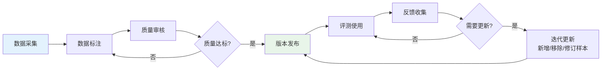
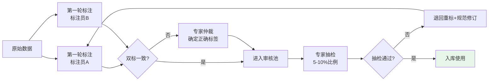
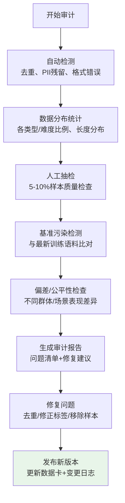

# 第6章：评测数据治理

---

## 6.1 数据治理概述

**评测数据治理**（Evaluation Data Governance，通俗解释：管理好Agent的"题库"——保证题目质量、知道题目的版本、不泄露隐私、题目持续更新）是评测体系长期有效的基础。垃圾进垃圾出（Garbage In, Garbage Out）——如果测试数据质量差，再先进的评测框架和指标也没有意义。

评测数据是比模型权重更宝贵的资产：模型权重几个月就会迭代一版，但高质量的评测数据集会持续产生价值，是衡量系统能力演进的"度量衡"。

---

## 6.2 评测数据生命周期

评测数据不是一次性产物，而是经历完整的生命周期，需要持续管理：



### 6.2.1 生命周期各阶段核心要点

| 阶段 | 核心目标 | 关键活动 | 质量门 |
|---|---|---|---|
| **数据采集** | 获取有代表性的原始数据 | 用户日志采样、公开基准、人工构造、对抗生成 | 采样代表性检查、脱敏预处理 |
| **数据标注** | 为原始数据添加标准答案/标签 | 标注员标注、专家审核、双标仲裁 | 标注一致性（Kappa≥0.6） |
| **质量审核** | 确保数据质量达标 | 自动校验、人工抽检、Gold Set验证 | 准确率≥95%，无敏感信息 |
| **版本发布** | 数据可追溯可复现 | 打版本标签、生成数据卡、写变更日志 | 版本号+数据哈希可复现 |
| **评测使用** | 数据用于评测活动 | 训练、验证、测试分离、防污染 | 测试集封闭管理 |
| **反馈收集** | 收集数据使用中的问题 | 错误case标注、标注分歧记录、新场景需求 | 问题分类归因 |
| **迭代更新** | 持续优化数据集 | 补充新样本、修复错误、淘汰过时样本 | 更新后重新做基线评测 |

---

## 6.3 数据采集来源与采样策略

### 6.3.1 常见数据来源

| 来源类型 | 具体方式 | 优点 | 缺点 |
|---|---|---|---|
| **真实用户日志** | 从生产环境采样真实用户请求（脱敏后） | 最真实、最能代表实际分布 | 隐私风险、标注成本高、可能包含噪声 |
| **公开基准数据集** | 使用学术界/工业界发布的公开基准 | 成本低、方便横向对比 | 可能已被污染、不一定适配特定场景 |
| **人工构造数据** | 由专家/标注员人工编写测试用例 | 可控、质量高、可覆盖边界case | 成本高、规模难做大、可能不自然 |
| **LLM生成数据** | 用大模型生成/扩增测试用例 | 速度快、成本低、可大规模生成 | 质量参差不齐、需要人工校验、可能存在模型偏见 |
| **对抗样本数据** | 通过红队测试/对抗攻击构造的"陷阱题" | 发现脆弱点、提升鲁棒性 | 需要安全专家、构造难度大 |
| **失败case回归** | 将评测/生产中发现的bad case转化为测试用例 | 直接对应实际问题、防止回归 | 需要持续收集、覆盖度有限 |

### 6.3.2 采样策略

从真实数据中采样需注意策略，保证样本代表性：

1. **分层抽样**：按任务类型、难度、用户群体等维度分层，按比例采样，避免某类样本过度代表或不足
2. **时间窗口采样**：不要只取最近的数据，要覆盖不同时间段（考虑季节性、版本影响）
3. **难度梯度采样**：简单:中等:困难≈2:6:2，不要全是简单题（区分度低）也不要全是难题（打击信心）
4. **失败过采样**：适当增加历史失败case的比例（从20%提到40%），突出对薄弱点的考察
5. **分布外样本预留**：预留10-15%的"新颖场景"样本，测试泛化能力（不是从历史数据采样）
6. **采样量估算**：根据统计显著性要求计算最小样本量——指标变化5%左右需要至少385个样本（95%置信度）

> **关键原则**：测试集分布应该与真实生产环境的用户请求分布近似——如果你的用户80%问的是A类问题，测试集就应该约80%是A类问题，而不是人工平均分配。

---

## 6.4 标注质量管理

高质量标注是评测数据的生命线。

### 6.4.1 多轮标注流程



### 6.4.2 Gold Set（黄金标准集）构建

**Gold Set**（黄金标准集，通俗解释："标准答案中的标准答案"——质量最高、大家都认可的一批参考样本）是标注质量的锚点。

**Gold Set的作用**：
- 新标注员上岗前的"考试题"——只有在Gold Set上达标才能正式标注
- 标注过程中的"质量探针"——随机混入正式标注中监控质量
- LLM-as-Judge校准的基准——Judge在Gold Set上的准确率必须≥85%
- 数据集版本之间的"锚点"——对比不同版本/不同模型时，Gold Set保持不变，保证可比性

**Gold Set构建方法**：
1. 专家（2-3名资深领域专家）独立标注
2. 讨论分歧直到达成共识
3. 每个样本附带详细的标注理由，说明为什么是这个标签/答案
4. 规模通常是100-500个样本（贵精不贵多）
5. Gold Set要定期更新，移除过时的、不再有代表性的样本
6. Gold Set需要封闭管理，防止泄露到训练数据中

### 6.4.3 标注常见问题与解决

| 问题 | 表现 | 解决方法 |
|---|---|---|
| **标注不一致** | 不同标注员对同一样本标注不同 | 完善标注规范、增加示例、加强校准培训 |
| **标注疲劳** | 标注后期质量下降、错误增多 | 限制每日标注时长、穿插简单样本、休息提醒 |
| **标准漂移** | 随着标注进行，标准悄悄变化 | 每批次标注前先标10个Gold Set样本校准、每周复盘分歧 |
| **敷衍标注** | 速度极快、答案模式化、高错误率 | 增加Gold Set抽查比例、警告、不合格返工 |
| **难度偏差** | 难样本准确率低，简单样本准确率高 | 难样本双标+仲裁、标注难度分层（简单给新手，难给专家） |

---

## 6.5 数据版本管理

代码有Git版本管理，评测数据也需要版本管理——你必须能回答"3个月前我们用的是哪个版本的测试集？当时v1.2模型在上面得分是多少？"

### 6.5.1 DVC（Data Version Control）

**DVC**（Data Version Control，通俗解释：数据界的Git——专门用来管理大文件和数据集版本的工具）是数据版本管理的标准工具。

- **核心原理**：数据文件本身不存Git（太大），Git只存一个指向特定版本数据文件的元数据指针（.dvc文件）
- **核心能力**：
  - 数据版本化：像git commit一样提交数据版本，可以checkout任意历史版本
  - 远程存储：支持S3/GCS/本地文件服务器等作为数据存储后端
  - 流水线复现：可以定义数据处理流水线，保证数据加工过程可复现
  - 指标追踪：可以追踪不同数据版本上的模型指标变化

- **最佳实践**：
  - Git仓库存代码、配置、.dvc指针文件
  - DVC远程存储存实际大文件（数据集、模型权重）
  - 每次数据更新都commit.dvc文件，写清楚变更日志
  - 打标签（dvc tag）标记重要版本（如test-set-v1.0, gold-set-v2.1）

### 6.5.2 数据卡（Data Card）

每个数据集版本必须配套**数据卡**（Data Card，通俗解释：数据集的"说明书"——说清楚数据是什么、怎么来的、有什么特点、怎么用），数据卡是数据集透明度和可复现性的基础。

**数据卡必备内容**：

```yaml
dataset_name: "客服Agent评测集v2.1"
version: "v2.1.0"
release_date: "2026-08-05"
total_samples: 1250
sample_distribution:
  简单: 250
  中等: 750
  困难: 250
task_categories:
  订单查询: 40%
  退换货: 25%
  产品咨询: 20%
  投诉处理: 10%
  其他: 5%
data_sources:
  - "2026年Q1-Q2客服日志采样（1000条，已脱敏）"
  - "专家构造边界case（200条）"
  - "对抗样本（50条）"
annotation_process:
  - "双标+专家仲裁"
  - "标注员共5人，均经过2轮校准"
  - "双标一致率: 92%，Cohen's Kappa: 0.78"
intended_use:
  - "客服Agent任务成功率评测"
  - "版本回归测试"
  - "RAG检索质量评估"
limitations:
  - "主要覆盖电商客服场景，其他场景迁移需谨慎"
  - "未包含多语言和方言样本"
  - "对抗样本比例较低（4%），安全评测需补充专用集"
changelog:
  v2.1.0: "新增200条618期间用户问题，移除50条过时的促销政策问题"
  v2.0.0: "重构分类体系，新增对抗样本子集"
  v1.0.0: "初始版本，1000条样本"
contact: "eval-team@company.com"
```

### 6.5.3 数据分割规范

评测数据必须分为三个互斥的子集，绝对不能混用：

| 子集 | 比例 | 用途 | 访问权限 | 更新频率 |
|---|---|---|---|---|
| **训练集（Train）** | 70-80% | 模型训练、Prompt优化 | 开发团队 | 频繁更新 |
| **验证集（Dev/Validation）** | 10-15% | 开发过程中调参、选择方案、快速迭代 | 开发团队 | 偶尔更新 |
| **测试集（Test/Holdout）** | 10-15% | 版本最终验收、论文结果、SOTA对比 | 受限访问（少数核心人员） | 极少更新（每季度/半年） |

> **铁律**：测试集（Test Set）是"高考题"——必须严格保密，开发过程中绝对不能偷看，更不能用测试集数据做训练或调参。偷看测试集就像提前偷考卷，得到的分数是虚高的，上线必崩。

---

## 6.6 隐私保护与数据脱敏

使用真实用户数据做评测必须严肃对待隐私问题，违反隐私法规（如GDPR、个人信息保护法）会带来严重法律风险。

### 6.6.1 PII（个人可识别信息）检测与处理

**PII**（Personally Identifiable Information，个人可识别信息，通俗解释：能直接定位到具体个人的信息——姓名、手机号、身份证号、地址、邮箱等）必须在使用前彻底脱敏。

**常见PII类型与脱敏方法**：

| PII类型 | 示例 | 脱敏方法 |
|---|---|---|
| 姓名 | "张三"、"John Smith" | 替换为"[用户]"、"[联系人]"或随机化名 |
| 手机号 | "138****1234"、"13812345678" | 完全替换为"[手机号]" |
| 身份证/护照号 | 18位身份证号 | 完全替换为"[身份证号]" |
| 邮箱地址 | "xxx@xxx.com" | 替换为"[邮箱]" |
| 地址/位置 | "北京市朝阳区xx路xx号" | 泛化为"[地址]"，移除具体门牌号 |
| 银行卡/支付信息 | 银行卡号、交易流水号 | 完全移除 |
| 账号/订单号 | "订单号123456789" | 替换为"[订单号]" |
| 生物特征 | 人脸、指纹、声纹数据 | 非必要不使用，必须使用需做不可逆匿名化 |

**PII处理原则**：
1. **最小必要**：评测不需要的PII信息一律移除，不要"留着万一有用"
2. **自动+人工双检**：先用PII检测工具自动处理，再人工抽检（自动工具会漏检）
3. **不可逆脱敏**：脱敏后的数据无法复原回原始信息（不要用加密，加密是可逆的）
4. **数据使用协议**：标注人员接触用户数据前必须签署保密协议

### 6.6.2 差分隐私与数据匿名化

对于高敏感场景，可以使用更严格的隐私保护技术：

- **差分隐私（Differential Privacy）**：在数据中加入适量噪声，使得无法从数据集中反推出是否包含某个特定用户的信息，同时保持数据整体统计特性有效
- **k-匿名**：确保每条记录都至少和数据集中其他k-1条记录在准标识符上不可区分
- **数据合成**：不直接使用真实用户数据，而是用生成模型学习真实数据的分布后，生成完全合成的人工数据（合成数据与真实数据统计特性相似，但不含任何真实用户信息）

### 6.6.3 隐私合规检查清单

- [ ] 所有使用用户数据的活动已通过隐私/法务团队审查
- [ ] 数据已完成PII脱敏处理，无残留敏感信息
- [ ] 数据存储在安全合规的位置，访问权限受控制
- [ ] 标注人员签署了保密协议
- [ ] 数据仅用于授权的评测目的，不挪作他用
- [ ] 数据保留期限明确，到期及时删除
- [ ] 有数据泄露应急响应预案

---

## 6.7 数据质量保障

### 6.7.1 常见数据质量问题

| 问题类型 | 表现 | 影响 | 检测方法 |
|---|---|---|---|
| **重复样本** | 完全一样或高度相似的样本重复出现 | 浪费标注/评测资源，虚高分数 | 文本哈希、MinHash/SimHash相似度检测 |
| **标签噪声** | 标注错误、答案不正确 | 评测结果不准确，误导优化方向 | 双标不一致检测、Gold Set准确率检查、异常分数分析 |
| **基准污染** | 测试集数据出现在模型训练集中 | 分数虚高，无法衡量真实能力 | n-gram匹配、嵌入相似度、扰动测试 |
| **数据偏差** | 某类样本过度代表或缺失，存在系统性偏见 | 评测结果不公平，模型优化方向偏斜 | 分布统计、公平性分析、交叉表检查 |
| **过时样本** | 样本对应场景/知识已过时（如旧版本产品功能、已过期政策） | 评测结果与现实脱节 | 定期人工审核、时效性标注 |
| **无效样本** | 指令模糊、没有明确答案、无法评测的样本 | 浪费资源，引入噪声 | 人工审核、规则校验（如文本长度、有效字符检查） |

### 6.7.2 数据集审计流程

定期（每季度）对数据集进行全面审计：



---

## 6.8 数据集迭代与更新策略

评测数据集不是一成不变的，需要持续迭代——就像高考题每年更新，不能连续10年用同一套题。

### 6.8.1 更新触发时机

在以下时机需要更新数据集：
1. **定期更新**：每季度小更新（补充10-20%新样本），每年大版本更新（全面审核）
2. **产品重大变更**：产品功能、知识库、业务流程有重大变化时
3. **新错误模式发现**：发现了新的典型错误类型，现有测试集没有覆盖
4. **基准污染确认**：发现某批样本被污染，需要替换
5. **模型性能饱和**：现有测试集上准确率>95%，区分度不足，需要增加难度
6. **新场景上线**：进入新的业务领域/用户群体，需要补充对应场景数据

### 6.8.2 更新注意事项

1. **保留历史版本**：不要覆盖旧版本，永远保留所有历史版本（用DVC/git tag）——你需要能复现历史评测结果
2. **重新跑基线**：数据集更新后，必须在新测试集上重新跑所有对比基线（旧模型、当前模型、竞品），不能只拿新分数和旧分数比（题目变了，分数不可直接比）
3. **平滑过渡**：新旧版本之间保留一部分重叠的锚点样本（如Gold Set），用于跨版本分数校准
4. **变更说明**：每次更新必须写清楚：新增了什么、移除了什么、修改了什么、为什么改、对分数有什么预期影响
5. **不要频繁大改**：大版本更新（如替换>30%样本）不要太频繁（每年1-2次足够），否则无法追踪模型长期进步趋势

### 6.8.3 测试集去污染策略

随着时间推移，测试集被训练数据污染几乎是必然的，需要主动管理：
- **动态Holdout集**：永远保留一部分最新收集的、从未公开过的样本作为最终验收集
- **时间分割验证**：用"训练集截止日期"之后发布/收集的样本做验证（确保模型训练时不可能见过）
- **定期轮换**：每半年轮换20-30%的测试样本，替换可能被污染的样本
- **扰动验证**：对可疑样本做微小扰动（改名字、改数字、改语序），如果性能骤降说明是记忆而非能力

---

## 章节导航

| 上一章 | 当前章节 | 下一章 |
|---|---|---|
| [← 第5章：人工评估方法论](05-human-evaluation.md) | **第6章：评测数据治理** | [第7章：行业实践案例 →](07-industry-practices.md) |

---

> **本章小结**：评测数据是最宝贵的评测资产，需要全生命周期治理。数据采集要保证代表性，优先使用真实用户数据并注意分层抽样；标注质量通过双标+仲裁+Gold Set机制保障；用DVC做数据版本管理，每个版本配数据卡；严格划分训练/验证/测试集，测试集必须封闭保密；隐私保护是红线，PII必须彻底脱敏；定期审计数据质量（去重、去噪、去污染、偏差检测）；数据集需要定期迭代更新，但要保留历史版本保证可复现性。下一章我们将通过行业实践案例，看这些理论方法如何在真实场景中落地。
