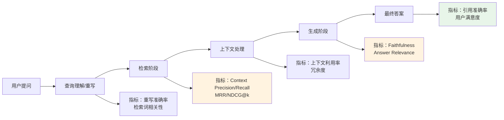
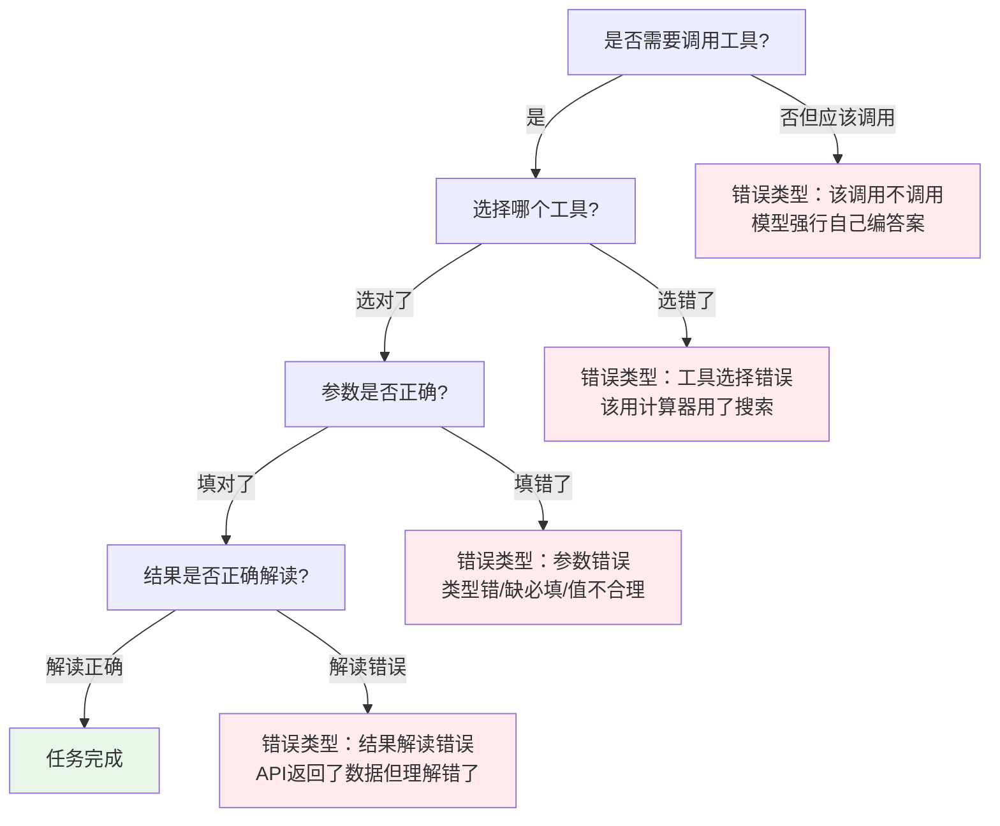
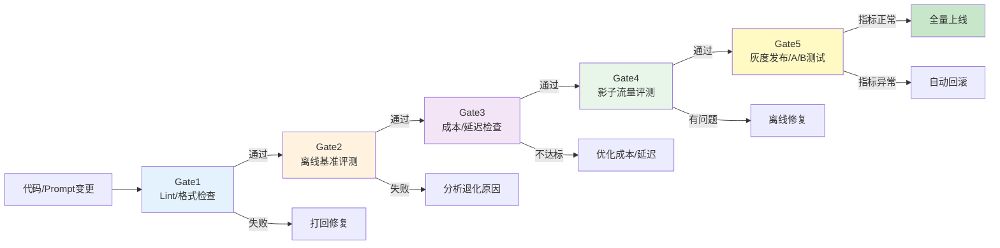

# 第7章：行业实践案例

> **方法论视角**：如需按"背景/做法/成果/经验教训/可复用要点"五要素阅读 8 个企业案例，可参阅 [方法论Wiki · 模块5 行业案例分析](../agent-eval-methodology-wiki/05-cases/05-cases-overview.md)。

---

## 7.1 案例1：Coding Agent评测（SWE-bench实践）

Coding Agent是当前Agent技术最成熟、商业化最成功的领域之一，SWE-bench已成为事实上的行业标准。

### 7.1.1 评测架构设计

Coding Agent评测采用"环境隔离+测试验证"的经典架构：

```mermaid
graph TB
    subgraph "评测控制平面"
        ORCH[评测编排器<br/>任务调度/超时控制/结果收集]
        JUDGE[判分引擎<br/>运行测试/计算pass@k/生成报告]
    end
    subgraph "隔离执行环境"
        ENV1[Docker容器1<br/>仓库+issue+Agent]
        ENV2[Docker容器2<br/>仓库+issue+Agent]
        ENV3[Docker容器N...]
    end
    TESTS[测试用例<br/>原仓库测试套件]
    
    ORCH --> ENV1
    ORCH --> ENV2
    ORCH --> ENV3
    ENV1 --> TESTS
    ENV2 --> TESTS
    ENV3 --> TESTS
    TESTS --> JUDGE
    JUDGE --> REPORT[评测报告]
    
    style ENV1 fill:#fff3e0
    style ENV2 fill:#fff3e0
    style ENV3 fill:#fff3e0
    style REPORT fill:#e8f5e9
```

### 7.1.2 核心评测指标

Coding Agent评测使用分层指标体系：

| 层级 | 指标 | 计算方式 | 说明 |
|---|---|---|---|
| **结果层** | pass@1 | 一次尝试补丁通过所有测试的比例 | 基础能力指标 |
| | pass@5 | 5次尝试中至少一次通过的比例 | 能力上限指标 |
| | pass^5 | 连续5次尝试都通过的比例 | 可靠性指标（生产环境更看重） |
| | 测试覆盖率 | 补丁覆盖到的相关代码比例 | 防止修复不完整 |
| **过程层** | 定位准确率 | 正确找到bug所在文件/函数的比例 | 诊断能力 |
| | 补丁大小 | 修改的文件数/代码行数 | 鼓励最小化修复，避免改坏其他地方 |
| | 编译/语法错误率 | 生成的补丁无法编译/有语法错误的比例 | 基础质量门槛 |
| | 平均尝试次数 | 解决一个问题平均需要几次尝试 | 效率指标 |
| **效率层** | 平均耗时/任务 | 解决一个issue的平均时间 | 端到端效率 |
| | Token消耗/任务 | 平均每个解决的issue消耗的Token数 | 成本指标 |

### 7.1.3 关键实践经验

1. **使用SWE-bench Verified而非原始版**：原始版约30%的任务存在问题（环境坏、答案错、定义模糊），Verified版500题是真正的黄金标准
2. **Docker隔离是必须的**：每个任务必须在干净的Docker环境中运行，防止环境污染、依赖冲突、恶意代码风险
3. **重视pass^k而非只看pass@k**：线上系统不能"重试5次选最好的"，pass^k才代表真实可靠性
4. **做失败case分类分析**：
   - 环境错误（10-15%）：依赖安装失败、测试跑不起来（不是Agent的锅）
   - 定位错误（30-40%）：找到了错误的文件/函数
   - 修复错误（30-40%）：找到了bug但补丁修错了
   - 格式错误（10-15%）：补丁格式不对无法应用
   - 超时（5-10%）：超过时间限制未完成
5. **不要只看SWE-bench分数**：SWE-bench都是Python项目，不代表其他语言/场景的能力；必须补充内部真实代码库的回归测试

---

## 7.2 案例2：RAG Agent评测

检索增强生成（RAG）Agent是企业场景最常见的Agent类型，评测聚焦"检索-生成"全链路。

### 7.2.1 分阶段评测方法论

RAG评测不能只看最终答案，必须拆分到每个环节：



### 7.2.2 核心指标详解

| 阶段 | 指标 | 评测方法 | 典型问题 |
|---|---|---|---|
| **检索阶段** | Context Precision | LLM-as-Judge或人工标注判断检索到的文档是否相关 | 检索返回太多无关文档干扰生成 |
| | Context Recall | 检查回答所需的关键信息是否都被检索到 | 漏检关键信息导致回答不完整 |
| | MRR（Mean Reciprocal Rank） | 第一个相关文档出现在第几位，取倒数平均 | 正确文档排得太靠后 |
| | NDCG@k | 前k个检索结果的排序质量 | 相关性高的文档没排在前面 |
| **生成阶段** | Faithfulness（忠实度） | LLM-as-Judge逐句检查：每个陈述是否都能从检索上下文中找到依据 | "一本正经胡说八道"——上下文没提到的内容被编出来 |
| | Answer Relevance | 答案与问题的语义相似度 | 答非所问、偏离用户问题 |
| | 幻觉率 | 与权威知识库对比事实错误比例 | 事实错误 |
| **引用阶段** | 引用准确率 | 每个引用是否确实支持对应陈述 | 引用错误、张冠李戴 |
| | 引用召回率 | 所有事实陈述是否都有引用支撑 | 没有引用来源的断言 |

### 7.2.3 RAG评测最佳实践

1. **用Ragas/DeepEval开箱即用**：这些框架已经实现了RAG四指标（Context P/R, Faithfulness, Relevance），不用自己从零写
2. **黄金文档集优先**：如果有条件，构造一批问题-相关文档-无关文档的标注数据，作为评测金标准
3. **不要只看最终答案正确性**：最终答案对了但检索全错（靠模型背出来的）和检索对了但生成错了，解决方法完全不同——必须定位问题在哪个阶段
4. **上下文窗口效应**：注意测试"无关信息干扰"——给模型10个文档（2个相关8个无关）看能不能准确找到相关信息，还是会被无关信息带偏
5. **长文档处理能力**：专门测试长文档（>50页PDF）场景，看检索是否能准确定位，还是只会看开头结尾

---

## 7.3 案例3：多工具Agent评测

多工具Agent（能调用多个不同工具/API完成复杂任务）是通用Agent的核心形态，评测重点是工具使用的全流程质量。

### 7.3.1 工具调用四阶段评测

工具调用不是一个动作，而是四个连续的决策点，每个点都可能出错：



### 7.3.2 多工具Agent核心指标

| 指标 | 定义 | 评测方法 |
|---|---|---|
| **工具选择准确率** | 该用工具时是否选了正确的工具 | 标注每一步应该选哪个工具，对比Agent实际选择 |
| **参数填充准确率** | 工具调用的参数名称、类型、值是否正确 | 规则校验（类型/必填）+ 人工/LLM判断参数值是否合理 |
| **工具调用成功率** | API返回200有效结果的比例 | 日志直接统计 |
| **错误恢复率** | 工具调用失败（报错/返回异常）后，Agent能正确处理并恢复的比例 | 专门构造工具错误场景测试 |
| **工具使用效率** | 完成任务的冗余工具调用比例 | 专家标注必要工具序列，对比Agent实际调用序列，多余的就是冗余 |
| **任务完成率** | 端到端成功完成任务的比例 | LLM-as-Judge + 状态验证 |
| **平均工具调用次数** | 完成任务平均需要多少次调用 | 效率指标 |

### 7.3.3 关键评测场景设计

1. **单工具基础场景**：只需调用一次工具就能解决的简单任务（测基础能力）
2. **多工具串行场景**：需要按顺序调用A工具→用A结果调用B工具（测参数传递、多步串联）
3. **工具选择场景**：给Agent多个工具，测它能不能选对（比如应该查数据库而不是搜网页）
4. **错误恢复场景**：工具返回错误（如API key无效、参数错误、查询无结果），测Agent能不能调整重试还是直接崩溃
5. **并行工具场景**：可以/需要同时调用多个独立工具提高效率（测并行调用能力）
6. **不该用工具场景**：模型靠常识就能回答的问题，硬要调用工具就是浪费（测"知道什么时候不用工具"）

> **经验值参考**：2026年顶尖多工具Agent在简单场景成功率约80-90%，多步串行场景约50-70%，错误恢复场景约30-50%——错误恢复是目前最大的短板。

---

## 7.4 案例4：多Agent协作评测

多Agent系统（多个分工不同的Agent协作完成任务）是复杂场景的解决方案，评测不仅要看单个Agent，还要看协作效率。

### 7.4.1 多Agent系统评测维度

相比单Agent，多Agent评测增加了协作层维度：

| 层级 | 评测维度 | 具体指标 |
|---|---|---|
| **个体Agent层** | 单个Agent能力 | 与单Agent评测相同：任务完成率、工具调用准确率等 |
| **通信层** | Agent间通信质量 | 消息传递准确率、信息丢失率、通信冗余度、消息理解准确率 |
| **协作层** | 分工与协作效率 | 角色分工合理性、任务分配均衡度、冲突解决成功率、死锁发生率 |
| **系统层** | 整体端到端表现 | 整体任务完成率、总耗时、总成本、Token总消耗、人工干预率 |
| **涌现行为** | 非预期行为检测 | 无限循环检测、Agent内讧检测、任务目标漂移、资源争抢 |

### 7.4.2 多Agent典型失败模式

多Agent系统有一些单Agent没有的特殊失败模式：

1. **信息传递丢失**：Agent A知道的关键信息没有传递给Agent B，导致B做错误决策
2. **职责推诿**：任务在几个Agent之间踢皮球，没人真正执行
3. **重复劳动**：两个Agent做了同样的工作，浪费资源
4. **死锁/无限循环**：A等B的结果，B等A的结果，或者Agent之间反复对话没有进展
5. **目标漂移**：协作过程中忘记了初始用户目标，开始自嗨
6. **冲突无法解决**：两个Agent意见不一致时无法达成共识，卡住
7. **级联失败**：一个Agent出错，后续所有Agent都跟着错，错误被放大

### 7.4.3 评测方法建议

1. **先单测后集成**：先保证每个Agent个体能力达标，再测协作——单个Agent连自己的活都干不好，协作不可能好
2. **轨迹分析是核心**：必须记录完整的Agent间通信日志，用LLM分析每一步通信是否必要、是否正确
3. **注入故障测试**：故意让某个Agent返回错误结果/延迟/崩溃，看整个系统的容错能力
4. **测量协作开销**：多Agent完成任务比单Agent多花了多少Token/时间？如果多花3倍成本只提升10%效果，性价比就很低
5. **设置超时和最大轮次**：防止无限对话死锁——超过N轮没进展就终止并标记失败

---

## 7.5 案例5：生产环境Agent评测（AWS Motorway五门CI/CD流水线）

AWS在生产环境实践中总结出了"五门质量门禁"（Five-Gate Quality Gates）CI/CD流水线，是Agent从开发到上线的标准工程实践（第9章会详细讲解，本章先做案例介绍）。

### 7.5.1 Motorway案例背景

AWS内部的CodeWhisperer/Amazon Q Agent团队使用名为Motorway的CI/CD流水线管理Agent版本发布，核心设计理念是"**不要让坏变更流出第一道门**"。

### 7.5.2 五门流水线概览



### 7.5.3 各门禁核心实践

**Gate1：Lint与基础检查**
- 检查Prompt格式是否正确、工具定义schema是否合法、代码是否通过静态检查
- 秒级完成，拦住低级错误，不浪费下游评测资源

**Gate2：离线基准评测**
- 在标准测试集上跑全量评测（几百到几千个测试用例）
- 对比基线版本，核心指标不能下降超过阈值（如任务完成率下降>2%直接拦截）
- 约几分钟到几十分钟完成，并行运行加速

**Gate3：成本与性能检查**
- 检查平均Token消耗、首Token延迟、总延迟不能比基线差太多
- 成本上涨超过10%需要有明确理由（比如带来了20%的效果提升）
- 防止"效果提升一点点，成本涨了三倍"

**Gate4：影子流量评测（Shadow Mode）**
- 新版本不直接给用户用，而是复制一份真实生产流量"影子运行"——真实调用但结果不返回给用户
- 在真实流量、真实环境下跑1-24小时，统计真实场景指标
- 这是最重要的一道门——离线评测通过但真实场景翻车是常态，影子流量能发现90%的离线发现不了的问题

**Gate5：灰度发布与A/B测试**
- 先放1%流量给小比例用户，观察真实用户指标（CSAT、任务完成率、投诉率）
- 没问题再逐步扩大到5%→20%→50%→100%
- 全量发布后继续监控24-48小时，异常自动告警和回滚

> **AWS经验总结**：前3道门（Gate1-3）能拦住80%的问题，Gate4（影子）能拦住剩下15%，Gate5（灰度）拦住最后5%的漏网之鱼。五门层层设防，才能保证生产环境质量。

---

## 7.6 7个常见错误警示（反模式）

最后总结Agent评测中最常见的7个反模式，避免踩坑：

### ❌ 反模式1：只看最终答案，不看过程
- **表现**：只统计"最终答案对不对"，不管Agent是怎么得出的
- **后果**：把"蒙对"当"能力"，无法定位错误原因，优化方向错误
- **正确做法**：轨迹级细粒度评测，过程质量+结果质量双重评估

### ❌ 反模式2：唯基准分数论，在公开基准上过拟合
- **表现**：针对公开基准疯狂优化，分数很高，但用户反馈效果差
- **后果**：变成"基准应试教育"，真实场景泛化能力差，分数虚高
- **正确做法**：公开基准只用来做基础能力参考，核心用自己的真实场景测试集，优先优化真实用户指标

### ❌ 反模式3：测试集污染，模型"作弊"
- **表现**：测试集数据泄露到训练集/Prompt/ few-shot示例中
- **后果**：离线评测分数90%+，上线直接崩，团队对系统能力产生错误认知
- **正确做法**：严格分离训练/验证/测试集，测试集封闭管理，定期做扰动测试和污染检测

### ❌ 反模式4：没有黄金标准集，评测标准飘移
- **表现**：每次评测标准都不一样，这个版本觉得好，下个版本同样的输出觉得不好
- **后果**：无法判断到底是模型变了还是标准变了，无法追踪真实进步
- **正确做法**：构建Gold Set黄金标准集，锚定评分标准，每次评测先跑Gold Set校准

### ❌ 反模式5：只看平均分，不看分布和失败case
- **表现**："任务成功率85%，不错！"，但不分析那15%为什么失败
- **后果**：85%可能是简单题全对，难题全错；或者某个特定场景100%失败但被平均分掩盖了
- **正确做法**：按场景/难度/用户群体拆分指标，分析Top失败模式，失败case100%复盘

### ❌ 反模式6：评测指标太多太杂，没有北极星指标
- **表现**：跟踪几十个指标，各种维度都有，但没人说得清"这个版本到底好不好"
- **后果**：指标之间trade-off时无法决策，团队对优化方向没有共识
- **正确做法**：每个阶段确定1-2个北极星指标（如任务完成率、用户CSAT），其他指标作为辅助诊断，北极星指标涨才是真的涨

### ❌ 反模式7：评测只在发布前做，平时不评测
- **表现**：平时不管质量，快发布了才跑一次评测，发现一堆问题来不及改
- **后果**：要么带病上线，要么延期发布，技术债越积越多
- **正确做法**：把评测嵌入CI/CD流水线，每次代码/Prompt变更都自动评测——评测不是"期末考试"，而是"每节课的小测验"。

---

## 章节导航

| 上一章 | 当前章节 | 下一章 |
|---|---|---|
| [← 第6章：评测数据治理](06-data-governance.md) | **第7章：行业实践案例** | [第8章：评测工具链选型 →](08-toolchain-selection.md) |

---

> **本章小结**：五个真实案例展示了评测方法论的落地：Coding Agent用Docker隔离+pass@k/pass^k分层指标，核心是SWE-bench Verified；RAG Agent分检索/生成/引用三阶段评测，用Context P/R/Faithfulness四指标定位问题；多工具Agent重点评测工具选择/参数/结果解读四步，以及错误恢复能力；多Agent增加了通信/协作/涌现行为的评测维度；AWS Motorway五门CI/CD流水线展示了生产环境从开发到上线的完整评测流程。最后要避免7个常见反模式——只看结果不看过程、唯基准分数论、测试集污染、没有黄金标准、只看平均分、指标爆炸、评测只在发布前做。下一章我们将讨论工具链选型——如何选择适合你的评测工具。
