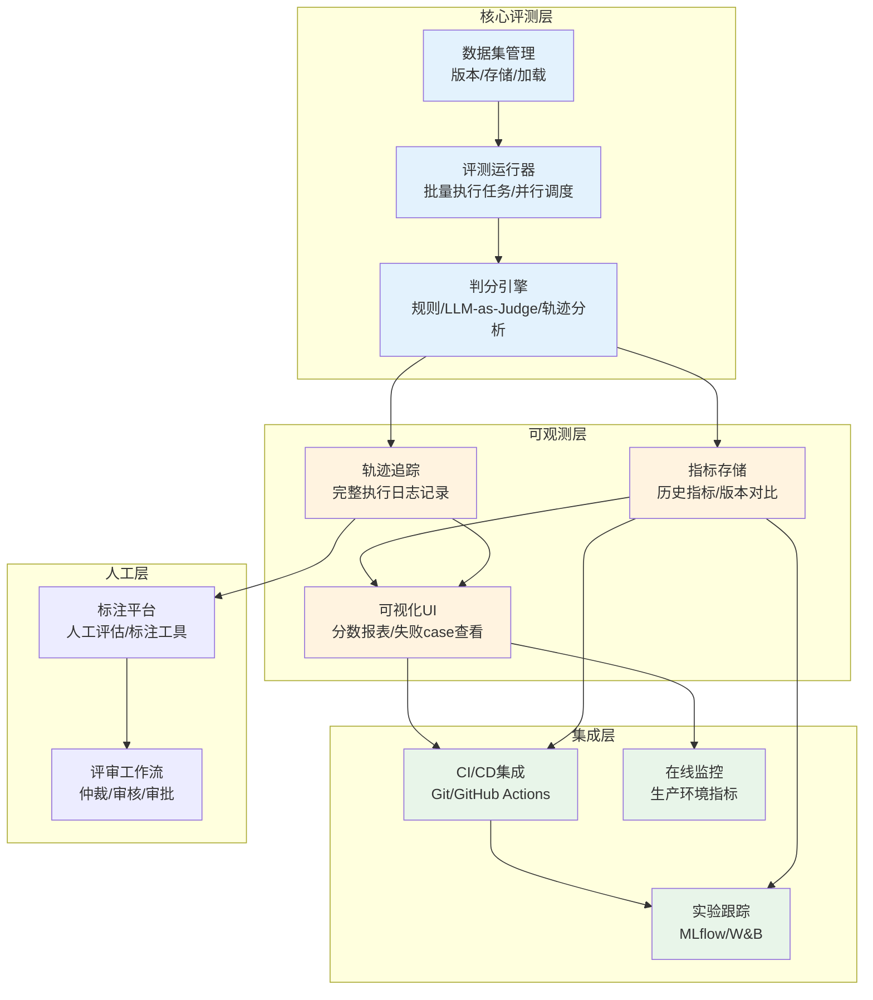
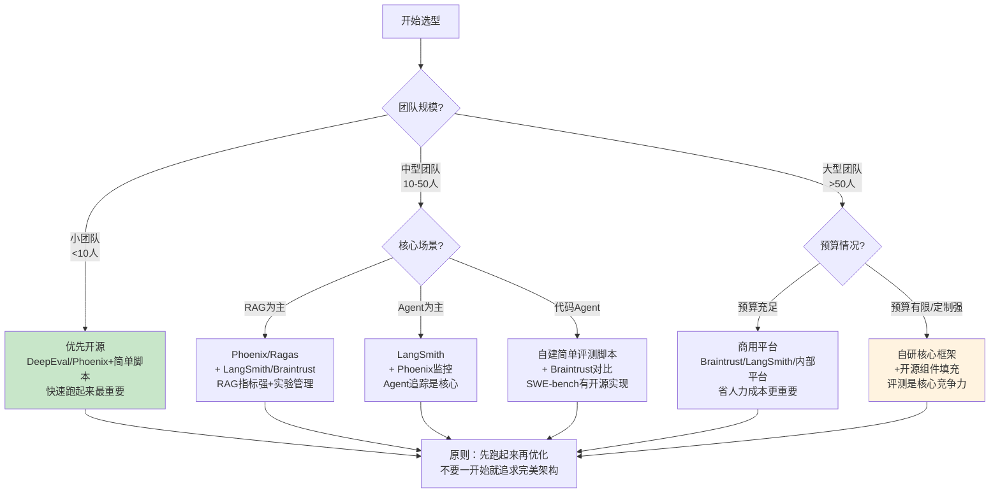
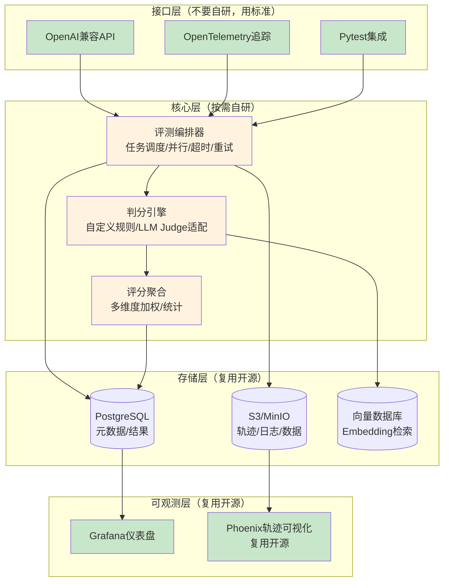
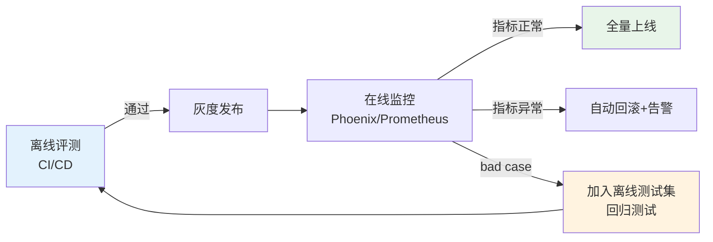

# 第8章：评测工具链选型

---

## 8.1 工具链选型概述

选择合适的评测工具链是评测体系落地的关键一步。工具选得好事半功倍，选得不好会导致团队排斥使用、评测流程无法落地、甚至前期投入打水漂。选型的核心原则不是"选功能最强的"，而是"选最适合你团队当前阶段的"。

### 8.1.1 评测工具链全景

一个完整的Agent评测工具链包含以下组件：



---

## 8.2 开源vs商用vs自研决策框架

选择工具前首先要做"建vs买"决策（Build vs. Buy），三种路线各有适用场景。

### 8.2.1 三种路线对比

| 路线 | 前期成本 | 维护成本 | 灵活性 | 上手速度 | 适用场景 |
|---|---|---|---|---|---|
| **纯开源组合** | 低（免费） | 高（需自己集成维护） | 最高（可以任意改） | 慢（需要自己搭积木） | 小团队、预算有限、技术能力强、定制化需求高 |
| **商用平台** | 高（年费/按用量付费） | 低（厂商维护） | 中（可配置但不能改核心） | 快（开箱即用） | 中大型团队、预算充足、追求快速落地、合规要求高 |
| **自研框架** | 最高（需要专门团队开发） | 最高（持续迭代） | 最高（100%贴合需求） | 最慢（从头开始） | 超大规模团队、评测是核心竞争力、有特殊需求无法满足 |

### 8.2.2 选型决策树



### 8.2.3 常见选型误区

- ❌ **误区1：一开始就自研**：还没搞清楚自己要什么就从零开始写，结果半年都没跑通评测。建议先用开源/商用摸清楚需求，再考虑自研。
- ❌ **误区2：选功能最多的**：功能多≠适合你。90%的功能你用不上，反而增加学习成本和复杂度。
- ❌ **误区3：只用一个工具解决所有问题**：评测是一整个工具链，不是单个工具。通常需要组合：一个做执行+判分，一个做追踪可视化，一个做数据管理。
- ❌ **误区4：不考虑和现有技术栈集成**：如果你已经用LangChain，选LangSmith天然集成；如果你用Pytest做测试，选DeepEval/Pytest集成最好。
- ✅ **正确思路**：最小可行起步→跑通流程→发现痛点→逐步替换/增强工具

---

## 8.3 开源工具详细对比

第4章已经介绍了6大主流框架，这里补充完整对比维度，方便选型：

| 工具 | 核心定位 | 开源协议 | Agent轨迹追踪 | RAG专用指标 | 自托管 | 与Pytest集成 | 学习曲线 | 社区活跃度（2026） |
|---|---|---|---|---|---|---|---|---|
| **DeepEval** | 开源评测框架 | MIT | ⭐⭐ | ⭐⭐⭐⭐⭐ | ✅ | ✅（原生） | 平缓 | 高 |
| **Phoenix** | 可观测性+RAG评测 | Elastic-2.0 | ⭐⭐⭐⭐ | ⭐⭐⭐⭐⭐ | ✅ | ⭐⭐ | 中等 | 高 |
| **LangSmith** | LangChain生态全栈 | SDK开源 | ⭐⭐⭐⭐⭐ | ⭐⭐⭐ | 企业版 | ⭐⭐⭐ | 中等 | 很高 |
| **Braintrust** | 开发者实验平台 | SDK开源 | ⭐⭐⭐ | ⭐⭐ | ❌（云服务） | ✅（原生） | 平缓 | 中高 |
| **OpenAI Evals** | 官方轻量框架 | MIT | ⭐ | ⭐ | ✅ | ⭐⭐ | 平缓 | 中 |
| **Ragas** | RAG专用评测 | Apache-2.0 | ⭐ | ⭐⭐⭐⭐⭐ | ✅ | ⭐⭐ | 平缓 | 高 |
| **TruLens** | 可观测性+评测 | MIT | ⭐⭐⭐ | ⭐⭐⭐⭐ | ✅ | ⭐⭐ | 中等 | 中高 |
| **MLflow** | 通用实验跟踪 | Apache-2.0 | ⭐⭐ | ⭐⭐ | ✅ | ⭐ | 平缓 | 很高 |

### 8.3.1 开源工具组合推荐

根据不同场景推荐最优组合：

**入门组合（最小可行）**：
- 核心：DeepEval（简单易用，和Pytest集成）
- 辅助：Python脚本+Pandas做简单报表
- 适合：小团队、刚开始做评测、快速验证价值

**RAG场景组合**：
- 核心：Phoenix（RAG指标强+可视化+Embedding分析）
- 辅助：Ragas（RAG四指标标准实现）
- 数据：DVC做数据版本管理
- 适合：RAG是核心场景、需要分析检索质量

**Agent场景组合**：
- 核心：LangSmith（Agent轨迹追踪是最好的）
- 辅助：Phoenix（补充生产监控）
- 实验：MLflow（如果已有MLflow栈）
- 适合：复杂多步Agent、需要详细轨迹调试

**纯代码/成本敏感组合**：
- 核心：OpenAI Evals + 自己写简单评测脚本
- 追踪：OpenTelemetry + 开源可视化（Grafana）
- 适合：技术能力强、定制化需求高、不想被厂商锁定

---

## 8.4 商用平台评估维度

如果考虑商用平台，按以下维度评估：

| 评估维度 | 关键问题 | 权重 |
|---|---|---|
| **功能完整性** | 是否支持你需要的所有评测类型（离线/在线/人工）？RAG/Agent指标全吗？ | 高 |
| **集成能力** | 和你现有的LangChain/LlamaIndex/Agent框架集成好吗？支持CI/CD集成吗？ | 高 |
| **数据安全** | 数据能留在自己VPC吗？支持自托管吗？符合SOC2/HIPAA/GDPR吗？ | 最高（企业场景） |
| **成本** | 怎么计费？按Token、按席位、按运行次数？预估每月成本多少？ | 高 |
| **可扩展性** | 能自定义评测指标吗？能加自定义插件吗？API完善吗？ | 中高 |
| **用户体验** | UI好不好用？失败case查看方便吗？对比可视化做得好吗？ | 中 |
| **厂商锁定风险** | 数据能导出吗？评测逻辑是平台特定还是开放标准？ | 中 |
| **技术支持** | 出问题响应快吗？有专属技术支持吗？文档全吗？ | 中（企业级） |

### 8.4.1 主要商用平台特点

- **LangSmith**：LangChain用户首选，Agent追踪能力最强，生态最好，性价比高
- **Braintrust**：开发者体验最好，实验对比和版本管理做得棒，适合快速迭代的工程团队
- **Future AGI (Arthur)**：企业级合规性最好，安全和偏见检测能力强，适合大型企业、金融/医疗等监管严的行业
- **Weights & Biases (W&B)**：如果你已经用W&B做ML实验跟踪，可以直接用它的LLM评测功能，不用额外引入新工具
- **其他垂直领域工具**：如HumanLoop（人工评估工作流）、Labelbox（数据标注）等，按需补充

---

## 8.5 自研评测框架设计要点

如果最终决定自研（通常是中大型团队有特殊需求时），不要从头写所有东西——复用开源组件，只自研核心差异化部分。

### 8.5.1 自研框架分层架构



### 8.5.2 自研核心模块要点

**评测编排器（最值得自研）**：
- 支持并行执行（多线程/多进程/分布式）
- 支持超时控制（避免单个任务卡死整个评测）
- 支持重试机制（API错误自动重试）
- 支持环境隔离（Docker/子进程，避免污染）
- 支持断点续跑（跑到一半断了不用从头来）

**判分引擎**：
- 插件化设计——新的指标/判分方法可以方便添加
- 统一的Judge接口——不管是规则、LLM Judge还是人工，都用同一接口
- 支持判分逻辑版本化——判分prompt/规则改了，知道是哪个版本判的分

**评分聚合**：
- 支持多种聚合方法（加权平均、几何平均、最小值门禁）
- 支持按维度/场景/难度拆分统计
- 自动生成统计显著性检验（A/B对比时用）
- 异常值检测（自动识别分数异常的样本）

### 8.5.3 不建议自研的部分

- 不要自己写轨迹可视化UI——直接用Phoenix/Grafana，省你半年工作量
- 不要自己写标注界面——如果需要人工标注，用Labelbox/HumanLoop等现成工具，或者简单点用Excel/Google Sheets也比自研强
- 不要自己写所有Judge——Ragas/DeepEval里已经有成熟实现的RAG/质量指标，直接复用
- 不要自己写实验管理——直接用MLflow，成熟稳定

---

## 8.6 分阶段技术栈推荐

根据团队评测体系成熟度，分阶段引入工具，不要一步到位：

### 阶段1：入门期（评测从0到1）

**目标**：先把评测跑起来，能验证Prompt/代码变更有没有造成退化

**技术栈**：
- 评测执行：Python脚本 + Pytest
- 判分：简单规则 + OpenAI API做LLM-as-Judge
- 数据：JSON/CSV文件，Git管理
- 结果：Pandas + 简单Excel/Markdown报告
- 追踪：简单的JSON日志

**不要做**：不要搞微服务、不要搞复杂架构、不要上K8s、不要自己写UI。这个阶段的目标是验证价值，不是搭完美架构。

**关键成功指标**：每次改Prompt/代码，10分钟内能知道效果变好还是变差了。

### 阶段2：成长期（评测流程化）

**目标**：评测集成到CI/CD，团队日常使用，能看到历史趋势

**技术栈**：
- 评测框架：DeepEval 或 OpenAI Evals
- 追踪可视化：Phoenix 或 LangSmith（如果用LangChain）
- 数据版本：DVC
- 实验跟踪：MLflow（如果团队已经在用）
- CI集成：GitHub Actions/GitLab CI
- 报告：自动生成HTML/Markdown报告

**关键改进**：
- 评测自动化，不用人手动跑
- 能看到每个版本的指标变化趋势
- 失败case可以方便查看和分享

**关键成功指标**：代码/Prompt MR自动触发评测，不达标不能合并；团队所有人都能方便看到评测结果。

### 阶段3：成熟期（持续评测体系）

**目标**：生产级持续评测，在线监控，人机协作，数据驱动迭代

**技术栈**：
- 核心平台：LangSmith 或 Braintrust 或 自研核心
- 监控：Phoenix + Prometheus + Grafana
- 人工评估：集成标注平台/自建简单评审工作流
- 数据治理：DVC + 完整数据卡/版本管理
- 流水线：完整五门CI/CD门禁（见第9章）
- 影子模式：生产流量影子评测
- A/B测试：实验平台集成

**关键成功指标**：
- 坏变更在Gate2就被拦住，流不到线上
- 线上质量问题能小时级发现和定位
- 评测数据持续反哺优化，形成正向循环

---

## 8.7 工具链集成方案

单个工具再强也没用，关键是要和现有工程体系集成：

### 8.7.1 与CI/CD集成

评测是CI/CD流水线的一部分，不是独立系统：

```yaml
# GitHub Actions示例（概念性）
name: Agent Evaluation
on: [pull_request]

jobs:
  evaluate:
    runs-on: ubuntu-latest
    steps:
      - uses: actions/checkout@v4
      - name: Run quick smoke tests  # Gate1: 快速冒烟
        run: pytest tests/smoke/ -v
      - name: Run full evaluation  # Gate2: 全量离线评测
        run: deepeval run test_suite.py
      - name: Check metric thresholds  # 门禁检查：核心指标不能退化
        run: |
          python check_metrics.py \
            --task-completion-rt -2% \
            --cost-rt +10%
      - name: Upload results
        uses: actions/upload-artifact@v4
        with:
          name: eval-report
          path: reports/
```

**CI集成最佳实践**：
- PR触发快速评测（10-30分钟，核心用例）
- 合并到main分支后触发全量评测
- 核心指标退化超过阈值自动block PR
- 评测结果作为PR评论自动发布，所有人都能看到

### 8.7.2 与实验跟踪集成

评测不是孤立的，要和实验跟踪结合：
- 每次评测记录：代码版本（git commit hash）、模型版本、Prompt版本、评测数据集版本、评测框架版本
- MLflow/W&B可以统一记录参数、指标、 artifacts
- 保证任何一次评测结果可复现——给你一个commit id，能重新跑出一模一样的结果

### 8.7.3 与模型监控集成

离线评测+在线监控形成闭环：
- 离线评测验证版本质量
- 上线后用Phoenix/Prometheus监控生产环境指标
- 线上发现的bad case自动加入测试集回归
- 线上指标下降自动告警，触发离线评测定位原因



---

## 章节导航

| 上一章 | 当前章节 | 下一章 |
|---|---|---|
| [← 第7章：行业实践案例](07-industry-practices.md) | **第8章：评测工具链选型** | [第9章：持续评测体系 →](09-continuous-evaluation.md) |

---

> **本章小结**：评测工具链选型不要追求一步到位，也不要一开始就自研，分阶段演进是最优路径：入门期用Pytest+简单脚本快速跑起来，验证价值；成长期引入DeepEval/Phoenix/LangSmith等框架，集成CI/CD实现流程化；成熟期搭建完整的持续评测体系，结合在线监控形成闭环。开源vs商用vs自研没有绝对答案——小团队优先开源，中大型团队可以考虑商用平台节省人力，只有当评测是核心竞争力且现有工具无法满足时才需要自研。核心原则是"复用一切能复用的"——可视化、标注、UI等非核心部分直接用现成工具，只在编排、判分等核心差异化部分投入精力。工具最终要融入CI/CD和工程体系，评测不是额外工作，而是开发流程的一部分。下一章我们将学习持续评测体系——如何把评测嵌入每天的开发工作流，实现评测驱动开发。
