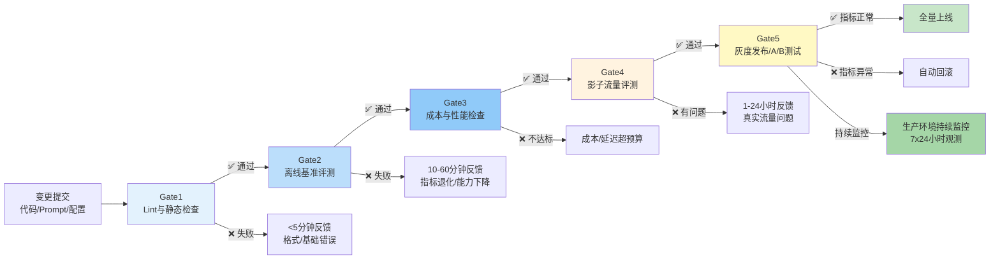
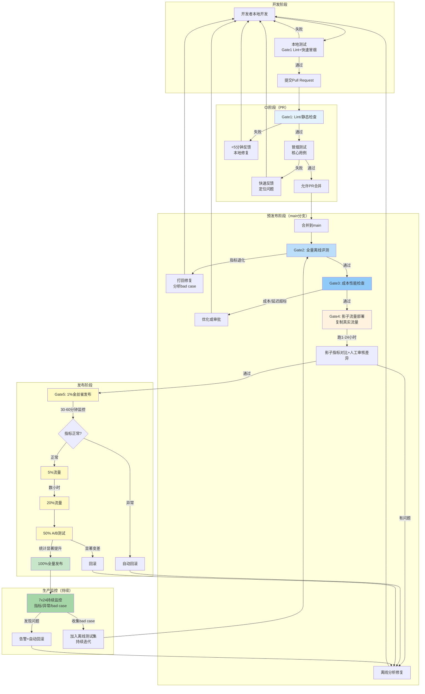
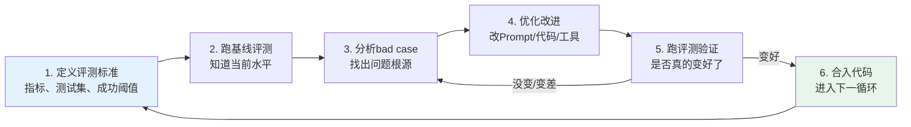
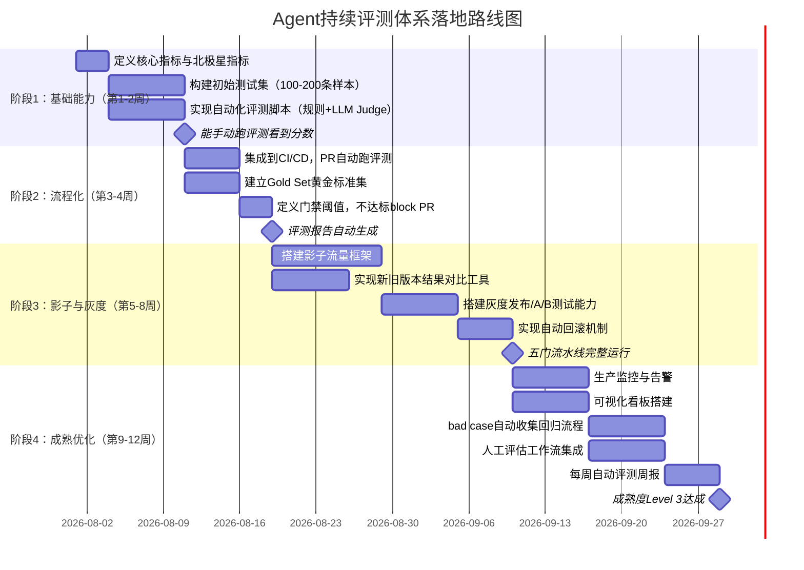

# 第9章：持续评测体系

> **方法论视角**：如需从"评测体系如何分阶段落地"（八阶段流程）的方法论视角理解本主题，可参阅 [方法论Wiki · 模块4 八阶段实施步骤](../agent-eval-methodology-wiki/04-implementation/04-implementation-overview.md)。

---

## 9.1 持续评测概述

**持续评测**（Continuous Evaluation，通俗解释：不是"版本发布前考一次试"，而是"每天小测验、每月大考、全程监控"，把评测嵌入开发流程的每一步）是Agent工程化成熟度的核心标志。传统软件的CI/CD（持续集成/持续交付）不够用了——Agent的非确定性意味着传统"测试通过=没问题"的假设不再成立，我们需要Agent-Native的质量保障体系。

### 9.1.1 为什么传统CI/CD不够？

传统软件CI/CD的核心假设是"**同样的输入一定产生同样的输出**"，只要单元测试/集成测试通过，代码就不会出大问题。但Agent系统打破了这个假设：

1. **非确定性**：即使代码/Prompt完全不变，LLM的温度参数、API波动、版本更新都可能导致输出变化
2. **数据依赖**：知识库更新、工具API变化、甚至搜索引擎结果变化，都会影响Agent表现
3. **模型漂移**：即使你不做任何变更，底层LLM供应商更新模型也可能导致你的Agent突然变差
4. **分布外泛化**：用户总会问出你没测试过的新问题，离线测试永远覆盖不了所有场景
5. **过程复杂性**：Agent是多步决策过程，即使最终结果对了，中间也可能隐藏着错误路径

> **核心洞察**：传统软件是"不改动就不会坏"，Agent系统是"你什么都不改，它也可能突然坏了"。因此，评测不是"发布前做一次"的活动，而是7x24小时持续进行的过程。

---

## 9.2 Agent-Native CI/CD：五门质量门禁

AWS Motorway等生产实践证明，五门质量门禁（Five Quality Gates）是Agent从开发到上线的成熟工程范式。每道门都是一个质量关卡，坏变更在第一道门就被拦住，不浪费下游资源。



---

## 9.3 五门门禁详解

### 9.3.1 Gate1：Lint与静态检查（秒级反馈）

**目标**：拦住低级错误，不浪费下游评测资源

**检查内容**：
- Prompt格式检查（变量是否正确、标签是否闭合、结构是否完整）
- 工具/函数调用Schema校验（参数定义是否合法、JSON Schema是否有效）
- 代码静态检查（语法错误、类型错误、import错误）
- 配置文件校验（环境变量、依赖版本是否正确）
- 安全检查（Prompt中是否有硬编码的API Key、敏感信息）

**特点**：
- 反馈速度：秒级（<10秒）
- 覆盖率：能拦住20-30%的低级错误
- 成本：几乎为零
- 执行时机：每次本地保存/PR提交时

**不要做**：不要在Gate1跑模型调用/评测，太慢——Gate1的核心是"快"，立刻给反馈。

### 9.3.2 Gate2：离线基准评测（分钟级反馈）

**目标**：验证变更没有造成核心能力退化

**评测内容**：
- 在标准测试集（几百到几千个样本）上跑全量评测
- 对比基线版本（当前生产版本）的核心指标
- 指标门禁：
  - 核心指标（任务完成率、事实正确率）下降不超过2%
  - 安全指标（幻觉率、有害内容率）不能上升
  - 没有新增的Top10失败类型

**特点**：
- 反馈速度：10-60分钟（取决于测试集规模，可以并行加速）
- 覆盖率：能拦住80%左右的能力退化问题
- 成本：低（主要是API调用成本）
- 执行时机：PR提交后自动触发，必须通过才能合并

**关键实践**：
- 测试集分层：10%核心冒烟用例（<5分钟跑完）+ 90%完整用例（PR合并后跑）
- 冒烟用例不达标直接block PR，完整用例在合并后跑全量
- 不仅看平均分，还要看是否有"雪崩式退化"——某个场景从90%降到30%这种严重问题

### 9.3.3 Gate3：成本与性能检查（分钟级反馈）

**目标**：防止"效果提升一点点，成本涨了三倍"

**检查内容**：
- 平均Token消耗变化（与基线比上涨不超过10%）
- 首Token延迟（TTFT）变化
- 平均任务完成时间变化
- 平均工具调用次数变化
- 成本效率（每任务成本）变化

**门禁逻辑**：
- 如果成本上涨<5%且核心指标提升>5%，允许通过
- 如果成本上涨5-15%，需要人工审批，说明理由
- 如果成本上涨>15%，除非核心指标提升>20%，否则直接打回
- 延迟超过SLA阈值（如首Token>3秒）直接打回

**特点**：
- 反馈速度：几分钟（Gate2跑完数据就有了，几乎是附带的）
- 执行时机：和Gate2一起，不需要单独跑

### 9.3.4 Gate4：影子流量评测（小时级反馈）

**目标**：在真实流量下验证，发现离线评测发现不了的问题——这是最重要的一道门

**什么是影子模式（Shadow Mode）**：新版本不接收真实用户请求，而是复制一份生产环境的真实流量，同时发给新版本和旧版本，新版本的结果不返回给用户，只做日志记录和对比。

**评测内容**：
- 在真实生产流量（通常是1-10%流量）上跑新版本
- 对比新旧版本在真实流量下的指标差异：
  - 任务完成率差异
  - 工具调用失败率差异
  - 平均响应长度/结构差异（异常检测）
  - 错误率/异常率差异
  - 与旧版本结果一致性（新旧结果应该大部分一致，差异大的地方人工审核）
- 跑1-24小时，覆盖不同时段流量

**特点**：
- 反馈速度：1-24小时（需要积累足够样本）
- 覆盖率：能拦住离线发现不了的15%左右问题（90%的线上问题能在这一步发现）
- 成本：中高（需要跑双份流量）
- 执行时机：合并到main分支后，部署到影子环境

**为什么影子模式如此重要**：离线测试集无论怎么设计都和真实流量有gap——用户的提问方式千奇百怪，真实世界的输入永远比你想象的更"野"。离线评测通过但影子模式翻车是常态，不是例外。

### 9.3.5 Gate5：灰度发布与A/B测试（天级反馈）

**目标**：在真实用户身上验证，拦住最后的问题，监控业务指标

**灰度策略**：
1. **1%金丝雀发布**：先放给1%的用户，观察30-60分钟
   - 核心系统指标监控（错误率、延迟、成本）
   - 没有异常再扩大
2. **5%/20%小流量**：逐步扩大，观察数小时
   - 开始计算用户层面指标（CSAT、任务完成率）
   - 收集用户反馈
3. **50%对比**：一半用户用新版，一半用旧版，做严格A/B测试
   - 计算统计显著性（不是差一点点就算赢）
   - 业务指标验证（用户留存、转化率、人工干预率）
4. **100%全量**：确认所有指标正常后全量发布
5. **发布后监控**：全量后继续监控24-48小时，异常自动回滚

**关键要点**：
- **自动回滚**：配置告警规则，核心指标（如错误率上升>5%、用户投诉率翻倍）自动触发回滚，不需要人工介入
- **分桶正交**：确保用户分桶是随机正交的，不要出现"新版正好分给了活跃用户"这种偏差
- **统计显著性**：A/B测试不要看了100个样本就下结论，样本量要足够，确保差异不是随机波动

---

## 9.4 五门流水线Mermaid流程图

五门门禁的完整流程图，包含反馈回路和监控闭环：



---

## 9.5 回归检测与告警机制

**回归（Regression）**（通俗解释：以前能做对的题，现在突然做错了——"能力退步"）是Agent开发中最常见的问题，持续评测的核心目标之一就是快速发现回归。

### 9.5.1 回归检测方法

1. **指标阈值告警**：核心指标比基线下降超过阈值（如2%）自动告警
2. **历史趋势检测**：不是只和上一个版本比，而是和过去N个版本比，发现持续下降趋势
3. **样本级回归检测**：具体看哪些以前做对的样本现在做错了（regressed samples），哪些以前做错的现在做对了（fixed samples）
   - 新增错误样本要重点分析——是改坏了什么？
   - 修复样本也要检查——是真的修好了，还是只是碰巧对了？
4. **异常模式检测**：
   - 输出长度突然变长/变短
   - 工具调用次数突然变多/变少
   - 某类错误突然激增
   - 响应延迟分布异常
5. **黄金集监控**：每次评测都先跑Gold Set，如果Gold Set分数下降，直接告警——Gold Set是"锚点"，锚点都错了说明基础能力出问题了

### 9.5.2 告警分级

| 告警级别 | 触发条件 | 响应时间 | 处理方式 |
|---|---|---|---|
| **P0 紧急** | 核心指标下降>10%，错误率翻倍，安全问题 | 立即响应（15分钟内） | 暂停发布，准备回滚，紧急排查 |
| **P1 高** | 核心指标下降2-10%，成本上涨>20%，延迟SLA超标 | 1小时内响应 | 停止灰度，分析原因，决定回滚还是修复 |
| **P2 中** | 次要指标下降，非核心场景退化，成本上涨5-20% | 工作日4小时内 | 记录问题，下个版本修复 |
| **P3 低** | 个别样本退化，体验类小问题 | 下个迭代处理 | 加入backlog，排期优化 |

---

## 9.6 版本对比分析方法

### 9.6.1 A/B测试统计显著性

A/B测试不能只看"新版本分数高2%"就说新版本更好——可能只是随机波动。必须做统计显著性检验：

- **核心概念**：p值（p-value）< 0.05 才认为差异是统计显著的（即只有<5%概率是随机碰巧的）
- **样本量估算**：检测2%的指标提升，95%置信度需要约385个样本；检测1%的提升需要约1500个样本
- **不要提前看结果**：不要A/B跑了一半看数据不错就提前下结论——"偷窥"数据会导致假阳性
- **同时看多个指标**：不要只看一个指标——一个指标涨了另一个跌了可能不是真的变好

### 9.6.2 版本对比报告模板

对比两个版本时，按以下结构分析：

```markdown
# 版本对比报告：v1.2 vs v1.1

## 核心指标对比
| 指标 | v1.1（基线） | v1.2（新版本） | 变化 | 统计显著性 |
|---|---|---|---|---|
| 任务完成率 | 70.2% | 75.1% | +4.9% | ✅ p<0.01（显著提升） |
| 幻觉率 | 4.8% | 3.2% | -1.6% | ✅ p<0.05（显著下降） |
| 平均成本/任务 | $0.102 | $0.115 | +12.7% | ⚠️ 成本上涨，需评估 |
| 平均延迟 | 2.1s | 2.3s | +0.2s | ➖ 不显著 |

## 改进点（v1.2更好的地方）
1. 订单查询类场景成功率从65%→82%（+17%）
   - 原因：优化了订单查询工具的Prompt
2. 幻觉率下降，尤其是产品信息类问题
   - 原因：增加了引用检查步骤

## 退化点（v1.2更差的地方）
1. 退换货场景成功率从75%→68%（-7%）⚠️
   - 原因：新的工具选择逻辑在退换货场景有bug，已定位
2. 平均成本上涨12.7%
   - 原因：增加了一次额外的检索步骤，需要优化是否必要

## 结论与建议
- v1.2核心指标有显著提升，但退换货场景有退化、成本上涨
- 建议：修复退换货bug、优化检索步骤后重新评测，再考虑发布
```

---

## 9.7 趋势分析与质量可视化

单次评测只能看到一个点，持续评测要看趋势线——"我们是在变好还是变坏？"

### 9.7.1 核心可视化看板

一个成熟的评测体系需要以下可视化看板：

1. **核心指标趋势图**（最重要）
   - 时间轴：X轴是日期/版本，Y轴是核心指标（任务完成率、成本、延迟）
   - 同时画基线（生产版本）和新版本的曲线
   - 标注关键变更点（如：哪天换了模型、哪天改了Prompt）

2. **分场景能力雷达图**
   - 不同任务类型的得分对比
   - 新版本vs旧版本的雷达图叠加，直观看到哪里涨了哪里跌了

3. **错误类型分布图**
   - 饼图/柱状图展示Top错误类型
   - 时间序列展示各错误类型的趋势变化

4. **成本效率散点图**
   - X轴：任务成功率，Y轴：平均成本
   - 每个版本是一个点——好的版本是"向右上方移动"（效果提升、成本下降）

5. **评测覆盖率仪表盘**
   - 测试集覆盖了多少场景
   - 生产流量中top N场景有多少被测试集覆盖了
   - 提示覆盖率盲区

### 9.7.2 定期复盘节奏

- **周报**：每周自动生成评测周报，总结本周指标变化、top问题、改进建议
- **月报**：每月做深度评测复盘，分析能力演进趋势、系统性问题、下个迭代优化方向
- **季度回顾**：每季度做一次全面的评测体系审计，更新测试集、调整指标、优化门禁阈值

---

## 9.8 评测驱动开发（Evaluation-Driven Development, EDD）

**评测驱动开发**（通俗解释：类似测试驱动开发TDD，但不是"写测试"，而是"先写评测"——先定义好怎么算好，再去优化）是Agent开发的核心方法论。

### 9.8.1 EDD开发循环



### 9.8.2 EDD核心原则

1. **先写评测，再优化**：不要上来就改Prompt，先明确"什么样算好"、"怎么测量"
2. **每次只改一个变量**：改Prompt就只改Prompt，不要同时改模型、改工具、改逻辑——你不知道是哪个改好的
3. **用评测数据说话，不要凭感觉**："我感觉这个Prompt更好"不算数，评测分数涨了才算数
4. **bad case驱动**：每次优化聚焦一类bad case，解决了再处理下一类——不要试图一次解决所有问题
5. **保留所有实验记录**：什么时间、改了什么、结果怎么样，都记录下来，避免重复踩坑

> **反模式**：盲目调参——改半天Prompt，跑一下感觉"好像好了"就合入，没有量化指标，过了两周发现其实变差了。这是Agent开发最常见的低效来源。

---

## 9.9 分阶段落地路线图甘特图

对于还没有建立持续评测体系的团队，建议按以下路线图分阶段落地，不要一步到位：



---

## 9.10 中小团队快速上手方案（最小可行评测体系）

如果你是小团队，资源有限，不用追求完美架构。用**两周时间**搭建一个最小可行评测体系（Minimum Viable Evaluation, MVE），立刻开始获得价值：

### 第一周：跑通离线评测
- Day1-2：确定3个核心指标（建议：任务完成率、工具调用成功率、幻觉率）
- Day3-4：从真实用户请求中采样100条，人工标注参考答案（双标+简单仲裁）
- Day5：写一个100行以内的Python脚本，能批量跑Agent + 用GPT-4做LLM-as-Judge评分
- 目标：手动跑一次脚本，能看到分数和失败case

### 第二周：集成CI，开始持续
- Day1-2：把脚本集成到Pytest，能 `pytest eval/` 一键跑
- Day3：加到GitHub Actions/GitLab CI，PR提交自动跑
- Day4：写个简单门禁脚本——核心指标比main分支低2%就exit 1 block PR
- Day5：建一个简单的Markdown报告模板，PR上自动评论评测结果
- 目标：每个PR都能自动看到有没有改坏东西

### 完成后你能获得什么？
- 每次改Prompt/代码，10分钟内知道效果变好还是变差了
- 不会再出现"改了A以为修好了结果B坏了"的回归问题
- bad case有积累，持续优化有方向
- **总投入：2人周，几乎零成本**

> **关键洞察**：最小可行评测体系2周就能跑起来，获得80%的价值。不要等到"完美方案"设计好才开始——完美是好的敌人，先有再好。一个能跑起来的简单评测体系，远好于一个永远在设计中的完美体系。

---

## 9.11 评测成熟度自评矩阵

用以下矩阵评估你的团队评测体系成熟度，明确下一步改进方向：

| 维度 | Level 1：初始级 | Level 2：可重复 | Level 3：已定义 | Level 4：已管理 | Level 5：优化中 |
|---|---|---|---|---|---|
| **评测执行** | 发布前人工偶尔测，没有标准流程 | 有手动评测流程，但不是每次发布都跑 | 每次PR/发布都自动跑评测，有标准流程 | 评测覆盖率>90%，自动化率>90% | 全链路自动化，自适应测试生成 |
| **指标体系** | 凭感觉判断好坏，没有量化指标 | 有一些基础指标，但不成体系 | 有分层指标体系，明确北极星指标 | 指标对齐业务价值，能预测业务表现 | 指标自动优化，动态调整权重 |
| **测试数据** | 临时凑几个case测试 | 有固定测试集，但没有版本管理/质量保障 | 测试集有版本管理、Gold Set、质量审计 | 数据持续从生产迭代更新，定期去污染 | 自动发现覆盖盲区，自动生成补充用例 |
| **CI/CD集成** | 评测和开发流程完全分离 | 偶尔手动跑，不集成CI | 评测集成CI，核心门禁自动化 | 五门完整流水线，影子+灰度+自动回滚 | 评测驱动开发，优化建议自动生成 |
| **生产监控** | 上线后不管了，用户投诉才知道问题 | 出问题了手动查日志 | 有基础监控，核心指标告警 | 7x24监控，异常自动检测告警回滚 | 预测性告警，问题发生前提前预警 |
| **数据驱动** | 拍脑袋决策，凭直觉优化 | 偶尔看评测数据，但不系统 | 所有优化都有评测数据支撑 | A/B测试成为标准流程，统计显著性验证 | 评测数据自动驱动优化闭环 |

**成熟度进阶建议**：
- 大部分团队从Level 1开始
- 用2周时间做到Level 2（最小可行评测）
- 用1-2个月做到Level 3
- Level 4需要持续投入3-6个月
- Level 5是行业顶尖水平，很少有团队能达到，但这是方向

---

## 9.12 元最佳实践：AI辅助构建评测体系时的上下文隔离

当你使用AI助手（如本教程的创建过程）构建评测体系或其他复杂项目时，需要特别注意**上下文隔离**问题——这是长会话AI工作流特有的"非确定性"风险。

### 问题背景

在长对话中串行处理多个相似任务（如连续创建多个Wiki教程、多个Spec）时，由于上下文压缩和会话恢复机制，可能发生**文件内容污染**：某个文件（通常是规划文档spec.md）被意外写入了其他任务的内容。

真实案例：本教程创建过程中，就出现过spec.md被另一个EchoBird wiki任务的PRD内容覆盖，但实际的12个wiki章节文件完全正确的情况。

### 为什么子代理委托更鲁棒？

| 工作方式 | 上下文机制 | 污染风险 | 说明 |
|---------|-----------|---------|------|
| **主对话直接写入** | 依赖隐式上下文缓冲区 | 中高 | 多任务切换+上下文压缩可能导致"内容-路径"关联错位 |
| **子代理委托执行** | 通过query参数显式传递任务描述 | 极低 | 任务边界清晰，参数是结构化、显式传递的，不受主对话上下文压缩影响 |

### 三条铁律保护你的交付物

1. **子代理优先原则**：核心产出物（wiki章节、代码）尽量委托子代理执行，利用显式参数传递的鲁棒性
2. **产出物优先验证**：永远先验证最终交付物（12个wiki文件）是否正确，再验证规划/过程文档（spec.md）——交付物是目的，规划文档是手段
3. **收尾前加一道Sanity Check**：任务完成、提交之前，花30秒运行自动化检查验证spec三件套一致性

### Spec Sanity Check 自动化工具

本项目提供了专门的检查脚本，在任务收尾时一键检测规划文档污染：

```bash
# 检查所有spec目录
python .agents/scripts/spec-sanity-check.py

# 检查指定spec目录
python .agents/scripts/spec-sanity-check.py --spec-dir d:\AI\.trae\specs\core-foundation\agent-evaluation-methodology-wiki --path d:\AI
```

检查项包括：
- ✅ spec.md/tasks.md/checklist三件套文件齐全
- ✅ 三个文件的H1标题主题一致性（核心检测项）
- ✅ 目录名与文档标题主题匹配度
- ✅ YAML frontmatter title与H1一致性

如果检测到"三件套主题一致性"错误，通常意味着spec.md内容被污染了——重建成本极低（5-10分钟），直接基于正确的产出物和tasks/checklist重建spec即可，不需要花费时间追溯"为什么会污染"。

> **关键洞察**：上下文污染是长上下文AI工作流的已知特性，不是bug。它的影响范围通常只限于单个规划元数据文件，核心交付物因为通过子代理显式执行而安全。建立"产出物优先+自动化sanity check"的工作习惯，就能以极低的成本防御这个问题。这本身也是一种"评测"——对AI辅助工作流本身的质量门禁。

---

## 章节导航

| 上一章 | 当前章节 | 下一章 |
|---|---|---|
| [← 第8章：评测工具链选型](08-toolchain-selection.md) | **第9章：持续评测体系** | [第10章：参考资源 →](10-resources.md) |

---

> **本章小结**：持续评测是Agent工程化的终极形态。传统CI/CD不适用于Agent的非确定性，需要Agent-Native的五门质量门禁：Gate1 Lint（秒级）→Gate2离线评测（分钟级）→Gate3成本检查（分钟级）→Gate4影子流量（小时级，最重要的一道门）→Gate5灰度A/B测试（天级），层层设防拦住坏变更。五门流水线加上回归告警、A/B测试统计显著性、可视化趋势看板，形成完整的质量保障体系。评测驱动开发（EDD）是核心开发方法论——先定义评测标准，再优化，用数据说话。中小团队不用一步到位，两周时间搭建最小可行评测体系就能获得80%的价值。用成熟度矩阵自评，从Level1逐步进阶到Level4/5。持续评测不是一个项目，而是一个持续迭代的旅程——开始行动，比完美设计更重要。
