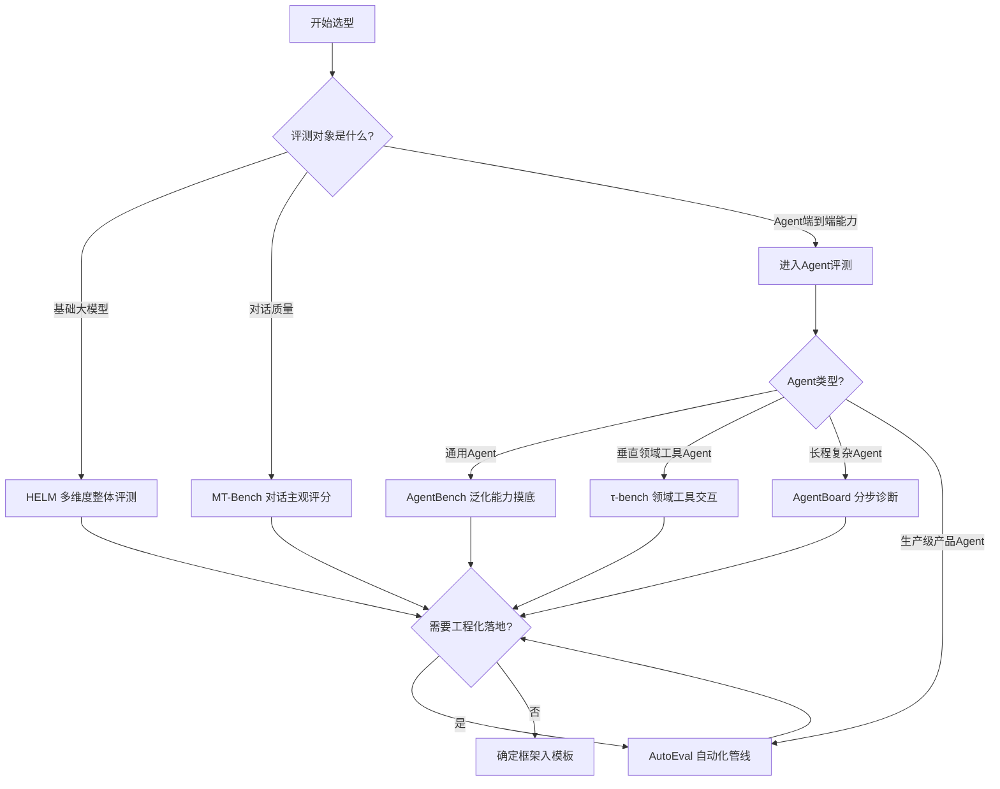

# 模块2：核心评测框架对比

## 2.1 为什么需要对比框架

评测框架（Evaluation Framework）是承载评测体系的基础设施——它决定了"测什么能力、用什么环境、怎么判定结果"。选错框架，评测体系会"地基倾斜"：要么测不到真实能力，要么无法复现，要么成本失控。

本模块系统对比当前业界最主流的六大评测框架，帮助读者在"用什么评测"上做出有依据的选择。

## 2.2 六大框架概览

| 框架 | 提出方 | 年份 | 核心定位 | 代表作 |
|---|---|---|---|---|
| **HELM** | 斯坦福 CRFM | 2022 | 大模型的**多维度整体评测** | 《Holistic Evaluation of Language Models》(F-001) |
| **MT-Bench** | UC Berkeley LMSYS | 2023 | **多轮对话**的主观质量评测 | 《Judging LLM-as-a-Judge with MT-Bench》(F-003) |
| **AgentBench** | 清华大学 | 2023 | LLM **作为Agent** 的端到端能力 | 《AgentBench: Evaluating LLMs as Agents》(F-005) |
| **AutoEval** | OpenAI | 2024 | **自动化评测管线**工程实践 | 《How we evaluate our agents》(F-007) |
| **τ-bench** | Sierra | 2024 | **工具-智能体-用户** 交互 | 《τ-bench: A Benchmark for Tool-Agent-User Interaction》(F-008) |
| **AgentBoard** | 中科院计算所等 | 2024 | **长程多步** Agent 的分析性评测 | 《AgentBoard: An Analytical Evaluation Board》(F-010) |

## 2.3 八大维度深度对比

对比维度选取原则：覆盖评测的**目标（测什么）、载体（用什么环境测）、判定（怎么算对）、产出（能拿到什么）**四条主线，共8个维度。

| 维度 | HELM | MT-Bench | AgentBench | AutoEval | τ-bench | AgentBoard |
|---|---|---|---|---|---|---|
| **评测对象** | 通用大模型 | 对话模型 | LLM作为Agent | 产品级Agent | 工具型Agent | 长程多步Agent |
| **能力维度** | 准确/校准/鲁棒/公平/毒性/效率 | 多轮对话质量 | 端到端任务 | 任务完成+质量 | 工具调用+策略 | 分步进度+错误归类 |
| **交互环境** | 静态任务集 | 静态对话集 | 8个真实交互环境（F-006） | 真实/模拟工作流 | 客服/零售模拟（F-009） | 长程任务环境 |
| **判定方式** | 规则+指标 | GPT-4裁判打分（F-004） | 规则判定 | LLM-as-Judge+人工抽检（F-030） | 规则+工具结果 | 规则+过程分析 |
| **可复现性** | 高（静态） | 中（受裁判影响） | 中（环境非确定） | 中（工程化） | 高（领域限定） | 中（长程波动） |
| **成本量级** | 低 | 中 | 中高 | 高 | 中 | 高 |
| **自动化程度** | 高 | 高 | 中 | 高 | 高 | 高 |
| **适用阶段** | 模型选型 | 对话优化 | 泛化能力摸底 | 生产级Agent回归 | 领域Agent验证 | 复杂Agent诊断 |

## 2.4 各框架要点解析

### 2.4.1 HELM：多维度整体评测的标杆

HELM 提出"多维度整体评测"理念，一次性覆盖准确率、校准度、鲁棒性、公平性、有偏行为、毒性、效率（推理延迟与成本）等维度（F-002）。它纠正了"单一benchmark分数就能代表模型水平"的误区，是**模型选型**阶段的黄金标准。

### 2.4.2 MT-Bench：对话质量的主观评测

MT-Bench 使用 GPT-4 作为裁判，对模型多轮对话回答进行 1-10 分的主观评分（F-004）。它的价值在于衡量**对话质量**这一难以用规则量化的维度，但也引入了 LLM-as-Judge 的裁判偏差风险（F-040）。

### 2.4.3 AgentBench：LLM 作为 Agent 的能力试金石

AgentBench 将 LLM 置于 8 个真实交互环境中（操作系统、数据库、知识图谱、数字卡牌等），衡量其**作为 Agent 的端到端能力**（F-006）。它是从"模型评测"走向"Agent评测"的标志性框架。

### 2.4.4 AutoEval：自动化评测管线的工程示范

AutoEval 是 OpenAI 公开的 Agent 自动化评测实践，将 LLM-as-Judge 与人工抽检结合，形成可落地、可复现的评测管线（F-007/F-030）。它为"评测如何工程化"提供了官方参考范式。

### 2.4.5 τ-bench：真实业务域的工具交互

τ-bench 模拟真实用户与客服/零售 Agent 交互，评测工具调用与策略学习能力（F-009）。它对**垂直业务域**的 Agent 评测有重要参考价值。

### 2.4.6 AgentBoard：长程任务的分析性评测

AgentBoard 提供分步进度追踪、中间奖励曲线与错误类型归类（F-011），面向长程多步 Agent 任务。它解决了"只看最终成败、无法定位失败步骤"的长程误差累积难题（呼应 F-050）。

## 2.5 选型决策树

不同团队所处阶段不同，选型逻辑也不同。以下决策树帮助快速定位：

> **选型要点**：框架选择不是"越新越好"，而要匹配你的**评测对象与阶段**。多数成熟团队会**组合使用**——用 HELM 看模型底子、用 AgentBench 看泛化、用 AutoEval 思路建生产管线。

## 2.6 框架选型的三个反模式

1. **追新弃稳**：盲目追逐最新框架，忽视其成熟度与社区支持——新框架未必适配你的场景。
2. **一锅端**：连框架能力都未分清就全部套用，导致评测对象与框架错配。
3. **只测不修**：框架跑出分数后不进入迭代闭环，评测沦为"展示性跑分"（违背公理 A4）。

---

## 章节小结

六大框架各有所长：HELM 定模型底子、MT-Bench 查对话质量、AgentBench 摸泛化能力、τ-bench 验垂直领域、AgentBoard 诊长程任务、AutoEval 做工程落地。选型的关键是**先定评测对象与阶段，再选框架**，并可组合使用。下一模块将进入**关键指标体系**，回答"用什么指标量化"。

---

## 延伸阅读

- 上一篇：[模块1：方法论概述](../01-overview/01-methodology-overview.md)
- 下一篇：[模块3：关键指标体系](../03-metrics/03-metrics-overview.md)
- 事实依据：[附录：R阶段事实清单](../appendices/fact-list.md)
- 术语对照：[术语表](../glossary.md)

---

*本模块版本：v0.1 | 创建日期：2026-08-05 | 状态：草稿*