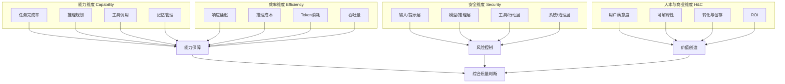

# 模块3：关键指标体系（总览）

## 3.1 为什么需要指标体系

指标体系是评测体系的"度量衡"——它把抽象的"Agent好不好"转化为可量化、可对比、可追踪的具体数值。没有指标体系的评测，等同于没有体检标准的"感觉健康"。

基于公理 A2（单一事实源）与 A6（多源互证），可靠的指标体系必须满足三个条件：

1. **有效性**：测到想测的能力（而非测偏）。
2. **可靠性**：结果稳定、可复现。
3. **可操作性**：能够低成本计算，投入产出合理（呼应公理 A5）。

## 3.2 四维指标体系结构

本教程采用**四维指标体系**，覆盖从底层能力到顶层商业价值的完整链路：

**四维定位**：

| 维度 | 回答的问题 | 对应公理 | 详细文件 |
|---|---|---|---|
| **能力维度** | Agent能不能把事做对？ | A3（能力可测） | [能力指标](03-metrics-capability.md) |
| **效率维度** | 成本与速度可接受吗？ | A5（成本约束） | [效率指标](03-metrics-efficiency.md) |
| **安全维度** | 会不会闯祸、越权、泄露？ | A2（单一事实源） | [安全指标](03-metrics-security.md) |
| **人本/商业维度** | 用户满意吗？产生商业价值吗？ | A1（价值锚定） | [人本与商业指标](03-metrics-human-commercial.md) |

## 3.3 指标的北极星与分层

指标的**北极星原则**（呼应模块1误区4）：每个评测体系应有 1-2 个北极星指标（最核心的目标），配合分层指标体系。

**北极星指标选取建议**：

| 阶段 | 北极星指标 |
|---|---|
| 开发阶段 | 任务完成率 + 步骤准确率 |
| 预发布 | 端到端成功率 + 平均成本 |
| 生产阶段 | 用户满意度（CSAT）+ 人工干预率 |

**分层原则**：核心指标（北极星，高优先级）+ 辅助指标（诊断定位，按需报告）+ 环境指标（成本、延迟等运行约束）。避免"指标爆炸"导致注意力稀释。

## 3.4 指标覆盖规模

本模块四个维度共详解 **50+ 项指标**，每个指标均提供：**定义、测量方法、参考阈值**。其中安全维度基于 IETF 提出的 4 层 55 项安全评估框架（F-015）进行分层解读。

> 指标数量本身不是目标——**每个指标都服务于某个质量判断**。读者应根据自身场景选取子集，而非贪多求全。

---

## 章节小结

四维指标体系（能力/效率/安全/人本与商业）覆盖了"能不能做对、成本是否可接受、会不会闯祸、是否创造价值"四条主线。选取指标时遵循北极星原则与分层原则，避免唯分数论与指标爆炸。下一页分别详解每个维度的具体指标。

---

## 延伸阅读

- 上一篇：[模块2：核心框架对比](../02-frameworks/02-core-frameworks.md)
- 下一篇：[能力维度指标详解](03-metrics-capability.md)
- 事实依据：[附录：R阶段事实清单](../appendices/fact-list.md)
- 术语对照：[术语表](../glossary.md)

---

*本模块版本：v0.1 | 创建日期：2026-08-05 | 状态：草稿*