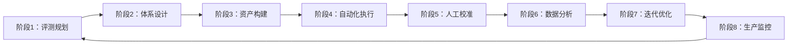

# 模块4：八阶段实施步骤

> 本模块是评测体系的"操作手册"，回答"评测体系如何落地"。八阶段流程源自公理 A4（闭环驱动）与 A5（成本约束），将评测从规划到持续优化串成完整闭环（基础事实见 F-022~F-029）。

## 4.1 八阶段总览

| 阶段 | 名称 | 核心任务 | 依据 |
|---|---|---|---|
| ① | 评测规划 | 明确目标、范围、KPI | F-023 |
| ② | 体系设计 | 定指标体系、评分权重、协议 | F-024 |
| ③ | 资产构建 | 建数据集、环境、Ground Truth | F-025 |
| ④ | 自动化执行 | 跑评测管线、生成结果 | F-026 |
| ⑤ | 人工校准 | 纠偏LLM裁判、双人复核 | F-027 |
| ⑥ | 数据分析 | 输出洞察报告、错误归类 | F-028 |
| ⑦ | 迭代优化 | 据洞察改进Agent | F-028 |
| ⑧ | 生产监控 | 实时指标、告警、反馈回路 | F-029 |

## 4.2 各阶段操作细则

### 阶段①：评测规划

- **输入**：业务目标、Agent需求、资源约束（F-023）。
- **输出**：评测目标、评测范围、KPI定义。
- **工具**：业务访谈、KPI拆解模板。
- **验收标准**：评测目标已锚定到业务价值（公理 A1），KPI可量化。
- **常见坑**：目标模糊（"评测一下Agent"），未锚定业务价值。

### 阶段②：体系设计

- **输入**：评测目标、指标模板（F-024）。
- **输出**：指标体系、评分权重、评测协议。
- **工具**：四维指标模板（见模块3）。
- **验收标准**：指标体系含北极星指标，覆盖能力/效率/安全/价值四维。
- **常见坑**：指标爆炸、无优先级、评分权重拍脑袋。

### 阶段③：资产构建

- **输入**：指标体系、评测协议（F-025）。
- **输出**：基准数据集、测试环境、Ground Truth。
- **工具**：数据集构建、环境容器化、标注工具。
- **验收标准**：数据集覆盖目标能力，Ground Truth 经人工核验。
- **常见坑**：数据集与训练数据重叠（数据污染，F-047）、用例过少。

### 阶段④：自动化执行

- **输入**：评测资产、执行管线（F-026）。
- **输出**：评测结果、执行轨迹日志。
- **工具**：LangSmith、OpenAI Evals、自建评测管线。
- **验收标准**：执行可复现（固定种子、锁定版本、容器化，F-039）。
- **常见坑**：环境非确定导致结果不可复现（F-038）。

### 阶段⑤：人工校准

- **输入**：自动化评测结果（F-027）。
- **输出**：纠偏后的评分、校准偏差率。
- **工具**：人工抽检、双人复核。
- **验收标准**：对LLM-as-Judge结果按固定比例抽检，记录校准偏差率。
- **常见坑**：完全信任LLM裁判，忽略其4种偏差（F-040）。

### 阶段⑥：数据分析

- **输入**：评测结果、校准数据（F-028）。
- **输出**：洞察报告、错误归类。
- **工具**：错误分析、轨迹分析、归因工具。
- **验收标准**：能定位薄弱环节（长程任务需分步追踪，F-050）。
- **常见坑**：只看汇总分数，不做错误归类。

### 阶段⑦：迭代优化

- **输入**：洞察报告（F-028）。
- **输出**：优化后的Agent版本。
- **工具**：Prompt调优、工具改进、回归评测。
- **验收标准**：优化后重新评测，确认指标提升且无回归。
- **常见坑**：优化一处另一处退化而无回归检测。

### 阶段⑧：生产监控

- **输入**：生产部署的Agent（F-029）。
- **输出**：实时质量指标、告警、在线反馈回路。
- **工具**：监控看板、告警系统、CI/CD集成。
- **验收标准**：设质量阈值告警，形成持续反馈闭环。
- **常见坑**：评测漂移（F-047）导致阈值失效。

## 4.3 0-8周落地清单

以下清单按周分解，帮助团队在8周内完成首个评测体系闭环。每阶段标注**投入量级**与**可量化收益信号**，便于评估ROI：

| 周次 | 重点任务 | 关键产出 | 投入量级 | 收益信号 |
|---|---|---|---|---|
| 第1周 | 业务访谈、锚定评测目标与KPI | 评测目标文档 | 1-2人日 | 目标清晰、KPI可量化 |
| 第2周 | 设计四维指标体系、定北极星 | 指标体系表 | 1-2人日 | 北极星指标确定 |
| 第3周 | 构建首批测试集、搭建测试环境 | 数据集v0.1、环境镜像 | 2-3人日 | 首批用例可跑 |
| 第4周 | 搭建自动化执行管线 | 可运行评测脚本 | 2-3人日 | 一键出分 |
| 第5周 | 首轮自动化执行 + 人工校准 | 首轮评测报告 | 2人日 | **首个可量化评测报告** |
| 第6周 | 数据分析、错误归类 | 洞察报告 | 1-2人日 | 定位到薄弱环节 |
| 第7周 | 依据洞察迭代优化Agent版本 | 优化版v1.1 | 2-3人日 | 关键指标提升 |
| 第8周 | 接入CI/CD、建立监控看板 | 持续评测闭环 | 2人日 | **每次变更自动回归** |

> **落地原则**：先垂直跑通一个最小闭环（如"规划→执行→校准→分析"），再逐步扩展。不必8周内完成所有阶段，关键是形成"评测→分析→改进→再评测"的飞轮。

### 4.3.1 轻量起步路径（中小团队推荐）

5人以下团队不必追求八阶段完备，建议垂直跑通**最小闭环**：

1. **用现成平台起步**：优先用 LangSmith、OpenAI Evals 等（F-026），避免自建管线的高成本。
2. **只做3个阶段**：规划→执行→校准。先建5-20个高价值测试用例，跑通"自动化初评分 + 人工抽检"。
3. **控制首期投入**：首期控制在1-2周人力度，先拿到一份可量化的评测报告，再决定是否扩展。
4. **异步扩展**：待评测证明价值后再逐步补齐数据分析、生产监控阶段。

### 4.3.2 最小评测 Hello World（客服Agent示例）

以"客服Agent评测"为例，走通端到端最小链路：

1. **定义任务**：评测客服Agent能否正确处理常见退换货咨询。
2. **建用例**：构造5个典型场景用例（含正常咨询、模糊表述、越界请求），每个标注预期行为。
3. **跑LLM-Judge**：用大模型对Agent回复按1-5分打分（提示：结合工具调用正确性）。
4. **人工抽检**：随机抽检20%的评分，记录校准偏差率；偏差率高（>15%）则调整评分提示。
5. **出报告**：汇总任务完成率、平均分、错误归类，形成一份可交付的评测报告。

这套最小链路让新人建立"从零到一"的完整认知，再据此扩展为完整八阶段。

---

## 章节小结

八阶段实施流程（规划→设计→资产→执行→校准→分析→优化→监控）将评测从零散的跑分串成持续的质量闭环。每阶段都有明确的输入/输出/工具/验收标准与常见坑，配合0-8周落地清单，团队可"照着做"快速起步。下一模块通过真实的行业案例，展示这些方法在不同领域的落地形态。

---

## 延伸阅读

- 上一篇：[模块3：关键指标体系](../03-metrics/03-metrics-overview.md)
- 下一篇：[模块5：行业案例分析](../05-cases/05-cases-overview.md)
- 事实依据：[附录：R阶段事实清单](../appendices/fact-list.md)

---

*本模块版本：v0.1 | 创建日期：2026-08-05 | 状态：草稿*