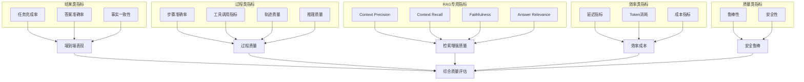
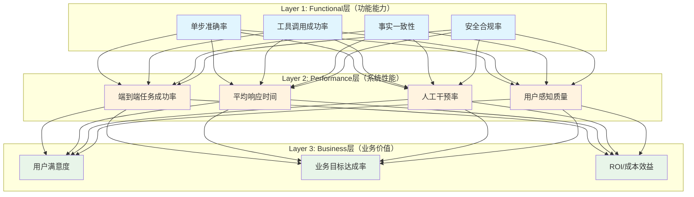

# 第2章：指标体系设计

---

## 2.1 指标体系概述

**评测指标**（Evaluation Metrics，通俗解释：衡量Agent表现的"考试分数"）是将Agent能力量化为可比较数值的核心工具。科学的指标体系需同时满足三个条件：**有效性**（测到想测的能力）、**可靠性**（结果稳定可复现）、**可操作性**（能够低成本计算）。

指标设计需遵循SMART原则：Specific（明确）、Measurable（可量化）、Achievable（可达成）、Relevant（与业务相关）、Time-bound（有时效性）。

### 2.1.1 14大类指标分类概览

Agent评测指标可分为14个大类，覆盖从基础能力到业务价值的全维度：



---

## 2.2 核心指标深度解析

### 2.2.1 代码生成一致性指标：pass@k 与 pass^k

**pass@k**（k次尝试通过率，通俗解释：给模型k次机会写代码，只要有一次通过所有测试就算成功）是代码生成领域的标准指标。

- **计算公式**：$pass@k = \mathbb{E}[1 - \prod_{i=1}^{k}(1 - \hat{p}_i)]$，其中$\hat{p}_i$是单次尝试通过测试的概率估计
- **通俗理解**：pass@1=50%意味着模型一次写对的概率是50%；pass@5=80%意味着给模型5次尝试机会，有80%概率至少一次写对
- **适用场景**：代码生成、形式化验证、任何允许多次尝试的任务

**pass^k**（k次连续通过率，与pass@k对偶）是衡量一致性的指标——连续k次尝试都通过测试的概率。

- **关键区别**：pass@k衡量"能力上限"（会不会），pass^k衡量"可靠性"（稳不稳）
- **典型值参考**：成熟代码模型pass@1≈60-75%，pass^5≈30-45%（pass^k通常远低于pass@k）
- **生产环境重要性**：线上系统无法"重试k次选最优"，pass^k比pass@k更能代表真实可靠性

> **工程启示**：不要只看pass@k——pass@1高但pass^5低的模型适合Copilot类辅助场景（人在回路中选最优），pass^k高的模型才适合全自动代码生成场景。

### 2.2.2 RAG专用四指标

检索增强生成（Retrieval-Augmented Generation, RAG，通俗解释：模型先从知识库查资料再回答，减少"胡说八道"）有四个专用核心指标：

| 指标 | 通俗解释 | 计算方式 | 理想值 |
|---|---|---|---|
| **Context Precision（上下文精确率）** | 检索回来的文档里，真正有用的比例是多少？ | 相关检索结果数 / 总检索结果数 | 越高越好（减少无关信息干扰） |
| **Context Recall（上下文召回率）** | 回答问题需要的所有资料，都检索回来了吗？ | 被检索到的相关文档数 / 所有相关文档数 | 越高越好（避免信息缺失） |
| **Faithfulness（忠实度）** | 回答内容是不是都能从检索到的资料里找到依据？ | 可被支撑的陈述数 / 总陈述数 | 越高越好（减少幻觉） |
| **Answer Relevance（答案相关性）** | 回答是不是针对用户问的问题，有没有答非所问？ | 答案与问题的语义相似度 | 越高越好（避免答非所问） |

> **指标权衡**：提高召回率通常会降低精确率（多捞文档容易掺水），需根据场景平衡——医疗/法律场景追求高召回率（宁可错看不可漏看），客服场景追求高精确率（减少干扰信息）。

### 2.2.3 Agent专用指标

Agent相比普通LLM应用新增四类专用指标，聚焦工具使用与多步决策质量：

**1. 工具调用成功率（Tool Call Success Rate）**

- **定义**：工具调用返回有效结果（非错误、非异常）的比例
- **细分维度**：
  - 工具选择准确率：是否选对了应该调用的工具
  - 参数填充准确率：工具参数是否正确
  - 结果解析成功率：是否正确理解工具返回结果
- **典型错误模式**：工具不存在、参数类型错误、必填参数缺失、API错误处理失败

**2. 步骤准确率（Step Accuracy）**

- **定义**：执行轨迹中每一步决策正确的比例
- **计算方式**：正确步骤数 / 总步骤数
- **进阶：关键步骤准确率**：不是所有步骤权重相同，关键决策步骤（如是否调用工具、选择哪个工具）权重更高
- **价值**：精确定位错误环节——是规划错了？工具选错了？还是参数填错了？

**3. 轨迹相似度（Trajectory Similarity）**

- **定义**：Agent执行轨迹与专家示范轨迹的相似程度
- **计算方法**：序列编辑距离（如Levenshtein距离）、动作序列匹配度、嵌入向量余弦相似度
- **通俗解释**：像批改作业——不仅看最终答案对不对，还要看解题步骤和标准答案像不像
- **局限**：同一任务可能有多种正确解法，过度追求轨迹相似度会抑制创造性解决方案

**4. 任务完成率（Task Completion Rate）**

- **定义**：端到端成功完成用户指定任务的比例（Agent的"终极指标"）
- **判定标准**：需明确"完成"的定义——是输出了答案？还是答案正确？还是达到了用户真实目标？
- **分级标准**：
  - 完全成功：无需人工干预，完美达成目标
  - 部分成功：核心目标达成但有瑕疵，或需要少量人工修正
  - 失败：未达成核心目标

### 2.2.4 效率类指标

效率指标直接关系到用户体验与成本，是生产环境不可忽视的维度：

**延迟指标**：
- **首Token延迟（TTFT, Time to First Token）**：用户提问到看到第一个字的等待时间（直接影响体感，建议<2秒）
- **每步延迟**：Agent每一步思考/工具调用/观察的平均耗时
- **总完成时间**：从提问到任务完成的总时长（复杂任务可接受更长时间，但需有进度反馈）

**Token消耗指标**：
- **输入Token数**：包含Prompt、历史上下文、工具返回结果
- **输出Token数**：Agent思考过程、工具调用参数、最终回答
- **总Token数**：输入+输出，直接决定推理成本
- **Token效率**：完成单位任务消耗的Token数（衡量"性价比"）

**成本指标**：
- **单任务平均成本**：总API费用 / 完成任务数
- **成本效率**：每美元能完成多少任务
- **成本分布**：分析钱花在哪里了——是输入Prompt太长？工具调用结果太冗余？还是Agent反复重试浪费了Token？

### 2.2.5 安全指标

安全指标衡量Agent的风险控制能力，是上线前的必过门槛：

| 安全维度 | 具体指标 | 检测方法 |
|---|---|---|
| **内容安全** | 有害内容生成率、拒答正确率 | 红队测试、安全分类器扫描 |
| **幻觉率** | 事实错误率、虚构引用比例 | 事实验证、Faithfulness指标 |
| **越权行为** | 未授权工具调用率、敏感操作比例 | 权限审计、行为沙箱监控 |
| **隐私泄露** | PII泄露率、敏感信息提及次数 | PII检测工具、关键词扫描 |
| **提示注入防御** | 注入攻击成功率 | 对抗样本测试、注入攻击基准 |
| **合规性** | 政策违规率、敏感话题处理正确率 | 合规规则引擎、人工审核 |

---

## 2.3 AWS三层评估框架

AWS在生产实践中提出了三层评估框架，从技术指标逐层对齐到业务价值：



### 2.3.1 Functional层（功能层）

- **关注点**：Agent是否具备完成任务的基础能力？
- **典型指标**：单步准确率、工具调用成功率、事实一致性、安全合规率、RAG四指标
- **评测时机**：开发阶段、单元测试、每次代码提交前
- **特点**：可自动化、细粒度、定位问题精确，但与最终用户体验距离较远

### 2.3.2 Performance层（性能层）

- **关注点**：Agent在完整任务场景中的端到端表现如何？
- **典型指标**：端到端任务成功率、平均完成时间、Token成本、人工干预率、重试率
- **评测时机**：版本发布前、集成测试、回归测试
- **特点**：聚合指标、接近用户真实体验，但问题定位不如Functional层精确

### 2.3.3 Business层（业务层）

- **关注点**：Agent是否真正创造了业务价值？
- **典型指标**：用户满意度（CSAT/NPS）、业务目标达成率（如问题解决率、转化率）、人工替代率、ROI（投资回报率）
- **评测时机**：上线后、A/B测试、持续监控
- **特点**：最有说服力，但评测周期长、受外部因素干扰多、难以直接用于指导技术迭代

> **AWS最佳实践**：三层指标需建立因果链路——Functional层指标提升应该能带动Performance层指标提升，进而带动Business层指标提升。如果出现"Functional指标涨了但Business指标没涨"，说明指标设计有问题（测到的不是真正有用的能力）。

---

## 2.4 指标计算方法与适用场景总表

| 指标类别 | 具体指标 | 计算方法 | 自动化程度 | 适用场景 |
|---|---|---|---|---|
| **代码生成** | pass@k | 蒙特卡洛估计/无偏估计 | 全自动 | 代码模型能力评测、HumanEval/SWE-bench |
| | pass^k | 连续k次通过的频率统计 | 全自动 | 生产环境可靠性评估 |
| **RAG专用** | Context Precision/Recall | 基于标注的相关/检索计算 | LLM辅助 | RAG系统检索模块调优 |
| | Faithfulness | LLM-as-Judge判断陈述支撑度 | LLM自动化 | RAG答案质量评估 |
| | Answer Relevance | 问题-答案语义相似度 | 全自动 | 答非所问检测 |
| **Agent专用** | 工具调用成功率 | 成功调用次数/总调用次数 | 全自动 | 工具使用模块评测 |
| | 步骤准确率 | 正确步骤数/总步骤数 | LLM辅助/人工标注 | 过程质量评测、错误定位 |
| | 任务完成率 | 成功任务数/总任务数 | LLM-as-Judge/规则 | 端到端能力验收 |
| **效率** | 首Token延迟/总延迟 | 时间戳差值计算 | 全自动 | 用户体验监控、性能优化 |
| | Token消耗/成本 | API返回数据统计 | 全自动 | 成本控制、ROI计算 |
| **安全** | 幻觉率 | 事实验证 | LLM辅助+人工 | 事实性保障 |
| | 有害内容率 | 安全分类器+红队 | 半自动 | 安全合规验收 |
| **用户体验** | CSAT/NPS | 用户评分/问卷 | 人工 | 上线后效果评估 |

---

## 2.5 指标选择指南

选择指标时需遵循以下决策流程：

```mermaid
flowchart TD
    START[开始选择指标] --> STAGE{评测阶段?}
    STAGE -->|开发/单元测试| FUNC[Functional层细粒度指标<br/>单步准确率、工具调用成功率、Faithfulness]
    STAGE -->|版本发布/集成| PERF[Performance层聚合指标<br/>任务完成率、延迟、成本]
    STAGE -->|上线/运营| BIZ[Business层价值指标<br/>用户满意度、业务转化率、人工替代率]
    
    FUNC --> TYPE{任务类型?}
    PERF --> TYPE
    BIZ --> DONE[指标确定]
    
    TYPE -->|代码生成| CODE[pass@k/pass^k、测试覆盖率、编译通过率]
    TYPE -->|RAG问答| RAG[Context P/R、Faithfulness、Answer Relevance、引用准确率]
    TYPE -->|多工具Agent| AGENT[工具调用成功率、步骤准确率、任务完成率、错误恢复率]
    TYPE -->|对话交互| CHAT[对话连贯性、指令遵循率、用户满意度]
    TYPE -->|安全敏感| SAFE[安全四件套：内容安全/幻觉/越权/注入防御]
    
    CODE --> RULE{是否需要多维平衡?}
    RAG --> RULE
    AGENT --> RULE
    CHAT --> RULE
    SAFE --> RULE
    
    RULE -->|是| COMPOSITE[设计加权复合指标<br/>同时报告各分项分数]
    RULE -->|否| SINGLE[使用单一核心指标]
    
    COMPOSITE --> DONE
    SINGLE --> DONE
```

### 指标选择反模式（避免踩坑）

1. **唯分数论**：只看单一综合分数，不看分项指标——无法定位问题
2. **指标虚荣**：选择容易涨分但无实际价值的指标（如回答长度、词汇丰富度）
3. **过度自动化**：只看自动化指标，忽略自动化无法覆盖的主观维度（如用户体验、创造性）
4. **指标爆炸**：堆砌几十个指标，没有核心北极星指标——无法判断"到底好不好"
5. **静态指标**：指标体系一成不变，不随系统迭代和业务变化更新

### 北极星指标推荐

每个评测体系应有1-2个北极星指标（最核心的目标）：
- **开发阶段**：任务完成率 + 单步准确率
- **预发布**：端到端成功率 + 平均成本
- **生产环境**：用户满意度（CSAT） + 人工干预率

---

## 章节导航

| 上一章 | 当前章节 | 下一章 |
|---|---|---|
| [← 第1章：评测理论基础](01-theory-foundations.md) | **第2章：指标体系设计** | [第3章：基准测试构建 →](03-benchmark-construction.md) |

---

> **本章小结**：指标是评测的"度量衡"。14大类指标覆盖结果、过程、RAG、效率、安全五大维度；pass@k/pass^k衡量代码能力的"会不会"与"稳不稳"；RAG四指标精准诊断检索增强质量；Agent专用指标聚焦工具使用与多步决策；AWS三层框架实现从技术到业务的价值对齐。选择指标时需根据评测阶段和任务类型决策，避免指标反模式，建立清晰的北极星指标。下一章我们将学习如何构建基准测试集——指标的"考卷"。
