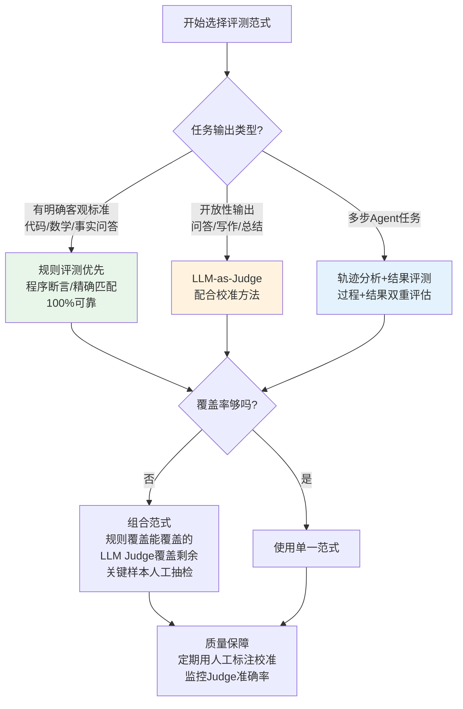
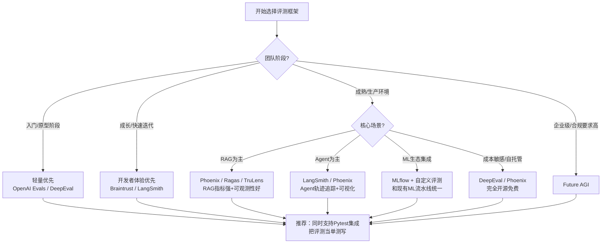

# 第4章：自动化评测框架

---

## 4.1 自动化评测概述

**自动化评测**（Automated Evaluation，通俗解释：让AI/程序自动"阅卷"，不用人逐一批改）是将评测流程标准化、规模化、可复现化的核心工程实践。没有自动化评测，就无法实现持续集成、快速迭代和大规模回归测试。

自动化评测的三大核心价值：
1. **速度**：几分钟跑完上千测试用例，跟上快速迭代节奏
2. **成本**：相比人工评估成本降低10-100倍
3. **可复现**：相同条件下结果一致，避免人为主观偏差

---

## 4.2 三大自动化评测范式

### 4.2.1 LLM-as-Judge（大模型作为裁判）

**LLM-as-Judge**（通俗解释：让更强的大模型来当"考官"，给Agent的答案打分）是2023年以来最主流的自动化评测范式。

**核心思想**：给评分模型（Judge LLM，如GPT-4/Claude 3 Opus）提供：评分标准、问题、Agent的回答（可选：参考答案），让它输出分数和评分理由。

**优势**：
- 通用性强：几乎可以评测任何开放性问题
- 接近人类判断：强模型的评分与人类评分相关性可达80-90%
- 灵活：可以自定义任意评分维度和标准
- 能给出理由：不仅有分数，还知道为什么扣/加分

**局限**：
- 位置偏差（Position Bias）：对先出现的答案打分偏高
- 冗长偏差（Verbosity Bias）：更长的回答容易得高分（即使内容空洞）
- 自我偏好（Self-Enhancement Bias）：倾向于给与自己风格相似的回答更高分
- 成本较高：需要调用强模型，大规模评测成本不低
- 推理能力上限：无法评判比裁判模型更强的模型的输出

**校准方法**（提升Judge可靠性）：
1. **多次采样+多数投票**：同一个样本让Judge评3-5次，取多数/平均分
2. **位置随机化**：对比评测时随机打乱A/B顺序，消除位置偏差
3. **Few-shot示例**：给出具体的评分示例，明确每个分数段的标准
4. **思维链评分**：要求Judge先写评分理由再给分，提高评分质量
5. **细粒度维度拆分**：不要让Judge打一个综合分，拆成多个维度分别评分再聚合
6. **校准集验证**：用有人类标注的校准集定期验证Judge的评分准确性

### 4.2.2 规则评测

**规则评测**（Rule-based Evaluation，通俗解释：用精确的规则/程序来判断对错）是最可靠、最可复现的评测范式。

**常见规则类型**：

| 方法 | 说明 | 适用场景 |
|---|---|---|
| **精确匹配（Exact Match）** | 答案与标准答案完全一致才算对 | 事实性问答、选择题、标准答案唯一的任务 |
| **正则匹配（Regex Match）** | 答案符合指定正则表达式即可 | 格式校验、特定模式存在性检查（如是否包含特定信息） |
| **包含检查（Contains）** | 答案中包含关键词/关键信息点 | 要点给分（如答案需要提到3个要点） |
| **F1/BLEU/ROUGE** | 基于n-gram重叠的文本相似度 | 文本生成质量快速评估（需注意局限） |
| **程序断言（Assertions）** | 运行代码/脚本来验证结果 | 代码生成（运行测试用例）、数据库查询（验证结果集） |
| **程序验证（Formal Verification）** | 用形式化方法验证输出满足规范 | 安全关键场景、数学证明、代码正确性证明 |

**优势**：100%可靠可复现、速度极快、零边际成本、没有主观偏差
**局限**：只能评测有明确客观标准的任务，无法评估开放性、创造性、主观性强的输出

### 4.2.3 执行轨迹分析

**执行轨迹分析**（Trajectory Analysis，通俗解释：不仅看最终答案，还分析Agent"做题"的整个过程）是Agent特有的评测范式。

**分析维度**：
- **工具调用序列检查**：是否调用了正确的工具序列？是否有冗余调用？
- **步骤类型分布**：思考、工具调用、观察、回答的比例是否合理？
- **错误恢复分析**：遇到错误后是否能有效恢复？还是直接崩溃？
- **状态一致性**：Agent对环境状态的认知是否与真实状态一致？
- **路径效率**：是否走了最优路径？有没有绕路/重复步骤？

**常用技术**：
- 轨迹与示范序列的编辑距离
- LLM对单步质量的逐步打分
- 错误模式匹配（用预定义的错误分类法标注错误类型）
- 关键节点检查（如"是否在第3步前调用了搜索工具"）

---

## 4.3 三大范式的选择与组合



> **最佳实践**：规则优先——能用规则判断的一律用规则（最可靠）；规则判断不了的用LLM-as-Judge；Agent任务必须做轨迹分析，不能只看最终结果。

---

## 4.4 六大主流框架深度对比

### 4.4.1 LangSmith

- **开发方**：LangChain
- **定位**：全栈LLM/Agent开发与评测平台
- **核心优势**：
  - 与LangChain/LangGraph生态无缝集成
  - 强大的可观测性：自动记录完整执行轨迹
  - 支持在线评测与A/B测试
  - 内置数据集管理
- **评测能力**：支持自定义评测器、LLM-as-Judge、规则评测、批量运行
- **适用场景**：已使用LangChain技术栈的团队、需要完整可观测性+评测的项目
- **开源情况**：UI闭源，SDK开源，提供云服务和自托管选项

### 4.4.2 Future AGI（原名Arthur）

- **开发方**：Future AGI
- **定位**：企业级LLM监控与评测平台
- **核心优势**：
  - 企业级安全与合规（SOC2、HIPAA）
  - 强大的生产监控能力
  - 内置偏见与幻觉检测
  - 详细的性能分析仪表盘
- **评测能力**：离线基准评测、在线质量监控、回归检测
- **适用场景**：中大型企业、生产环境LLM应用、对合规要求高的场景
- **开源情况**：商用闭源

### 4.4.3 Braintrust

- **开发方**：Braintrust Data
- **定位**：开发者友好的LLM评测与实验平台
- **核心优势**：
  - 极佳的DX（开发者体验），SDK设计简洁优雅
  - 支持Git-like的实验版本管理
  - 强大的对比可视化（A/B对比、分数分布、失败case聚类）
  - 支持Eval模板复用
- **评测能力**：自定义评分函数、LLM-as-Judge、批量评测、Pytest集成
- **适用场景**：追求开发效率的技术团队、快速迭代的项目
- **开源情况**：SDK开源，核心平台闭源，提供云服务

### 4.4.4 DeepEval

- **开发方**：Confident AI
- **定位**：开源LLM评测框架
- **核心优势**：
  - 完全开源免费，可自托管
  - 内置14+开箱即用的评测指标（G-Eval、Faithfulness、Answer Relevance等）
  - 与Pytest无缝集成，评测就像写单元测试
  - 提供简单的Web UI查看结果
- **评测能力**：RAG评测指标齐全、LLM-as-Judge、对话评测、幻觉检测
- **适用场景**：预算有限的团队、RAG应用评测、喜欢开源的团队
- **开源情况**：完全开源（MIT协议）

### 4.4.5 Phoenix（Arize AI）

- **开发方**：Arize AI
- **定位**：开源LLM可观测性与评测平台
- **核心优势**：
  - 完全开源，可观测性能力极强
  - 自动追踪LLM调用、检索、工具使用
  - 内置RAG评测指标（UMAP聚类可视化、Embedding分析）
  - 支持生产环境实时监控
- **评测能力**：RAG质量评估、漂移检测、根因分析、轨迹可视化
- **适用场景**：RAG系统评测与监控、需要强可观测性的Agent系统
- **开源情况**：完全开源（Elastic License 2.0）

### 4.4.6 OpenAI Evals

- **开发方**：OpenAI
- **定位**：官方评测框架
- **核心优势**：
  - 官方维护，与OpenAI模型兼容性最好
  - 包含大量基准的官方实现
  - 框架轻量灵活，易于自定义
  - Completion/Fn匹配两种基础评测模式
- **局限**：框架相对简单，缺少高级功能（如UI、聚类分析、实验管理）
- **评测能力**：基础规则评测、模型评分、基准实现
- **适用场景**：快速原型评测、复现OpenAI基准、简单评测场景
- **开源情况**：完全开源（MIT协议）

---

## 4.5 六大框架对比总表

| 特性 | LangSmith | Future AGI | Braintrust | DeepEval | Phoenix | OpenAI Evals |
|---|---|---|---|---|---|---|
| **开源程度** | SDK开源 | 闭源 | SDK开源 | 完全开源 | 完全开源 | 完全开源 |
| **自托管** | 支持（企业版） | 支持 | 不支持 | 支持 | 支持 | 支持 |
| **云服务** | ✅ | ✅ | ✅ | 云组件可选 | ✅ | ❌ |
| **RAG专用指标** | ⭐⭐⭐ | ⭐⭐⭐⭐ | ⭐⭐ | ⭐⭐⭐⭐⭐ | ⭐⭐⭐⭐⭐ | ⭐ |
| **Agent轨迹支持** | ⭐⭐⭐⭐⭐ | ⭐⭐⭐ | ⭐⭐⭐ | ⭐⭐ | ⭐⭐⭐⭐ | ⭐ |
| **可观测性** | ⭐⭐⭐⭐⭐ | ⭐⭐⭐⭐ | ⭐⭐⭐ | ⭐⭐ | ⭐⭐⭐⭐⭐ | ⭐ |
| **开发者体验** | ⭐⭐⭐⭐ | ⭐⭐⭐ | ⭐⭐⭐⭐⭐ | ⭐⭐⭐⭐ | ⭐⭐⭐ | ⭐⭐⭐ |
| **企业级合规** | ⭐⭐⭐ | ⭐⭐⭐⭐⭐ | ⭐⭐ | ⭐⭐ | ⭐⭐⭐ | ⭐ |
| **成本** | 免费+付费 | 企业定价 | 免费+付费 | 免费（自托管） | 免费（自托管） | 免费 |
| **适合阶段** | 全流程 | 生产企业 | 开发迭代 | 入门/RAG | 监控+RAG | 原型/基准 |

---

## 4.6 补充工具生态

除了上述六大主流框架，还有一系列补充工具可以按需选用：

| 工具 | 定位 | 核心优势 |
|---|---|---|
| **MLflow** | 实验跟踪与模型管理 | 机器学习生态标准，与现有ML流程集成好，支持评测记录版本化 |
| **TruLens** | LLM可观测性与评测 | 链式思维评测、细粒度反馈函数、RAG三元组（Context/Answer/Groundedness）评估 |
| **Ragas** | RAG专用评测框架 | RAG四指标（Context P/R/Faithfulness/Relevance）标准实现，RAG场景开箱即用 |
| **LlamaIndex Evaluators** | LlamaIndex生态评测 | 与LlamaIndex无缝集成，适合基于LlamaIndex构建的RAG/Agent |
| **Evidently AI** | ML/LLM监控 | 数据漂移检测、模型质量监控、生产环境统计分析 |
| **WhyLabs** | AI可观测性平台 | 统计监控、异常检测、数据质量 profiling、大规模部署监控 |

---

## 4.7 多维度评分聚合方法

当评测包含多个维度时，需要将分项分数聚合成综合分数：

### 4.7.1 常用聚合方法

| 方法 | 公式 | 特点 | 适用场景 |
|---|---|---|---|
| **加权平均** | $\sum w_i s_i$ | 简单直观，权重可手动调整 | 大多数场景，权重反映维度重要性 |
| **几何平均** | $(\prod s_i)^{1/n}$ | 对短板更敏感，要求各维度均衡 | 安全/质量关键场景（不能有明显短板） |
| **最小值（木桶原理）** | $\min(s_i)$ | 任一维度不合格则整体不合格 | 安全门禁：任何安全指标不达标就不能上线 |
| **加权调和平均** | $\frac{1}{\sum w_i/s_i}$ | 同时惩罚短板和偏科 | 需要平衡各维度表现 |
| **自定义阶梯** | 规则-based，如"核心指标达标后再看加分项" | 灵活反映业务优先级 | 产品验收场景（核心功能必须达标，体验项是加分） |

### 4.7.2 聚合原则

1. **核心指标一票否决**：安全性、事实正确性等核心指标不达标时，其他维度再高也没用
2. **同时报告分项与总分**：只报总分无法定位问题，必须同时展示各分项分数
3. **权重需业务对齐**：权重不是技术问题，是业务优先级问题——需和产品/业务方共同确定
4. **分数分布比平均分更重要**：不要只看平均分，要看分数分布、方差、失败case比例

---

## 4.8 评测报告生成模板

标准化的评测报告应包含以下部分：

```markdown
# 评测报告：[版本/实验名称]

## 概要
- 评测时间：YYYY-MM-DD
- 评测对象：模型/Agent版本
- 基准/数据集：测试集名称+样本数
- 核心结论：一句话总结（如"v2.1相比v2.0任务成功率提升8%，成本下降15%，安全指标持平"）

## 核心指标结果
| 指标 | v2.0（基线） | v2.1（本次） | 变化 |
|---|---|---|---|
| 任务完成率 | 62% | 70% | +8% ✅ |
| 工具调用成功率 | 85% | 88% | +3% ✅ |
| 平均成本/任务 | $0.12 | $0.102 | -15% ✅ |
| 幻觉率 | 5% | 4.8% | -0.2% ➖ |

## 分项维度分析
### 任务完成率细分
（按任务类型/难度拆分，展示哪些场景提升大，哪些没变化）

### 错误模式分析
（Top错误类型分布，新增了哪些错误类型，修复了哪些旧错误）

## 失败case分析
（列举5-10个典型失败case，分析失败原因）

## 结论与建议
- 是否达到发布标准：是/否
- 主要改进：...
- 仍存在的问题：...
- 下一步优化建议：...

## 附录
- 完整测试集链接
- 原始数据/轨迹链接
- 评测配置参数
```

---

## 4.9 框架选型Mermaid决策树

根据你的具体场景，按以下决策树选择框架：



> **框架选型原则**：不要被功能列表迷惑——先看**和你现有技术栈的集成度**，再看**核心场景的支持度**，最后才是功能丰富度。评测框架是工具，不是目的——能让你的团队真正用起来的框架才是好框架。

---

## 章节导航

| 上一章 | 当前章节 | 下一章 |
|---|---|---|
| [← 第3章：基准测试构建](03-benchmark-construction.md) | **第4章：自动化评测框架** | [第5章：人工评估方法论 →](05-human-evaluation.md) |

---

> **本章小结**：自动化评测是Agent工程化的基础，三大范式各有适用场景：规则评测最可靠（能用就用），LLM-as-Judge最灵活（需校准），轨迹分析是Agent特有（过程+结果双重评估）。六大主流框架各有侧重：LangSmith在LangChain生态和Agent轨迹方面最强，DeepEval/Phoenix开源免费适合RAG和自托管，Braintrust开发者体验最佳，Future AGI适合企业级合规场景。多维度评分聚合要注意核心指标一票否决，同时报告分项与总分。下一章我们将讨论自动化无法覆盖的领域——人工评估方法论。
