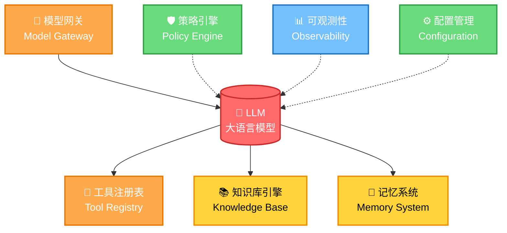

# Harness业务运行底座七组件：概述与学习目标

## 背景介绍

本文源自王戴明的公众号文章，核心观点：**2026年Agent领域最重要的创新是Harness**。很多人做Agent停留在Prompt层面，但难的是另一堆问题：该用哪个模型、能调用哪些工具、从哪里拿业务知识、怎么防止越权乱说乱操作、出错后怎么定位。

大模型只能解决智能问题，Harness才能解决交付问题。

## 核心定义

> Harness是AI Agent的业务运行底座。它把模型、工具、知识、记忆、策略、观测和配置组织起来，让Agent能在真实业务场景里，稳定、安全、可控、低成本地完成任务。
>
> LLM是聪明的大脑。Harness是让这个大脑能干活的工作系统。
>
> 如果没有Harness，Agent只能回答"应该怎么做"。有了Harness，Agent才能真的去查、去判断、去调用工具、去执行、去记录、去复盘。

**生活类比：家庭聚餐**

请聪明助理安排周末家庭聚餐，只有LLM它只能给建议，要真正办成事需要一整套系统：

| 组件 | 家庭聚餐场景 | 文章Agent场景 |
|------|-------------|-------------|
| 模型网关（Model Gateway） | 决定什么事问什么助理 | 选题判断用强模型/材料整理用长上下文/格式整理用便宜模型 |
| 工具注册表（Tool Registry） | 能调用日历地图预订系统 | 读取选题池/检索历史文章/保存草稿 |
| 知识库引擎（Knowledge Base Engine） | 知道谁不能吃辣/预算/哪家餐厅体验差 | 历史文章/案例纪要/观点框架（判断力缓存） |
| 记忆系统（Memory System） | 记住刚刚否掉了火锅/上次别选太远 | 短期记忆（当前文章核心判断）/长期记忆（写作风格偏好） |
| 策略引擎（Policy Engine） | 不能私自付款超2000元 | 选题策略/内容安全/质量标准（不是让Agent更会写，而是不乱写） |
| 可观测性（Observability） | 记录花了多少钱哪里失败过 | 发布数据追踪/Badcase闭环 |
| 配置管理（Configuration Management） | 本次预算人数可调 | 目标读者/交付物类型/内容级别 |

## 七大组件架构图

## 学习目标

通过本文档，你将能够：

1. 理解Harness作为AI Agent业务运行底座的核心定位
2. 掌握七大组件的定义、职责、设计原则
3. 通过"家庭聚餐"类比和"文章Agent"案例建立直观认知
4. 学会从零构建Harness的实施路径与优先级
5. 能够区分易混淆概念（知识库vs记忆、工具vs策略等）
6. 建立与现有Harness Engineering知识的关联

## 前置知识要求

- 了解AI Agent基本概念
- 有LLM应用使用或开发经验更佳
- 对Prompt Engineering有初步认知
- 无特定技术栈要求，适合产品经理和开发者共同阅读

## 文档导航表

| 章节 | 文件 | 内容概要 |
|------|------|----------|
| 01 | [01-core-concepts.md](01-core-concepts.md) | 核心概念定义、七大组件概览、组件协作流程 |
| 02 | [02-model-gateway.md](02-model-gateway.md) | 模型网关：大脑调度中心，什么任务用什么模型 |
| 03 | [03-tool-registry.md](03-tool-registry.md) | 工具注册表：Agent的手脚管理 |
| 04 | [04-knowledge-base.md](04-knowledge-base.md) | 知识库引擎：业务资料来源与判断力缓存 |
| 05 | [05-memory-system.md](05-memory-system.md) | 记忆系统：短期上下文与长期偏好 |
| 06 | [06-policy-engine.md](06-policy-engine.md) | 策略引擎：规则红线与强制约束 |
| 07 | [07-observability.md](07-observability.md) | 可观测性：数据追踪与Badcase闭环 |
| 08 | [08-configuration.md](08-configuration.md) | 配置管理：持续调教与任务级参数 |
| 09 | [09-practice-guide.md](09-practice-guide.md) | 实践指南：五步法构建Harness |
| 10 | [10-case-study.md](10-case-study.md) | 案例分析：家庭聚餐+文章Agent深度剖析 |
| 11 | [11-faq.md](11-faq.md) | 常见问题FAQ |
| 12 | [12-resources.md](12-resources.md) | 资源链接与延伸阅读 |
| 13 | [13-cheatsheet.md](13-cheatsheet.md) | 速查手册 |

## 与现有知识的关联

本教程与已有的[Harness Engineering驾驭工程](../harness-engineering-wiki/00-overview.md)形成互补：

- **本教程（王戴明视角）**：侧重业务运行底座的组件架构，产品视角，七大组件体系
- **Harness Engineering（涅羽/阿里技术视角）**：侧重三代工程范式演进、四条铁律、六大工程模式

建议先读本文建立组件认知，再读驾驭工程深入工程模式。

## 术语表

| 术语 | 定义 |
|------|------|
| **Harness** | AI Agent的业务运行底座，组织模型/工具/知识/记忆/策略/观测/配置的工作系统 |
| **模型网关 Model Gateway** | Agent的大脑调度中心，决定什么任务用什么模型 |
| **工具注册表 Tool Registry** | 管理Agent可用工具、参数和失败处理的"手脚管理"模块 |
| **知识库引擎 Knowledge Base Engine** | Agent的业务资料来源/参考书，存放私有知识和判断力缓存 |
| **记忆系统 Memory System** | 存储当前任务上下文（短期）和长期偏好（长期）的便签本+档案柜 |
| **策略引擎 Policy Engine** | 将业务规则、安全红线、质量标准变为强制约束的模块 |
| **可观测性 Observability** | 记录Agent执行过程、追踪数据指标、闭环Badcase的运营模块 |
| **配置管理 Configuration Management** | 支持任务级参数调整，实现持续调教而不重新发版 |
| **MVH** | Minimum Viable Harness，最小可行Harness |
| **Badcase** | 失败案例，用于优化Agent的原材料 |

---

[➡️ 开始学习：核心概念——从智能到交付](01-core-concepts.md)
