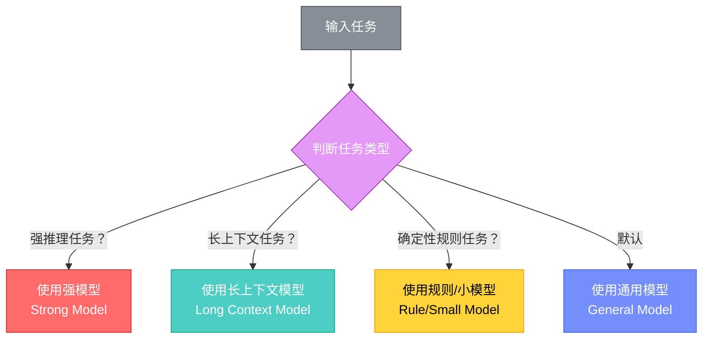

## 一、什么是模型网关

模型网关（Model Gateway）是Agent的"大脑调度中心"。它解决的核心问题是：这次任务，到底该用哪个模型？不是所有任务都应该用最贵最强的大模型（Large Language Model, LLM）。

## 二、生活场景理解

家庭聚餐安排中，不是什么事都要问最聪明的助理：
- 把餐厅名单做简单分类 → 速度快、成本低的小助理就够了
- 判断哪家餐厅最适合全家人 → 需要动用经验最丰富、理解能力最强的助理
- 什么事都让最聪明的助理干 → 成本高、速度慢，很多事不会做得更好

## 三、核心设计原则

> **该用好模型的地方不要省，该用便宜模型的地方不要浪费，能用规则解决的地方就别麻烦大模型。**

这个原则不仅省钱，也能提高稳定性。因为很多时候，大模型不是越强越好——对于确定性任务，代码和规则比模型更可靠。

## 四、文章Agent中的模型路由

文章Agent（Article Agent）至少遇到三类典型任务：

| 任务类型 | 特征 | 推荐模型类型 | 原因 |
|---------|------|------------|------|
| 选题判断 | 需要理解选题逻辑和传播价值 | 最强推理模型（Strong Reasoning Model） | 判断涉及商业洞察和传播规律 |
| 材料整理 | 需要读大量上下文 | 长上下文（Long Context）、成本适中模型 | 主要是信息归纳，不需要最强推理 |
| 格式整理/标签分类 | 任务确定、规则明确 | 最便宜模型/规则引擎（Rule Engine） | 确定性任务，模型不需要"思考" |

## 五、模型网关路由决策图（Mermaid）

## 六、常见误区

1. **什么都用最贵模型**：成本高、速度慢，确定性任务反而不如规则可靠
2. **忽略规则和代码**：格式校验、分类标签这类任务用几行代码比任何模型都稳定
3. **没有降级策略（Fallback Strategy）**：强模型不可用时没有备用方案
4. **忽视成本监控（Cost Monitoring）**：不追踪各模型调用比例和成本分布

## 七、与其他组件的关系

- 模型网关是任务执行的入口
- 它的决策受策略引擎（Policy Engine）约束（如成本上限）
- 配置管理（Configuration Management）可覆盖默认路由策略
- 可观测性（Observability）记录各模型的调用频率和效果

---

[🏠 返回总览](00-overview.md) | [⬅️ 核心概念](01-core-concepts.md) | [➡️ 工具注册表](03-tool-registry.md)
