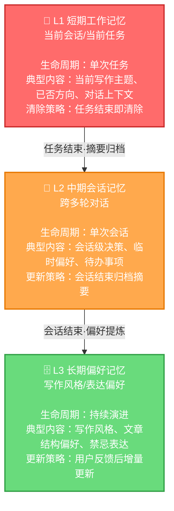

## 一、什么是记忆系统

记忆系统（Memory System）是Agent的"便签本和档案柜"——存的是当前任务上下文和长期偏好。

## 二、知识库 vs 记忆系统

这两个概念非常容易混淆。关键区别：

| 维度 | 知识库引擎 | 记忆系统 |
|------|-----------|---------|
| 比喻 | 资料库/参考书 | 便签本+档案柜 |
| 存储内容 | 可检索的内容资产 | 当前任务上下文 + 长期偏好 |
| 生命周期 | 长期、稳定、持续更新 | 短期随任务、长期随偏好演进 |
| 典型内容 | 历史文章、案例纪要、观点框架 | "刚否掉了火锅"、"作者不喜欢AI鸡汤" |

> **知识库更像资料库，存的是可检索的内容资产。记忆系统更像便签本和档案柜，存的是当前任务上下文和长期偏好。**

## 三、短期记忆 vs 长期记忆

生活场景里，助理安排家庭聚餐时：
- **短期记忆（Short-term Memory）**：你刚刚否掉了火锅——当前任务不要断片
- **长期记忆（Long-term Memory）**：你上次说过以后聚餐尽量别选太远的地方——以后不要每次重新教

### 短期记忆（工作记忆）

解决当前任务连续性问题：
- 这篇文章正在写什么
- 核心判断是什么
- 哪些方向刚刚被你否掉了
- 当前的对话上下文

### 长期记忆（偏好记忆）

解决跨任务一致性问题：
- 你的写作风格
- 常用文章结构
- 标题偏好
- 你不喜欢的表达方式

文章Agent的长期记忆示例：文章经常先指出行业误区，再讲背后的商业逻辑，最后给产品经理判断框架；不喜欢端着的咨询报告腔，也不喜欢空泛的AI鸡汤。

## 四、记忆分层图

## 五、记忆设计的核心难点

> **记忆系统的难点是，它不是记得越多越好。**

| 问题 | 表现 |
|------|------|
| 记太少 | Agent没有连续性，每次都像失忆 |
| 记太多 | 上下文污染、成本飙升、还可能把A文章的设定带到B文章里（串台） |

AI Agent的产品经理不能只写"支持上下文记忆"这种需求。真正要设计的是：
1. **记什么**——哪些信息值得记住
2. **记多久**——不同类型记忆的生命周期
3. **什么时候压缩或忘掉**——遗忘机制是记忆系统的核心能力

## 六、常见误区

1. **追求无限记忆**：上下文窗口（Context Window）是稀缺资源，不是无限仓库
2. **没有遗忘机制**：不会忘的记忆系统最终会变成垃圾场
3. **混淆知识和记忆**：把应该放在知识库的内容塞进记忆，导致上下文爆炸
4. **不做记忆边界**：A任务的记忆泄露到B任务，产生"串台"
5. **忽视长期偏好的价值**：每次都重新教Agent你的风格和偏好

---

[🏠 返回总览](00-overview.md) | [⬅️ 知识库引擎](04-knowledge-base.md) | [➡️ 策略引擎](06-policy-engine.md)
