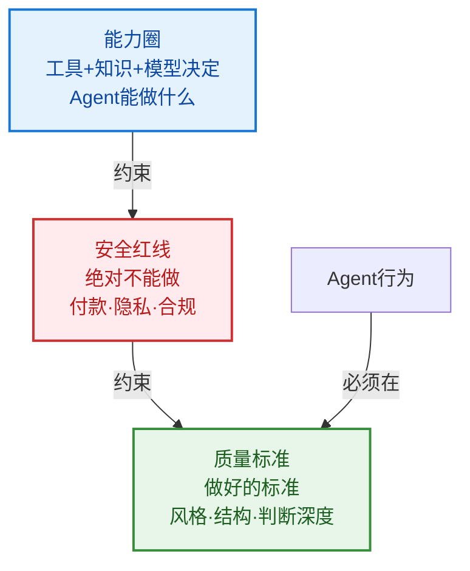

## 一、为什么策略引擎最容易被低估

很多人做Agent喜欢讲模型、工具、知识库，但上线以后最容易出事的往往是策略。**策略引擎（Policy Engine）** 是最被低估的组件。

## 二、什么是策略引擎

策略引擎（Policy Engine）负责把业务规则、安全规则、权限规则、合规规则和成本规则，变成Agent执行过程中的强制约束。

> **策略引擎管的就是这些边界。它的作用不是让Agent更会写，而是让Agent不乱写。**

生活场景里，助理很聪明，但你必须给它规则：
- 预算不能超过2000元
- 未经确认不能付款
- 不能替你在家庭群里乱发消息

这些规则不是建议，而是红线——Agent不能"看情况发挥"。

## 三、策略引擎 vs 记忆系统

| 维度 | 记忆系统 | 策略引擎 |
|------|---------|---------|
| 职责 | 记录事实 | 把事实和规则变成行动边界 |
| 性质 | 描述性（是什么） | 规范性（不能做什么/必须做什么） |
| 变更频率 | 随任务和偏好演进 | 相对稳定，修改需审慎 |

## 四、文章Agent的三条关键策略

### 策略一：选题策略

- 选题必须和作者定位有关
- 最好有真实案例支撑
- 能展开成商业判断

### 策略二：内容安全策略

- 不能写空泛AI鸡汤
- 不能复述没有判断的案例
- 不能泄露未脱敏的私聊和客户信息

### 策略三：质量策略

- 开头必须有明确判断
- 文章必须有一个核心矛盾
- 不能写成咨询报告腔
- 要像作者本人写的公众号文章

## 五、策略边界约束图（Mermaid）

## 六、策略引擎的核心价值

很多AI内容的问题不是语言不好，而是没有判断标准、没有边界、也没有商业目标。策略引擎就是把这些标准、边界和目标写进系统。

> **传统产品经理交付的是功能。AI产品经理交付的是效果。而策略引擎是效果的硬约束保障。**

## 七、常见误区

1. **把策略当提示词**：在system prompt里写"不要泄露隐私"是软约束，模型可能忘记或忽略——策略引擎应该是硬约束
2. **没有灰度策略**：所有规则都一刀切，没有灵活度
3. **策略不可配置**：每次调策略都要改代码发版
4. **忽视成本策略**：只关注功能和安全，不控制模型调用成本
5. **策略和工具不分**：在工具层面做业务判断（正确做法是工具管能力，策略管使用）

---

[🏠 返回总览](00-overview.md) | [⬅️ 记忆系统](05-memory-system.md) | [➡️ 可观测性](07-observability.md)
