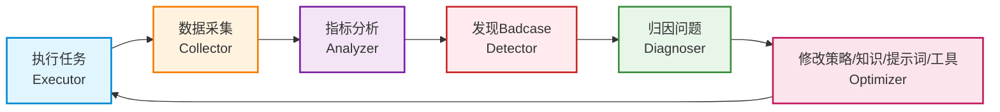

## 一、没有可观测性就没有Agent运营
你不知道它哪里好、哪里坏、哪里浪费成本、哪里反复出错——就无法优化。没有可观测性（Observability），就没有Agent运营。

## 二、什么是可观测性
可观测性（Observability）让你知道Agent到底干得怎么样——记录执行过程、追踪关键指标、发现问题、归因问题、驱动优化。

生活场景里，如果助理帮你安排家庭聚餐，办完以后你至少要知道：花了多少钱、哪些环节出过问题、下次还要不要继续选这家餐厅。否则这次办完下次还是从零开始。

## 三、文章Agent的数据追踪工作流
每篇文章发出去以后，需要追踪的数据：

| 指标 | 含义 | 解读 |
|------|------|------|
| 阅读数 | 标题和封面的吸引力 | 基础曝光 |
| 点赞数 | 内容的基本认可 | 浅层次认同 |
| 推荐数/在看 | 内容的深度认可 | 愿意推荐给朋友 |
| 转发数 | 内容的传播价值 | 最强认可，帮助传播 |
| 点赞率 | 点赞/阅读 | 阅读高点赞低 → 标题党 |
| 推荐率 | 推荐/阅读 | 阅读不高推荐高 → 选题窄但有深度 |
| 转发率 | 转发/阅读 | 判断内容的社交货币价值 |

## 四、数据解读的关键逻辑
- **阅读高但点赞推荐低**：标题可能有打开率，但内容没有形成深度认可（标题党）
- **阅读不高但推荐转发高**：选题可能窄，但判断有收藏和传播价值（深度好文）
- **各项都低**：从选题到内容都出了问题，需要具体分析

## 五、Badcase闭环
发布数据只能告诉你结果，不能直接告诉你原因。真正要优化Agent，得看Badcase。

### Badcase的价值
Badcase不是抱怨，而是优化Agent的原材料。比如：
- 写得太像AI
- 标题像营销号
- 案例没有脱敏
- 观点重复没有新意

### Badcase闭环流程（Mermaid图）

## 六、核心洞见
> **会做Agent的团队，不会指望一次写对，而是建立一套Badcase闭环：发现问题，归因问题，再修改策略、知识、提示词或工具。**
> 
> 可观测性不是技术后台的事情。对产品经理来说，它决定了你能不能把Agent从"能用"优化到"好用"。

## 七、可观测性三个层次

| 层次 | 内容 | 问题 |
|------|------|------|
| L1 执行日志 | 调用了什么工具、用了什么模型、花了多少token | 出了什么错？ |
| L2 业务指标 | 任务成功率、用户满意度、关键转化 | 效果好不好？ |
| L3 Badcase库 | 失败案例分类、根因标注、修复记录 | 怎么变好？ |

## 八、常见误区
1. **只看结果数据不看过程**：阅读量低要追溯到选题、素材、写作哪个环节出问题
2. **没有Badcase分类**：失败了不知道为什么失败
3. **数据和优化脱节**：收集了数据但不驱动策略/知识/工具的改进
4. **只关注成功指标**：失败案例比成功案例更有学习价值
5. **忽视成本观测**：不追踪token消耗和模型调用成本

---

[🏠 返回总览](00-overview.md) | [⬅️ 策略引擎](06-policy-engine.md) | [➡️ 配置管理](08-configuration.md)
