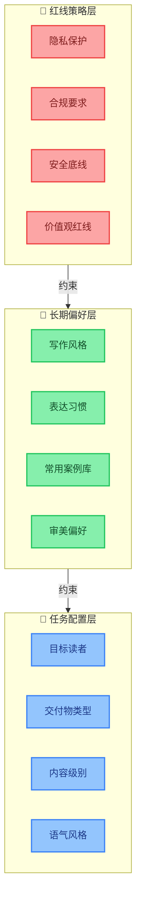

# 配置管理（Configuration Management）：持续调教面板

## 一、为什么产品经理必须理解配置管理

一个Agent（智能体）上线以后，不可能每次改规则都找开发发版：

- 今天想改选题标准
- 明天想调整标题风格
- 后天想把某类案例设为"只允许线下课使用"
- 下周想把新模型灰度给一小部分任务

这些都不能靠拍脑袋，也不能靠手工改Prompt（提示词）。配置管理（Configuration Management）听起来很技术，但产品经理一定要理解。

## 二、什么是配置管理

配置管理（Configuration Management）让Agent可以持续调教——不需要改代码、不需要重新发版，通过调整配置来改变Agent的行为。

生活场景里，助理也需要配置：

- 这次预算是1500元还是3000元？
- 这次优先考虑老人还是小孩？

这些配置会影响整个执行过程。

## 三、配置 vs 长期记忆/策略红线

| 维度 | 策略红线 | 长期记忆/偏好 | 任务配置 |
|------|---------|-------------|---------|
| 变更频率 | 极低（核心安全规则） | 低（风格偏好渐变） | 高（每次任务可能不同） |
| 谁来改 | 负责人审批 | Agent学习+人工确认 | 任务发起者设定 |
| 影响范围 | 全局不可逾越 | 跨任务一致性 | 单次任务 |
| 示例 | "不泄露客户隐私" | "作者不喜欢AI鸡汤" | "本次面向AI产品经理" |

> **配置管理不是重新定义你的长期写作风格，也不是修改那些不能碰的红线，而是告诉Agent：这一次任务怎么执行。**

## 四、文章Agent的配置项

同一个素材，面向不同读者、不同目的，输出不同：

| 配置项 | 选项 | 影响 |
|--------|------|------|
| 目标读者 | AI产品经理 / 软件公司老板 / 技术负责人 | 案例选择、术语深度、痛点侧重 |
| 核心交付物 | 深度长文 / 快速观点 / 教程指南 | 结构、长度、论证深度 |
| 内容级别 | 公开发布 / 内部沉淀 / 付费课程专属 | 案例脱敏程度、观点开放度 |
| 语气风格 | 犀利评论 / 温和分析 / 教学讲解 | 用词、句式、判断强度 |

## 五、配置管理层次图（Mermaid）

三层配置的约束关系：下层约束上层，上层不能突破下层。

## 六、配置管理的核心价值

> **这套配置管理的价值是：你不是每次都重新教Agent怎么写，而是通过配置告诉它"这次我要什么"。这才是可持续的Agent。**

没有配置管理的Agent，每次改变行为都要改Prompt甚至改代码——这是不可持续的。有了配置管理，同一个Agent底座可以服务多种场景。

## 七、常见误区

1. **配置硬编码**：把业务规则写死在代码里，每次调整都要发版
2. **配置和策略混淆**：把应该是策略红线的东西做成可配置（如隐私保护不能配置）
3. **没有配置校验**：不合理的配置值导致Agent行为异常
4. **配置项过多**：给用户太多配置项反而让人不知道怎么用——好的配置管理应该有合理默认值
5. **忽视配置版本**：不知道历史配置长什么样，出问题无法回滚

## 八、七大组件总结

至此七大组件全部介绍完毕。核心论点回顾：

- **模型网关（Model Gateway）**：大脑调度中心，什么任务用什么模型
- **工具注册表（Tool Registry）**：手脚管理，有什么工具、怎么调用
- **知识库引擎（Knowledge Base Engine）**：业务参考书，你的判断力缓存
- **记忆系统（Memory System）**：便签本和档案柜，上下文+偏好
- **策略引擎（Policy Engine）**：规则红线，让Agent不乱写
- **可观测性（Observability）**：运营仪表盘，数据追踪+Badcase闭环
- **配置管理（Configuration Management）**：持续调教面板，这次任务怎么执行

> **大模型解决智能问题，Harness解决交付问题。未来有价值的Agent，不是会聊天的Agent，而是能在具体业务里稳定交付结果的Agent。**

---

[🏠 返回总览](00-overview.md) | [⬅️ 可观测性](07-observability.md) | [➡️ 实践指南](09-practice-guide.md)
