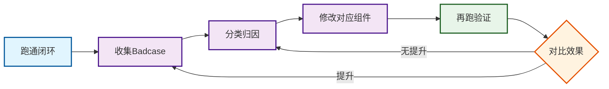

## 一、从理解到落地：实操路线图

学完七大组件，接下来是落地。本文以文章Agent（智能体）为例，给出从零搭建的实操步骤，包含四个阶段：定义→搭建→调优→运营。

## 二、阶段一：定义Agent（Before Coding）

在写任何代码之前，先想清楚以下五个问题：

### 2.1 你的Agent要交付什么结果？

不是"帮我写文章"——太模糊。要具体到：

- 产出什么格式（公众号文章/短评/提纲/选题建议）？
- 交付频率（每日/按需/每周）？
- 质量标准（像本人写的/不泄露隐私/有真实判断）？

### 2.2 你的业务知识有哪些？

列出Agent需要懂的"私有知识（Private Knowledge）"：

- 历史文章（观点、风格、案例）
- 行业判断框架（你的核心认知）
- 脱敏的客户/行业案例
- 不能公开的内容清单

### 2.3 什么能做、什么绝对不能做？

划清红线（Red Lines）：

- 不能泄露未脱敏的私聊内容
- 不能写空泛AI鸡汤
- 不能替你做需要确认的决策（如付款、公开发布）
- 不能用你没审核过的信息支撑核心观点

### 2.4 成功怎么衡量？

定义可观测的指标（Metrics）：

- 内容质量（点赞率、推荐率、转发率）
- 效率提升（选题到初稿的时间缩短多少）
- 成本控制（每篇文章的模型调用成本）

### 2.5 什么场景需要配置？

列出会因任务不同而变化的参数（Parameters）：

- 目标读者（产品经理/老板/技术人）
- 内容级别（公开/内部/付费）
- 文章类型（深度长文/短评/教程）

## 三、阶段二：搭建Harness七大组件

按优先级依次搭建：

### Step 1：配置模型网关（最先）

模型网关（Model Gateway）是整个系统的算力入口，优先级最高：

- 确定模型分层：强推理模型（Reasoning Model）用什么？成本适中的通用模型（General Model）用什么？规则任务（Rule-based Task）用什么？
- 实现路由逻辑：根据任务类型自动选择模型
- 加降级策略（Fallback Strategy）：强模型不可用时的备用方案

### Step 2：搭建工具注册表

工具注册表（Tool Registry）决定Agent能做什么动作：

- 列出最小工具集：读选题池、检索历史文章、保存草稿
- 为每个工具写清楚：用途、参数、返回值、失败处理
- 不要一上来就给20个工具——3-5个核心工具先跑起来

### Step 3：初始化知识库

知识库（Knowledge Base）是Agent的"认知来源"：

- 从最有价值的内容开始：最近20篇高质量历史文章
- 分类入库：观点类/案例类/框架类分开
- 加基本标注：哪些是公开观点、哪些是内部素材
- 不要追求"大而全"——少量高质量内容远胜大量低质内容

### Step 4：实现记忆系统

记忆系统（Memory System）让Agent有上下文连续性：

- 短期记忆（Short-term Memory）：当前文章的写作状态（选题、核心判断、被否掉的方向）
- 长期记忆（Long-term Memory）：先从硬编码偏好开始，后续再做动态学习
- 设计记忆生命周期：任务结束清理短期记忆，长期记忆定期review

### Step 5：配置策略引擎

策略引擎（Policy Engine）是Agent的"价值观"和"行为准则"：

- 安全红线（Security Policy）第一优先：内容脱敏、隐私保护、禁止越权操作
- 质量策略（Quality Policy）第二：写作风格要求、结构要求
- 选题策略（Topic Policy）第三：选题判断标准
- 策略要可配置——不要写死在代码里

### Step 6：接入可观测性

可观测性（Observability）是调优的基础：

- 记录每次执行：用了什么模型、调用了什么工具、花了多少token
- 记录发布数据：阅读、点赞、推荐、转发
- 建立Badcase（坏案例）记录表：分类（风格/事实/安全/结构）、根因、修复方案

### Step 7：添加配置管理

配置管理（Configuration）让Agent灵活适配不同场景：

- 先做简单的：任务级参数（读者、类型、级别）
- 提供合理默认值：80%的场景用默认配置即可
- 支持覆盖：特殊任务可以调整参数

## 四、阶段三：调优（上线前必做）

### 4.1 从一个最小闭环开始

不要试图一次做出完美Agent。先跑通一个完整闭环（Closed Loop）：

1. 给一个具体选题
2. Agent检索知识库
3. 生成提纲
4. 你审核反馈
5. 根据反馈修改
6. 产出初稿
7. 记录全过程数据

### 4.2 Badcase驱动调优

收集至少10个Badcase后再做系统性调优：

- 把Badcase按问题类型分类
- 每类问题归因到具体组件（策略问题/知识缺失/模型选错/记忆串台）
- 针对性修复，不要泛泛地"改Prompt（提示词）"

### 4.3 策略迭代流程

Badcase驱动的迭代流程图：

## 五、阶段四：持续运营

> **Agent上线不是结束，而是运营（Operations）的开始。**

### 5.1 定期review指标

- 每周看一次内容数据（阅读/点赞/推荐/转发）
- 每月看一次成本数据（各模型调用占比、总成本趋势）
- 每次重大调整后看Badcase变化趋势

### 5.2 知识库持续更新

- 新文章发布后及时入库
- 过时的判断标记或清理
- 定期补充新案例、新框架

### 5.3 记忆review

- 长期记忆是否准确反映你的偏好
- 有没有错误记忆需要修正
- 偏好变化后是否及时更新

## 六、常见落地坑与规避方法

| 坑 | 表现 | 规避方法 |
|----|------|---------|
| 一开始就做大而全 | 工具十几个、知识库几百篇文档，跑不起来 | 最小闭环优先，3个工具+20篇文章先跑通 |
| 只调Prompt不建组件 | 每次出问题都改system prompt，越改越乱 | 问题归因到组件，策略问题改策略、知识问题补知识 |
| 没有数据就优化 | 凭感觉"写得像AI"但没有数据支撑 | 先接可观测性，数据驱动决策 |
| 忽视配置管理 | 每次改风格都改代码 | 从第一天就考虑配置化 |
| 知识库质量低 | 什么都往里塞，Agent输出混乱 | 精选高质量内容，宁缺毋滥 |
| 没有红线策略 | Agent偶尔输出不当内容 | 安全红线优先于一切功能 |

## 七、实施检查清单

搭建你的文章Agent前，逐项确认：

- [ ] 我已经明确了Agent要交付的具体结果
- [ ] 我已经列出了私有知识清单
- [ ] 我已经划清了红线（什么绝对不能做）
- [ ] 我已经定义了成功指标
- [ ] 我已经确定了模型分层策略
- [ ] 我已经选好了最小工具集
- [ ] 我已经准备好了初始知识库内容
- [ ] 我已经设计了基本的策略规则
- [ ] 我已经想好怎么记录执行过程和结果数据
- [ ] 我已经准备好Badcase记录机制

---

[🏠 返回总览](00-overview.md) | [⬅️ 配置管理](08-configuration.md) | [➡️ 案例分析](10-case-study.md)
