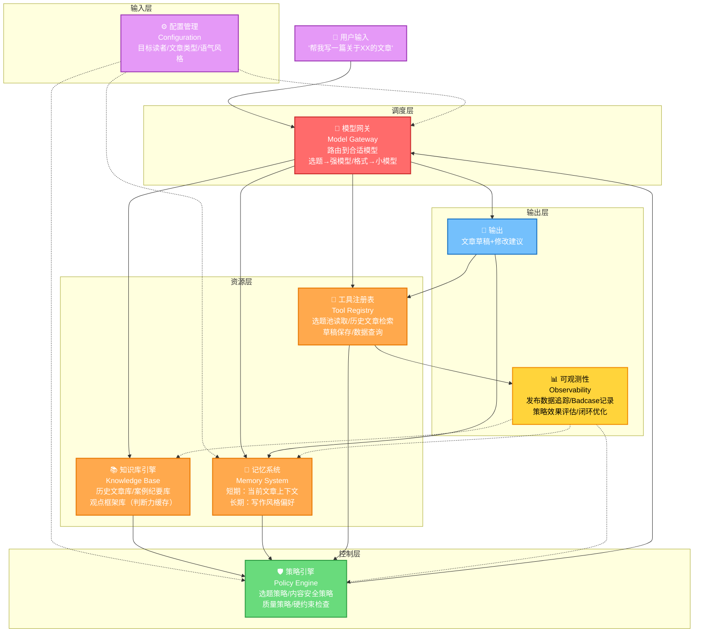
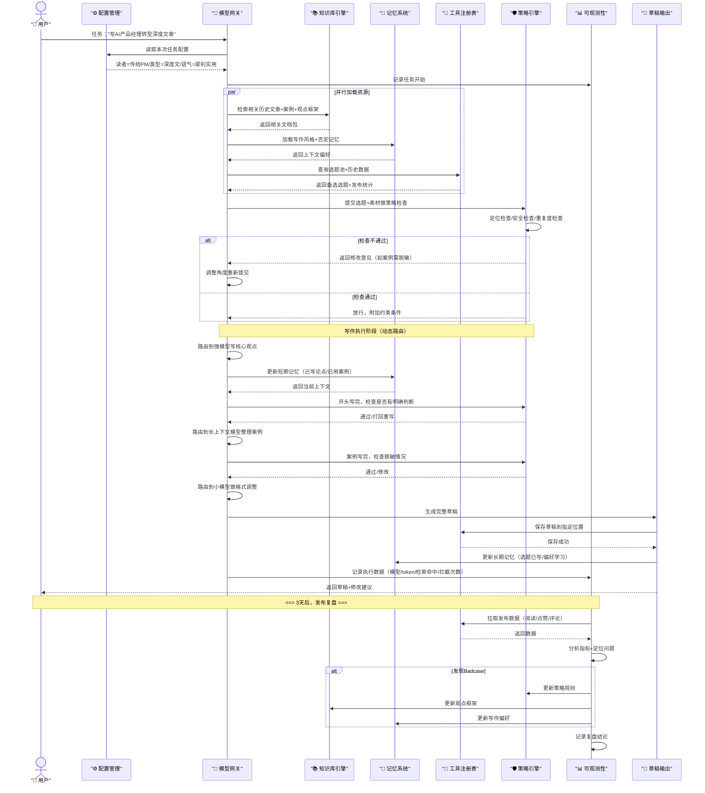

# 案例分析：文章写作Agent的Harness拆解

## 案例分析核心思路

前面的章节分别介绍了七大组件的定义和职责，但抽象的概念容易让人"知道是什么，不知道怎么用"。本文以"公众号文章写作Agent（Article Writing Agent）"为贯穿案例，对这个真实业务场景进行深度拆解，展示七大组件如何在实际任务中协同工作，让抽象理论变得可触摸、可复用。

这不是一个假想的Demo，而是从真实产品迭代中提炼出来的架构——你会看到每个组件的加入都对应着一个真实的Badcase，每个设计决策背后都有踩坑的教训。

## 一、案例背景

我们要做的不是一个"聊天机器人"，也不是一个"AI写作助手"，而是一个能完成**"选题→素材整理→初稿写作→修改→发布后复盘"完整链路的业务Agent**。它的目标是帮一个垂直领域的公众号作者持续产出高质量文章。

### 业务目标

- **风格一致性**：能持续产出符合作者风格和定位的文章，读者看了知道是"你写的"
- **效率提升**：减少重复劳动（素材整理、格式调整、标签生成），让作者把精力花在观点判断上
- **观点一致性**：不重复讲过的观点，不自相矛盾，形成连贯的认知体系
- **数据闭环**：能通过发布后的数据反馈持续优化写作策略

### 非目标（边界很重要）

- **不是全自动写作**：作者仍是最终决策者，Agent是"副驾驶"不是"代驾"
- **不追求"像人写的"**：追求"像你写的"——风格比"拟人化"重要一万倍
- **不追求通用写作**：只服务特定领域+特定风格，通用=平庸

---

## 二、文章Agent完整架构图

七大组件不是孤立存在的，它们围绕着具体的业务流组装成一个完整的系统。下图展示了文章写作Agent从接收用户指令到输出草稿并持续复盘的完整链路：

**架构说明：**

- **实线箭头**表示直接的数据流/调用流
- **虚线箭头**表示配置/反馈/更新流
- 颜色分层对应了Harness的五层结构：输入层→调度层→资源层→控制层→输出层
- 可观测性（OB）是唯一一个反向连接到所有组件的模块——它不直接参与任务执行，而是负责事后的闭环优化

---

## 三、一次完整任务的七组件协同

光有架构图还不够，我们需要看一次真实任务中，每个组件具体"做了什么"。

以一个具体任务为例：**"帮我写一篇关于AI产品经理转型的深度文章，面向传统软件公司的产品经理"**。

### 步骤1：任务接收与模型路由

用户发出指令后，最先介入的是**模型网关（Model Gateway）**和**配置管理（Configuration Management）**：

- **配置管理**立即读取本次任务的上下文参数：
  - 目标读者 = 传统软件公司的产品经理（不是互联网PM，不是技术人员）
  - 文章类型 = 深度长文（不是快讯，不是观点短文）
  - 语气风格 = 犀利但实用（不说教，不鸡汤，有具体路径）
  - 作者定位 = B端产品+AI落地实践者
- **模型网关**做出第一个路由判断：这是需要强推理的选题分析任务，不能用小模型 → 路由到最强推理模型
- 此时**可观测性（Observability）**开始记录：任务接收时间、用户ID、任务类型

> **💡 细节**：为什么"选题判断"必须用强模型？因为它需要理解"传统软件PM"和"互联网PM"的认知差异，需要判断什么角度对这个读者群是"刷新认知"而不是"正确的废话"——这是典型的复杂推理任务。

### 步骤2：知识检索与上下文加载

在模型开始写作之前，**知识库引擎（Knowledge Base Engine）**、**记忆系统（Memory System）**、**工具注册表（Tool Registry）**三个组件并行工作，为模型准备好"作战物资"：

- **知识库引擎**并行检索三类内容：
  1. **历史文章库**：过去写过的3篇AI产品经理相关文章，提取核心观点，避免重复
  2. **案例纪要库**：最近3个传统企业AI转型的一手案例（已脱敏），提取具体细节
  3. **观点框架库**（判断力缓存）：作者关于这个话题的核心判断——"不是转型做AI，而是用AI重做产品"、"AI产品成功≠商业成功"
- **记忆系统**加载两类记忆：
  1. **长期记忆**：作者的写作风格偏好（文章结构：先讲误区→再讲核心矛盾→最后给路径；开头必须有一个明确判断，不能铺垫）
  2. **否定记忆**：上次否掉的角度——不写"人人都是产品经理"式鸡汤，不写"AI会取代PM"式焦虑营销，不堆概念
- **工具注册表**调用两个工具：
  1. 读取选题池中"AI产品经理转型"相关的3个备选选题，看哪个角度最合适
  2. 查询历史文章发布数据：过去AI话题文章平均阅读量、点赞率、评论高频词

> **💡 细节**：为什么这三个组件要"并行"工作？因为它们之间没有依赖关系，串行会浪费等待时间。在真实系统中，这一步的并行检索能把准备时间从15秒压缩到3秒。

### 步骤3：策略检查

资源准备完毕后，不是直接交给模型写作，而是先经过**策略引擎（Policy Engine）**的"安检"：

策略引擎逐条检查硬约束：

1. **定位合规检查**：选题"AI产品经理转型"是否符合账号定位？→ ✓ 是核心主题，不是蹭热点
2. **内容安全检查**：检索到的案例是否已脱敏？→ ⚠️ 发现一个案例提到了真实客户名，标记需要在写作时替换为"某大型ERP厂商"
3. **观点明确性检查**：是否有一个核心矛盾/核心判断？→ ✓ 已有"不是转型做AI，而是用AI重做产品"作为核心主线
4. **重复度检查**：和历史文章观点重复度多少？→ 计算结果18%，主要在基础概念部分，属于正常范围
5. **红线规则检查**：有没有违反"不写鸡汤"、"不焦虑营销"等规则？→ ✓ 当前选题角度符合要求

如果任何一项检查不通过，策略引擎会直接返回给模型网关要求调整角度，甚至终止任务——这就是"硬约束"的含义：不是"建议你不要这么写"，而是"你不能这么写"。

### 步骤4：写作执行

通过策略检查后，任务正式进入写作执行阶段。这不是"一个模型从头写到尾"，而是**模型网关动态路由+记忆系统持续维护上下文+策略引擎实时约束**三者配合的过程：

- **模型网关**在写作过程中做三次动态路由切换：
  1. **核心观点论证阶段**（写核心矛盾、误区分析）→ 强推理模型，确保逻辑严密
  2. **案例整理填充阶段**（写具体案例、数据、操作路径）→ 中等模型+长上下文窗口，因为需要通读多个案例纪要
  3. **格式调整和标签生成阶段**（排版、加小标题、写摘要、生成标签）→ 小模型，快速便宜
- **记忆系统**在写作过程中持续更新和维护短期上下文：
  - 已经写了哪几个论点？（误区讲了3个，核心判断讲了1个，路径讲了2个）
  - 核心矛盾是什么？（"做AI产品"vs"用AI做产品"）
  - 哪些案例已经用过？（避免同一个案例重复举）
  - 写到多少字了？距离目标字数还差多少？
- **策略引擎**不是只检查一次，而是在关键节点做实时约束：
  - 写完开头 → 检查是否有明确判断？如果是铺垫式开头直接打回重写
  - 写完案例部分 → 检查是否有未脱敏的真实信息？
  - 写完结尾 → 检查是否又回到鸡汤？如果有"让我们一起拥抱AI时代"这种话直接删除重写

> **💡 细节**：为什么不从头到尾用强模型？成本是一方面，更重要的是——强模型在"格式调整"这种简单任务上反而容易"过度发挥"，小模型更听话。而且长上下文窗口的模型通常推理能力不是最强的，让合适的模型做合适的事才是最优解。

### 步骤5：输出与保存

初稿完成后，进入输出阶段，又是多个组件配合：

- **工具注册表**调用：
  1. 按照预设格式保存草稿到指定位置（飞书文档/Notion/本地Markdown）
  2. 自动生成文章摘要、封面图提示词、标签、推荐语
  3. 给作者发送通知，附上修改建议清单（哪些地方可能需要作者亲自调整判断）
- **可观测性**记录本次任务的完整数据：
  - 使用了哪些模型？各调用了多少次？
  - 总共消耗了多少token？各模型分别多少？
  - 知识检索命中了哪些文档？每个文档的相关度得分？
  - 策略引擎触发了几次拦截/打回？
  - 写作总时长是多少？
- **记忆系统**更新：
  1. 短期记忆清空（任务结束，当前文章上下文不再需要）
  2. 长期记忆更新：记录"AI产品经理转型"这个选题已写，下次遇到类似选题时提示"3个月内已写过同主题，建议换角度"
  3. 如果作者对初稿做了修改，记忆系统会学习修改偏好（比如"作者不喜欢用'赋能'这个词"）

### 步骤6：发布后复盘（关键的闭环）

Harness不是"写完就结束"了——文章发布3天后，**可观测性**模块自动触发复盘流程：

1. **数据收集**：自动拉取发布数据——阅读量、点赞数、在看数、转发数、收藏数、评论内容、完读率
2. **指标分析**：
   - 如果**阅读高但点赞低** → 说明标题/封面不错，但内容深度或共鸣不够，归因到"内容质量策略"需要调整
   - 如果**点赞高但转发低** → 说明内容有共鸣但缺乏"社交货币"（读者觉得好但不愿意转），归因到"选题策略"
   - 如果**评论高频词是"又是鸡汤"** → 这是严重的Badcase，需要回溯到写作过程，看策略引擎的"反鸡汤"规则为什么没拦住
3. **Badcase闭环**：
   - 如果发现是策略引擎的规则太松 → 收紧策略（比如把"不能出现'拥抱AI时代'"加入硬约束）
   - 如果发现是知识库的观点框架有问题 → 更新观点框架库
   - 如果发现是模型路由错误（比如核心观点用了中等模型）→ 优化模型网关的路由规则
4. **多组件更新**：复盘结论会反向更新到知识库引擎、策略引擎、记忆系统，形成完整闭环——这才是Harness能"越用越好"的原因。

> **💡 关键洞察**：很多人做Agent只做到"步骤5输出草稿"就结束了，但真正的价值在"步骤6复盘"。没有可观测性和闭环，你的Agent永远停留在"第一次用惊艳，越用越难用"的阶段。

---

## 四、组件协同时序图

上面的步骤描述是线性的，但真实执行中很多组件是并行交互的。下面的时序图更准确地展示了一次任务中各组件的消息流转：

**时序图要点说明：**

1. **并行加载**：知识库、记忆、工具三个组件在资源准备阶段是并行调用的（`par`块），而不是串行
2. **动态路由**：写作过程中模型网关多次切换模型，不是一次路由到底
3. **多次策略检查**：策略引擎不是只检查一次，而是在关键节点（开头写完、案例写完、结尾写完）都要检查
4. **记忆持续更新**：记忆系统在整个写作过程中持续被读写，不是只在开头加载一次
5. **闭环反馈**：可观测性的复盘是异步的（3天后），但它的输出会反向更新到策略、知识库、记忆三个组件

---

## 五、关键设计决策解析

这个架构不是第一天就设计成这样的——它是经过多次Badcase迭代出来的。下面四个关键设计决策，每一个背后都有真实的踩坑教训。

### 决策1：为什么模型网关分三层而不是两层？

**最初设计**：只分"强模型"和"弱模型"两层——需要推理用强模型，简单任务用弱模型。

**遇到的问题**：
- 有一类任务（比如通读10篇历史文章找素材、整理案例纪要），它不需要最强的推理能力，但需要很长的上下文窗口
- 强模型通常上下文窗口不是最大的，而且用强模型做"通读找素材"非常贵
- 弱模型上下文窗口小，装不下10篇文章，而且长文本理解能力差

**解决方案**：拆分为三层路由：

| 层级 | 模型类型 | 适用场景 | 成本 |
|------|---------|---------|------|
| L1 | 强推理模型 | 选题判断、核心观点论证、逻辑推演 | 高 |
| L2 | 长上下文模型 | 素材通读、案例整理、多文档综合 | 中 |
| L3 | 小模型/规则模型 | 格式调整、标签生成、简单分类 | 低 |

**教训**：模型路由分层不要一开始就设计太多层（不要上来就分5层），从"强/弱"两层开始，当你反复遇到某一类任务两层都不合适的时候，再拆分成三层——分层是演化出来的，不是设计出来的。

### 决策2：知识库的"判断力缓存"是什么意思？

**最初设计**：知识库就是一个RAG（检索增强生成）系统，把历史文章、资料文档存进去，需要的时候检索出来喂给模型。

**遇到的问题**：
- 检索命中率不稳定：有时候核心观点被淹没在长文里，检索出来的是无关的段落
- 断章取义：模型只看到检索出来的片段，不理解作者为什么这么说，容易用错
- 真正有价值的不是"作者写过什么"，而是"作者怎么判断"——比如"AI产品成功≠商业成功"这个判断，它不是某篇文章的原话，而是贯穿多篇文章的核心认知

**解决方案**：在知识库中专门分出一类"观点框架库"，不存原文，只存抽象出来的核心判断：
- 判断是什么（一句话）
- 为什么这么判断（支撑论据）
- 适用场景/边界条件
- 不适用什么场景
- 相关的文章索引

这就是**"判断力缓存（Judgment Cache）"**——把作者的判断力从文章中萃取出来，结构化存储，而不是让模型每次都从原文中重新"领悟"。

**教训**：知识库不是"资料堆"，而是"判断力的外部化存储"。你存进去的应该是"判断"，而不只是"信息"。信息RAG只能解决"知道什么"的问题，判断力缓存才能解决"怎么看"的问题。

### 决策3：策略引擎为什么不能靠Prompt？

**最初设计**：在System Prompt里写一堆规则：
> "不要泄露客户隐私"
> "不要写AI鸡汤"
> "开头必须有明确判断"
> "不要用'赋能''抓手'这类词"

**遇到的问题**：
- 模型在长文写作（5000字以上）中会"遗忘"这些约束，特别是在推理链较长的时候——写到第三部分就忘了开头的规则
- 规则没有强制力：模型"应该"遵守，但不是"必须"遵守，概率性违反
- 出了问题很难排查：你不知道是模型没理解规则，还是理解了但没遵守，还是遵守了但没做好
- 加太多规则在Prompt里会占token，反而影响核心任务的推理

**解决方案**：把核心策略从Prompt里移出来，做成策略引擎的**硬约束**：
- **脱敏检查**：在保存草稿前，自动扫描全文，用NER（命名实体识别）检测是否包含未脱敏的客户名、人名，有就标红拦截
- **反鸡汤检查**：维护一个"鸡汤词库"和"鸡汤句式库"，命中就提示修改
- **开头检查**：写完前300字后，自动分析是否有明确判断句，没有就打回
- **词频检查**：统计"赋能""抓手"这类词的出现频率，超过阈值提示替换

Prompt里只留"软引导"，核心红线必须是代码层面的硬检查。

**教训**：关键安全规则和质量底线必须是硬约束，不能依赖模型"记住"。Prompt是"建议"，策略引擎是"法律"——你不能靠建议来维持秩序。

### 决策4：记忆系统为什么需要"遗忘"？

**最初设计**：把所有历史对话、所有写过的文章、所有用户反馈都塞给模型作为上下文——"记得越多越好"。

**遇到的问题**：
- **Token成本飙升**：每次写作都带上几十篇历史文章，token费用很快就失控了
- **"串台"问题**：A文章的设定跑到B文章里——比如写To B文章时突然冒出To C的案例，作者自己都懵了
- **干扰核心推理**：无关记忆太多，模型注意力被分散，核心观点反而不突出
- **过时信息污染**：作者半年前的某个判断后来已经修正了，但旧判断还在记忆里，模型反复拿出来用

**解决方案**：设计三层记忆+主动遗忘机制：

| 记忆层级 | 存储内容 | 生命周期 | 遗忘机制 |
|---------|---------|---------|---------|
| 短期记忆 | 当前文章的写作上下文（已写论点、已用案例、当前结构） | 单次任务 | 任务结束立即清除 |
| 中期记忆 | 最近3个月写过的选题、近期的风格偏好变化 | 3个月 | 超过3个月自动归档，不默认加载 |
| 长期记忆 | 稳定的写作风格、核心观点框架、被反复验证的偏好 | 永久 | 定期"洗记忆"，过时的判断标记为"已更新" |

**教训**：好的记忆系统会忘记，不只是记住。遗忘不是缺陷，是特性——它保证了模型每次都专注在当前任务上，不被无关信息干扰。人类作家也不会每次写作都把自己这辈子写过的所有文章都回忆一遍。

---

## 六、从案例中提炼的Harness设计原则

看完上面的细节，我们从这个案例中提炼出五条可以迁移到任何Agent设计的普适原则：

### 原则1：组件为业务服务，不为架构服务

不需要的组件不要加。比如你做一个"客服FAQ机器人"，可能一开始根本不需要复杂的记忆系统——客户问完就结束，不需要记住上个月他问过什么。不要上来就把七大组件全堆上去，从最小可行Harness（MVH）开始。

**判断标准**：加一个组件之前，先问自己："我遇到了什么Badcase是现有组件解决不了的？"如果答不上来，就不要加。

### 原则2：Prompt解决不了的，用组件解决

当你发现某个问题（比如内容安全、风格一致性）反复出现，而且在Prompt里加了规则也没用——不要继续堆Prompt，把它变成一个组件的硬约束。

**简单判断**：如果这个规则违反一次就是严重事故，它就应该在策略引擎里；如果违反了只是"不太好"，它可以留在Prompt里。

### 原则3：从Badcase出发迭代

文章Agent的每一个组件、每一个设计决策，都是为了解决一个真实的Badcase：
- 模型选得不对成本高质量差 → 有了模型网关三层路由
- 检索断章取义观点用错 → 有了知识库的判断力缓存
- 模型写着写着就写鸡汤 → 有了策略引擎硬约束
- Token又贵又串台 → 有了记忆系统的遗忘机制
- 写完不知道好不好、怎么改进 → 有了可观测性闭环

不要"预先设计"所有组件，让Badcase驱动你的架构演化。

### 原则4：分层渐进，从轻量开始

模型网关从两层开始，按需拆成三层；知识库从简单RAG开始，按需加观点框架；策略引擎从几条硬规则开始，按需丰富；记忆系统从简单的上下文窗口开始，按需加分层和遗忘。

不要追求"完美架构"第一天就上线。先让Agent跑起来，解决一个具体问题，然后在使用中发现问题、迭代组件。

### 原则5：闭环思维，可观测性不是终点是起点

很多人把可观测性做成了"日志记录"——记了一堆数据但没人看，看完了也不改进。真正的可观测性是闭环的起点：数据→分析→归因→更新组件→验证效果。

没有闭环的Agent是"一次性工具"，有闭环的Agent才是"越用越好的系统"。

---

## 七、迁移框架：如果我要做XX Agent，Harness怎么套？

最后，我们把文章Agent的经验迁移到其他常见场景，给你一个可以直接套用的框架。当你要做一个新Agent时，用这张表快速思考每个组件应该做什么：

| 组件 | 客服Agent | 销售Agent | 研发辅助Agent |
|------|----------|----------|-------------|
| **模型网关 Model Gateway** | FAQ→小模型 复杂投诉→强模型 多轮安抚→中等模型 | 简单咨询→小模型 需求挖掘→强模型 报价计算→规则模型 | 代码补全→代码模型 架构设计→强模型 Bug定位→长上下文模型 |
| **工具注册表 Tool Registry** | 工单查询、退款处理 订单查询、知识库搜索 转人工接口 | CRM查询、客户历史 报价生成、合同模板 跟进记录写入 | Git操作、CI/CD触发 代码搜索、依赖查询 测试运行、部署接口 |
| **知识库引擎 Knowledge Base** | 产品FAQ、政策文档 历史工单（解决方案） 话术模板 | 产品资料、价格表 客户案例、竞品信息 销售话术库 | 代码库、API文档 技术规范、架构决策记录 历史Bug+解决方案 |
| **记忆系统 Memory System** | 当前对话上下文 客户历史问题 客户标签（短期） | 客户偏好、跟进阶段 历史沟通记录 客户画像（长期） | 当前PR/issue上下文 本次修改的文件 代码风格偏好（长期） |
| **策略引擎 Policy Engine** | 退款权限规则 敏感词过滤 投诉升级规则 服务话术规范 | 报价底线折扣 合规要求（不能乱承诺） 跟进SLA时限 客户分级规则 | 代码规范检查 安全规则（不能泄露密钥） CR要求（谁能approve） 测试覆盖率要求 |
| **可观测性 Observability** | 问题解决率、满意度 转人工率、平均响应时间 高频问题、Badcase复盘 | 转化率、客单价 跟进时效、成单周期 丢单原因分析 | 代码采纳率、Bug引入率 CR通过率、审查时长 高频问题类型 |
| **配置管理 Configuration** | 产品线、服务语言 服务等级（VIP/普通） 渠道（电话/在线/APP） | 行业、客户级别 销售阶段、产品品类 活动政策 | 项目类型、语言栈 团队规范、环境（dev/prod） 框架版本 |

**使用方法**：
1. 先填这张表，想清楚每个组件在你的场景里具体是什么
2. 标记哪些是MVP必须的，哪些是后面迭代可以加的
3. 从最核心的2-3个组件开始，先跑通一个最小场景
4. 在使用中收集Badcase，按需添加和强化其他组件

---

## 本章小结

通过文章写作Agent的深度拆解，我们看到：

- 七大组件不是"理论分类"，而是在真实业务中协同工作的"工作系统"
- 每个组件的加入和设计都对应着真实的Badcase，不是凭空架构出来的
- 模型网关动态路由、记忆主动遗忘、策略硬约束、可观测性闭环——这些设计细节决定了Agent是"Demo"还是"产品"
- Harness的设计原则可以迁移到任何业务场景：业务驱动、Badcase迭代、分层渐进、闭环思维

下一章我们整理常见问题FAQ，回答大家在实践中最容易困惑的问题。

---

[🏠 返回总览](00-overview.md) | [⬅️ 实践指南](09-practice-guide.md) | [➡️ 常见问题](11-faq.md)
