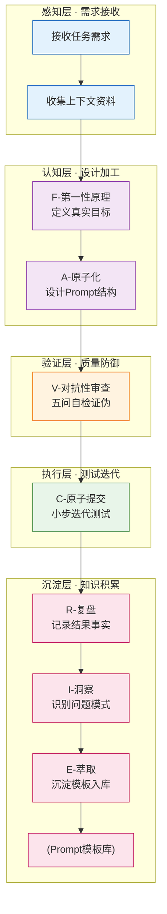

# 七概念方法论与Prompt Engineering映射

---

## 1. 章节引言：为什么用七概念理解Prompt Engineering？

理解了GPT-5.6时代"从规定过程到明确目标"的范式变革之后，你可能会问：**"目标导向"说起来容易，具体怎么做呢？有没有一套系统化、可操作的框架来指导我写出高质量的Prompt？**

答案是肯定的。SpecWeave项目经过18天1258+次提交实战验证，提炼出了一套R-I-E-C-A-F-V七概念方法论体系。这套方法论原本用于软件项目治理，但我们发现它天然适用于Prompt Engineering——因为写Prompt本质上也是一个"定义目标→设计结构→验证质量→小步迭代→沉淀复用"的认知闭环过程。

七概念方法论为Prompt写作提供了三大核心价值：

| 价值 | 说明 |
|------|------|
| **可验证** | 每个概念都有明确的输入输出、质量标准、检查清单，不是"凭感觉"写Prompt |
| **可复用** | 验证有效的Prompt模式可以萃取为模板，跨场景复用，不用每次从零开始 |
| **可演进** | 通过复盘-洞察-萃取闭环，你的Prompt能力会持续积累提升，而不是"每次都靠灵感" |

---

## 2. ⚠️ 重要声明

**七概念方法论映射为SpecWeave方法论整合内容，非OpenAI官方观点。**

- R(复盘)、I(洞察)、E(萃取)、C(原子提交)、A(原子化)、F(第一性原理)、V(对抗性审查)七概念体系来源于SpecWeave项目实战总结
- 本章节将七概念方法论映射到Prompt Engineering领域，属于SpecWeave团队的研究成果
- OpenAI官方Prompt指南的核心原则会在后续章节（03-GCOB框架、04-新范式规则）中单独说明
- 七概念映射为🔵B级可信度——基于官方指南的合理推导+实战验证，但非OpenAI官方发布

---

## 3. 七概念到Prompt编写环节的映射表

七概念（R-I-E-C-A-F-V）完整覆盖了Prompt从构思到沉淀的全生命周期：

| 概念 | Prompt编写阶段 | 核心作用 | 关键产出物 |
|------|---------------|---------|-----------|
| **F(第一性原理)** | 目标定义阶段 | 从"要做什么"的本质出发，剥离隐含假设，定义Goal/Boundaries | 清晰的目标陈述、完成标准、约束边界 |
| **A(原子化)** | Prompt结构设计 | 将复杂Prompt分解为Context/Request/Output/Constraints/Checkpoint模块化结构 | 五段式结构化Prompt草稿 |
| **V(对抗性审查)** | Prompt自检 | 写完后用五问清单证伪，寻找反例和边界漏洞 | 自检通过的Prompt终稿、风险点记录 |
| **C(原子提交)** | Prompt迭代 | 小步验证Prompt效果，每次只改一个变量，可回滚 | 迭代记录、效果对比数据、最优版本 |
| **R(复盘)** | 结果回顾 | Prompt执行后总结什么有效什么无效，积累事实 | 复盘记录（事实+数据，无主观判断） |
| **I(洞察)** | 模式识别 | 从多次复盘中识别Prompt问题模式，形成四元组洞察 | 可迁移的问题/成功模式（C→M→A→B格式） |
| **E(萃取)** | 模板沉淀 | 将验证有效的Prompt抽象为可复用模板/模式 | Prompt模板库、反模式库、最佳实践 |

🔵 **可信度评级：B级** —— 方法论框架经过项目实战验证，可操作可落地。

---

## 4. 五层模型视角下的Prompt编写认知过程

七概念方法论的五层模型（感知→认知→验证→执行→沉淀）完美对应了Prompt编写的完整认知过程：

**各层级核心职能说明**：

| 层级 | 对应Prompt阶段 | 核心问题 |
|------|---------------|---------|
| **感知层** | 需求理解 | 我到底要解决什么问题？需要哪些背景信息？ |
| **认知层** | 设计阶段 | 真实目标是什么？Prompt应该怎么结构化？ |
| **验证层** | 自检阶段 | 这个Prompt有没有漏洞？会不会产生歧义或越界？ |
| **执行层** | 测试阶段 | 实际效果如何？哪个变量影响了结果？ |
| **沉淀层** | 复用阶段 | 哪些写法有效？能提炼成模板下次直接用吗？ |

---

## 5. 七概念驱动的Prompt编写完整工作流（6步）

基于七概念映射，我们整理出一套可直接执行的6步Prompt编写工作流：

### 步骤1：F-定义目标（第一性原理）

**做什么**：用第一性原理明确Goal和完成标准，剥离所有隐含假设。

**关键问题清单**：
- 我真正想要的交付物是什么？（不是"帮我分析"，而是"给出3条可执行建议+支撑数据"）
- "完成"的标准是什么？（字数？格式？数据来源？要避免什么？）
- 有什么隐含假设我没有说出来？（"专业"具体指什么？"简洁"是多少字以内？）
- 什么是绝对不能做的？（边界和红线）

**输出**：一句话目标陈述 + 3-5条明确的完成标准 + 约束边界。

### 步骤2：A-结构设计（原子化）

**做什么**：将Prompt原子化分解为五段式模块化结构。

**标准五段结构**：
| 模块 | 作用 | 示例 |
|------|------|------|
| **Context（上下文）** | 提供必要背景信息 | "以下是我们的产品文档：[文档内容]" |
| **Request（请求）** | 清晰说明要做什么 | "请帮我写一篇产品发布文案" |
| **Output（输出要求）** | 交付物格式和质量标准 | "字数300-500字，分3段，包含3个核心卖点" |
| **Constraints（约束）** | 什么不能做、要避免什么 | "不要用技术术语，不要夸大，不要提到竞品" |
| **Checkpoint（检查点）** | 交付前要自检什么 | "写完后检查：卖点是否与文档一致？是否有夸大表述？" |

**输出**：五段式结构化Prompt草稿。

### 步骤3：V-对抗自检（对抗性审查）

**做什么**：用五问清单从反方视角攻击你的Prompt，寻找漏洞和歧义。

**五问自检清单**：
1. ❓ **目标清晰吗？** —— 一个陌生人看到这个Prompt，能准确知道要交付什么吗？有没有模糊词汇（"专业""美观""深入"）？
2. ❓ **完成标准可验证吗？** —— 拿到输出后，我能明确判断"合格/不合格"吗？还是只能"凭感觉"？
3. ❓ **有没有需要猜测的地方？** —— 模型需要脑补哪些信息？我是不是省略了关键上下文？
4. ❓ **有没有越界空间？** —— 模型会不会输出我不想要的内容？有没有说清楚什么不能做？
5. ❓ **什么时候应该停下来？** —— 模型知道什么时候算做完了吗？会不会无限展开？

**输出**：修正后的Prompt终稿，记录发现的风险点。

### 步骤4：C-小步测试（原子提交）

**做什么**：发送Prompt测试效果，每次只改一个变量，确保可回滚。

**测试原则**：
- 首次测试用最小可行版本，不要追求"一次完美"
- 效果不好时，每次只改一个地方（如只改输出要求，或只补充上下文）
- 记录每次修改了什么、效果有什么变化
- 改坏了随时回退到上一个有效版本

**输出**：测试记录、效果对比、最优Prompt版本。

### 步骤5：R-结果复盘（复盘）

**做什么**：Prompt执行后，客观记录什么有效、什么无效，只记事实不加判断。

**复盘记录格式**：
- ✅ **什么有效**：（具体事实，如"明确列出3个问题，模型都准确回答了"）
- ❌ **什么无效**：（具体事实，如"'不要泛泛而谈'这个约束没有生效，还是有空话"）
- 📊 **关键数据**：（token消耗？输出字数？一次成功率？修改了几次？）

**注意**：复盘阶段只记录可验证的事实，不要下结论（不要说"模型理解能力差"，要说"第2点约束没有被遵守"）。

**输出**：客观的复盘事实记录。

### 步骤6：I+E-沉淀迭代（洞察+萃取）

**做什么**：从多次复盘中识别模式，萃取可复用的Prompt模板。

**I（洞察）**：从复盘中提炼可迁移的规律，用四元组格式：
> `[条件C]` → 因为`[机制M]` → 做`[行动A]` → 导致`[结果B]`
>
> 示例：`[写文案时只说"要专业"]` → 因为`["专业"是主观词汇没有统一标准]` → 做`[明确说明专业的具体标准（如"面向技术决策者，用数据说话，不用形容词"]` → 导致`[输出质量稳定性提升60%]`

**E（萃取）**：将验证有效的Prompt抽象为模板，归入模板库。标注：
- 适用场景
- 输入槽位（哪些地方需要替换）
- 已知边界（什么情况下不适用）
- 质量检查点

**输出**：可复用Prompt模板、反模式记录、个人/团队Prompt库更新。

---

## 6. 与OpenAI GCOB框架的对应关系说明

七概念方法论是SpecWeave的治理框架，而GCOB（Goal-Context-Output-Boundaries）是OpenAI官方推荐的Prompt结构化框架。两者不是互斥关系，而是分层互补的关系：

| 维度 | 七概念方法论 | GCOB框架 |
|------|-------------|---------|
| 定位 | 全生命周期治理框架（从构思到沉淀） | Prompt结构化设计框架（单次写作） |
| 覆盖范围 | F-A-V-C-R-I-E 7个概念覆盖完整闭环 | G-C-O-B 4个要素聚焦Prompt结构本身 |
| 层级 | 元方法论层（指导"怎么做事"） | 实践框架层（指导"怎么写"） |

**对应关系**：
- F(第一性原理定义目标) → 对应G(Goal)
- A(原子化结构设计)中的Context模块 → 对应C(Context)
- A(原子化)中的Output/Checkpoint模块 → 对应O(Output)
- V(对抗性审查识别漏洞) + Constraints模块 → 对应B(Boundaries)

简单来说：**GCOB告诉你Prompt里要写什么，七概念告诉你整个流程怎么管理——从理解需求到测试迭代到沉淀复用**。后续章节（03-GCOB框架详解）会深入讲解GCOB四要素。

---

## 7. 本章小结

### 7.1 核心要点回顾

1. **为什么用七概念**：提供可验证、可复用、可演进的Prompt工程方法论，告别"凭感觉写Prompt"
2. **七概念全链路覆盖**：F(目标定义)→A(结构设计)→V(对抗自检)→C(小步测试)→R(结果复盘)→I(模式识别)→E(模板沉淀)
3. **五层认知模型**：感知层→认知层→验证层→执行层→沉淀层，完整对应Prompt编写认知过程
4. **6步工作流可直接执行**：定义目标→结构设计→对抗自检→小步测试→结果复盘→沉淀迭代
5. **与GCOB互补而非互斥**：七概念是全流程治理框架，GCOB是单次写作结构框架，两者结合使用效果最佳

### 7.2 下一步

掌握了七概念方法论的整体框架之后，下一章我们将深入学习OpenAI官方推荐的GCOB四要素框架——这是结构化Prompt写作的具体操作指南，告诉你Prompt里具体应该写什么、怎么组织。

👉 继续阅读：[03-gcob-framework.md](03-gcob-framework.md)（GCOB四要素框架详解）
👉 返回上一章：[01-paradigm-shift.md](01-paradigm-shift.md)（GPT-5.6范式变革）

---

*本文件版本：v1.0 | 创建日期：2026-07-13 | 状态：🚧 建设中*
