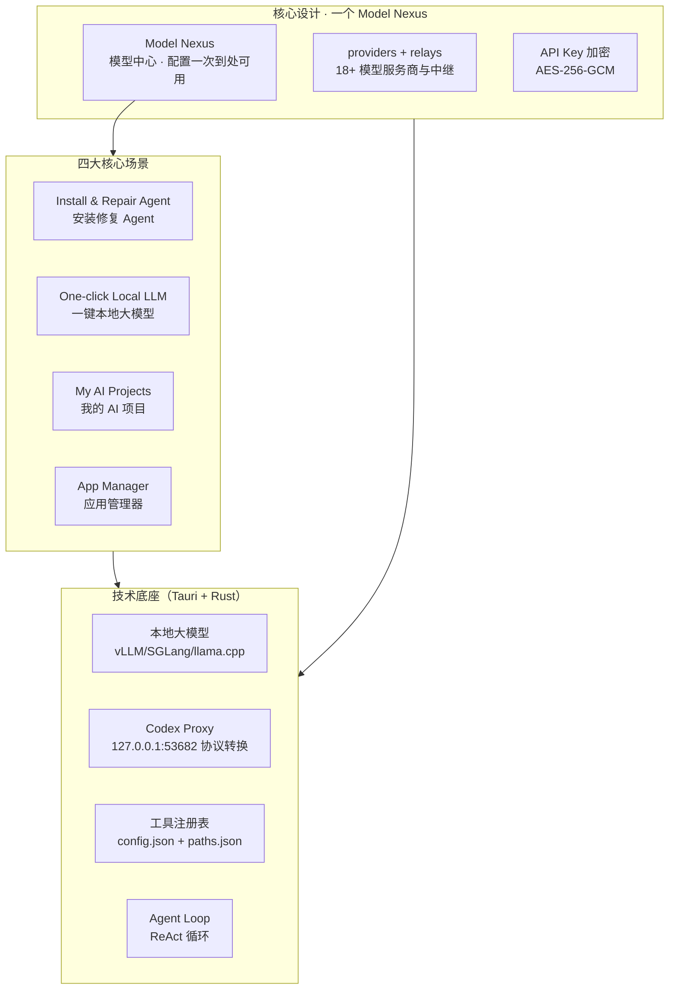

# 00 教程总览与知识地图

## EchoBird 产品生态全景图

## 12 章导航表

| 章号 | 标题 | 核心内容 | 适合人群 | 预计阅读时间 |
|------|------|---------|---------|-------------|
| 00 | 教程总览与知识地图 | 生态全景图、12章导航、三条阅读路径 | 所有读者 | 3 分钟 |
| 01 | 产品定位与核心价值 | 解决60%安装配置痛点、配置一次到处可用 | 初学者 | 5 分钟 |
| 02 | 技术架构深度解析 | Tauri+Rust前后端分层、入口初始化流程、依赖清单 | 开发者 | 8 分钟 |
| 03 | Model Nexus 模型中心 | modelDirectory.json数据模型、API Key加密、配置一处生效 | 开发者 | 8 分钟 |
| 04 | 四大核心场景 | 安装修复/本地大模型/AI项目/应用管理器的源码实现 | 开发者 | 10 分钟 |
| 05 | 本地大模型服务 | vLLM/SGLang/llama.cpp引擎选择、GPU检测、模型下载 | 开发者/爱好者 | 10 分钟 |
| 06 | Codex Proxy 协议转换 | 127.0.0.1:53682绑定、Responses↔Chat转换、多厂商适配 | 开发者 | 10 分钟 |
| 07 | 工具注册表 | config.json/paths.json结构、25+工具、官方端点恢复 | 开发者 | 7 分钟 |
| 08 | 高级功能模块 | AiPulse/AiCareer/MotherAgent/Skills/SSH | 开发者 | 6 分钟 |
| 09 | 快速上手指南 | 四步快速上手：安装→装Agent→配模型→绑定启动 | 初学者 | 8 分钟 |
| 10 | 对比与趋势洞察 | 与同类工具对比、Agent桌面化趋势 | 架构师/决策者 | 7 分钟 |
| 11 | FAQ 与术语表 | 常见问题解答 + 核心术语词表 | 全体 | 5 分钟 |

## 三条阅读路径

### 路径一：快速上手路径（初学者 / AI Agent 工具使用者）
> **章节顺序**：01 产品定位 → 09 快速上手 → 11 FAQ → 00 总览
>
> **适用人群**：首次接触 EchoBird 的 AI Agent 工具使用者，目标是 15 分钟内建立核心认知并完成第一个 Agent 的运行。
>
> **合计预计阅读时间**：5 + 8 + 5 + 3 = **21 分钟**

### 路径二：源码深度开发路径（开发者 / 架构师）
> **章节顺序**：01 产品定位 → 02 架构 → 03 模型中心 → 04 四大场景 → 05 本地大模型 → 06 Codex Proxy → 07 工具注册表 → 08 高级功能 → 10 趋势
>
> **适用人群**：需要理解 EchoBird 完整技术实现、或借鉴其工程模式的开发者、架构师。
>
> **合计预计阅读时间**：5 + 8 + 8 + 10 + 10 + 10 + 7 + 6 + 7 = **71 分钟**

### 路径三：本地大模型专项路径（本地部署爱好者）
> **章节顺序**：01 产品定位 → 05 本地大模型 → 06 Codex Proxy → 09 快速上手 → 11 术语表
>
> **适用人群**：关注本地大模型部署、数据隐私、GPU 加速的爱好者。
>
> **合计预计阅读时间**：5 + 10 + 10 + 8 + 5 = **38 分钟**

## 与现有知识库的交叉引用矩阵

| 关联 wiki | 对应路径 | 关联章节 | 互补关系说明 |
|-----------|---------|---------|-------------|
| echobird-wiki.md（概念层文章版） | `../echobird-wiki.md` | 全文 | 文章版聚焦产品定位与四大场景的概念层，本教程聚焦源码实现的技术层，两者互为补充 |
| eve-wiki（Vercel Eve 框架） | `../eve-wiki/README.md` | 10 对比趋势 | Eve 是"目录即 Agent"的开源框架，EchoBird 是"桌面管理工具"，可对照理解「框架 vs 工具」两种 Agent 落地路线 |
| orca-wiki（Orca 多代理编排） | `../orca-wiki/README.md` | 10 对比趋势 | Orca 面向 100x 构建者的多 Agent 编排器，EchoBird 面向普通用户的一键 Agent 管理，可对照理解目标用户差异 |
| langgraph-implementation-roadmap | `../langgraph-implementation-roadmap.md` | 10 对比趋势 | LangGraph 是编程式图编排框架，EchoBird 是图形化桌面管理，可对照理解「代码编排 vs 可视化编排」 |

---

| 上一章 | 返回目录 | 下一章 |
|--------|---------|--------|
| ← 这是教程第 1 章 | [README](./README.md) | → [01 产品定位与核心价值](./01-product-positioning.md) |