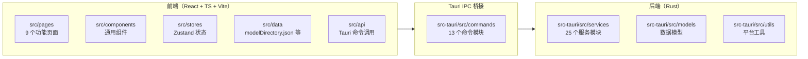

# 02 技术架构深度解析

## 2.1 总体架构：Tauri + Rust 前后端分层

EchoBird 采用 **Tauri v2 + Rust** 桌面应用架构，前端用 React + TypeScript + Vite，后端用 Rust。相比 Electron，Tauri 原生组件体积小、启动快、内存占用低，安装包约 50MB。

## 2.2 前端结构（src/）

| 目录 | 说明 |
|------|------|
| `src/pages/` | 9 个功能页面：ModelNexus、AppManager、LocalServer、MotherAgent、MyProjects、AiPulse、AiCareer、Skills、Feedback |
| `src/components/` | 通用组件：卡片、聊天气泡、对话框、侧边栏、下载条等 |
| `src/stores/` | Zustand 状态管理：toolsStore、navigationStore、themeStore、myProjectsStore、aiCareerStore |
| `src/data/` | 静态数据：modelDirectory.json（模型目录）、officialEndpoints.ts（官方端点） |
| `src/api/` | Tauri 命令封装：agent.ts、models.ts、localServer.ts、ssh.ts、tools.ts 等 |
| `src/hooks/` | 自定义 Hook：useI18n、useChatPersistence、usePulseScroll 等 |
| `src/i18n/` | 国际化：en / zh-Hans / zh-Hant / ja |

> **前端路由设计**：`App.tsx` 采用轻量路由，所有 Provider 常驻挂载，页面通过 CSS 显隐切换（避免重挂载），保证切换标签页不丢失状态。

## 2.3 后端结构（src-tauri/src/）

| 目录 | 说明 |
|------|------|
| `services/` | 25 个核心服务模块（见下表） |
| `commands/` | 13 个 Tauri 命令模块，暴露给前端调用 |
| `models/` | 数据模型：model.rs、tool.rs、skill.rs |
| `utils/` | 平台工具：platform.rs |
| `lib.rs` | 应用入口，`run()` 构建 Tauri 上下文 |

### 后端服务模块（services/）

| 模块 | 职责 |
|------|------|
| `model_manager.rs` | 模型 CRUD、API 测试、Ping、API Key 加密（`~/.echobird/config/models.json`） |
| `model_directory.rs` | 模型目录读取（modelDirectory.json） |
| `tool_manager.rs` | 工具定义加载、已装工具检测、配置管理 |
| `tool_config_manager.rs` | 向各工具写入原生配置（如 `~/.codex/config.toml`） |
| `tool_patcher.rs` | 工具补丁（如 Claude Desktop 中文补丁） |
| `local_llm/` | 本地大模型：types/settings/gpu/server/proxy/model_store/pid_file/custom_command |
| `codex_proxy/` | Codex Responses↔Chat 协议代理（127.0.0.1:53682） |
| `anthropic_proxy/` | Anthropic 协议代理 |
| `agent_loop.rs` | 核心 ReAct 循环（Reason→Act→Observe→Repeat） |
| `agent_tools.rs` | Agent 可调用的工具集 |
| `auto_fix.rs` | 自动修复逻辑 |
| `skill_manager.rs` | Skill 管理 |
| `usage_providers/` | 11 个用量查询提供方（DeepSeek/Kimi/MiniMax/Volcengine 等） |
| `ssh.rs` | SSH 客户端 |
| `ai_career.rs` | AI 职业模块 |
| `parasite.rs` | 寄生/进程管理扩展 |
| `self_update.rs` | 自更新 |
| `process_manager.rs` | 进程管理（含 Codex 启动） |
| `bundled_assets.rs` | 打包安装资产（install json 注册表） |
| `pulse_archive.rs` | AI 新闻归档 |
| `datalog.rs` / `json_repair.rs` / `llm_client.rs` / `codex_catalog.rs` / `codex_session_merge.rs` | 辅助（日志、JSON 修复、LLM 客户端、Codex 目录、会话合并） |

## 2.4 入口初始化流程（lib.rs）

`lib.rs` 的 `run()` 函数构建 Tauri 应用，核心流程：

1. **BundledAssets 注册**：编译期将 `docs/api/tools/install/*.json` 安装参考表打包进二进制（26 个工具，含 claudecode/codex/opencode 等）
2. **单实例守护**：`tauri-plugin-single-instance` 保证二次启动时聚焦已有窗口，不重复开进程
3. **窗口状态持久化**：手动管理 `~/.echobird/window-state.json`，保存窗口位置/大小
4. **托盘图标**：`TrayIconBuilder` 构建托盘菜单（显示/退出），支持中英双语
5. **macOS 应用菜单**：`install_macos_menu` 为 macOS 增加 Settings…/Feedback 菜单项
6. **孤儿进程清理**：`kill_stale_llama_server()` 清理上次会话遗留的 llama-server 进程
7. **Codex Proxy 启动**：`services::codex_proxy::spawn_proxy_task()` 在后台 tokio 任务绑定 127.0.0.1:53682
8. **命令注册**：注册 model_commands、tool_commands、settings_commands、agent_commands 等 13 个命令模块

## 2.5 关键依赖清单（Cargo.toml）

| 依赖 | 用途 |
|------|------|
| `tauri` v2 | 桌面应用框架（protocol-asset、tray-icon） |
| `tauri-plugin-shell/dialog/clipboard-manager/log/autostart/single-instance/window-state` | Tauri 插件 |
| `axum` v0.8 | Codex Proxy HTTP 服务器（127.0.0.1:53682） |
| `reqwest` v0.12 | HTTP 客户端（SSE 流、gzip） |
| `rusqlite` | SQLite（读取 OpenCode 会话库） |
| `aes-gcm` / `hmac` / `sha2` / `hex` | API Key 加密 |
| `async-ssh2-tokio` | SSH 客户端 |
| `reqwest-eventsource` | Agent Loop 的 LLM 流式调用 |
| `row` `winreg`（Windows） | 注册表扫描检测已装工具 |

---

| 上一章 | 返回目录 | 下一章 |
|--------|---------|--------|
| ← [01 产品定位与核心价值](./01-product-positioning.md) | [README](./README.md) | → [03 Model Nexus 模型中心](./03-model-nexus.md) |