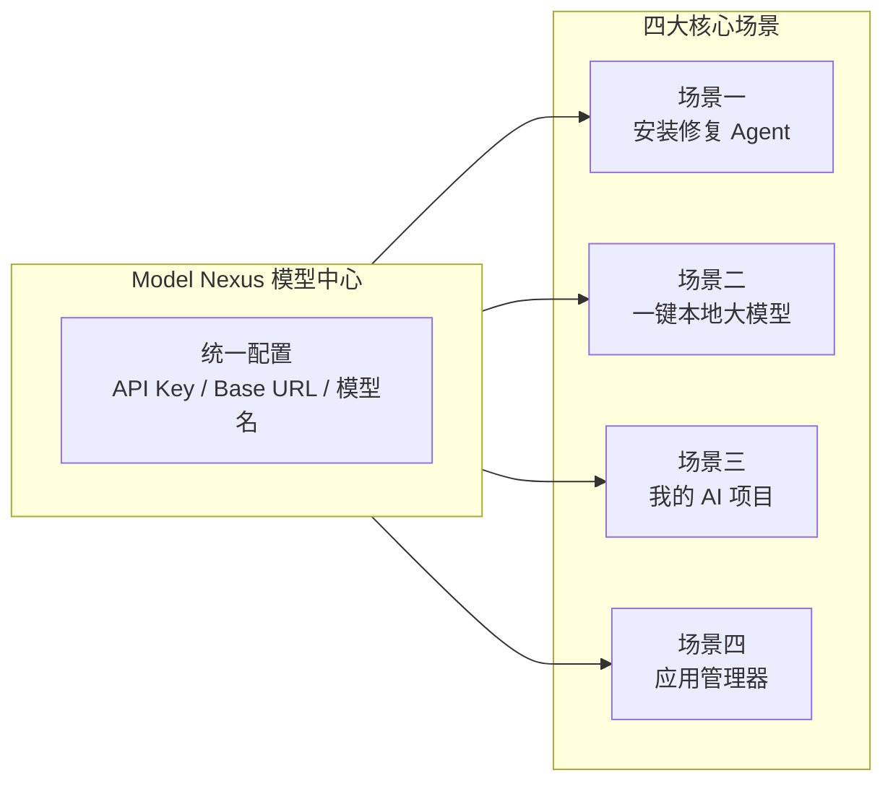
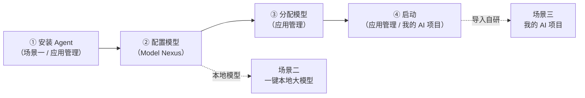

# 04 四大核心场景

EchoBird 把"把 AI 工具用起来之前那段路铺平"的产品哲学，落实到 **四个核心场景** 上：安装修复 Agent、一键本地大模型、我的 AI 项目、应用管理器。它们共享同一个 **Model Nexus（模型中心）**——统一管理 API Key / Base URL / 模型名的数据中心，从而形成"**安装 Agent → 配置模型 → 分配模型 → 启动**"的顺滑闭环，全程无需手改配置文件。

先看整体架构：

| 场景 | 对应页面 | 一句话定位 |
|------|---------|-----------|
| 场景一·安装修复 Agent | MotherAgent | 对话式 AI 自动安装与排查 Agent 工具 |
| 场景二·一键本地大模型 | LocalServer | 三步启动本地大模型推理引擎 |
| 场景三·我的 AI 项目 | MyProjects | 导入自研 AI 应用/游戏统一管理 |
| 场景四·应用管理器 | AppManager | 卡片式启动面板，一键启停与切换模型 |

---

## 4.1 场景一·安装修复 Agent（Mother Agent）

### 4.1.1 功能说明

**安装修复 Agent（Mother Agent）** 是一个对话式 AI 助手：你直接用自然语言告诉它"装一个 XX"或"帮我修一下 XX 报错"，它会自动分析环境、安装 Agent 工具、排查并修复配置问题。它支持**本地诊断**（分析本机环境）与**SSH 远程协助**（连接远程服务器执行操作）两种工作模式。

### 4.1.2 操作流程

1. 在 **Mother Agent** 页面输入自然语言指令（如"安装 Claude Code"）；
2. 在右侧选择模型（来自 Model Nexus）与目标服务器（本地 `local` 或已配置的 SSH 服务器）；
3. 发送后，Agent 进入 **ReAct 循环**，边思考边调用工具，实时流式展示思考过程与工具调用；
4. 完成后返回结果；若中途报错，可继续追问"再排查一下"。

> 安装修复 Agent 也需要一个可用的模型来驱动推理。若本地模型未就绪，可配合场景二的一键本地大模型，或先在 Model Nexus 中配置云端模型。

### 4.1.3 源码实现要点

**核心：ReAct 循环（Reason→Act→Observe→Repeat）**，实现在 `src-tauri/src/services/agent_loop.rs`：

- **ReAct 循环**：模型先"推理"（Reason）得出下一步该做什么，再"行动"（Act）调用工具，然后"观察"（Observe）工具返回结果，如此循环直到任务完成。这是让 Agent 能自主完成多步任务的通用范式。
- **流式事件**：`AgentEvent` 枚举把循环过程实时推送到前端，包含 `text_delta`（文字增量）、`thinking`（思考过程）、`tool_call_start`（工具开始）、`tool_call_args`（参数）、`tool_result`（结果）、`done`（完成）、`error`（错误）、`state`（状态变化）等事件，前端据此渲染聊天流。
- **循环保护**：`recent_calls` 环形缓冲（容量 8）记录最近的工具调用哈希，同一 (工具, 参数) 重复 3 次（`LOOP_REPEAT_THRESHOLD = 3`）即触发"你在循环里"的合成结果；`MAX_TOOL_LOOPS = 150` 作为兜底上限；`MAX_CONTEXT_BYTES = 300_000`（约 300KB / 约 8 万 token）按字节控制上下文，避免长安装流程撑爆内存。
- **工具来源**：Agent 可调用的工具从**工具注册表**（`tools/` 目录）读取。每个工具一个子目录，通过 `config.json`（模型配置写入映射）与 `paths.json`（各平台安装路径）描述，由 `tool_manager.rs` 的 `load_tool_definitions` / `detect_tool` 加载并检测是否已安装。
- **远程协助**：`MotherAgentProvider.tsx` 管理 `sshServers` 列表（`loadSSHServers` / `saveSSHServer` / `removeSSHServer`），`agent_loop.rs` 通过 `server_ids` 把选中的 SSH 服务器传给循环，让工具操作可发生在远程主机上。
- **寄生模式**：`parasiteAgent` 支持把当前回合委派给已安装的 Claude Code CLI（`claudecode`）执行，而非走 EchoBird 自己的 `agent_loop`。

**工具清单（tools/ 目录，26+ 款）**：

| 工具 | 类型 | 说明 |
|------|------|------|
| `claudecode` | CLI 编程 | Claude Code CLI，Anthropic 官方编程助手 |
| `codex` | CLI 编程 | OpenAI Codex CLI + Desktop 集成资产 |
| `opencode` | CLI 编程 | 开源代码助手 |
| `hermes` | 框架 | 多功能 Agent 框架 |
| `openclaw` | 框架 | 开源 Agent 工作流框架 |
| `aider` | CLI 编程 | 与 Git 仓库深度集成 |
| `cursor` | IDE | AI 编程 IDE |
| `vscode` | IDE | VS Code 编辑器 |
| `trae` / `traecn` | IDE | Trae 编程环境 |
| `claudedesktop` | 桌面 | Claude Desktop 桌面应用 |
| `chatgptdesktop` | 桌面 | ChatGPT 桌面应用 |
| `geminidesktop` | 桌面 | Gemini 桌面应用 |
| `opencodedesktop` | 桌面 | OpenCode 桌面应用 |
| `grok` | 桌面 | Grok 桌面应用 |
| `kimicode` | 编程 | Kimi 编程助手 |
| `mimocode` | 编程 | 小米 MiMo 编程助手 |
| `qwencode` | 编程 | 通义千问编程助手 |
| `zcode` | 编程 | Z 编程助手 |
| `claudescience` / `openscience` | 科学 | 科学计算 Agent |
| `pi` / `workbuddy` / `coffeecli` | 工具 | 个人智能/工作助手/咖啡 CLI |
| `vibe-trading` | 交易 | 自动交易 Agent |
| `reversi` / `translator` | 游戏 | 内置示例（黑白棋 / AI 翻译） |

### 4.1.4 应用价值

- **降低安装门槛**：把"装一个 Agent 要敲一堆命令、查文档、配环境"变成一句自然语言，由 AI 自动完成；
- **问题自愈**：报错时无需自学排查，Agent 可本地诊断（缺运行环境 / 配置文件错误 / API Key 未配对）或远程协助；
- **多工具统一运维**：一个入口管理 26+ 款工具的安装与修复，避免逐个工具学习。

---

## 4.2 场景二·一键本地大模型（One-click Local LLM）

### 4.2.1 功能说明

**一键本地大模型** 让不依赖云端 API、有数据隐私诉求的用户，在本地启动一个大模型推理服务。它内置 **llama.cpp**、**vLLM**、**SGLang** 三种推理引擎（推理引擎即"把神经网络模型跑起来对外提供接口"的软件），自动完成引擎选择、模型下载、端口与 endpoint 配置。

### 4.2.2 操作流程

三步即可启动：

1. **选模型**：在右侧面板选择本地 GGUF 模型文件，或从模型商店（Store）下载一个模型（含量化版本与显存适配提示）；
2. **点 START**：点击 START 按钮，EchoBird 自动检测引擎状态、必要时先下载安装引擎；
3. **等待加载**：等待模型加载完成，底部状态栏显示可用的 OpenAI / Anthropic 兼容 endpoint。

### 4.2.3 源码实现要点

对应页面 `src/pages/LocalServer/LocalServer.tsx`，后端服务在 `src-tauri/src/services/local_llm/`（含 `server.rs`、`gpu.rs`、`model_store.rs`、`proxy.rs`、`settings.rs`、`pid_file.rs`、`custom_command.rs`、`types.rs`）。

- **引擎选择**：`runtimeOptions` 根据平台与 GPU 动态生成——vLLM / SGLang 仅在有 NVIDIA/AMD GPU 的 Linux 上提供，llama.cpp（`llama-server`）跨平台兜底；Linux + GPU 时默认 runtime 自动切到 vllm。
- **GPU 检测**：`getSystemInfo` / `getGpuInfo` / `detectGpu` 检测 OS、架构、NVIDIA/AMD GPU 与显存（`gpuVramGb`）。计算模式自动判定：有 GPU 用 GPU-Full（llama.cpp 走 CUDA 构建，macOS 走 Metal 构建），无 GPU 自动降级 CPU-only。
- **启动参数**：`startLlmServer(selectedModelPath, serverPort, gpuLayers, contextSize, runtime)` 注入 `-m` 模型路径、`--host`、`--port`、`--ctx-size` 等参数。默认端口 `11434`，上下文默认 `32768`（32K，确保 Mother Agent 系统提示词 + 工具定义约 2.2 万 token 放得下）。
- **模型下载**：`startDownload(model.huggingfaceRepo, variant.files)` 从 HuggingFace 下载模型，支持分片 GGUF（`XXXX-00001-of-00008.gguf`）自动合并；`normalizeStoreModels` 归一化模型商店数据。
- **endpoint 配置**：启动后同时暴露 OpenAI 兼容端点 `http://127.0.0.1:{port}/v1` 与 Anthropic 兼容端点 `http://127.0.0.1:{port}/anthropic`，任何 Agent 工具都能直接接入。
- **自定义命令**：`custom_command.rs` 支持高级用户以"逐行 token"格式改写 llama-server 启动命令（如 AMD 用户指向自己的 Vulkan 构建）。

### 4.2.4 应用价值

- **数据隐私**：模型完全本地运行，数据不出本机；
- **离线可用**：不依赖云端 API，无网络波动与按量计费；
- **零门槛部署**：把"装引擎、找模型、配参数、起服务"压缩成"选模型→点 START"，并对显存给出"轻松/良好/紧张/重/不可行"的适配提示。

---

## 4.3 场景三·我的 AI 项目（My AI Projects）

### 4.3.1 功能说明

**我的 AI 项目** 是一个"AI 工具集中管理站"：可以导入自己开发的 AI 应用或游戏，统一管理、统一启动。页面内置 Reversi（黑白棋）与 AI Translator（AI 翻译）两个示例，用于演示项目的导入方式。

### 4.3.2 操作流程

1. 点击 **+** 按钮添加项目；
2. 填写项目名称、图标路径、启动器路径（`.exe` / `.app` / 可执行文件）、`models.json` 路径；
3. 保存后项目以卡片形式出现在网格中；点击卡片可查看/编辑，`[delete]` 可移除；
4. 内置示例卡片不可删除，`[edit]` 打开只读检查器，`📁` 在系统文件管理器中打开参考目录以便学习。

### 4.3.3 源码实现要点

对应页面 `src/pages/MyProjects/MyProjects.tsx`，采用**双表架构**：

- **内置示例**：由 `BUILTIN_TOOL_IDS` 在代码中生成，参考副本沉淀在 `~/.echobird/<id>/`；每次渲染实时计算，不存 localStorage；`linkedToolId` 让内置示例复用 App Manager 的 `ToolCard` 与 `launch_game` 启动流程；`hiddenBuiltins` 列表支持隐藏（不可删除）。
- **用户项目**：存于 `localStorage`（经 `myProjectsStore`），支持增删改；字段为 `name` / `iconPath` / `launcherPath` / `modelsJsonPath`。
- **卡片渲染**：`ProjectToolCard` 复用 App Manager 的 `ToolCard`，内置示例隐藏 `[delete]`，两者都保留 `[edit]`。
- **图标安全**：`iconSrcFor` 对用户自定义文件路径走 Tauri 的 asset protocol（`convertFileSrc`），以在 WebView 中安全渲染本地图片。
- **启动现状**：内置示例点击即走 `launch_game` 流程；纯用户项目目前点击暂不启动（代码注释标注 Phase D 将接入其专用启动器）。

### 4.3.4 应用价值

- **自有 AI 资产统一入口**：把团队或个人自研的 AI 应用/游戏收进一个管理面板；
- **低代码演示**：内置示例（黑白棋、AI 翻译）展示"一个项目 = 图标 + 启动器 + models.json"的最小结构，便于学习与二次开发。

---

## 4.4 场景四·应用管理器（App Manager）

### 4.4.1 功能说明

**应用管理器** 是 EchoBird 的主启动面板：以**卡片网格**展示所有已安装的 Agent 工具与导入的项目，支持**一键启停**、**查看当前模型**、**切换模型**，并配合 Model Nexus 完成"分配模型 → 启动"的收尾动作。

### 4.4.2 操作流程

1. 打开 **应用管理** 页面，顶部刷新按钮手动触发工具扫描（`scanTools`），工具按分类分页展示；
2. 点击某个工具卡片，右侧出现模型列表（Model List Section），可为该工具选择模型并切换协议；
3. 底部栏勾选启动选项（如"应用后启动"、"应用配置"），点击启动按钮完成"分配模型 → 启动"；
4. 对第三方/代理 URL 不满意的模型，可点击 **Restore** 一键恢复到厂商官方端点。

### 4.4.3 源码实现要点

对应页面 `src/pages/AppManager/`（`AppManagerComponents.tsx` + `AppManagerProvider.tsx`），后端含 `src-tauri/src/services/process_manager.rs`。

- **分类分页**：`toolCategories` 提供 `ALL` / `IDE` / `CLI Code` / `AutoTrading` / `Game` / `Desktop` / `Utility` / `Science` 分类，`activeToolCategory` 过滤卡片。
- **工具检测**：`scanTools` 调用工具注册表扫描已安装工具；`detectedTools` 由 `toolsStore` 管理；`aiInstallableIds` 从打包的 `install/index.json` 读取可 AI 安装的工具 ID。
- **模型应用**：`applyModelConfig` 把 Model Nexus 的模型配置写入工具的原生配置文件（如 `~/.codex/config.toml`、`~/.claude/settings.json`），并依据协议（openai / anthropic）选择正确的 URL。
- **协议代理**：`Claude Desktop` / `Claude Code` 路由开关（`claudeDesktopRelayMode` / `claudeCodeRelayMode`）决定走直连还是走 `anthropic_proxy`（模型 ID 重写 + 协议转换）；Codex 的 `codexResponsesPassthrough`（Responses 直通）与 `codexWebSearch`（联网搜索开/关）等开关独立持久化。
- **一键启动**：`process_manager.rs` 管理工具进程——`start_tool` 用正确的命令与环境启动工具，`stop_tool` / `kill_desktop_instances` 终止进程，`CooldownSet` 提供 3 秒防抖防止误触快速重启。
- **调用接力**：`handleGoToMother` 把"安装 XX"预填给 Mother Agent（场景一），形成"装不上 → 交给 AI 修复"的闭环。

### 4.4.4 应用价值

- **一站式控制台**：所有 Agent 工具与项目统一在一个面板启停，无需在多个终端/应用间切换；
- **模型即点即换**：切换模型无需手动改配置文件，协议代理让切换即时生效；
- **顺滑闭环**：从"安装 Agent"到"配置模型"到"分配模型"到"启动"全流程在软件内完成，**全程不碰终端、不改配置文件、不查环境变量**。

---

## 4.5 场景联动：由 Model Nexus 串联的顺滑流程

四大场景并非孤立，而是由 Model Nexus 串联成一条完整链路：

| 步骤 | 依托场景 | 动作 |
|------|---------|------|
| ① 安装 Agent | 场景一 / 场景四 | 用 Mother Agent 对话安装，或从应用管理扫描已装工具 |
| ② 配置模型 | Model Nexus | 填写 API Key / Base URL / 模型名，一次配置 |
| ③ 分配模型 | 场景四 | 把模型绑定到某个工具，选择协议 |
| ④ 启动 | 场景四 / 场景三 | 一键启动工具或导入的自研项目 |

> 需要本地模型时，可在步骤②/③之间用场景二启动本地大模型，其暴露的 OpenAI / Anthropic 端点同样能在 Model Nexus 中登记为模型，实现"云端 API + 本地模型"的自由切换。

---

## 4.6 四场景对比小结

| 维度 | 场景一 | 场景二 | 场景三 | 场景四 |
|------|--------|--------|--------|--------|
| 核心目标 | 自动安装/修复 | 本地推理 | 管理自研项目 | 统一启动面板 |
| 主要交互 | 对话 | 选模型→START | 增删改查 | 卡片点击 |
| 依赖 Model Nexus | 需要模型 | 产出模型端点 | 间接 | 直接绑定模型 |
| 关键源码 | `agent_loop.rs` | `local_llm/` | `MyProjects.tsx` | `AppManager*` + `process_manager.rs` |
| 深度技术 | ReAct 循环 / 工具注册表 | vLLM/SGLang/llama.cpp | 双表存储 | 协议代理 / 进程管理 |

---

| 上一章 | 返回目录 | 下一章 |
|--------|---------|--------|
| ← [03 Model Nexus 模型中心](./03-model-nexus.md) | [README](./README.md) | → [05 本地大模型服务](./05-local-llm.md) |