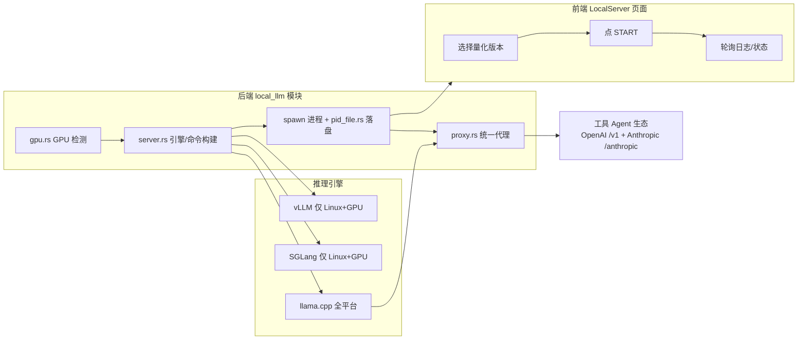

# 05 本地大模型服务

EchoBird 的"本地大模型服务"（Local Server 页面）让用户无需购买云端 API、即可在本地一键运行大模型，并把本地模型以 OpenAI/Anthropic 兼容协议暴露给 EchoBird 的 Agent 工具生态。其核心逻辑位于 Rust 后端 `src-tauri/src/services/local_llm/` 与前端 `src/pages/LocalServer/`。

## 5.1 引擎选择机制：vLLM / SGLang / llama.cpp

EchoBird 支持三种推理引擎（推理引擎指把大模型加载到显存/内存并执行生成任务的程序），后端在 `server.rs` 的 `start()` 中按 `runtime` 字符串分派：

| 引擎 | 标识 | 启动方式 | 适用平台 | 关键参数 |
|------|------|---------|---------|---------|
| **vLLM** | `vllm` | `python3 -m vllm.entrypoints.openai.api_server` | 仅 Linux + GPU | `--max-model-len`、`--tensor-parallel-size` |
| **SGLang** | `sglang` | `python3 -m sglang.launch_server` | 仅 Linux + GPU | `--context-length`、`--tp` |
| **llama.cpp** | `llama-server` | 本地二进制 `llama-server` | 全平台（cuda/vulkan/cpu/metal） | `-ngl`、`-c`、`--tensor-split` |

**自动选择逻辑**（前端 `LocalServer.tsx`）：

- **Linux + 有 GPU**：`runtimeOptions` 前两项为 vLLM、SGLang（推荐），llama.cpp 置于末尾；且默认运行时自动从 `llama-server` 切换为 `vllm`，让默认选中的卡片与推荐顺序一致。
- **其他平台（Windows / macOS / 无 GPU）**：仅提供 `llama.cpp` 一项，作为通用兜底。

**引擎版本管理**：三种引擎的版本均自动追踪上游源（`model_store.rs`）：llama.cpp 追 GitHub Releases（`ggml-org/llama.cpp`），vLLM/SGLang 追 PyPI（`pypi.org/pypi/vllm/json`、`pypi.org/pypi/sglang/json`）。网络不可达时回退到本地缓存，再到硬编码兜底常量（如 `FALLBACK_LLAMA_VERSION = "b8999"`、`FALLBACK_CUDA_VER = "13.1"`）。

> **多 GPU 张量并行**：`start()` 启动时调用 `gpu::detect_nvidia_gpu_count()` 统计 NVIDIA 显卡数量，当 ≥2 张时自动注入引擎特有的张量并行参数——vLLM 用 `--tensor-parallel-size N`、SGLang 用 `--tp N`、llama.cpp 用 `--tensor-split 1,1` + `--main-gpu 0`。单卡/AMD/无卡用户不受影响（计数为 0 或 1 时短路）。

## 5.2 GPU 检测与 CPU 回退

`gpu.rs` 实现跨平台 GPU 检测，按平台调用不同探测命令：

| 平台 | 探测顺序 | 命令 |
|------|---------|------|
| Windows | nvidia-smi → rocm-smi → wmic | `nvidia-smi --query-gpu=name,memory.total`、`rocm-smi --showmeminfo vram --showmeminfo`、`wmic path win32_VideoController get Name,AdapterRAM` |
| macOS | nvidia-smi → rocm-smi → xpu-smi → system_profiler → 国产四家 | `system_profiler SPDisplaysDataType -json` |
| Linux | nvidia-smi → rocm-smi → xpu-smi → 国产四家 | 同上 |

**厂商分类**（`classify_gpu_vendor`）：通过 GPU 名称关键词识别 NVIDIA / AMD / Intel / 国产（摩尔线程、芯元（Iluvatar CoreX）、寒武纪（Cambricon MLU）、壁仞（Biren）、昆仑芯（KunlunXin））。国产卡仅作展示识别，不捆绑专用引擎。

**多卡汇总**：`aggregate_nvidia_gpus_from_smi_output` 把多张 NVIDIA 卡聚合为单一显示名与总显存——单卡显示 "RTX 4090"、同构多卡显示 "RTX 4090 ×2"、异构多卡显示 "RTX 5080 + RTX 5060 Ti"，显存相加后驱动前端的显存适配（VRAM Fitness）判断。

**无 GPU 时的 CPU 回退**：前端在拿到 `systemInfo` 后，若无 NVIDIA/AMD/Metal 显卡且运行时为 `llama-server`，把 `gpuLayers` 从默认的 `-1`（GPU-Auto）强制改为 `0`（CPU-only），即 `-ngl 0` 全量走 CPU。macOS 因 llama.cpp 使用 Metal（统一内存），仍被视为可用 GPU 而不会回退到 CPU。

> **GPU 检测缓存**：`detect_gpu()` 会把检测到的 GPU 名与显存写入 `~/.echobird/config/local-model-settings.json`，`get_gpu_info()` 直接读缓存，避免每次启动都调用系统命令。

## 5.3 三步操作流程

本地大模型的核心交互极简，前端 `LocalServer.tsx` 的状态机驱动：

1. **选择量化版本**：在右侧面板的"本地 / 商店"双 Tab 中，从同一模型的多个量化版本（quant，如 `Q4_K_M`、`IQ2_M`）里选中一个。不同运行时切换扫描方式——`llama.cpp` 扫描 `.gguf` 文件（`scan_gguf_files`），vLLM/SGLang 扫描含 `config.json` 的 HuggingFace 目录（`scan_hf_models`）。多分片 GGUF（`foo-00001-of-00008.gguf`）会被合并为单个虚拟条目并累加文件大小。
2. **点 START**：需同时满足"已选模型"与"引擎已装"（或已保存自定义命令）才可点击。点击后前端调用 `startLlmServer`，后端自动完成引擎启动、模型加载、端口与代理配置。
3. **等待加载完成**：终端输出区实时显示 stdout/stderr 日志（前端以 1s 轮询 `getLlmServerLogs` 拉取，窗口隐藏时暂停）。启动后底部状态栏显示可复制的 OpenAI 端点（`http://127.0.0.1:{port}/v1`）与 Anthropic 端点（`http://127.0.0.1:{port}/anthropic`）。

**参数面板**（启动前可调，运行中锁定）：

- **计算模式**：自动判定，有 GPU 显示 GPU-Full（`-1`），无 GPU 显示 CPU-only（`0`），仅作状态指示。
- **上下文长度**：默认 32K（最小选择），因 Mother Agent 的 system prompt + 工具定义约 2.2 万 token，低于 32K 会触发 `exceed_context_size_error`；可选 64K~1M。
- **端口**：默认 11434，也可选 🎲 Random 随机生成（10000~60000）。
- **运行时**：按上文引擎选择机制展示。

**引擎安装状态机**：`EngineStatus` 在 `checking / ready / not-installed / downloading / error / update-available` 间流转。引擎未装时显示 SETUP ENGINE 按钮；Windows + NVIDIA + llama.cpp 场景会弹出 CUDA 版本选择器（`fetch_llama_release_options` 列出各 CUDA 变体），其余走自动安装最新版；检测到上游有新版本时显示 UPGRADE ENGINE。

## 5.4 进程管理：构建命令、spawn 与 PID 落盘

`server.rs` 是本地服务生命周期核心，`start_server` → `start()` 流程：

1. **预检清理**：读取上次记录的 PID 文件，若存在则先 `taskkill /F /PID`（Windows）或 `SIGKILL`（非 Windows）杀掉 EchoBird 自己启动的残留 `llama-server`，再删除 PID 文件并短暂等待 300ms 释放端口。**只杀自己记录的 PID**，绝不误杀用户独立启动的 llama-server 实例。
2. **构建引擎命令**：按运行时匹配。vLLM/SGLang 直接用 `python3` 启动；llama.cpp 走 `build_llama_default_command` 组装 `-m <model> --port <internal> --host 127.0.0.1 [-ngl N] [-c N]`。使用 `CREATE_NO_WINDOW`（0x08000000）保持 UI 干净，stdout/stderr 均以管道接收。
3. **spawn 进程**：`Command::new(...).spawn()` 得到子进程，记录 `child_pid`，更新 `LocalServerInfo`（running=true、port、pid、runtime）。
4. **PID 落盘**：`pid_file::write_pid_file(pid, runtime)` 原子写入 `~/.echobird/llama-server.pid`（`{pid, runtime, startedAt}`，tmp+rename）。Tauri 退出清理与下次启动预检都靠它精确定位并回收孤儿进程。
5. **输出读取**：`spawn_output_reader` 起三个线程——stdout 读取、stderr 读取（防止管道缓冲填满导致子进程阻塞，逐行 emit `local-llm-stdout` 事件给前端），以及 crash watcher（`child.wait()` 检测非零退出，若崩溃则把服务器状态重置为 running=false 并向前端提示"请点击 START 重启"）。

**停止流程**：`stop()` 对 `child_pid`（Windows 用 `taskkill /pid X /T /F` 连带子进程树，非 Windows 用 SIGTERM→2s→SIGKILL），向代理发送关闭信号，删除 PID 文件，重置状态。

## 5.5 模型仓库：下载与本地存储

`model_store.rs` 负责模型目录与下载：

**商店模型列表**（`fetch_store_models`）：按 远程 → 缓存 → 空 三级取数。远程拉取 `https://echobird.ai/api/store/models.json`，成功则写入 `~/.echobird/cache/store-models.json`；前端还有第二级静态 JSON 兜底。

**模型下载**（`download_model`）：支持单文件与多分片 GGUF：
- **三源测速**：对 HuggingFace / HF-Mirror / ModelScope 三个源做 5 秒测速，按速度排序，优先用最快源；4GB+ 大文件测速无信号时回退默认顺序。
- **分片下载**：每个分片独立 Range 续传（`bytes={start}-`）+ 3 源失败回退；已存在磁盘的分片自动跳过（应用重启后恢复）。保存时把 HF 路径扁平化到本地下载目录，保证 `llama-server --model` 指向扁平目录。
- **暂停/取消**：`pause_download` 置暂停标志；`cancel_download` 置中止标志并清理所有分片的 `.downloading` 临时文件。
- 本地目录默认 `~/Models`，可配置；下载进度经 `download-progress` 事件实时推送前端。

**引擎安装**（`download_llama_server`）：按平台选二进制文件（Windows 有 GPU 选 `llama-*-bin-win-cuda-*-x64.zip` + `cudart-*`，无 GPU 选 `bin-win-cpu-*`；Linux NVIDIA/AMD 用 Vulkan 统一构建，约 70-80% 原生 CUDA 性能）。多镜像测速（GitHub + 六个 ghproxy 类镜像），下载到 `bin.new/` 后原子换名到 `bin/`，中途取消/失败不影响既有安装。非 Windows 安装后补 0755 可执行权限。

## 5.6 代理服务：本地统一代理

`proxy.rs` 的 `run_unified_proxy` 在用户端口上监听，把本地模型以 OpenAI/Anthropic 兼容协议暴露给各工具：

| 路径 | 处理 |
|------|------|
| `/v1/*` | 直通透传（OpenAI 原生）到 llama-server 内部端口 |
| `/anthropic/*` | Anthropic → OpenAI 格式转换后转发到 llama-server 的 `/v1/chat/completions` |

**关键设计**：
- **端口隔离**：llama.cpp 场景下，用户面对的是"代理端口"（`port`），llama-server 实际监听"内部端口"（`port + 100`），llama-server 不直接暴露给工具。
- **完整请求读取**：`read_full_http_request` 读取完整 HTTP 请求（含大体积 body），避免工具定义类请求超过 64KB 被截断（Bug 1 修复）。
- **SSE 流式**：OpenAI 路径用 `copy_bidirectional` 双向管道，正确处理 SSE 流式响应；Anthropic 路径把 OpenAI 的流式/非流式响应逐段转换为 Anthropic 的 `message_start / content_block_delta / message_stop` 事件，并处理工具调用（tool_use）增量。
- **冷启动 503 重试**：llama-server 进程启动后端口即开，但多 GB 模型 mmap 进显存需 5-30 秒，期间请求返回 503 "Loading model"。代理对 503 做指数退避重试（1+2+4+8+16=31s 上限），覆盖消费级硬件上最大约 30B Q4_K_M 模型的冷启动。
- **错误可见化**：上游 4xx/5xx 时，把错误体作为 `text_delta` 推给客户端，避免"无响应"的假象。

## 5.7 自定义命令：BYO 引擎

`custom_command.rs` 支持用户用自己的可执行文件 + 参数启动 llama-server（全局生效，非按模型）。典型场景：AMD 用户指向自己用 Vulkan 编译的 llama-server。

- 存储位置：`~/.echobird/llama-custom-command.json`（`{exe, args}`）。
- 前端齿轮对话框：每行一个 token（首行为可执行文件），打开时预填"自动默认命令"或已存自定义命令；保存时若为空或首行仍是 `<ENGINE>` 占位符则视为未配置。
- **关键约束**：`ensure_managed_llama_args` 在启动时强制覆盖 `-m`（模型）、`--host`、`--port` 为 EchoBird 管理的值——用户可自定义可执行文件与参数，但**模型来自界面选择、host 与代理端口由 EchoBird 决定**，保证服务总是加载所选模型并监听代理能连到的端口。
- 自定义命令自带引擎（首行即 exe），因此即使未安装内置引擎，也能让 START 启用。

## 5.8 适用人群

| 人群 | 核心诉求 | EchoBird 的对应能力 |
|------|---------|-------------------|
| **本地部署用户** | 模型不出本机，数据隐私可控 | 一键下载 GGUF + 一键启动，模型留在本地 `~/Models` |
| **数据隐私敏感用户** | 输入输出不经过第三方 | 本地服务仅监听 `127.0.0.1`，无 API Key 鉴权；OpenAI/Anthropic 端点均指向本地 |
| **GPU 加速用户** | 用显卡跑大模型提升速度 | vLLM/SGLang（Linux）/llama.cpp；多卡自动张量并行；macOS 走 Metal；Windows 提供 CUDA 版本选择 |
| **无 GPU 用户** | 用 CPU 也能跑 | 自动回退 `-ngl 0` CPU-only，选择小量化模型 |
| **Agent 工具用户** | 把本地模型接入 Claude Code / Codex 等 | 统一代理把本地模型以 OpenAI/Anthropic 协议暴露给既有工具 |

---

| 上一章 | 返回目录 | 下一章 |
|--------|---------|--------|
| ← [04 四大核心场景](./04-core-scenarios.md) | [README](./README.md) | → [06 Codex Proxy 协议转换](./06-codex-proxy.md) |