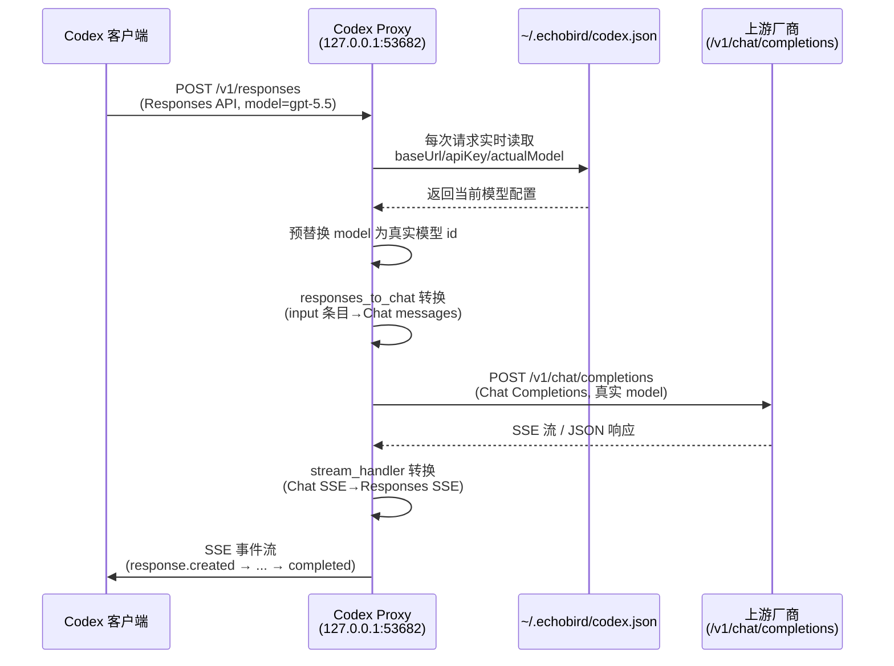

# 06 Codex Proxy 协议转换

EchoBird 内置一个 **Codex Proxy（Codex 协议代理）**，是一个运行在本地、以 Rust 编写的 HTTP 服务。它把 OpenAI Codex 客户端使用的 **Responses API（响应式 API）** 协议，翻译成各家模型服务商通用的 **Chat Completions（聊天补全）** 协议，从而让 Codex 客户端可以对接任意第三方模型（DeepSeek、GLM、Qwen、MiMo 等），而不必依赖 OpenAI 官方模型。其完整实现位于 `src-tauri/src/services/codex_proxy/` 目录。

## 6.1 核心定位

Codex Proxy 的定位可以用一句话概括：**让 Codex 客户端"看不见"协议差异，让第三方模型"看不见"协议伪装**。

- **对 Codex 客户端**：它始终表现为一个 OpenAI 官方 Responses API 端点（模型 id 显示为 `gpt-5.5`）。Codex 不知道也无需知道背后实际是哪个厂商的哪个模型。
- **对上游模型服务商**：它始终以一个标准的 Chat Completions 客户端身份出现，发送 `base_url`、`api_key`、`model` 等字段，调用对方原生的 `/v1/chat/completions` 接口。

这种设计带来两个关键效果：

1. **模型随意切换**：Codex 本身是国内用户使用频率极高的 AI 编程客户端，但它默认只面向 OpenAI 官方模型。通过 Proxy，用户可以在 EchoBird 的 Model Nexus 里任意切换 DeepSeek、GLM、Qwen 等模型，Codex 无需任何改动。
2. **协议伪装**：Codex 客户端只看到 Responses 侧，上游只看到 Chat 侧。真正负责转换的 JSON 负载只存在于 Proxy 进程内部，既保证了兼容性，也无形中提高了逆向解析的难度。

实现上，这是从旧版 Node.js 启动器（v4.6.x 的 `tools/codex/lib/*.cjs`）移植到 Rust 的。移植的动机包括：终端用户无需安装 Node.js 运行时、翻译字典编译为机器码、以及 Tokio + axum + reqwest 全栈所带来的更低 SSE 缓冲延迟。

## 6.2 服务器绑定

Codex Proxy 由 Tauri 主进程在启动时，通过 `spawn_proxy_task()` 派生一个后台 tokio 任务，调用 `server::run(CODEX_PROXY_PORT)` 启动。它基于 **axum** 路由框架构建。

**绑定信息**：

- 监听地址：`127.0.0.1:53682`（仅本机回环地址，不对外暴露）
- 固定端口：`CODEX_PROXY_PORT = 53682`，由 `mod.rs` 定义，是唯一事实来源
- HTTP 客户端：`reqwest`，连接超时 30 秒，TCP keepalive 60 秒

**路由表**：

| 路由 | 处理函数 | 说明 |
|------|---------|------|
| `POST /v1/responses` | `handle_responses` | Codex 主请求端点 |
| `POST /responses` | `handle_responses` | 无版本前缀的别名 |
| `POST /v1/responses/compact` | `handle_compact` | 服务端会话压缩（旧版） |
| `POST /responses/compact` | `handle_compact` | 压缩别名 |
| `POST /v1/messages` | `anthropic_proxy::handle_messages` | Claude Desktop 的 Anthropic Messages API 路由（同服务器，不同处理器） |
| `POST /claudecode/v1/messages` | `anthropic_proxy::handle_messages_claudecode` | Claude Code 专用路由，读取独立 relay 文件 |

请求体缓冲上限被提升到 **64 MiB**（`MAX_REQUEST_BODY_BYTES`），因为现代 Codex 流程中 `computer_use` 工具结果可能包含截图和大型 HTML 快照，单轮请求体轻易超过 axum 默认的 2 MiB。

**端口占用处理**：如果绑定失败（通常是另一个 EchoBird 实例仍占用端口），服务会记录日志并优雅退出，EchoBird 的其它功能不受影响，因为该 53682 端口可能正被另一个实例的监听器服务。

## 6.3 协议转换

协议转换是 Codex Proxy 的核心，逻辑集中在 `protocol_converter.rs`。核心函数 `responses_to_chat(body, sessions)` 把 Codex 的 Responses API 请求体转换为 Chat Completions 请求体。

**为什么转换字典复杂**：Responses API 的 `input` 是一个**异构数组**，每一轮对话、每次工具调用、每一段模型推理、每个上下文压缩摘要都作为带类型的 dict 条目出现。真实转换必须忠实翻译每一种条目类型——哪怕漏掉一种，都会产生上游拒绝的 Chat 消息数组（对应 issue #38 的 "insufficient tool messages" 类报错）。

**输入条目类型 → Chat 消息的映射**：

| Responses 输入条目类型 | 映射为 Chat 消息 |
|----------------------|-----------------|
| 字符串 `input` | 一条 `user` 消息 |
| `message`（role=user/assistant/system） | 对应 role 的普通消息；`developer` 折叠为 `system` |
| `function_call` | 合并入一条 `assistant` 消息的 `tool_calls` 数组 |
| `function_call_output` / `*_output` | 一条 `tool` 消息（含 `tool_call_id`） |
| `local_shell_call` | `assistant` 消息的 `tool_calls`（name=`local_shell`） |
| `reasoning` | 缓存为待附带的 `reasoning_content`，附加到下一个 `assistant.tool_calls` |
| `compaction` / `context_compaction` | 一条 `system` 消息（摘要文本或占位符） |
| `web_search_call` / `tool_search_call` 等 | 一条 `system` 说明性消息 |
| 通用 `*_call`（custom_tool_call 等） | `assistant` 消息的 `tool_calls` |
| `compaction_trigger` | 直接丢弃（真正处理在 server.rs 的 `handle_inline_compaction`） |

**关键防御性处理**（保证上游不 400）：

- **工具调用配对**：`ensure_tool_outputs_paired` 为孤儿工具调用（Codex 发出 `function_call` 但缺少对应 `function_call_output`，如用户中途打断）合成 `role:tool` 占位消息，防止上游报 "tool_calls require matching tool messages"。
- **推理内容回填**：`ensure_reasoning_for_tool_calls` 为带 `tool_calls` 的 assistant 消息补齐 `reasoning_content` 字段——这是 MiMo、DeepSeek-V4 思考版等多轮 API 契约的硬性要求，缺失会导致 400。
- **空函数名清理**：`strip_nameless_tool_calls` 丢弃 `function.name` 为空字符串的工具调用及其配对结果，避免严格上游（如小米 MiMo）整体 400。
- **重排**：`reorder_tool_messages` 把每条 `tool` 消息紧跟在对应 `assistant` 之后，保证消息顺序合法。

**参数透传与映射**：`reasoning.effort` 映射为 Chat 侧 `reasoning_effort`（`minimal`→`low`、`xhigh`→`high` 的钳制）；`text.format` 映射为 `response_format`；`max_output_tokens`→`max_tokens`、`stop_sequences`→`stop`；`parallel_tool_calls`、`top_p`、`seed` 等字段直接透传。

**工具定义过滤**：Codex 内置的 Responses 工具（`local_shell`、`web_search`、`file_search`、`computer_use_preview` 等）在 Chat Completions 中没有对应物，会被过滤或按厂商适配器处理。`namespace` 类型的 MCP 工具会被展平，并把裸工具名限定为 `mcp__<server>__<tool>` 形式以避免跨命名空间冲突。

下面用 Mermaid 序列图展示一次完整的请求流转：

## 6.4 流式处理

流式处理（Streaming）是 Codex 实时对话体验的关键，逻辑集中在 `stream_handler.rs`。它把上游 Chat Completions 的 SSE（Server-Sent Events，服务器推送事件）流转换为 Responses API 的 SSE 事件流。

核心设计是**把纯状态机与异步驱动分离**：

1. **纯状态机 `StreamState`**：消费解析后的 Chat deltas，产生 `SseEvent` 值到内部缓冲。完全同步、完全可测试。
2. **异步驱动 `drive_chat_stream`**：从 reqwest 字节流读取数据，按行切分 SSE，解析 JSON，喂给状态机，最终以 axum 的 SSE 流返回。

**状态机需要处理的增量类型**：

- **文本增量**（`delta.content`）：累积到 `response.output_text.delta` 事件；
- **工具调用增量**（`delta.tool_calls`）：`ToolCallSlot` 槽位跟踪多工具并行调用，`added` 事件延迟到非空 `name` 出现后才发出（避免向 Codex 泄漏空名调用）；
- **推理增量**（`delta.reasoning_content`）：`extract_reasoning_delta` 用多种字段名（`reasoning_content`/`reasoning`/`thinking`）及多种形状（字符串/对象/数组）尽力捕获，合成 `reasoning` 输出项，让 Codex 界面出现"思考中"面板；
- **拒绝响应**（`delta.refusal`）：模型拒绝回答时合成 Responses 的 refusal 事件序列；
- **引用来源**（`annotations`）：透传 OpenAI 搜索预览的 `url_citation` 引用。

**用量统计转换**：`chat_usage_to_responses_usage` 把 Chat 的 `prompt_tokens`/`completion_tokens` 转换为 Responses 的完整嵌套结构（`input_tokens`、`output_tokens`、`total_tokens` 及两个 `*_details` 对象）。Codex 的 Rust 客户端用严格 serde 解析 `ResponseCompleted`，缺少任意字段都会崩溃（"missing field input_tokens"），因此上游缺失时用 0 补齐。

**断连安全策略**（修复"聊一会儿就断"问题）：

- **首字节超时**：仅对首个 chunk 设置 120 秒超时（`UPSTREAM_FIRST_BYTE_TIMEOUT`），防止上游"接受请求但永不回复"。
- **后续 chunk 不限时**：思考模型（grok / o 系列 / DeepSeek-R1）在推理期间可能合法地静默数分钟，若对每个 chunk 间隙设超时，会在长思考暂停时把流 `fail()` 掉，导致 Codex 收到 `response.failed` 使整轮对话崩溃。TCP keepalive 负责检测死连接。

**错误处理**：`chat_error_to_responses_error` 把上游错误包装为 Responses 形状的错误信封，并做了**友好化改写**——上下文超长（双向关键词匹配中英文）改写为 actionable 提示，`image_unsupported` 提示切换到视觉模型，错误码规范化为 Codex UI 能识别的词汇（`rate_limit_exceeded`、`server_overloaded`、`cyber_policy` 等）。

**会话压缩**：`/v1/responses/compact` 端点把压缩请求翻译为一次"总结对话"的 Chat Completions 调用，把摘要文本作为 `encrypted_content` 返回，让 Codex 的"压缩此线程"按钮对第三方上游也能工作。

## 6.5 多厂商适配

不同模型服务商对 `web_search`（网页搜索）等能力的暴露方式差异巨大，EchoBird 通过 `vendors/` 目录下的适配器（Adapter）按"真实模型 id 子串"路由。默认适配器是通用 OpenAI 兼容行为，厂商只覆盖自己需要的内容。

| 厂商 | 匹配规则 | 搜索能力暴露方式 | 说明 |
|------|---------|----------------|------|
| 小米 MiMo | `mimo` | 裸 `{type:"web_search"}` 工具 + 顶层 `webSearchEnabled:true` 标志 | 只发工具不带标志会 400（"webSearchEnabled is false"） |
| 智谱 GLM / zhipu / z.ai | `glm` / `zhipu` / `z.ai` | **丢弃**（`Drop`） | GLM-5.2 严格校验每个 `tools[]` 条目必须含 `function` 键，混入非 function 搜索工具会令整个请求 400 |
| 阿里 Qwen / DashScope / Bailian / Tongyi | `qwen` / `dashscope` / `bailian` / `tongyi` | 顶层请求参数 `enable_search:true`（非工具） | OpenAI 兼容模式下不返回引用来源 |
| 其他 | 默认 | 丢弃（`Drop`） | 裸 `{type:"web_search"}` 会 400 不识别它的厂商 |

**适配器如何影响转换**：`protocol_converter.rs` 处理 `tools` 数组时，会对 `web_search` 工具调用 `adapter_for(model_id)` 获取适配器，按 `WebSearchSupport` 枚举三种行为：

- `Drop`——直接丢弃该工具；
- `RequestParams`——把该工具消费为顶层请求参数（如 Qwen 的 `enable_search`）；
- `ToolWithParams`——既保留工具，又附加顶层参数（如 MiMo 需两者兼备）。

此外，MiniMax 因为不能正确处理独立 system 角色，走 `minimax_merge` 特殊路径，把连续的 system 内容合并进下一条 user 消息的 `[System Instructions]` 前缀。

## 6.6 配置管理

配置管理由 `config_manager.rs` 负责，涉及两个文件系统位置：

| 文件 | 路径 | 作用 |
|------|------|------|
| Codex 自身配置 | `~/.codex/config.toml` | Codex 读取的配置，其 `base_url` 固定指向 `http://127.0.0.1:53682/v1`，`wire_api = "responses"` |
| 中继文件（relay） | `~/.echobird/codex.json` | EchoBird 写入当前选中的模型 / API Key / 上游 base_url |

**关键设计——每次请求实时读取**：Proxy 在**每个请求**新鲜读取 `~/.echobird/codex.json`（`read_echobird_relay`），从不缓存。因此用户在 EchoBird 中切换模型**无需重启 Codex 或 Proxy** 即可生效。`config.toml` 的 `base_url` 永久固定指向本地代理，Codex 的视角也始终不变。

**中继文件字段**：`baseUrl`（上游地址，缺 `/v1` 时自动补全）、`apiKey`、`actualModel`（或 `modelName`，真实模型 id）、`responsesPassthrough`（标志上游是否原生支持 Responses 协议）。

**自愈机制**：`ensure_canonical_config` 在启动 Codex 前做防御性"读-重写-检出漂移"检查——若 `config.toml` 缺失或偏离规范模板（被外部工具覆盖或用户手改），则重写为规范形状。当 relay 文件带 `relayMode: true` 或 `responsesPassthrough: true` 时跳过该检查（用户有意直连上游，不应撤销其选择）。

**Responses 直通（passthrough）模式**：当 `responsesPassthrough: true` 时，上游原生讲 Responses 协议，Proxy 把请求（已重写模型 id）原样转发到上游的 `/responses` 端点，只把模型 id 换回 Codex 的显示 id，从而保留 Chat 往返会压平的推理与工具调用保真度。

**路径可覆盖**：环境变量 `ECHOBIRD_CODEX_CONFIG_DIR` 覆盖 `~/.codex`（测试用），`ECHOBIRD_RELAY_DIR` 覆盖 `~/.echobird`。

## 6.7 会话与追踪

### 会话存储（SessionStore）

`session_store.rs` 实现进程内的会话存储，维护三张独立映射，全部进程本地：

| 映射 | 键 | 值 | 用途 |
|------|-----|-----|------|
| `response_history` | `response_id` | 消息数组 | Codex 用 `previous_response_id` 续聊时，重放存储消息，使每次上游调用自包含 |
| `reasoning` | `call_id` | 推理文本 | 思考模型返回 `reasoning_content` 时按工具调用 id 保存，后续轮次重放时重新附加 |
| `turn_reasoning` | `fnv1a64(content)` | 推理文本 | 纯文本助理轮次（无工具调用）用内容指纹做查找键 |

三张映射均采用**有界 FIFO 逐出**策略，每张上限 **512 条**（`MAP_CAPACITY`）。这与 Node 版无界设计不同——Rust 代理随着 Tauri 应用存活（可能数天），有界策略保证长会话下常驻内存约 5-10 MB。

**响应 id 生成**：`new_response_id()` 生成 `resp_` + 16 位小写字母数字（匹配 Codex 客户端正则 `/^resp_[a-z0-9]+$/`）。

### 请求追踪（Trace）

`trace.rs` 实现**可选、脱敏**的请求追踪器，用于排查"双重协议伪装"导致的故障。由于模型 id 伪装和协议伪装，真正失败的请求（上游拒绝的 Chat 负载）只存在于代理进程内部，Codex 和上游任何一端都无法展示。

- **开关**：环境变量 `ECHOBIRD_CODEX_TRACE=1`（默认关闭，关闭时热路径零开销）
- **输出**：每个请求一个目录，位于 `~/.echobird/codex-trace/`，包含 `1-codex-request.json`、`2-upstream-request.json`、`3-upstream-error.txt`、`summary.json` 等
- **脱敏**：字段名黑名单（`authorization`、`api_key`、`token`、`secret` 等）替换为 `[REDACTED]`；内联文本按已知密钥前缀（`sk-`、`ghp_` 等）且长度 ≥16 的连续段做掩码

## 6.8 Codex 二进制

`codex_binary.rs` 负责解析 Codex 的两种形态在本机的安装位置，供进程管理器启动使用。

**CLI 形态**：Codex v0.107+ 作为 Rust 二进制，打包在平台专属的 npm 包（`@openai/codex-<triple>`）中。直接 spawn `.cmd` shim 会在 `cmd /d /s /c` 包装层内丢失 TTY，导致 Rust TUI 报 "stdin is not a terminal"。因此用 `resolve_codex_cli_binary()` 找到 npm 安装根下的原生 exe 并直接启动；找不到时回退到 `.cmd` shim（`resolve_codex_cli_shim`）。

**桌面形态**（原 Codex Desktop，现并入 ChatGPT）：

| 平台 | 搜索路径 | 说明 |
|------|---------|------|
| Windows | `%LOCALAPPDATA%\Programs\ChatGPT\ChatGPT.exe`（先）；`Codex.exe`（旧） | Microsoft Store 安装暴露 `%LOCALAPPDATA%\Microsoft\WindowsApps` 别名 |
| macOS | `/Applications/ChatGPT.app`（先）；`Codex.app`（旧） | `.app` 包 |
| Linux | 无 | 截至 2026-07 无桌面构建 |

Windows 上还通过 `Get-AppxPackage` 查询 AppX 包清单（权威来源），以 `shell:AppsFolder\<PFN>!App` 形式解析 Store 版启动 URI，识别稳定频道（`OpenAI.Codex`）与 beta 频道（`OpenAI.CodexBeta`），优先稳定频道。

**配套的 onboarding 绕过**（`onboarding_bypass.rs`）：启动 Codex 前，把 `~/.codex/.codex-global-state.json` 的 `electron-persisted-atom-state` 内若干标志（`electron:onboarding-override`、`electron:onboarding-welcome-pending`、`electron:onboarding-projectless-completed`、`skip-full-access-confirm` 等）打补丁，让 Codex 每次启动直接进入主界面，跳过登录与首次引导。写入采用原子写（写 `.tmp` 再 rename），并在改写前保留 `.bak` 备份，且保留用户已有的非相关键。

## 6.9 工程价值

Codex Proxy 在工程上体现了几个值得借鉴的设计理念：

1. **协议适配层解耦**：不修改 Codex 客户端、不修改各家模型服务商，仅通过一层本地代理做双向协议翻译，就实现了"任意模型接入 Codex"。这种"适配器在中间"的模式把异构系统的集成成本收敛到一个可维护的模块。
2. **运行时而非配置时切换**：`relay` 文件每次请求实时读取，让"切换模型"从改文件、重启进程变为"点一下鼠标"——这是 Model Nexus"配置一次，到处可用"理念在协议层的落地。
3. **状态机与 I/O 分离**：流式转换拆成纯状态机 + 异步驱动，使最复杂的翻译规则（finish_reason → status、工具槽位追踪、推理内容往返）都能脱离真实网络做单元测试。
4. **防御性协议工程**：对上游的"严格性"做系统性防御——工具配对、推理回填、空名清理、错误码规范、友好 rewrites，把易碎的第三方集成做成了健壮的工业级桥梁。
5. **安全默认**：仅绑定回环地址、请求追踪默认关闭且强脱敏、会话存储有界内存，体现了"安全内建"而非"事后补救"。

---

| 上一章 | 返回目录 | 下一章 |
|--------|---------|--------|
| ← [05 本地大模型服务](./05-local-llm.md) | [README](./README.md) | → [07 工具注册表](./07-tool-registry.md) |