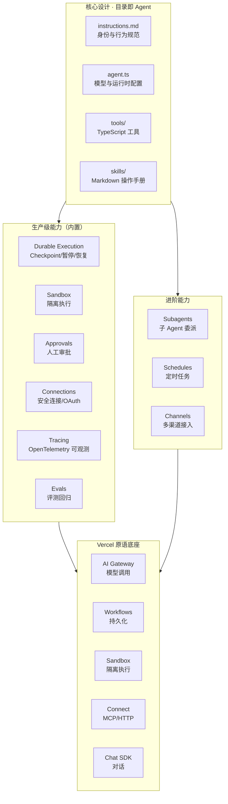

# 00 教程总览与知识地图

## Eve 产品生态全景图

## 10 章导航表

| 章号 | 标题 | 核心内容 | 适合人群 | 预计阅读时间 |
|------|------|---------|---------|-------------|
| 00 | 教程总览与知识地图 | 生态全景图、10章导航、三条阅读路径、交叉引用矩阵 | 所有读者 | 3 分钟 |
| 01 | 产品介绍与核心概念 | 定位（Next.js for Agents）、与 AI SDK/Agent Loop 层次区分、目录即 Agent 哲学 | 初学者/前端开发者 | 5 分钟 |
| 02 | 目录结构与核心能力 | agent.ts/instructions.md/tools/skills/sandbox 详解 | 开发者 | 8 分钟 |
| 03 | 生产级能力详解 | durable execution/approvals/connections/channels/tracing/evals | 开发者/架构师 | 10 分钟 |
| 04 | 进阶能力 | subagents/schedules/多 Agent 协作实战 | 开发者 | 7 分钟 |
| 05 | 快速上手指南 | 官方九步 + 五步快启 + 最小指令先行 + 部署 | 初学者/开发者 | 10 分钟 |
| 06 | 竞品对比与选型 | Eve vs Mastra vs LangGraph、适用团队边界、选型决策树 | 架构师/决策者 | 7 分钟 |
| 07 | 工程化理念与趋势洞察 | Demo→生产、工程底座竞争、前端工程化迁移 | 全体 | 8 分钟 |
| 08 | FAQ 与适用范围 | 常见问题、适用团队、局限性 | 全体 | 5 分钟 |
| 09 | 术语表与参考资源 | 核心术语 + 5 个来源 + 官方文档 + 知识库扩展 | 全体 | 4 分钟 |

## 三条阅读路径

### 路径一：快速上手路径（初学者/前端开发者）
> **章节顺序**：01 产品介绍 → 05 快速上手 → 08 FAQ → 09 术语表
>
> **适用人群**：首次接触 Eve 的前端开发者，目标是 15 分钟内建立核心认知并完成第一个 Agent。
>
> **合计预计阅读时间**：5 + 10 + 5 + 4 = **24 分钟**

### 路径二：深度开发路径（开发者 / 架构师）
> **章节顺序**：01 产品介绍 → 02 目录结构 → 03 生产级能力 → 04 进阶能力 → 05 快速上手 → 07 工程化理念 → 09 术语表
>
> **适用人群**：需要落地 Eve 生产级 Agent 的开发者、架构师，目标是掌握从目录结构到生产级能力的全链路。
>
> **合计预计阅读时间**：5 + 8 + 10 + 7 + 10 + 8 + 4 = **52 分钟**

### 路径三：选型决策路径（架构师 / 技术决策者）
> **章节顺序**：01 产品介绍 → 06 竞品对比与选型 → 07 工程化理念 → 08 FAQ → 09 术语表
>
> **适用人群**：评估 Eve 作为 Agent 基础设施的架构师、技术负责人，目标是完成技术选型决策。
>
> **合计预计阅读时间**：5 + 7 + 8 + 5 + 4 = **29 分钟**

## 与现有知识库的交叉引用矩阵

| 关联 wiki | 对应路径 | 关联章节 | 互补关系说明 |
|-----------|---------|---------|-------------|
| agent-communication-protocols（MCP/A2A 协议） | `../agent-communication-protocols/` | 03 Connections | 本教程覆盖 Eve 通过 Vercel Connect 接入 MCP 服务器，通信协议 wiki 提供 MCP/A2A 的协议规范细节，两者互补形成「协议规范 + 平台实现」的完整认知 |
| agent-skills-wiki（Skill 开发） | `../agent-skills-wiki/` | 02 Skills | 本教程覆盖 Eve 的 skills/（Markdown 操作手册、按需加载），Skill 开发 wiki 提供标准化 Skill 的定义、开发、发布、复用全流程方法论 |
| harness-seven-components-wiki（智能体 7 组件） | `../harness-seven-components-wiki/` | 07 工程化理念 | Eve 被定位为"生产级 Agent Harness"，7 组件 wiki 提供通用 Harness 编排的组件抽象与设计原则，可对照理解 Eve 的 Harness 产品化 |
| volcengine-agentkit-wiki（AgentKit 平台） | `../volcengine-agentkit-wiki/` | 06 对比 | 两者都是生产级 Agent 平台，AgentKit 是云平台（企业级），Eve 是开源框架（目录即 Agent），可对照理解「平台 vs 框架」两种路线 |
| longcat-agent-learning-wiki（可观测） | `../longcat-agent-learning-wiki/` | 03 Tracing | 本教程覆盖 Eve 的 OpenTelemetry 追踪，可观测 wiki 提供埋点设计、Trace 采样、告警阈值等生产级最佳实践 |

---

| 上一章 | 返回目录 | 下一章 |
|--------|---------|--------|
| ← 这是教程第 1 章 | [README](./README.md) | → [01 产品介绍与核心概念](./01-product-intro.md) |