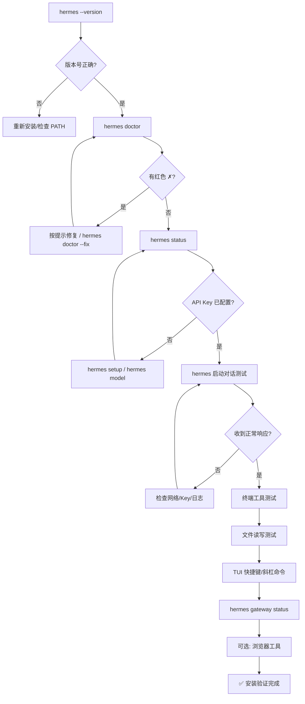

# 7. 安装验证

本章说明 Hermes Agent 安装完成后的完整验证流程，包括版本检查、环境诊断、状态查看、基础对话测试、工具功能验证、TUI 界面验证、浏览器工具验证、网关验证，以及日志位置与查看方法。建议按照本章顺序逐项验证，确保安装完整可用。

> 验证流程遵循"由浅入深"原则：先确认命令可用（版本检查），再确认环境健康（doctor 诊断），然后验证核心交互（对话测试），最后验证扩展能力（工具、网关）。任一步骤失败时，可根据输出提示修复后重新验证。

---

## 7.1 版本检查

安装完成后，首先确认 `hermes` 命令已正确加入 PATH 并能输出版本信息。Hermes 提供两个版本查看命令，分别适用于不同场景。

### 7.1.1 快速版本检查：`hermes --version`

```bash
hermes --version
# 或
hermes -V
```

该命令走**快速路径**（ultrafast path），在加载重型配置和日志模块之前即输出结果，启动延迟极低。典型输出：

```
Hermes Agent v0.20.0 (2026-07-15)
Install directory: /home/user/.hermes/hermes-agent
Install method: managed
Python: 3.11.9
OpenAI SDK: 1.0.0
Run 'hermes version' for update status.
```

输出字段说明：

| 字段 | 含义 |
|---|---|
| `Hermes Agent vX.Y.Z` | 当前安装的 Hermes 版本号及发布日期 |
| `Install directory` | Hermes 安装根目录（即项目源码所在路径） |
| `Install method` | 安装方式：`managed`（官方脚本）、`git`、`pip`、`docker`、`nix` 等 |
| `Python` | 运行 Hermes 的 Python 解释器版本 |
| `OpenAI SDK` | 已安装的 OpenAI Python SDK 版本（未安装则显示 `Not installed`） |

> **注意**：`--version` 标志由 `hermes_cli/_startup_fast.py` 中的 `try_fast_version()` 处理，在 Termux 环境下也接受 `version` 子命令走快速路径。其他平台上 `version` 子命令走慢路径。

### 7.1.2 完整版本信息：`hermes version`

```bash
hermes version
```

该命令走**慢路径**，除上述信息外，还会同步检查更新状态：

```
Hermes Agent v0.20.0 (2026-07-15)
Install directory: /home/user/.hermes/hermes-agent
Install method: managed
Python: 3.11.9
OpenAI SDK: 1.0.0
Up to date
```

当有新版本可用时，末尾会显示：

```
Update available: 3 commits behind — run 'hermes update'
```

版本号同时在两处维护，`hermes doctor` 会校验两者一致性：
- `pyproject.toml` 中的 `[project].version`
- `hermes_cli/__init__.py` 中的 `__version__`

若两者不一致（通常由 git 冲突解决不完整导致），doctor 会报错并提示运行 `hermes update` 重新同步。

---

## 7.2 `hermes doctor` 诊断命令

`hermes doctor` 是安装后最重要的诊断工具，会对 Python 环境、依赖包、配置文件、SSL 证书、数据库、外部工具、API 连通性等进行全面检查。

### 7.2.1 命令语法

```bash
hermes doctor              # 运行所有诊断检查
hermes doctor --fix        # 自动修复可修复的问题
hermes doctor --live       # 额外执行实时后端探测（真实网络调用）
hermes doctor --ack <id>   # 确认已知安全公告（不再弹出启动横幅）
```

`--fix` 可自动修复的问题包括：创建缺失的 `.env` 文件、从示例创建 `config.yaml`、迁移过期配置版本、修复陈旧的根级配置键、清理 WAL 文件、修复符号链接、强制重装 certifi 等。无法自动修复的问题会列入"需要手动干预"清单。

### 7.2.2 检查项详解

doctor 输出按 `◆ 分区标题` 组织，每个检查项前有状态图标：

| 图标 | 含义 |
|---|---|
| `✓` 绿色 | 检查通过 |
| `⚠` 黄色 | 警告（非阻断，建议处理） |
| `✗` 红色 | 失败（阻断性问题，需修复） |
| `→` 青色 | 附加信息/修复建议 |

各检查分区如下：

#### （1）Security Advisories（安全公告）

扫描已安装的 Python 包是否命中已知的安全漏洞数据库。命中时显示漏洞包名、版本号和完整修复说明。确认并处理后运行 `hermes doctor --ack <公告ID>` 可静默该公告。

#### （2）MCP Server Security（MCP 服务器安全）

检查 `config.yaml` 中 `mcp_servers` 配置的 stdio 命令是否可疑（如恶意命令注入模式），防止 MCP 服务器配置被篡改。

#### （3）Python Environment（Python 环境）

- Python 版本检查：要求 ≥ 3.10，推荐 ≥ 3.11；RL Training 工具（tinker）要求 ≥ 3.11
- SQLite 版本及 WAL-reset 漏洞检查（受影响版本：3.51.3 之前等）
- 是否在虚拟环境中运行（推荐）
- `pyproject.toml` 与 `hermes_cli/__init__.py` 版本一致性

#### （4）SSL / CA Certificates（SSL 证书）

验证 certifi CA 证书包是否可加载。若损坏（常见于 brew 升级 Python 后重建 venv），`--fix` 会强制重装 certifi。

#### （5）Required Packages（必需包）

检查核心依赖是否可导入：

- `openai`（OpenAI SDK）
- `rich`（终端 UI）
- `dotenv`（python-dotenv）
- `yaml`（PyYAML）
- `httpx`（HTTP 客户端）

可选包（`croniter`、`python-telegram-bot`、`discord.py`）缺失仅警告。

#### （6）Configuration Files（配置文件）

- `~/.hermes/.env` 是否存在、是否包含 API Key 配置
- `~/.hermes/config.yaml` 是否存在、`model.provider` 和 `model.default` 是否合法
- 配置版本是否为最新（过期可 `--fix` 自动迁移）
- 陈旧的根级 `provider`/`base_url` 键（应在 `model:` 节下）
- `.env` 中 `HERMES_MAX_ITERATIONS` 是否遮蔽 `config.yaml` 的 `agent.max_turns`
- 废弃配置键和环境变量检查（仅警告，告知现代替代项）
- 配置结构合法性校验

#### （7）xAI Model Retirement（xAI 模型退役）

检查配置中是否引用了 2026 年 5 月 15 日退役的 xAI 模型，并给出迁移指南链接。

#### （8）Auth Providers（认证提供商）

检查 OAuth 登录状态：Nous Portal、OpenAI Codex、MiniMax OAuth、xAI OAuth。未登录仅警告，不阻断（用户可使用 API Key 方式）。

#### （9）Directory Structure（目录结构）

检查 `~/.hermes/` 下的关键子目录和文件：

- `cron/`、`sessions/`、`logs/`、`skills/`、`memories/` 目录
- `SOUL.md` 人格文件
- `MEMORY.md`、`USER.md` 记忆文件
- `state.db` SQLite 会话数据库（含 FTS 写入健康探针、模式完整性检查）
- `state.db-wal` WAL 文件大小（超过 50 MB 警告，可 `--fix` 执行 checkpoint）

#### （10）Gateway Service（网关服务）

Linux 上检查 systemd linger 是否启用（未启用时网关在用户登出后会停止）；容器内检查 s6 监管状态。

#### （11）Command Installation（命令安装，非 Windows）

检查 `venv/bin/hermes` 入口点是否存在，以及 `~/.local/bin/hermes` 符号链接是否指向正确目标。Termux 下检查 `$PREFIX/bin/hermes`。

#### （12）External Tools（外部工具）

- `git`（可选）
- `ripgrep`（`rg`，可选但推荐，缺失时回退到 grep）
- `docker`（仅当 `TERMINAL_ENV=docker` 时必需，否则可选）
- SSH 连接（仅当 `TERMINAL_ENV=ssh` 时检查）
- Daytona SDK 和 API Key（仅当 `TERMINAL_ENV=daytona` 时检查）
- Vercel Sandbox SDK、认证、运行时（仅当 `TERMINAL_ENV=vercel_sandbox` 时检查）
- Node.js 和 `agent-browser`（浏览器自动化）
- Playwright Chromium（浏览器引擎）
- npm 包安全审计（browser tools、web workspace、ui-tui workspace、WhatsApp bridge）

#### （13）API Connectivity（API 连通性）

并行探测已配置的 LLM 提供商 API 可达性，包括 OpenRouter、Anthropic 等。常见 HTTP 状态码解读：

| 状态码 | 含义 | 处理建议 |
|---|---|---|
| 200 | 连通正常 | — |
| 401 | API Key 无效 | 检查 `.env` 中的 Key |
| 402 | 余额不足 | 充值或切换提供商 |
| 429 | 触发速率限制 | 等待或切换提供商 |

#### （14）Skills（技能）

检查 Skills Hub 目录是否初始化、是否有技能被隔离检疫（quarantine）。

#### （15）Memory Provider（记忆提供商）

检查记忆后端配置：内置记忆（默认）、Honcho、Mem0 或其他插件。Honcho/Mem0 未安装或未配置时给出修复指引。

#### （16）Profiles（配置档案）

列出所有命名配置档案及其网关运行状态、模型、配置完整性，检测孤儿别名包装器。

### 7.2.3 输出解读与退出码

诊断结束后，底部会输出总结：

- **全部通过**：绿色横线 + `All checks passed! 🎉`
- **有问题**：黄色横线 + `Found N issue(s) to address:`，逐条编号列出修复建议，并提示 `Tip: run 'hermes doctor --fix' to auto-fix what's possible.`
- **`--fix` 后**：绿色横线 + `Fixed N issue(s).`，若仍有手动项则追加 `M issue(s) require manual intervention.`

**退出码含义**：

| 退出码 | 场景 |
|---|---|
| `0` | 诊断正常完成（即使存在警告/失败项，主诊断路径也以 0 退出，问题通过输出清单展示） |
| `1` | `hermes doctor --ack <id>` 持久化确认失败（如 `config.yaml` 不可写） |
| `2` | `hermes doctor --ack <id>` 指定了未知的公告 ID |

> **设计说明**：doctor 的主诊断流程不通过非零退出码阻断脚本，因为它是一个诊断与展示工具，问题清单本身即是输出。自动化脚本若需判断是否有问题，应解析输出文本或检查 `issues` 清单，而非依赖退出码。

---

## 7.3 `hermes status` 状态检查

`hermes status` 以分区形式展示当前 Hermes 的运行时状态快照，比 doctor 更轻量，适合日常快速查看。

### 7.3.1 命令语法

```bash
hermes status          # 显示状态概览
hermes status --deep   # 深度检查（额外探测 OpenRouter 连通性和网关端口 18789）
```

### 7.3.2 输出分区

#### ◆ Environment（环境）

```
Project:      /home/user/.hermes/hermes-agent
Python:       3.11.9
.env file:    ✓ exists
Model:        hermes-405b
Provider:     Nous Portal
```

#### ◆ API Keys（API 密钥）

列出各提供商的 Key 配置状态，密钥值经过脱敏（仅显示首尾字符，中间用 `•` 替代）。涵盖 OpenRouter、OpenAI、Anthropic、Google/Gemini、DeepSeek、xAI、NVIDIA、Z.AI/GLM、Kimi、StepFun、MiniMax、DeepInfra、Firecrawl、Tavily、Browserbase、FAL、ElevenLabs、GitHub 等。未配置的显示 `(not set)`。

#### ◆ Auth Providers（OAuth 认证提供商）

显示 Nous Portal、OpenAI Codex、Qwen OAuth、MiniMax OAuth、xAI OAuth 的登录状态，以及 Portal URL、Inference URL、Access Token 过期时间、Refresh Token 是否存在等详情。

#### ◆ Nous Tool Gateway（Nous 工具网关）

当 Nous 订阅启用时，显示 web 搜索、图像生成、TTS、STT、浏览器、Modal 等工具的激活状态。

#### ◆ API-Key Providers（API Key 提供商）

显示 Z.AI/GLM、Kimi、StepFun、MiniMax、DeepInfra 等 Key 型提供商的配置状态。若当前提供商为 LM Studio，还会探测其 `http://127.0.0.1:1234/v1` 可达性。

#### ◆ Terminal Backend（终端后端）

显示当前终端后端类型（`local`/`ssh`/`docker`/`daytona`/`vercel_sandbox`）及对应配置（SSH 主机、Docker 镜像、Vercel 运行时和认证状态等）。

#### ◆ Messaging Platforms（消息平台）

列出 Telegram、Discord、WhatsApp、Signal、Slack、Email、SMS、DingTalk、Feishu、WeCom、Weixin、BlueBubbles、QQBot、Yuanbao 等平台的 Token 配置状态和 Home Channel。

#### ◆ Gateway Service（网关服务）

```
Status:       ✓ running
Manager:      systemd
PID(s):       12345
```

显示网关运行状态、进程管理器（systemd/launchd/s6/manual）和 PID。若服务已安装但未运行，会给出启动提示。

#### ◆ Scheduled Jobs（定时任务）

显示 `~/.hermes/cron/jobs.json` 中启用的定时任务数量。

#### ◆ Sessions（会话）

显示活跃会话数、最近活动时间，以及（当配置了 `max_concurrent_sessions` 时）会话槽位使用情况。

#### ◆ Deep Checks（深度检查，仅 `--deep`）

- 实际请求 OpenRouter `/models` 端点验证连通性
- 探测本地端口 `127.0.0.1:18789` 是否被占用（网关默认端口）

---

## 7.4 基础对话测试

完成环境与配置检查后，进行端到端的对话测试，验证 LLM 调用链路完整可用。

### 7.4.1 启动 Hermes

在终端中直接运行：

```bash
hermes
```

首次启动时会显示 Hermes 横幅（banner）和版本信息，随后进入 TUI（终端用户界面）对话界面。若尚未配置模型，会提示运行 `hermes model` 或 `hermes setup` 选择提供商和模型。

### 7.4.2 发送测试消息

在输入框中输入一条简单消息并回车发送，例如：

```
你好，请回复"安装验证成功"这五个字。
```

或英文：

```
Hello, please reply with exactly: installation verified
```

### 7.4.3 验证响应

观察以下现象：

1. **消息发送成功**：输入的消息出现在对话区域
2. **Agent 开始思考**：界面显示思考/处理指示器（流式输出）
3. **收到流式响应**：模型回复逐字显示，而非长时间空白后一次性出现
4. **响应内容正确**：回复包含预期的确认文字
5. **无报错信息**：对话过程中无红色错误提示或 traceback

若收到 `401 Unauthorized`，说明 API Key 无效；收到 `402 Payment Required`，说明账户余额不足；收到连接超时，检查网络和代理设置。

### 7.4.4 退出对话

测试完成后，使用以下方式退出：

- 斜杠命令：输入 `/quit` 或 `/exit` 后回车
- 快捷键：`Ctrl+C`（中断当前工作）/ `Ctrl+D`（退出，部分界面）

---

## 7.5 工具功能验证

Hermes 的核心能力之一是工具调用。以下验证终端工具和文件读写工具这两个最基础的工具。

### 7.5.1 终端工具验证

终端工具（`tools/terminal_tool.py`）允许 Agent 在本地或配置的远程后端执行 shell 命令。

**测试步骤**：

在 Hermes 对话中输入：

```
请在终端中执行 `echo "hermes terminal test ok"` 并告诉我输出结果。
```

**预期结果**：

- Agent 调用终端工具执行命令（TUI 中会显示工具调用面板和流式输出）
- 返回标准输出 `hermes terminal test ok`
- Agent 基于输出给出自然语言回复

进一步验证命令执行环境：

```
请执行 `pwd` 和 `python --version`，告诉我当前工作目录和 Python 版本。
```

> **安全提示**：终端工具受命令审批机制保护。首次执行某些命令时可能需要用户确认。涉及 `sudo` 的命令需要配置 `SUDO_PASSWORD`。可在 `config.yaml` 的 `terminal` 节配置后端（local/ssh/docker/daytona/vercel_sandbox）。

### 7.5.2 文件读写工具验证

文件工具（`tools/file_tools.py`）提供 `read_file`、`write_file`、`patch` 等能力，支持带行号读取、文件大小预算控制和写入审批。

**测试写入**：

```
请在 /tmp/hermes_verify_test.txt 中写入一行文字："Hermes file write test OK"，然后读取该文件确认内容。
```

**预期结果**：

- Agent 调用写入工具创建文件
- 随后调用读取工具回读内容
- 显示文件内容与写入一致
- Agent 报告验证成功

**测试读取带行号格式**：

`read_file` 工具返回的内容带行号前缀（`  1 | content`），便于 Agent 精确定位行。可让 Agent 读取一个已知小文件（如 `~/.hermes/SOUL.md`）验证。

**验证后清理**：

```
请删除刚才创建的 /tmp/hermes_verify_test.txt 测试文件。
```

> **安全提示**：写入和补丁操作受 `write_approval` 机制保护，敏感路径写入需要用户确认。文件工具还包含路径安全检查（`path_security.py`），防止符号链接逃逸等攻击。

---

## 7.6 TUI 界面验证

Hermes 的 TUI（基于 `ui-tui/` 的 React/Ink 实现，旧版 curses UI 位于 `curses_ui.py`）提供多行编辑、斜杠命令自动补全、对话历史浏览等功能。

### 7.6.1 快捷键验证

在 TUI 界面中验证以下常用快捷键：

| 快捷键 | 功能 | 验证方法 |
|---|---|---|
| `Enter` | 发送消息 / 确认选择 | 输入文字后按回车发送 |
| `Backspace` | 删除字符 | 在输入框中按退格键 |
| `Ctrl+U` | 清空当前输入 | 输入文字后按 Ctrl+U，输入框应清空 |
| `Ctrl+C` | 中断当前 Agent 工作 | 发送一条消息后，在 Agent 处理过程中按 Ctrl+C，应中断而非退出程序 |
| `Ctrl+D` | 退出 / 会话切换器中删除 | 在空输入框按 Ctrl+D 退出；在会话切换器中删除会话 |
| `Ctrl+N` | 新建会话（会话切换器中） | 在会话切换器中按 Ctrl+N |
| `Ctrl+R` | 重命名会话（会话切换器中） | 在会话切换器中按 Ctrl+R |
| `↑` / `↓` 或 `k` / `j` | 历史导航 / 菜单上下移动 | 在选择菜单中按方向键或 k/j |
| `Esc` | 停止搜索 / 关闭面板 | 在搜索框中按 Esc 退出搜索 |

### 7.6.2 斜杠命令验证

在输入框中输入 `/` 会触发斜杠命令自动补全菜单，输入字符可模糊匹配。常用斜杠命令：

| 斜杠命令 | 功能 |
|---|---|
| `/help` | 显示所有可用命令 |
| `/new` 或 `/reset` | 开始新对话（清空当前上下文） |
| `/model [provider:model]` | 切换模型，如 `/model openrouter:anthropic/claude-3.5-sonnet` |
| `/personality [name]` | 切换人格 |
| `/retry` | 重试上一轮 |
| `/undo` | 撤销上一轮 |
| `/compress` | 压缩上下文 |
| `/usage` | 查看 Token 使用情况 |
| `/skills` | 浏览已安装技能 |
| `/<skill-name>` | 直接调用某个技能 |
| `/insights [N]` | 查看最近 N 天的洞察 |
| `/quit` 或 `/exit` | 退出 Hermes |

**验证方法**：

1. 输入 `/`，确认弹出命令补全菜单
2. 输入 `he`，确认菜单过滤到 `/help`
3. 按 Tab 或 Enter 补全，再按 Enter 执行
4. 执行 `/usage`，确认显示当前会话的 Token 使用统计
5. 执行 `/new`，确认开始新会话

### 7.6.3 多行编辑验证

TUI 支持多行输入，便于粘贴代码块或长文本：

1. 在输入框中输入第一行文字
2. 使用换行快捷键（通常为 `Shift+Enter` 或 `Alt+Enter`，具体取决于终端）换行
3. 输入第二行、第三行
4. 按 `Enter` 发送整个多行消息
5. 确认 Agent 收到完整的多行内容并正确处理

验证多行编辑后，可发送一段简单代码让 Agent 解释，确认格式未被破坏：

````
请解释这段代码：
```python
def hello():
    print("hello")
```
````

---

## 7.7 浏览器工具验证（可选）

浏览器工具允许 Agent 进行网页自动化操作（导航、点击、截图、提取内容等）。该功能为可选，需要额外的浏览器运行时。

### 7.7.1 前置条件

浏览器工具支持两种后端：

**本地浏览器（默认）**：
- Node.js 已安装
- `agent-browser` npm 包已安装
- Playwright Chromium 已安装

检查安装状态：

```bash
hermes doctor | grep -i "agent-browser\|chromium\|node"
```

若缺失，安装方法：

```bash
# 在 Hermes 项目目录下
npm install
npx playwright install chromium        # Linux 还需加 --with-deps
```

**云端浏览器（Browserbase）**：
- 在 `.env` 中配置 `BROWSERBASE_API_KEY`
- 无需本地安装 Chromium

### 7.7.2 验证步骤

在 Hermes 对话中输入：

```
请用浏览器打开 https://example.com，告诉我页面的标题和第一段文字。
```

**预期结果**：

- Agent 调用浏览器工具（本地模式下会启动 Chromium；云端模式下连接 Browserbase）
- 页面导航成功
- 返回页面标题（`Example Domain`）和描述文字
- Agent 总结页面内容

若 `hermes doctor` 显示 `Playwright Chromium not installed`，浏览器工具会对 Agent 隐藏，需先安装 Chromium。Termux 环境下浏览器工具不可用（预期行为）。

> 其他可选云浏览器后端包括 Camofox、CDP override、Lightpanda 引擎等，均会绕过本地 Chromium 依赖。详见 `tools/browser_tool.py` 中的配置探测逻辑。

---

## 7.8 网关验证

消息网关（gateway）是 Hermes 连接 Telegram、Discord、Slack、WhatsApp 等消息平台的后台进程。即使只使用 CLI/TUI，也建议验证网关命令可用。

### 7.8.1 查看网关状态

```bash
hermes gateway status
```

典型输出（网关未运行时）：

```
✗ Gateway is not running

To start:
  hermes gateway run      # Run in foreground
  hermes gateway install  # Install as user service
```

网关运行时：

```
✓ Gateway is running (PID: 12345)
  (Running manually, not as a system service)

Recent gateway health:
  ...

To install as a service:
  hermes gateway install
```

### 7.8.2 常用网关命令

| 命令 | 功能 |
|---|---|
| `hermes gateway status` | 查看当前档案的网关状态 |
| `hermes gateway status --deep` | 深度状态检查（含完整日志/服务输出） |
| `hermes gateway status --system` | 查看 Linux 系统级网关服务状态 |
| `hermes gateway list` | 列出所有档案及其网关状态 |
| `hermes gateway run` | 在前台运行网关（推荐 WSL/Docker/Termux） |
| `hermes gateway install` | 安装为 systemd/launchd/计划任务后台服务 |
| `hermes gateway start` | 启动已安装的网关服务 |
| `hermes gateway stop` | 停止网关服务 |
| `hermes gateway restart` | 重启网关服务 |
| `hermes gateway setup` | 配置消息平台（交互式向导） |
| `hermes gateway uninstall` | 卸载后台服务 |

### 7.8.3 验证要点

1. **命令可执行**：`hermes gateway status` 正常输出而非报"未知命令"
2. **平台配置正确**：若已配置平台 Token，`hermes status` 的 Messaging Platforms 分区显示 `✓ configured`
3. **端口探测**：`hermes status --deep` 中 Port 18789 显示 `in use`（网关运行时）或 `available`（未运行时）

> 若仅使用 CLI/TUI 而不需要消息平台，网关保持未运行状态是正常的，不影响核心功能。

---

## 7.9 安装成功的标志清单

完成以上验证后，对照以下清单确认安装成功。所有"必需"项均应通过。

### 7.9.1 必需项（Must Pass）

- [ ] `hermes --version` 正常输出版本号（≥ 0.20.0），无报错
- [ ] `hermes doctor` 中 Python 版本 ≥ 3.10（推荐 3.11+），无红色 `✗` 阻断项
- [ ] `hermes doctor` 中必需包（openai、rich、dotenv、yaml、httpx）全部 `✓`
- [ ] `hermes doctor` 中 SSL CA 证书包有效
- [ ] `~/.hermes/.env` 文件存在且包含至少一个 LLM 提供商的 API Key
- [ ] `~/.hermes/config.yaml` 存在且 `model.provider` 为合法值
- [ ] `hermes status` 中 Environment 分区显示正确的项目路径、Python 版本、模型和提供商
- [ ] `hermes status` 中至少一个 API Key 显示 `✓`（脱敏值）
- [ ] 运行 `hermes` 能成功进入 TUI 界面
- [ ] 发送测试消息后收到流式响应，内容正确，无 401/402/网络错误
- [ ] 终端工具能执行简单命令并返回输出
- [ ] 文件工具能写入和读取临时文件
- [ ] `/help` 斜杠命令正常显示命令列表

### 7.9.2 推荐项（Should Pass）

- [ ] `hermes doctor` 显示 `Version files consistent`
- [ ] `hermes doctor` 显示 `Virtual environment active`
- [ ] `hermes doctor` 显示 `config.yaml` 版本为最新
- [ ] `hermes doctor` 中 `state.db` 健康且无 FTS 写入警告
- [ ] `hermes doctor` 中 ripgrep（`rg`）已安装（加速文件搜索）
- [ ] `hermes version` 显示 `Up to date`（或仅有少量更新落后）
- [ ] TUI 多行编辑和斜杠命令自动补全工作正常
- [ ] `hermes gateway status` 命令可正常执行

### 7.9.3 可选项（Nice to Have）

- [ ] `agent-browser` 和 Playwright Chromium 已安装，浏览器工具可用
- [ ] Node.js 已安装且 `hermes doctor` 无 npm 严重漏洞
- [ ] Docker 已安装（若使用 Docker 终端后端）
- [ ] git 已安装
- [ ] 消息平台（Telegram/Discord 等）已配置且网关可启动
- [ ] Honcho 或 Mem0 记忆提供商已配置（若需要高级记忆功能）

---

## 7.10 日志位置和查看方法

Hermes 的所有日志文件统一存放于 `~/.hermes/logs/` 目录下。可使用 `hermes logs` 命令方便地查看和过滤。

### 7.10.1 日志文件清单

| 日志名称 | 文件名 | 用途 |
|---|---|---|
| `agent` | `agent.log` | Agent 主日志（对话、工具调用、模型交互） |
| `errors` | `errors.log` | 错误日志（仅 WARNING 及以上级别） |
| `gateway` | `gateway.log` | 消息网关日志（平台连接、消息收发） |
| `gui` | `gui.log` | Dashboard/PTY/WebSocket 日志 |
| `desktop` | `desktop.log` | Electron 桌面应用启动和后端日志 |
| `mcp` | `mcp-stderr.log` | 所有 stdio MCP 子进程的 stderr 输出 |

日志目录路径：

- Linux / macOS / WSL2：`~/.hermes/logs/`
- Windows 原生：`%USERPROFILE%\.hermes\logs\`
- Termux：`$PREFIX/share/hermes/logs/` 或 `~/.hermes/logs/`

### 7.10.2 `hermes logs` 命令

```bash
hermes logs                    # 显示 agent.log 最后 50 行
hermes logs -f                 # 实时跟踪 agent.log（Ctrl+C 停止）
hermes logs errors             # 显示 errors.log 最后 50 行
hermes logs gateway -n 100     # 显示 gateway.log 最后 100 行
hermes logs gui -f             # 实时跟踪 gui.log
hermes logs desktop -f         # 实时跟踪 desktop.log
hermes logs mcp                # 查看 MCP 子进程输出
```

### 7.10.3 过滤选项

```bash
hermes logs --level WARNING          # 仅显示 WARNING 及以上级别
hermes logs --level ERROR            # 仅显示 ERROR 及以上
hermes logs --session abc123         # 按会话 ID 子串过滤
hermes logs --component tools        # 仅显示工具相关日志
hermes logs --component gateway      # 仅显示网关相关日志
hermes logs --since 1h               # 最近 1 小时的日志
hermes logs --since 30m -f           # 最近 30 分钟并实时跟踪
hermes logs gateway -n 200 --since 2h  # 组合使用
```

支持的日志级别（从低到高）：`DEBUG`、`INFO`、`WARNING`、`ERROR`、`CRITICAL`。

支持的时间单位：`s`（秒）、`m`（分）、`h`（时）、`d`（天），如 `30m`、`2h`、`1d`。

### 7.10.4 列出所有日志文件

```bash
hermes logs --list
```

该命令显示 `~/.hermes/logs/` 下所有 `.log` 文件的大小和最后修改时间：

```
Log files in ~/.hermes/logs/:

  agent.log                  1.2MB   5m ago
  errors.log                 12.3KB  5m ago
  gateway.log               456.7KB  2h ago
  gui.log                    89.1KB  1d ago
  mcp-stderr.log             2.4KB   3d ago
```

> **提示**：日志文件在 Hermes 首次运行时才会创建。如果运行 `hermes logs` 提示"Log file not found"，先启动一次 `hermes` 或 `hermes gateway run` 生成日志。排查问题时推荐开两个终端：一个运行 `hermes logs -f --level DEBUG` 实时观察，另一个复现问题。

---

## 7.11 验证流程总结

推荐的完整验证顺序如下：



完成本章所有验证后，Hermes Agent 即处于可用状态。后续可参考官方文档（https://hermes-agent.nousresearch.com/docs/）了解模型切换、技能创建、定时任务、多平台网关等进阶功能。
