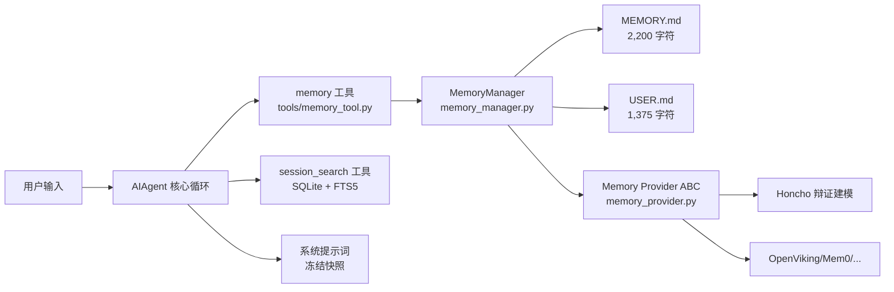

# 08 记忆系统

## 8.1 持久记忆：跨会话的核心

Hermes 的记忆是**受限（bounded）且精选（curated）**的，跨会话持久化。它由两个文件构成，均存于 `~/.hermes/memories/`，并在每次会话开始时以**冻结快照**形式注入系统提示词：

| 文件 | 用途 | 字符上限 |
|------|------|---------|
| **MEMORY.md** | Agent 个人笔记——环境事实、约定、学到的东西 | 2,200 字符（约 800 token） |
| **USER.md** | 用户画像——你的偏好、沟通风格、期望 | 1,375 字符（约 500 token） |

> **冻结快照模式（frozen snapshot）**：系统提示词中的记忆在会话开始时捕获一次，**会话中途不再变化**。这刻意保护 LLM 的**前缀缓存**（prefix cache，即对相同前缀提示词的缓存复用）以降低每次调用的成本。Agent 在会话中增删记忆会立即写盘，但要到下个会话启动才会反映到系统提示词中；工具响应始终显示实时状态。

**记忆不会自动压缩**：写入超出上限时，`memory` 工具返回错误而非静默丢弃，由 Agent 在同一轮内自行合并或删除条目后再重试。

## 8.2 记忆组件与 memory provider ABC

记忆在代码中由两个核心组件实现（见 `agent/` 目录）：

- **`memory_manager.py`** — 记忆编排层（MemoryManager），负责协调内置记忆与外部 provider、控制写入审批与后台自改进评审。
- **`memory_provider.py`** — 记忆提供者抽象基类（ABC，Abstract Base Class，抽象基类）。任何外部记忆后端都实现该接口，从而被统一调用。

其工作流由 `tools/memory_tool.py` 暴露的 `memory` 工具驱动。Hermes 内置记忆（MEMORY.md/USER.md）**始终生效**；外部 provider 是**叠加**（additive）的，永不替换内置记忆。

## 8.3 memory provider ABC：可插拔记忆后端

外部记忆后端通过实现 Memory Provider ABC 接入。Hermes 自带 8 个官方 memory provider 插件，**同一时刻仅一个外部 provider 生效**：

- **Honcho**：AI 原生跨会话用户建模（详见 8.4）
- **OpenViking**：火山引擎（字节）上下文数据库，文件系统式知识层级 + 分层检索
- **Mem0**：服务端 LLM 事实抽取 + 语义检索去重
- **Hindsight**：知识图谱 + 实体消解 + 跨记忆综合
- **Holographic**：本地 SQLite 事实库 + FTS5 + 信任评分 + HRR 代数查询
- **RetainDB**：云端混合检索（Vector+BM25+Rerank）记忆 API
- **ByteRover**：`brv` CLI 分层知识树
- **Supermemory**：语义长期记忆 + 会话图谱

切换/配置命令：

```bash
hermes memory setup     # 交互式选择并配置 provider
hermes memory status    # 查看当前生效的 provider
hermes memory off       # 停用外部 provider
```

## 8.4 Honcho 辩证式用户建模

**Honcho**（[plastic-labs/honcho](https://github.com/plastic-labs/honcho)）是一个 AI 原生记忆后端，在 Hermes 内置记忆之上增加**辩证推理（dialectic reasoning）**与深度用户建模。

**核心机制**：每 N 轮对话（由 `dialecticCadence` 控制）后，Honcho 分析对话并推导关于用户偏好、习惯、目标的洞察。这些洞察随时间累积，形成对用户的动态理解。

**双层上下文注入**（`hybrid`/`context` 模式下每轮注入系统提示词）：
1. **基础层**——会话摘要、用户表征、peer 卡片（刷新频率由 `contextCadence` 控制）→"这个用户是谁"
2. **辩证补充层**——LLM 综合推理出的用户当前状态与需求（由 `dialecticCadence` 控制）→"现在什么最重要"

**三个正交配置旋钮**（独立控制成本与深度）：

| 旋钮 | 控制内容 | 默认 |
|------|---------|------|
| `contextCadence` | 基础层刷新的 API 调用间隔 | `1` |
| `dialecticCadence` | 辩证层 LLM 调用的间隔 | `2` |
| `dialecticDepth` | 每次辩证的 `.chat()` 遍数（1–3） | `1` |

Honcho 提供 5 个工具：`honcho_profile`、`honcho_search`、`honcho_context`、`honcho_reasoning`、`honcho_conclude`。其 CLI 子命令 `hermes honcho …` 仅在 `memory.provider: honcho` 生效时注册。

## 8.5 FTS5 会话搜索：跨会话回溯

除记忆文件外，Agent 可用 `session_search` 工具搜索过往对话。所有 CLI 与消息会话均存于 SQLite（`~/.hermes/state.db`），并通过 **FTS5**（SQLite 内置全文检索）建立索引：

- 搜索直接返回数据库中真实消息，**无 LLM 摘要、无截断**
- Agent 能找回数周前讨论过的内容，即使不在活动记忆中
- 可在找到的会话内向前/向后翻页

| 维度 | 持久记忆 | 会话搜索 |
|------|---------|---------|
| 容量 | 约 1,300 token | 无上限（全部会话） |
| 速度 | 即时（在系统提示词中） | FTS5 查询约 20ms |
| 成本 | 每次提示词都计 token | 免费（无 LLM 调用） |
| 用途 | 关键事实常驻 | 查找特定历史对话 |

## 8.6 用户画像与记忆工具

`memory` 工具有两个**目标（target）**：`memory`（Agent 个人笔记，环境/约定/经验）与 `user`（用户画像，身份/偏好/沟通风格）。动作包括：

- **add** — 新增条目
- **replace** — 替换现有条目（用 `old_text` 做唯一子串匹配）
- **remove** — 删除不再相关的条目（同样基于子串匹配）

没有 `read` 动作——记忆内容已在会话开始时自动注入系统提示词。系统还提供去重（拒绝完全重复）、安全扫描（拦截提示词注入/凭据外泄/不可见 Unicode 字符）。

## 8.7 memory 命令与配置

```bash
hermes memory setup      # 选择并配置外部 provider
hermes memory status     # 查看生效 provider
hermes memory off        # 停用外部 provider
hermes sessions list     # 浏览历史会话（配合 session_search）
hermes journey list      # 列出学习时间线上所有技能与记忆节点
hermes journey delete <node> [-y]   # 删除节点（技能归档、记忆删除）
hermes journey edit <node>          # 在 $EDITOR 中编辑节点内容
```

配置（`~/.hermes/config.yaml`）：

```yaml
memory:
  memory_enabled: true
  user_profile_enabled: true
  memory_char_limit: 2200
  user_char_limit: 1375
  write_approval: false   # true = 写入前需审批
```

`memory.write_approval: true` 时，所有写入（含后台自改进评审的）先暂存，通过 `/memory pending`、`/memory approve <id>`、`/memory reject <id>` 审批。学习时间线（`/journey`）用于查看并修剪已学内容。

## 8.8 记忆架构示意



> 扩展阅读：如何自建 memory provider 见[集成指南](../hermes-agent-integration/README.md)；本 Wiki [01 核心特性](01-core-features.md) 亦简述学习闭环。
