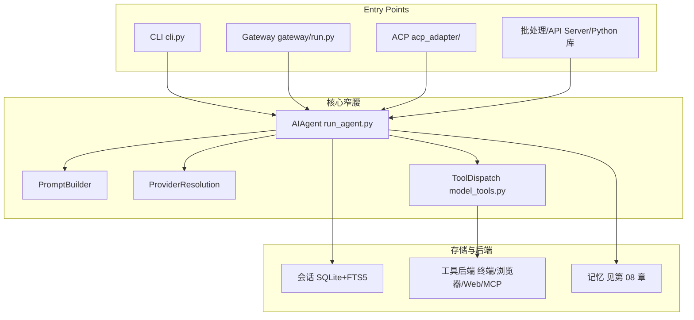

# 10 架构解析与源码导读

## 10.1 AIAgent 核心循环

> 本节行数/测试数统计取自当前本地源码，随版本演进会变化，以仓库最新代码为准。

核心编排引擎是 `run_agent.py` 中的 **`AIAgent` 类**（约 1.2 万行），负责：

- 经 `agent/prompt_builder.py` 组装系统提示词与工具 schema
- 选择正确的 provider/API 模式（`chat_completions`、`codex_responses`、`anthropic_messages`）
- 发起**可中断**的模型调用
- 执行工具调用（顺序或经线程池并发）
- 维护 OpenAI 格式的对话历史
- 处理压缩、重试与 fallback 模型切换
- 在上下文丢失前刷新持久记忆

**两个入口**：`agent.chat(msg)` 是 `run_conversation()` 的薄封装（返回最终响应字符串）；`run_conversation()` 返回含消息、元数据、用量统计的字典。

**三种 API 模式**：

| API 模式 | 用途 | 客户端 |
|---------|------|--------|
| `chat_completions` | OpenAI 兼容端点（OpenRouter、自定义、多数 provider） | `openai.OpenAI` |
| `codex_responses` | OpenAI Codex / Responses API | `openai.OpenAI` |
| `anthropic_messages` | 原生 Anthropic Messages API | `anthropic.Anthropic` |

**回合生命周期**：追加用户消息 → 构建/复用缓存系统提示词 → 预检压缩（>50% 上下文）→ 构建 API 消息 → 注入临时提示层 → 应用缓存标记 → 可中断 API 调用 → 解析：有 `tool_calls` 则执行并回环，是文本则持久化会话、必要时刷新记忆后返回。

## 10.2 整体架构

```text
入口点：CLI (cli.py) · Gateway (gateway/run.py) · ACP (acp_adapter/) · 批处理 · API Server · Python 库
        │                     │                          │
        ▼                     ▼                          ▼
                     AIAgent (run_agent.py)
        PromptBuilder · ProviderResolution · ToolDispatch · 3 API 模式
        │                                              │
        ▼                                              ▼
  会话存储 (SQLite + FTS5)                   工具后端 (终端/浏览器/Web/MCP/文件…)
```

**平台无关核心**：同一个 `AIAgent` 类服务 CLI、gateway、ACP、批处理与 API server——平台差异只存在于入口点，不进入 agent。这体现了"核心窄腰、能力在边缘"的设计哲学（详见[00 总览](00-overview.md)）。

## 10.3 CLI / TUI / 桌面

- **CLI**：`cli.py`（约 1.1 万行）的 `HermesCLI` 提供交互式终端 UI；`hermes_cli/` 目录承载所有子命令与安装向导，其中 `main.py` 是所有 `hermes` 子命令的入口。
- **TUI**：提供 `/journey`、`/agents` 等叠加视图（overlay），如委派树的实时视图。
- **桌面（desktop）**：`apps/desktop/` 提供原生桌面应用，含 `/journey` 的 Star Map/记忆图谱面板。

## 10.4 Gateway 架构

**Gateway（消息网关）**是长驻进程（`gateway/run.py` 的 `GatewayRunner`），把 Telegram、Discord、Slack 等 25+ 平台适配器统一路由：

```text
平台事件 → Adapter.on_message() → MessageEvent
  → GatewayRunner._handle_message()（授权用户 → 解析会话键）
  → 用会话历史创建 AIAgent → AIAgent.run_conversation()
  → 经适配器投递响应
```

它同时承担**授权**（allowlist + DM 配对）、**斜杠命令分发**、**hook 系统**、**cron tick**（见[09 定时任务](09-extensions-cron-delegation.md)）与后台维护。内置适配器见 `gateway/platforms/`，其余平台以插件形式位于 `plugins/platforms/`。

## 10.5 项目结构与关键文件

```
hermes-agent/
├── run_agent.py            # AIAgent 核心循环（约 1.2 万行）
├── cli.py                  # HermesCLI 交互终端（约 1.1 万行）
├── model_tools.py          # 工具发现、schema 收集、分发
├── toolsets.py             # 工具分组与平台预设
├── hermes_state.py         # SQLite 会话/状态库 + FTS5
├── batch_runner.py         # 批量轨迹生成
├── agent/                  # 内部：prompt_builder/context_engine/compressor/memory_manager/memory_provider…
├── hermes_cli/             # CLI 子命令与安装向导
├── tools/                  # 工具实现（每工具一文件，registry.py 为注册中心）
├── gateway/                # 消息网关
├── acp_adapter/            # ACP 服务器（VS Code/Zed/JetBrains）
├── cron/                   # 调度器（jobs.py、scheduler.py）
├── plugins/memory/         # 记忆 provider 插件
├── plugins/context_engine/ # 上下文引擎插件
├── skills/                 # 内置技能
├── optional-skills/        # 官方可选技能
├── website/                # Docusaurus 文档站
└── tests/                  # pytest 套件（约 1.7 万测试，跨约 1,250 个文件）
```

## 10.6 插件系统

插件（plugin）让新能力落在核心之外。三类发现来源：`~/.hermes/plugins/`（用户）、`.hermes/plugins/`（项目）、pip 入口点。一个插件含 **`plugin.yaml` 清单**（声明名称、`provides_tools`/`provides_hooks` 等）与 **`register(ctx)` 上下文 API**（注册工具、hook、斜杠命令）。详见源码 `hermes_cli/plugins.py`（PluginManager）与 [developer-guide/plugins](https://github.com/NousResearch/hermes-agent/blob/main/website/docs/developer-guide/plugins/index.md)。

另有**两类单例插件**：记忆 provider（`plugins/memory/`）与上下文引擎（`plugins/context_engine/`），两者各仅一个可同时生效。

## 10.7 核心窄腰 / 能力在边缘在代码中的体现

- **工具注册链**：`tools/registry.py`（零依赖）→ 各 `tools/*.py` 在 import 时调用 `registry.register()` → `model_tools.py` 触发发现 → `run_agent.py`/`cli.py` 使用。新工具**自动发现**，无需手工 import 清单。
- **服务门控工具**：部分工具通过 `check_fn` 仅在满足前置条件时出现，避免塞满每次 API 调用的工具 schema。
- **设计原则**（见 architecture.md）：提示词稳定（会话中途不破坏前缀缓存）、可观测执行、可中断、平台无关核心、松耦合（MCP/插件/记忆 provider 用注册表模式 + check_fn 门控而非硬依赖）、画像隔离。

## 10.8 架构总览示意图



> 想深入了解接入与记忆层，见[集成指南](../hermes-agent-integration/README.md)；核心循环细节对应 [developer-guide/agent-loop](https://github.com/NousResearch/hermes-agent/blob/main/website/docs/developer-guide/agent-loop.md)。
