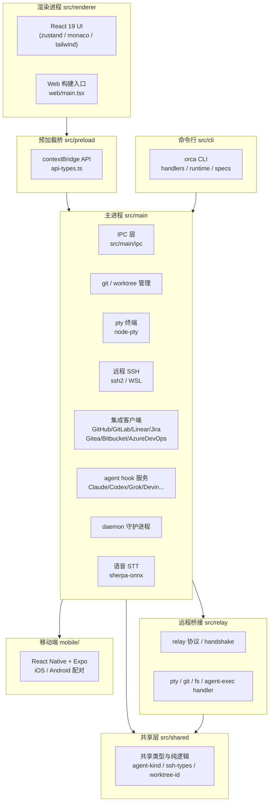

# 01 核心架构与技术栈

> 本章基于 Orca 本地开源源码（`d:\AI\external\tools\orca`）的 `package.json` 依赖清单与 `src` 目录结构解析，是理解后续各章功能实现机理的基础。所有技术栈信息均以本地源码为权威依据。

## 1.1 技术栈全景

Orca 是一个**基于 Electron 的桌面级 AI 编排器**，其技术底座覆盖桌面端、终端、远程、集成、移动端与语音六大领域。下表为依赖清单的核心技术栈速览：

| 领域 | 核心技术 | 关键依赖 | 用途说明 |
|------|---------|---------|---------|
| 桌面端 | Electron + Electron-vite + React 19 + TypeScript | `electron`、`electron-vite`、`react`、`typescript` | 应用外壳、构建链路、渲染 UI、类型安全 |
| 终端 | xterm.js + node-pty | `@xterm/xterm`、`@xterm/addon-webgl`、`node-pty` | Ghostty-class 终端渲染、伪终端进程管理 |
| 远程 | ssh2 + WSL + Windows 原生注册表 | `ssh2`、`windows-native-registry` | SSH Worktree、WSL 支持、Windows 集成 |
| 集成 | Linear / GitHub / GitLab / Gitea / Bitbucket / Azure DevOps / Jira | `@linear/sdk` 及各类客户端 | 任务与代码平台原生接入 |
| 移动端 | React Native / Expo | `react-native`、`expo`（`mobile/` 目录） | iOS / Android 移动 Companion |
| 语音 | sherpa-onnx | `sherpa-onnx` | 本地语音转文字（STT） |
| 其他 | i18next / terminal 序列化 / 内置浏览器 | `i18next`、`@xterm/addon-serialize`、`agent-browser` | 国际化、终端序列化、内置浏览器 |

### ⚠️ 重要：桌面端是 Electron，**非 Tauri**

> 请务必注意：Orca 桌面端基于 **Electron**（`electron` ^43.1.0）构建，**并非 Tauri**。这与 EchoBird 等采用 Rust 后端 + Tauri 壳的同类产品在技术路线上有本质区别。Electron 路径意味着 Orca 拥有完整的 Node.js 运行时与 Chromium 渲染环境，是支撑其 node-pty 伪终端、ssh2 远程、agent-browser 内置浏览器等能力的基础。

## 1.2 桌面端技术栈详解

| 技术 | 版本 | 作用 |
|------|------|------|
| Electron | ^43.1.0 | 桌面应用外壳，主进程 + 渲染进程双进程模型 |
| Electron-vite | ^5.0.0 | 现代构建工具，统一主进程/preload/渲染进程打包 |
| React | ^19.2.7 | 渲染进程 UI 框架 |
| React DOM | ^19.2.7 | Web 渲染层 |
| TypeScript | ^7.0.2 | 全量类型检查（`tsconfig.node/.web/.cli` 三套配置） |
| Zustand | ^5.0.14 | 前端状态管理（含 selector fanout 基准与优化） |
| Tailwind CSS | ^4.2.4 | UI 样式体系 |
| Monaco Editor | ^0.55.1 | 代码编辑与高亮 |
| i18next | ^26.3.1 | 国际化（本地化目录与覆盖率审计） |

## 1.3 终端技术栈详解

终端是 Orca 的核心能力之一，其技术栈分两层：

| 层次 | 技术 | 说明 |
|------|------|------|
| 渲染层 | `@xterm/xterm`（6.1.0-beta）+ `@xterm/addon-webgl` | **WebGL 渲染**，达到 Ghostty-class 终端性能；另有 fit、ligatures、search、unicode11、web-links 等 addon 增强 |
| 序列化 | `@xterm/addon-serialize` | 终端输出序列化，支撑「滚动缓冲跨重启存活」与日志回溯 |
| 进程管理层 | `node-pty`（+ 官方 patch） | 管理伪终端（PTY），负责与 CLI Agent 进程的 IO 交互 |
| 无头层 | `@xterm/headless` | 无头终端渲染，用于后台/远程场景 |

> 终端性能是 Orca 的工程重点：`package.json` 中大量 `test:e2e:terminal-*` 脚本（typing-latency、foreground-redraw-freeze、webgl-atlas-budget、hidden-tui-visual-restore 等）印证了其对终端渲染性能与正确性的持续投入。

## 1.4 远程与集成技术栈详解

| 领域 | 技术 | 说明 |
|------|------|------|
| SSH 远程 | `ssh2`（^1.17.0） | SSH Worktree：远程机器上运行 Agent，含全量文件编辑、git、终端、自动重连与端口转发 |
| WSL 支持 | `src/main/wsl*.ts`、`src/main/cli/wsl-cli-scripts.ts` | 面向 Windows 的 Linux 子系统集成，WSL 环境下的 CLI 与终端 |
| Windows 原生 | `windows-native-registry`（optional） | Windows 原生注册表访问 |
| Linear 集成 | `@linear/sdk` | 浏览/创建任务、从任务打开 worktree |
| GitHub 集成 | `src/main/github/` | PR、issue、项目看板、rate-limit 检测 |
| GitLab 集成 | `src/main/gitlab/` | 项目、issue 浏览 |
| Gitea 集成 | `src/main/gitea/` | 轻量 Git 托管接入 |
| Bitbucket 集成 | `src/main/bitbucket/` | Bitbucket 客户端 |
| Azure DevOps 集成 | `src/main/azure-devops/` | Azure DevOps 客户端 |
| Jira 集成 | `src/main/jira/` | Jira issue 浏览与 ADF 转换 |

## 1.5 移动端与语音技术栈详解

| 领域 | 技术 | 说明 |
|------|------|------|
| 移动端框架 | React Native（^0.83.9）+ Expo（^55） | 位于独立 `mobile/` 目录，`expo-router` 驱动路由 |
| 移动端平台 | iOS / Android | 可与桌面端配对，监控与引导 Agent（配对、E2EE 加密、双通道音频） |
| 移动端终端 | `@xterm/xterm` + `@xterm/addon-webgl` | 移动端同样内嵌终端渲染 |
| 语音 | `sherpa-onnx`（1.12.37，含各平台 optional 包） | **本地语音转文字（STT）**，无需云端；`src/main/speech/` 提供 stt-service / stt-worker |

## 1.6 整体分层架构

根据 `src` 目录结构，Orca 采用 **Electron 双进程 + 多模块** 分层，核心共六个目录：

| 目录 | 进程/职责 | 说明 |
|------|-----------|------|
| `src/main` | 主进程 | Node.js 环境，承载 git、pty、ssh、github/gitlab/linear/jira 集成、updater、telemetry、daemon、agent hook 服务等全部后端能力 |
| `src/renderer` | 渲染进程 | React 19 UI，包含 `src/`（App 与 store）、`web/`（Web 构建入口）、i18n 等 |
| `src/preload` | 预加载桥 | 通过 contextBridge 暴露安全 API（`api-types.ts`、`index.ts`） |
| `src/relay` | 远程桥接 | SSH 远程 Worktree 的桥接层：协议、pty、git、fs、agent-exec、plugin-overlay 等 handler |
| `src/shared` | 共享层 | 主/渲染/中继进程共享的类型与纯逻辑（agent-kind、ssh-types、git-history、worktree-id、e2ee-crypto 等） |
| `src/cli` | 命令行 | `orca` CLI（`./out/cli/index.js`），含 handlers、runtime、specs，供 Agent 反过来驱动 Orca |

### 架构示意图（Mermaid）

## 1.7 分层职责总结

- **主进程（src/main）**：Orca 的"后端大脑"，集中管理所有重量级能力——git 与 worktree 逻辑、pty 终端、SSH 远程、六大代码平台集成、Agent hook 服务（Claude/Codex/Grok/Devin 等）、daemon 守护、雷达/遥测、更新器、语音 STT。通过 IPC 层向渲染进程暴露能力。
- **渲染进程（src/renderer）**：用户可见的 UI，React 19 + Zustand，同时产出 Web 构建版（`web/`），支持跨端复用。
- **preload（src/preload）**：安全的 IPC 桥，以 contextBridge 方式暴露类型化 API，避免渲染进程直接接触 Node 能力。
- **relay（src/relay）**：远程 SSH 场景的桥接层，将 pty/git/fs/agent-exec 等能力转发到远程机器，是 SSH Worktree 的核心。
- **shared（src/shared）**：跨进程共享的类型与纯函数，保证主进程、渲染进程、relay 之间数据契约一致。
- **cli（src/cli）**：独立的 `orca` 命令行入口，支持 Agent 反过来驱动 Orca（worktree/snapshot/click/fill 等），是与桌面端互补的"反向编排"通道。

## 1.8 与后续章节的关联

- **terminal 能力** → 第 02 章「终端分屏」与第 03 章「Orca CLI」中的终端命令面
- **integration 能力** → 第 02 章「GitHub & Linear」与「SSH Worktree」
- **agent hook 服务** → 第 04 章「支持的 Agent 清单」中多 Agent 的接入机制
- **cli 能力** → 第 03 章「Orca CLI 与多 Agent 编排」的完整命令面
- **mobile 能力** → 第 02 章「移动 Companion」

---

| 上一章 | 返回目录 | 下一章 |
|--------|---------|--------|
| ← [00 项目概述与核心定位](./00-overview.md) | [README](./README.md) | → [02 八大核心功能详解](./02-core-features.md) |