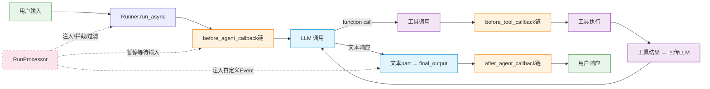
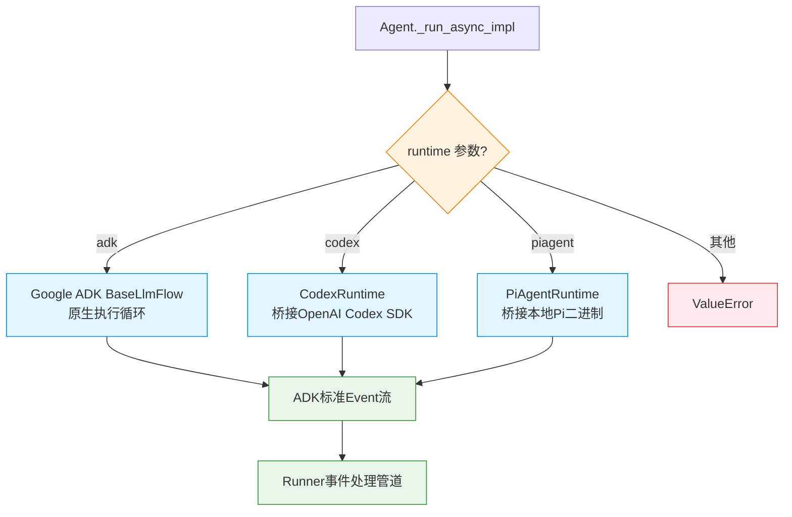

# 架构详解：Agent 生命周期与执行流程

本文档详细解析 VeADK Agent 从创建到执行完成的完整生命周期，包括初始化阶段的 19 步自动装配流程、Runner 执行时的消息处理管道、事件流转机制，以及多运行时策略选择逻辑。

---

## Agent 初始化流程图

Agent 的初始化核心在 `model_post_init` 方法中完成，这是 Pydantic 模型的后置初始化钩子，在所有字段赋值完成后自动调用。整个初始化流程包含 19 个有序步骤，采用**条件插件挂载**模式按需启用功能。

```mermaid
flowchart TD
    Start([Agent 构造开始]) --> Step1[步骤1: 父类初始化<br/>super().model_post_init]
    Step1 --> Step2[步骤2: API Key 四级解析<br/>显式>环境变量>ARK Token>配置默认]
    Step2 --> Step3[步骤3: RunProcessor 初始化<br/>None → NoOpRunProcessor]
    Step3 --> Step4[步骤4: model_extra_config 合并<br/>默认头|=用户配置]
    Step4 --> Step5[步骤5: 模型实例化<br/>ArkLlm/LiteLlm + Fallback链]
    Step5 --> Step6[步骤6: Tracer 准备<br/>_prepare_tracers 环境变量探测]
    Step6 --> Step7[步骤7: 工具依赖验证<br/>_validate_tool_dependencies 自动补全]
    Step7 --> Step8{knowledgebase<br/>存在?}
    Step8 -->|是| Step8a[挂载 LoadKnowledgebaseTool<br/>+ load_kb_queries 可选]
    Step8 -->|否| Step9
    Step8a --> Step9{long_term_memory<br/>存在?}
    Step9 -->|是| Step9a[挂载 load_memory 工具<br/>设置 backend metadata]
    Step9 -->|否| Step10{enable_authz?}
    Step9a --> Step10
    Step10 -->|是| Step10a[挂载 check_agent_authorization<br/>before_agent_callback]
    Step10 -->|否| Step11{prompt_manager<br/>存在?}
    Step10a --> Step11
    Step11 -->|是| Step11a[instruction = prompt_manager.get_prompt]
    Step11 -->|否| Step12{auto_save_session?}
    Step11a --> Step12
    Step12 -->|是| Step12a[挂载 save_session_to_long_term_memory<br/>after_agent_callback]
    Step12 -->|否| Step13{skills 非空?}
    Step12a --> Step13
    Step13 -->|是| Step13a[load_skills 自动探测模式<br/>+ enable_skills_checklist 回调]
    Step13 -->|否| Step14{example_store<br/>存在?}
    Step13a --> Step14
    Step14 -->|是| Step14a[挂载 ExampleTool]
    Step14 -->|否| Step15{enable_ghostchar?}
    Step14a --> Step15
    Step15 -->|是| Step15a[挂载 GhostcharTool<br/>修改 instruction]
    Step15 -->|否| Step16{enable_a2ui?}
    Step15a --> Step16
    Step16 -->|是| Step16a[挂载 build_a2ui_toolset]
    Step16 -->|否| Step17{enable_tunnel?}
    Step16a --> Step17
    Step17 -->|是| Step17a[挂载 TunnelToolset]
    Step17 -->|否| Step18{enable_dataset_gen?}
    Step17a --> Step18
    Step18 -->|是| Step18a[挂载 dataset_auto_gen_callback<br/>after_agent_callback]
    Step18 -->|否| Step19[步骤19: 初始化完成日志<br/>版本号+Agent信息]
    Step18a --> Step19
    Step19 --> End([Agent 就绪])

    classDef init fill:#e1f5fe,stroke:#0288d1,stroke-width:2px
    classDef condition fill:#fff3e0,stroke:#f57c00,stroke-width:2px
    classDef action fill:#f3e5f5,stroke:#7b1fa2,stroke-width:2px
    classDef done fill:#e8f5e9,stroke:#388e3c,stroke-width:2px

    class Start,End done
    class Step1,Step2,Step3,Step4,Step5,Step6,Step7,Step19 init
    class Step8,Step9,Step10,Step11,Step12,Step13,Step14,Step15,Step16,Step17,Step18 condition
    class Step8a,Step9a,Step10a,Step11a,Step12a,Step13a,Step14a,Step15a,Step16a,Step17a,Step18a action
```

---

## model_post_init 逐阶段解析

方法位置：[veadk/agent.py:214-445](file:///d:/AI/.chaos/libs/veadk-python/veadk/agent.py#L214-L445)

### 阶段一：基础配置初始化（步骤 1-4）

#### 步骤 1：父类初始化（第 215 行）

```python
super().model_post_init(None)  # for sub_agents init
```

**做什么**：调用 Google ADK `LlmAgent.model_post_init`，完成 sub_agents 等父类字段初始化。
**为什么**：确保父类状态完整后再挂载 VeADK 扩展，避免继承链断裂。

#### 步骤 2：API Key 四级优先级解析（第 223-232 行）

```python
if not self.model_api_key:
    env_key = os.getenv("MODEL_AGENT_API_KEY")
    if env_key:
        self.model_api_key = env_key
    elif self.model_api_key_name:
        from veadk.auth.veauth.ark_veauth import get_ark_token
        self.model_api_key = get_ark_token(api_key_name=self.model_api_key_name)
    else:
        self.model_api_key = settings.model.api_key
```

**做什么**：按优先级链解析模型 API Key。
**优先级顺序**：
1. 显式传入的 `model_api_key`（最高）
2. `MODEL_AGENT_API_KEY` 环境变量
3. `model_api_key_name` 通过 ARK Token 服务获取临时凭证
4. `settings.model.api_key` 配置文件默认值（最低）

**为什么**：适配不同部署场景——本地开发用环境变量、企业级用 ARK Token 轮换、容器部署用显式传参。

#### 步骤 3：RunProcessor 默认初始化（第 235-236 行）

```python
if self.run_processor is None:
    self.run_processor = NoOpRunProcessor()
```

**做什么**：未指定 RunProcessor 时，使用空实现的 `NoOpRunProcessor`。
**为什么**：避免后续装饰器调用时出现 NoneType 错误，NoOp 实现恒等装饰，无性能开销。

#### 步骤 4：模型配置合并（第 239-254 行）

```python
headers = DEFAULT_MODEL_EXTRA_CONFIG["extra_headers"].copy()
body = DEFAULT_MODEL_EXTRA_CONFIG["extra_body"].copy()
if self.model_extra_config:
    headers |= user_headers
    body |= user_body
self.model_extra_config |= {"extra_headers": headers, "extra_body": body}
```

**做什么**：将 VeADK 默认请求头（`veadk-source`、`veadk-version`、`x-is-encrypted` 等）与用户配置合并，用户配置优先级更高（`|=` 运算符右覆盖左）。
**为什么**：保证所有请求携带框架标识头用于后端统计和审计，同时允许用户自定义覆盖。

---

### 阶段二：核心对象创建（步骤 5-7）

#### 步骤 5：模型实例化（第 256-300 行）

**做什么**：
1. 处理 `model_name`：支持字符串（单模型）或列表（第一个为主模型，其余为 fallback 模型链）
2. 根据 `enable_responses` 选择客户端：
   - `True` → `ArkLlm`（豆包 Responses API，支持多轮缓存）
   - `False` → `LiteLlm`（通用 OpenAI 兼容接口）
3. 传入 `fallbacks` 参数实现自动故障转移
4. 用户自定义 model 时输出 warning 提示默认头可能缺失

**代码位置**：[veadk/agent.py:256-300](file:///d:/AI/.chaos/libs/veadk-python/veadk/agent.py#L256-L300)

#### 步骤 6：Tracer 准备（第 302 行）

```python
self._prepare_tracers()
```

**做什么**：调用 `_prepare_tracers()` 方法，通过环境变量 `ENABLE_APMPLUS`/`ENABLE_COZELOOP`/`ENABLE_TLS` 自动探测并配置 Tracing 导出器。
**详细流程**：[veadk/agent.py:645-696](file:///d:/AI/.chaos/libs/veadk-python/veadk/agent.py#L645-L696)

#### 步骤 7：工具依赖验证（第 304 行）

```python
self._validate_tool_dependencies()
```

**做什么**：检查工具间配对依赖，目前实现了视频生成工具对的自动补全：
- 有 `video_generate` 无 `video_task_query` → 自动补全 query 工具
- 有 `video_task_query` 无 `video_generate` → 自动补全 generate 工具

**代码位置**：[veadk/agent.py:614-643](file:///d:/AI/.chaos/libs/veadk-python/veadk/agent.py#L614-L643)

---

### 阶段三：条件功能挂载（步骤 8-18）

此阶段的 11 个步骤全部采用**条件判断+延迟导入+工具/回调挂载**模式，每个功能仅在用户显式启用或传入对应实例时才激活，且模块导入发生在条件分支内部，避免不必要的依赖开销。

| 步骤 | 开关条件 | 挂载内容 | 挂载方式 | 代码位置 |
|---|---|---|---|---|
| 8 | `self.knowledgebase` 非空 | `LoadKnowledgebaseTool`、`load_kb_queries` | `self.tools.append()` | [veadk/agent.py:306-324](file:///d:/AI/.chaos/libs/veadk-python/veadk/agent.py#L306-L324) |
| 9 | `self.long_term_memory is not None` | `load_memory` 工具（设置 backend metadata） | `self.tools.append()` | [veadk/agent.py:326-333](file:///d:/AI/.chaos/libs/veadk-python/veadk/agent.py#L326-L333) |
| 10 | `self.enable_authz = True` | `check_agent_authorization` | `before_agent_callback` 链 | [veadk/agent.py:335-349](file:///d:/AI/.chaos/libs/veadk-python/veadk/agent.py#L335-L349) |
| 11 | `self.prompt_manager` 非空 | `self.instruction = prompt_manager.get_prompt` | 替换 instruction | [veadk/agent.py:351-352](file:///d:/AI/.chaos/libs/veadk-python/veadk/agent.py#L351-L352) |
| 12 | `self.auto_save_session = True` | `save_session_to_long_term_memory` | `after_agent_callback` 链 | [veadk/agent.py:354-375](file:///d:/AI/.chaos/libs/veadk-python/veadk/agent.py#L354-L375) |
| 13 | `self.skills` 非空 | `load_skills()` + skills checklist 回调 | 工具+`before_tool_callback` | [veadk/agent.py:377-397](file:///d:/AI/.chaos/libs/veadk-python/veadk/agent.py#L377-L397) |
| 14 | `self.example_store` 非空 | `ExampleTool` | `self.tools.append()` | [veadk/agent.py:399-402](file:///d:/AI/.chaos/libs/veadk-python/veadk/agent.py#L399-L402) |
| 15 | `self.enable_ghostchar = True` | `GhostcharTool` + instruction 追加 | `self.tools.append()` + 修改 instruction | [veadk/agent.py:404-410](file:///d:/AI/.chaos/libs/veadk-python/veadk/agent.py#L404-L410) |
| 16 | `self.enable_a2ui = True` | `build_a2ui_toolset()` | `self.tools.append()` | [veadk/agent.py:412-416](file:///d:/AI/.chaos/libs/veadk-python/veadk/agent.py#L412-L416) |
| 17 | `self.enable_tunnel = True` | `TunnelToolset(agent_name=self.name)` | `self.tools.append()` | [veadk/agent.py:418-422](file:///d:/AI/.chaos/libs/veadk-python/veadk/agent.py#L418-L422) |
| 18 | `self.enable_dataset_gen = True` | `dataset_auto_gen_callback` | `after_agent_callback` 链 | [veadk/agent.py:424-438](file:///d:/AI/.chaos/libs/veadk-python/veadk/agent.py#L424-L438) |

**回调链的双形态自适应机制**：步骤 10/12/13/18 中挂载回调时，框架自动处理单函数/列表两种形态：
- 回调不存在 → 直接赋值为单个函数
- 回调已存在且是列表 → append
- 回调已存在但不是列表 → 转为 `[原回调, 新回调]` 列表

这种"宽容输入、严格输出"的设计降低了 API 使用门槛。

---

### 阶段四：初始化完成（步骤 19）

**做什么**（第 440-445 行）：
1. 打印 VeADK 版本号 info 日志
2. 打印类名和 agent name，提示初始化完成
3. debug 级别打印 agent 的 id、name、model_name、model_api_base、tools、skills 完整信息

```python
logger.info(f"VeADK version: {VERSION}")
logger.info(f"{self.__class__.__name__} `{self.name}` init done.")
logger.debug(f"Agent: {self.model_dump(include={'id', 'name', 'model_name', 'model_api_base', 'tools', 'skills'})}")
```

---

## Runner 执行流程

Runner 是 VeADK 的执行入口，负责消息输入转换、会话管理、RunProcessor 装饰器链应用、Agent 调用、事件流处理、响应输出全流程。

方法位置：[veadk/runner.py:468-576](file:///d:/AI/.chaos/libs/veadk-python/veadk/runner.py#L468-L576)

### 执行流程图

```mermaid
flowchart TD
    Input([用户消息输入<br/>str/MediaMessage/list]) --> Convert[消息转换<br/>_convert_messages<br/>转为ADK标准Message列表]
    Convert --> SessionCheck{short_term_memory<br/>存在?}
    SessionCheck -->|是| CreateSession[创建/获取会话<br/>short_term_memory.create_session<br/>app_name+user_id+session_id]
    SessionCheck -->|否| RunConfig
    CreateSession --> RunConfig
    RunConfig[RunConfig初始化<br/>max_llm_calls from env] --> MediaUpload{本次启用<br/>TOS上传?}
    MediaUpload -->|临时启用| SetUploadFlag[设置upload_inline_data_to_tos]
    MediaUpload -->|否| MessageLoop
    SetUploadFlag --> MessageLoop[遍历每条消息]
    MessageLoop --> ProcessorDecorator[RunProcessor装饰器<br/>@processor.process_run 包装event_generator]
    ProcessorDecorator --> RunAsync[调用 run_async<br/>→ Agent._run_async_impl]
    RunAsync --> EventStream{事件流迭代}
    EventStream --> TextPart{event.content.parts<br/>有文本且非thought?}
    TextPart -->|是| UpdateOutput[更新 final_output = part.text]
    TextPart -->|否| EventStream
    UpdateOutput --> EventStream
    EventStream -->|迭代结束| MessageLoop
    MessageLoop -->|所有消息完成| TracingSave{save_tracing_data?}
    TracingSave -->|是| SaveTracing[save_tracing_file<br/>dump到磁盘]
    TracingSave -->|否| PrintTrace
    SaveTracing --> PrintTrace[打印 Trace ID<br/>_print_trace_id]
    PrintTrace --> RestoreUpload{临时启用过<br/>TOS上传?}
    RestoreUpload -->|是| RestoreFlag[恢复原upload标志]
    RestoreUpload -->|否| ReturnOutput
    RestoreFlag --> ReturnOutput([返回 final_output 字符串])

    classDef io fill:#e8f5e9,stroke:#388e3c,stroke-width:2px
    classDef process fill:#e1f5fe,stroke:#0288d1,stroke-width:2px
    classDef decision fill:#fff3e0,stroke:#f57c00,stroke-width:2px
    classDef middleware fill:#f3e5f5,stroke:#7b1fa2,stroke-width:2px

    class Input,ReturnOutput io
    class Convert,CreateSession,RunConfig,SetUploadFlag,RunAsync,UpdateOutput,SaveTracing,PrintTrace,RestoreFlag process
    class SessionCheck,MediaUpload,TracingSave,RestoreUpload,TextPart,EventStream,MessageLoop decision
    class ProcessorDecorator middleware
```

### 执行阶段详解

#### 阶段一：消息输入与会话管理

1. **消息类型支持**：`RunnerMessage = Union[str, list[str], MediaMessage, list[MediaMessage], list[MediaMessage | str]]`（[veadk/runner.py:46-52](file:///d:/AI/.chaos/libs/veadk-python/veadk/runner.py#L46-L52)）
2. **消息转换**：`_convert_messages()` 将多种输入类型转为 ADK 标准 Message 列表（[veadk/runner.py:201-277](file:///d:/AI/.chaos/libs/veadk-python/veadk/runner.py#L201-L277)）
3. **会话自动创建**：配置了 `short_term_memory` 时，自动调用 `create_session(app_name, user_id, session_id)`，使用 assert 验证会话创建成功（[veadk/runner.py:526-535](file:///d:/AI/.chaos/libs/veadk-python/veadk/runner.py#L526-L535)）
4. **RunConfig 配置**：默认 `max_llm_calls` 从 `MODEL_AGENT_MAX_LLM_CALLS` 环境变量读取，默认值 100

#### 阶段二：RunProcessor 装饰器链

这是 Runner 最核心的横切关注点机制：

```python
@(run_processor or self.run_processor).process_run(
    runner=self, message=converted_message
)
async def event_generator():
    async for event in self.run_async(
        user_id=user_id,
        session_id=session_id,
        new_message=converted_message,
        run_config=run_config,
    ):
        yield event

async for event in event_generator():
    # 处理事件...
```

**代码位置**：[veadk/runner.py:541-553](file:///d:/AI/.chaos/libs/veadk-python/veadk/runner.py#L541-L553)

**三级优先级解析**（[veadk/runner.py:406-414](file:///d:/AI/.chaos/libs/veadk-python/veadk/runner.py#L406-L414)）：
1. `run()` 方法参数传入的 `run_processor`（最高，单次运行临时覆盖）
2. Runner 构造参数的 `run_processor`
3. Agent 实例的 `run_processor`
4. 默认 `NoOpRunProcessor`（最低，空实现）

**装饰器工作原理**：`process_run()` 返回一个高阶函数（装饰器），接收原始 `event_generator` 函数，返回包装后的新生成器。包装器可以在事件流前后执行逻辑、注入事件、过滤事件、甚至暂停等待用户输入（如 OAuth2 认证流程）。

#### 阶段三：模型调用与工具执行

`self.run_async` 经过 `intercept_new_message(_upload_image_to_tos)` 装饰器包装（[veadk/runner.py:464-466](file:///d:/AI/.chaos/libs/veadk-python/veadk/runner.py#L464-L466)），在调用前后插入 pre/post 钩子：
- `pre_run_process`：处理内联媒体数据（如图片上传到 TOS）
- `post_run_process`：后置处理占位
- thinking_parts 聚合逻辑和事件日志记录

`run_async` 最终调用到 Agent 的 `_run_async_impl`，根据 runtime 参数分发到不同执行引擎（详见下文"运行时策略选择"）。

#### 阶段四：回调链执行

在 Agent 执行过程中，Google ADK 原生回调机制会按以下顺序触发回调链：
1. **before_agent_callback**：Agent 执行前，可用于授权检查、动态技能加载
2. **before_tool_callback**：每个工具调用前，可用于技能清单检查
3. **after_agent_callback**：Agent 执行后，可用于会话自动保存、数据集生成

每个回调点都支持 VeADK 的双形态自适应（单函数/列表）。

#### 阶段五：响应输出

事件流迭代过程中，从每个 `event.content.parts` 中提取非 thought 的文本部分，持续更新 `final_output`，最终返回最后一个有效文本作为响应。

---

## 事件流（Event 类型与流转）

VeADK 的事件流基于 Google ADK 的 Event 体系，所有执行过程中的状态变化都通过 Event 对象 yield 出来，形成异步生成器流。

### 核心 Event 类型

| 事件类型 | 触发时机 | 主要用途 |
|---|---|---|
| **模型请求事件** | LLM 调用前 | 记录请求参数、prompt 内容 |
| **模型响应事件** | LLM 返回后 | 携带模型生成的文本/function call |
| **工具调用事件** | 工具执行前 | 记录工具名、参数 |
| **工具结果事件** | 工具执行后 | 携带工具返回结果 |
| **思考事件（thought）** | 模型内部推理 | `part.thought=True`，不展示给用户 |
| **错误事件** | 异常发生时 | 携带错误信息 |
| **自定义事件** | RunProcessor 注入 | 如认证请求事件（AuthRequest） |

### 事件流转路径



---

## 运行时策略选择流程

VeADK 支持三种执行运行时，通过 Agent 的 `runtime` 字段（`Literal["adk", "codex", "piagent"]`，默认 `"adk"`）选择。

### 策略分发代码

分发逻辑位于 `Agent._run_async_impl`：

```python
if self.runtime == "adk":
    async for event in super()._run_async_impl(ctx):
        yield event
    return

from veadk.runtime import get_runtime
async for event in get_runtime(self.runtime).run_async(self, ctx):
    yield event
```

**代码位置**：[veadk/agent.py:733-741](file:///d:/AI/.chaos/libs/veadk-python/veadk/agent.py#L733-L741)

### 运行时工厂与缓存

`get_runtime()` 工厂函数使用 `@lru_cache(maxsize=None)` 缓存运行时实例，延迟导入实现可选依赖隔离：

```python
@lru_cache(maxsize=None)
def get_runtime(name: str) -> BaseRuntime:
    if name == "codex":
        try:
            from veadk.runtime.codex import CodexRuntime
        except ModuleNotFoundError as e:
            raise ImportError(
                f"The 'codex' runtime requires extra dependencies (missing: {e.name}). "
                "Install them with: pip install openai-codex fastapi uvicorn"
            ) from e
        return CodexRuntime()
    if name == "piagent":
        from veadk.runtime.piagent import PiAgentRuntime
        return PiAgentRuntime()
    raise ValueError(f"Unknown runtime: {name!r}")
```

**代码位置**：[veadk/runtime/__init__.py:32-64](file:///d:/AI/.chaos/libs/veadk-python/veadk/runtime/__init__.py#L32-L64)

### 三种运行时对比

| 运行时 | 实现方式 | 依赖 | 适用场景 | 功能完整度 |
|---|---|---|---|---|
| **adk**（默认） | 直接调用父类 `super()._run_async_impl(ctx)`，使用 Google ADK 原生 BaseLlmFlow | 无额外依赖 | 通用 Agent 开发，最稳定 | 100% 支持所有 ADK 特性 |
| **codex** | `CodexRuntime` 桥接 OpenAI Codex SDK | `openai-codex`, `fastapi`, `uvicorn` | 代码生成、编程助手场景 | 工具桥接，部分高级特性受限 |
| **piagent** | `PiAgentRuntime` 桥接本地 Pi 编码 Agent 二进制 | piagent 二进制 | 本地代码代理、CLI 编程助手 | 通过子进程通信，适合独立任务 |

### 运行时桥接接口

所有非 adk 运行时继承 `BaseRuntime` 抽象基类，统一桥接接口：

```python
class BaseRuntime:
    async def run_async(
        self, agent: Agent, ctx: InvocationContext
    ) -> AsyncGenerator[Event, None]:
        ...
```

**代码位置**：[veadk/runtime/base_runtime.py](file:///d:/AI/.chaos/libs/veadk-python/veadk/runtime/base_runtime.py)

桥接层负责将外部运行时（Codex SDK、PiAgent 二进制）的输出转换回 ADK 标准 Event 流，使得上层 Runner 的会话管理、memory、tracing、RunProcessor 等功能无需修改即可复用于所有 runtime。



---

## 下一步阅读

- [架构概览](overview.md)：回到整体架构总览
- [核心设计模式解析](design-patterns.md)：深入理解继承扩展、回调链、策略模式等 7 个设计模式
- [模块依赖关系](module-dependencies.md)：了解模块间的依赖约束和分层规则
