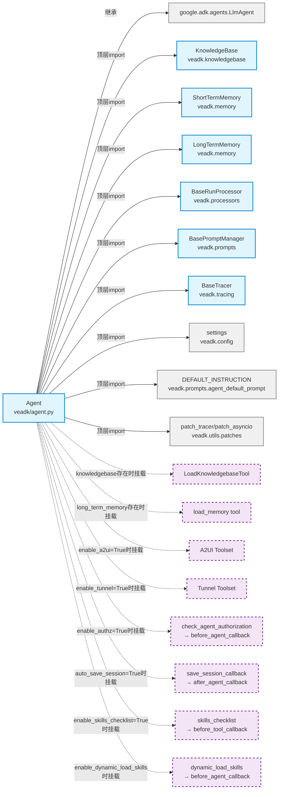
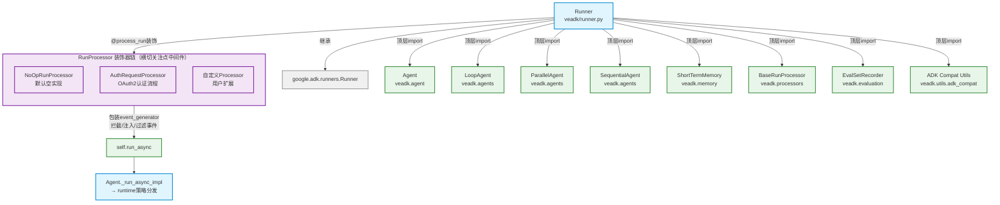

# 架构参考：模块依赖关系与分层约束

本文档详细展示 VeADK 核心模块间的 import/依赖关系，通过 Mermaid 图表可视化六层分层架构，并明确定义模块依赖规则，为代码贡献者和架构师提供准确的架构参考。

---

## 一、核心模块依赖关系总览

下图展示 VeADK 完整的六层架构模块依赖关系。实线箭头表示直接 import 依赖，虚线箭头表示继承或使用第三方 SDK：

```mermaid
flowchart TD
    %% ========== L0 基础层（第三方依赖） ==========
    subgraph L0["L0 基础层（Google ADK + 第三方SDK）"]
        direction LR
        ADK[Google ADK<br/>LlmAgent/BaseTool/BaseSessionService]
        A2ASDK[A2A SDK<br/>a2a.server/a2a.types]
        VolcSDK[火山引擎SDK<br/>volcenginesdkcore/vefaas/apig]
        LarkSDK[飞书SDK<br/>lark_oapi]
        ClickLib[Click CLI Framework]
        FastAPILib[FastAPI/UVicorn]
    end

    %% ========== L1 核心层（VeADK Core） ==========
    subgraph L1["L1 核心层（VeADK Core）"]
        direction TB
        Config[Config/Settings<br/>veadk/config.py]
        Consts[Consts<br/>veadk/consts.py]
        Logger[Logger<br/>veadk/utils/logger.py]
        AgentClass[Agent<br/>veadk/agent.py]
        RunnerClass[Runner<br/>veadk/runner.py]
        EventTypes[Event Types<br/>veadk/types.py]
        CredentialService[VeCredentialService<br/>veadk/auth/ve_credential_service.py]

        Config --> Consts
        Config --> Logger
        AgentClass --> Config
        AgentClass --> Consts
        AgentClass --> CredentialService
        RunnerClass --> AgentClass
        RunnerClass --> Config
        RunnerClass --> EventTypes
    end

    %% ========== L2 扩展抽象层（Extension Points） ==========
    subgraph L2["L2 扩展抽象层（Extension Points）"]
        direction TB
        RunProcessor[BaseRunProcessor<br/>veadk/processors/]
        Tracer[BaseTracer<br/>veadk/tracing/]
        PromptManager[BasePromptManager<br/>veadk/prompts/]
        ShortTermMem[ShortTermMemory<br/>veadk/memory/]
        LongTermMem[LongTermMemory<br/>veadk/memory/]
        KB[KnowledgeBase<br/>veadk/knowledgebase/]
        Skills[Skills Registry<br/>veadk/skills/]
        Tools[Builtin Tools<br/>veadk/tools/]
        Tunnel[Tunnel<br/>veadk/tunnel/]
        A2UI[A2UI<br/>veadk/a2ui/]
        Reflector[Reflector<br/>veadk/reflector/]
        Evaluation[Evaluation<br/>veadk/evaluation/]

        AgentClass --> RunProcessor
        AgentClass --> Tracer
        AgentClass --> PromptManager
        AgentClass --> ShortTermMem
        AgentClass --> LongTermMem
        AgentClass --> KB
        AgentClass --> Skills
        AgentClass --> Tools
        AgentClass --> Tunnel
        AgentClass --> A2UI
        RunnerClass --> ShortTermMem
    end

    %% ========== L3 后端实现层（Backend Implementations） ==========
    subgraph L3["L3 后端实现层（Backend Implementations）"]
        direction TB
        STMBackends[STM Backends<br/>memory/short_term_memory_backends/]
        LTMBackends[LTM Backends<br/>memory/long_term_memory_backends/]
        KBBackends[KB Backends<br/>knowledgebase/backends/]
        Tracers[Tracer Exporters<br/>tracing/telemetry/exporters/]
        VeAuth[VeAuth Modules<br/>auth/veauth/]
        PromptImpls[Prompt Managers<br/>CozeloopPromptManager]

        ShortTermMem --> STMBackends
        LongTermMem --> LTMBackends
        KB --> KBBackends
        Tracer --> Tracers
        CredentialService --> VeAuth
        PromptManager --> PromptImpls
    end

    %% ========== L4 协议层（Protocols） ==========
    subgraph L4["L4 协议层（Protocols）"]
        direction TB
        A2AServer[VeA2AServer<br/>a2a/ve_a2a_server.py]
        AgentCard[AgentCard<br/>a2a/agent_card.py]
        A2AHub[A2A Hub Server/Client<br/>a2a/hub/]
        A2AExecutor[A2aAgentExecutor<br/>a2a/ve_agent_executor.py]
        RemoteAgent[RemoteVeAgent<br/>a2a/remote_ve_agent.py]
        VeMiddlewares[A2A Middlewares<br/>a2a/ve_middlewares.py]

        A2AServer --> AgentCard
        A2AServer --> A2AExecutor
        A2AHub --> AgentCard
        RunnerClass --> A2AExecutor
    end

    %% ========== L5 云集成层（Cloud Integrations） ==========
    subgraph L5["L5 云集成层（Cloud Integrations）"]
        direction TB
        VeFaaS[VeFaaS<br/>integrations/ve_faas/]
        VeAPIG[VeAPIG<br/>integrations/ve_apig/]
        VeCR[VeCR<br/>integrations/ve_cr/]
        VeTOS[VeTOS<br/>integrations/ve_tos/]
        VeTLS[VeTLS<br/>integrations/ve_tls/]
        VeIdentity[VeIdentity<br/>integrations/ve_identity/]
        AgentKit[AgentKit<br/>integrations/agentkit/]
        CozeLoop[CozeLoop<br/>integrations/ve_cozeloop/]
        CloudEngine[CloudAgentEngine<br/>cloud/cloud_agent_engine.py]
        CloudApp[CloudApp<br/>cloud/cloud_app.py]
        HarnessApp[Harness App<br/>cloud/harness_app/]

        VeFaaS --> VeAPIG
        VeFaaS --> VeCR
        CloudEngine --> VeFaaS
        CloudApp --> CloudEngine
        HarnessApp --> CloudEngine
    end

    %% ========== L6 接入层（Channels & CLI） ==========
    subgraph L6["L6 接入层（Channels & CLI）"]
        direction TB
        FeishuChannel[FeishuChannelExtension<br/>extensions/feishu_channel.py]
        HarnessExt[Harness Extension<br/>extensions/harness/]
        CLI[CLI Commands<br/>cli/cli.py]
        WebUI[Web UI<br/>webui/]
        Frontend[Frontend Build<br/>frontend/]
        RuntimeCodex[Codex Runtime<br/>runtime/codex/]
        RuntimePiAgent[PiAgent Runtime<br/>runtime/piagent/]

        FeishuChannel --> RunnerClass
        CLI --> VeFaaS
        CLI --> AgentKit
        CLI --> VeAPIG
    end

    %% ========== 第三方依赖连线（虚线） ==========
    AgentClass -.->|"继承"| ADK
    Tools -.->|"继承BaseTool"| ADK
    STMBackends -.->|"实现BaseSessionService"| ADK
    A2AServer -.->|"使用"| A2ASDK
    A2AHub -.->|"使用"| A2ASDK
    VeFaaS -.->|"调用"| VolcSDK
    VeAPIG -.->|"调用"| VolcSDK
    VeIdentity -.->|"调用"| VolcSDK
    FeishuChannel -.->|"使用"| LarkSDK
    CLI -.->|"基于"| ClickLib
    A2AServer -.->|"基于"| FastAPILib
    A2AHub -.->|"基于"| FastAPILib
    HarnessApp -.->|"基于"| FastAPILib

    %% ========== 样式定义 ==========
    classDef l0 fill:#f0f0f0,stroke:#999,stroke-width:2px
    classDef l1 fill:#e1f5fe,stroke:#0288d1,stroke-width:2px
    classDef l2 fill:#f3e5f5,stroke:#7b1fa2,stroke-width:2px
    classDef l3 fill:#e8f5e9,stroke:#388e3c,stroke-width:2px
    classDef l4 fill:#fff3e0,stroke:#f57c00,stroke-width:2px
    classDef l5 fill:#ffebee,stroke:#d32f2f,stroke-width:2px
    classDef l6 fill:#fce4ec,stroke:#c2185b,stroke-width:2px

    class ADK,A2ASDK,VolcSDK,LarkSDK,ClickLib,FastAPILib l0
    class Config,Consts,Logger,AgentClass,RunnerClass,EventTypes,CredentialService l1
    class RunProcessor,Tracer,PromptManager,ShortTermMem,LongTermMem,KB,Skills,Tools,Tunnel,A2UI,Reflector,Evaluation l2
    class STMBackends,LTMBackends,KBBackends,Tracers,VeAuth,PromptImpls l3
    class A2AServer,AgentCard,A2AHub,A2AExecutor,RemoteAgent,VeMiddlewares l4
    class VeFaaS,VeAPIG,VeCR,VeTOS,VeTLS,VeIdentity,AgentKit,CozeLoop,CloudEngine,CloudApp,HarnessApp l5
    class FeishuChannel,HarnessExt,CLI,WebUI,Frontend,RuntimeCodex,RuntimePiAgent l6
```



---

## 二、Agent 核心依赖聚焦图

下图聚焦 Agent 类（[veadk/agent.py](file:///d:/AI/.chaos/libs/veadk-python/veadk/agent.py)）的直接依赖和条件挂载的扩展点，帮助理解 Agent 如何整合各个能力模块：



**关键区分**：
- **实线箭头（顶层 import）**：Agent 模块加载时就会 import 的依赖，属于硬依赖
- **虚线箭头（延迟导入）**：在 `model_post_init` 方法内部条件分支中 `from ... import ...`，仅当对应功能启用时才加载，属于可选依赖

---

## 三、Runner 执行依赖聚焦图

下图聚焦 Runner 类（[veadk/runner.py](file:///d:/AI/.chaos/libs/veadk-python/veadk/runner.py)）的执行依赖和 RunProcessor 装饰器链机制：



**RunProcessor 三级优先级**（[veadk/runner.py:406-414](file:///d:/AI/.chaos/libs/veadk-python/veadk/runner.py#L406-L414)）：
1. `run()` 方法参数 `run_processor`（单次运行临时覆盖，最高优先级）
2. Runner 构造函数参数 `run_processor`
3. Agent 实例的 `run_processor`
4. 默认 `NoOpRunProcessor`（最低优先级，恒等装饰）

---

## 四、六层分层架构详细说明

VeADK 采用严格的六层分层架构，依赖方向严格自上而下（上层依赖下层，下层不反向依赖上层）。

```
L6 接入层 ──▶ L5 云集成层 ──▶ L4 协议层 ──▶ L3 后端实现层 ──▶ L2 扩展抽象层 ──▶ L1 核心层 ──▶ L0 基础层
```

### L0 基础层（Base Layer）- 第三方依赖

**定位**：所有外部依赖，不包含 VeADK 自身代码。此层是整个架构的基石。

| 组件 | 包名 | 职责 |
|---|---|---|
| Google ADK | `google.adk.*` | LlmAgent 基类、工具抽象、会话服务、事件流、Runner 基类、BaseLlmFlow 执行引擎 |
| A2A SDK | `a2a.server`、`a2a.types` | Agent-to-Agent 协议实现、JSON-RPC、FastAPI 应用基础 |
| 火山引擎 SDK | `volcenginesdkcore`、`volcenginesdkvefaas`、`volcenginesdkapig` | VeFaaS、APIG、TOS、TLS、IAM 等云服务 API 封装和签名请求 |
| 飞书 SDK | `lark_oapi` | 飞书机器人 WebSocket 连接、消息收发、OpenAPI |
| Click | `click` | CLI 命令行框架，提供命令/参数/选项解析 |
| FastAPI/Uvicorn | `fastapi`、`uvicorn` | HTTP 服务框架，用于 A2A Server、Harness App、A2A Hub 等 |

### L1 核心层（Core Layer）- VeADK 内核

**定位**：框架最核心的抽象与实现，所有其他模块都依赖此层。核心层**不依赖任何上层模块**，保持纯净。

| 模块 | 路径 | 核心职责 |
|---|---|---|
| Config | [veadk/config.py](file:///d:/AI/.chaos/libs/veadk-python/veadk/config.py)、[veadk/configs/](file:///d:/AI/.chaos/libs/veadk-python/veadk/configs/) | 配置加载、环境变量管理、`settings` 单例、`veadk_environments` 环境探测 |
| Consts | [veadk/consts.py](file:///d:/AI/.chaos/libs/veadk-python/veadk/consts.py) | 默认常量、默认模型配置、`DEFAULT_MODEL_EXTRA_CONFIG` 版本头信息 |
| Logger | [veadk/utils/logger.py](file:///d:/AI/.chaos/libs/veadk-python/veadk/utils/logger.py) | 统一日志接口封装 |
| **Agent** | [veadk/agent.py:72](file:///d:/AI/.chaos/libs/veadk-python/veadk/agent.py#L72-L72) | **核心类**，继承 LlmAgent，整合所有扩展能力（memory/kb/tracers/processor 等） |
| **Runner** | [veadk/runner.py:329](file:///d:/AI/.chaos/libs/veadk-python/veadk/runner.py#L329-L329) | **执行入口**，继承 ADK Runner，包装事件流、支持 RunProcessor 装饰器、媒体处理 |
| Event Types | [veadk/types.py](file:///d:/AI/.chaos/libs/veadk-python/veadk/types.py) | `MediaMessage` 等自定义类型扩展 |
| VeCredentialService | [veadk/auth/ve_credential_service.py](file:///d:/AI/.chaos/libs/veadk-python/veadk/auth/ve_credential_service.py) | 凭证存储服务，支持 app_name/user_id 双层隔离访问 |

**核心层纯净规则**：核心层的 import 语句只能引用 L0 基础层和核心层内部模块，绝不能 import L2-L6 的任何模块。扩展能力通过"接收抽象基类实例作为构造参数"的方式接入，而非直接 import 具体实现。

### L2 扩展抽象层（Extension Abstraction Layer）

**定位**：定义所有扩展点的抽象基类/接口，规定扩展契约。此层大量使用模板方法模式、策略模式、装饰器模式。

| 模块 | 路径 | 抽象方法/职责 |
|---|---|---|
| BaseRunProcessor | [veadk/processors/base_run_processor.py](file:///d:/AI/.chaos/libs/veadk-python/veadk/processors/base_run_processor.py) | `process_run()` 装饰器接口，横切关注点中间件抽象 |
| BaseTracer | [veadk/tracing/base_tracer.py](file:///d:/AI/.chaos/libs/veadk-python/veadk/tracing/base_tracer.py) | `dump()` Tracing 数据导出抽象 |
| BasePromptManager | [veadk/prompts/prompt_manager.py](file:///d:/AI/.chaos/libs/veadk-python/veadk/prompts/prompt_manager.py) | `get_prompt()` 提示词动态获取抽象 |
| ShortTermMemory | [veadk/memory/short_term_memory.py](file:///d:/AI/.chaos/libs/veadk-python/veadk/memory/short_term_memory.py) | 会话级记忆封装，提供 `create_session/get_session` |
| LongTermMemory | [veadk/memory/long_term_memory.py](file:///d:/AI/.chaos/libs/veadk-python/veadk/memory/long_term_memory.py) | 跨会话持久记忆封装，提供 `save/search`，自动挂载 `load_memory` 工具 |
| KnowledgeBase | [veadk/knowledgebase/knowledgebase.py](file:///d:/AI/.chaos/libs/veadk-python/veadk/knowledgebase/knowledgebase.py) | RAG 知识库封装，提供 `add/query`，自动挂载 `load_kb` 工具 |
| Builtin Tools | [veadk/tools/](file:///d:/AI/.chaos/libs/veadk-python/veadk/tools/) | web_search、run_code、load_kb、视频生成等内置工具实现 |
| Tunnel | [veadk/tunnel/](file:///d:/AI/.chaos/libs/veadk-python/veadk/tunnel/) | `TunnelRegistry`、`BaseProtocol`、MCP 协议实现 |
| A2UI | [veadk/a2ui/](file:///d:/AI/.chaos/libs/veadk-python/veadk/a2ui/) | A2UI 组件目录、Toolset 封装 |
| Reflector | [veadk/reflector/](file:///d:/AI/.chaos/libs/veadk-python/veadk/reflector/) | `BaseReflector` 反思机制抽象 |
| Evaluation | [veadk/evaluation/](file:///d:/AI/.chaos/libs/veadk-python/veadk/evaluation/) | `BaseEvaluator`、`EvalSetRecorder` 评估框架 |

**扩展契约稳定性**：L2 层的抽象基类接口一旦发布保持稳定，L3 层的具体实现可独立演进，不影响上层代码。

### L3 后端实现层（Backend Implementation Layer）

**定位**：扩展抽象层的具体实现，可插拔替换。使用工厂模式+依赖注入，用户通过构造参数传入 backend 实例即可切换存储后端。

| 分类 | 模块路径 | 具体实现 |
|---|---|---|
| 短期记忆后端 | [memory/short_term_memory_backends/](file:///d:/AI/.chaos/libs/veadk-python/veadk/memory/short_term_memory_backends/) | SQLite、PostgreSQL、MySQL |
| 长期记忆后端 | [memory/long_term_memory_backends/](file:///d:/AI/.chaos/libs/veadk-python/veadk/memory/long_term_memory_backends/) | InMemory、Redis、OpenSearch、Mem0、VikingDB、OpenViking、TOS Bucket |
| 知识库后端 | [knowledgebase/backends/](file:///d:/AI/.chaos/libs/veadk-python/veadk/knowledgebase/backends/) | InMemory、Milvus、OpenSearch、Redis、VikingDB、OpenViking、TOS Vector、Context Search |
| Tracer 导出器 | [tracing/telemetry/exporters/](file:///d:/AI/.chaos/libs/veadk-python/veadk/tracing/telemetry/exporters/) | InMemory、TLS、APMPlus、Cozeloop、OpenTelemetry |
| VeAuth 认证 | [auth/veauth/](file:///d:/AI/.chaos/libs/veadk-python/veadk/auth/veauth/) | ARK、Speech、OpenSearch、PostgreSQL、Viking Mem0 等各服务的凭证获取 |
| PromptManager 实现 | [prompts/](file:///d:/AI/.chaos/libs/veadk-python/veadk/prompts/) | `CozeloopPromptManager`（从 CozeLoop 获取提示词） |

**依赖注入模式示例**：
```python
# 用户通过构造参数传入具体 backend 实例，无需修改上层代码
stm = ShortTermMemory(backend=PostgreSQLBackend(dsn="postgresql://..."))
agent = Agent(name="demo", short_term_memory=stm)
```

### L4 协议层（Protocol Layer）

**定位**：标准化 Agent 间通信协议和远程调用，基于开放 A2A 协议实现互操作。

| 模块 | 路径 | 核心职责 |
|---|---|---|
| VeA2AServer | [a2a/ve_a2a_server.py](file:///d:/AI/.chaos/libs/veadk-python/veadk/a2a/ve_a2a_server.py) | 将 VeADK Agent 包装为 A2A 协议 FastAPI 服务，`init_app()` 一站式构建 |
| AgentCard | [a2a/agent_card.py](file:///d:/AI/.chaos/libs/veadk-python/veadk/a2a/agent_card.py) | 从 Agent 元数据自动生成符合 A2A 标准的 AgentCard（能力自描述） |
| VeAgentExecutor | [a2a/ve_agent_executor.py](file:///d:/AI/.chaos/libs/veadk-python/veadk/a2a/ve_agent_executor.py) | A2A 任务执行器，桥接 A2A JSON-RPC 请求到 VeADK Runner |
| A2A Hub | [a2a/hub/](file:///d:/AI/.chaos/libs/veadk-python/veadk/a2a/hub/) | A2A Hub 服务器/客户端，支持 agent 分组注册与发现 |
| RemoteVeAgent | [a2a/remote_ve_agent.py](file:///d:/AI/.chaos/libs/veadk-python/veadk/a2a/remote_ve_agent.py) | 远程 Agent 代理，像调用本地 Agent 一样调用远程 A2A Agent |
| VeMiddlewares | [a2a/ve_middlewares.py](file:///d:/AI/.chaos/libs/veadk-python/veadk/a2a/ve_middlewares.py) | A2A 请求/响应中间件机制，类似 HTTP 中间件 |

**四层 A2A 架构**：
1. AgentCard 元数据层：Agent 能力自描述
2. VeA2AServer 服务端层：FastAPI 应用包装
3. A2A Hub 注册中心层：多 Agent 动态发现
4. RemoteVeAgent 客户端代理层：本地调用远程 Agent

### L5 云集成层（Cloud Integration Layer）

**定位**：与火山引擎云服务的深度集成，支持一键部署和云端托管。所有模块遵循统一的凭证初始化模式。

| 模块 | 路径 | 集成的云服务 |
|---|---|---|
| VeFaaS | [integrations/ve_faas/](file:///d:/AI/.chaos/libs/veadk-python/veadk/integrations/ve_faas/) | 函数计算：代码打包、函数创建、应用发布、镜像部署 |
| VeAPIG | [integrations/ve_apig/](file:///d:/AI/.chaos/libs/veadk-python/veadk/integrations/ve_apig/) | API 网关：Serverless 网关、服务/路由/上游管理 |
| VeCR | [integrations/ve_cr/](file:///d:/AI/.chaos/libs/veadk-python/veadk/integrations/ve_cr/) | 容器镜像仓库：VPC 隧道网络打通 |
| VeTOS | [integrations/ve_tos/](file:///d:/AI/.chaos/libs/veadk-python/veadk/integrations/ve_tos/) | 对象存储：文件上传、媒体托管、内联数据上传 |
| VeTLS | [integrations/ve_tls/](file:///d:/AI/.chaos/libs/veadk-python/veadk/integrations/ve_tls/) | 日志服务：日志导出、Trace 上报 |
| VeIdentity | [integrations/ve_identity/](file:///d:/AI/.chaos/libs/veadk-python/veadk/integrations/ve_identity/) | 身份认证：IAM、OAuth2、MCP 工具认证、Function Tool 认证 |
| AgentKit | [integrations/agentkit/](file:///d:/AI/.chaos/libs/veadk-python/veadk/integrations/agentkit/) | AgentKit 平台：应用托管、会话能力、评估反馈、技能沙箱 |
| CozeLoop | [integrations/ve_cozeloop/](file:///d:/AI/.chaos/libs/veadk-python/veadk/integrations/ve_cozeloop/) | CozeLoop 提示词平台集成 |
| CloudAgentEngine | [cloud/cloud_agent_engine.py](file:///d:/AI/.chaos/libs/veadk-python/veadk/cloud/cloud_agent_engine.py) | 云端 Agent 引擎，统一调度 |
| CloudApp | [cloud/cloud_app.py](file:///d:/AI/.chaos/libs/veadk-python/veadk/cloud/cloud_app.py) | 云端应用入口 |
| Harness App | [cloud/harness_app/](file:///d:/AI/.chaos/libs/veadk-python/veadk/cloud/harness_app/) | Harness 运行时应用、环境映射、指标收集 |

**统一凭证初始化模式**：
所有云集成模块构造函数都接收 `access_key`、`secret_key`、`session_token`、`region` 四元组，内部统一创建 `volcenginesdkcore.Configuration()` 设置凭证，再初始化对应 SDK 的 ApiClient。对于 SDK 未覆盖的 OpenAPI，统一通过 `ve_request()` 工具函数发送签名请求。

### L6 接入层（Access Layer）

**定位**：用户直接交互的入口，包括消息渠道、CLI 命令行、前端、多运行时桥接。

| 模块 | 路径 | 功能 |
|---|---|---|
| FeishuChannelExtension | [extensions/feishu_channel.py](file:///d:/AI/.chaos/libs/veadk-python/veadk/extensions/feishu_channel.py) | 飞书渠道桥接：WebSocket 连接、消息接收、user/session 映射、流式响应、thread 历史 |
| Harness Extension | [extensions/harness/](file:///d:/AI/.chaos/libs/veadk-python/veadk/extensions/harness/) | Harness 运行时扩展：插件系统、事件总线、JSONL 存储、模块（invocation_context、tool_compactor 等） |
| CLI | [cli/cli.py](file:///d:/AI/.chaos/libs/veadk-python/veadk/cli/cli.py) + [cli/cli_*.py](file:///d:/AI/.chaos/libs/veadk-python/veadk/cli/) | 命令行工具：init/create/deploy/web/frontend/kb/eval/rl/pipeline/harness 等 15+ 子命令 |
| Web UI | [webui/](file:///d:/AI/.chaos/libs/veadk-python/webui/) | 静态 Web UI 资源 |
| Frontend | [frontend/](file:///d:/AI/.chaos/libs/veadk-python/frontend/) | TypeScript/React 前端：工作台、沙箱、A2UI 组件、技能创建器、Studio 部署 |
| Runtime (Codex) | [runtime/codex/](file:///d:/AI/.chaos/libs/veadk-python/veadk/runtime/codex/) | Codex 运行时桥接，替代 ADK 原生执行循环 |
| Runtime (PiAgent) | [runtime/piagent/](file:///d:/AI/.chaos/libs/veadk-python/veadk/runtime/piagent/) | PiAgent 本地编码 Agent 二进制桥接 |

---

## 五、模块依赖规则

为了保证架构的可维护性和可扩展性，所有代码贡献必须遵循以下依赖规则：

### 规则 1：单向依赖（Strictly Layered Dependency）

```
L6 ──▶ L5 ──▶ L4 ──▶ L3 ──▶ L2 ──▶ L1 ──▶ L0
```

- **允许**：上层模块可以 import 下层模块
- **禁止**：下层模块绝对不能 import 上层模块
- **禁止**：同层模块间避免循环依赖

**反例（禁止）**：
- L1 核心层 `agent.py` import L6 接入层的 `cli` 模块
- L2 扩展抽象层 `base_run_processor.py` import L5 云集成层的 `ve_faas`
- L3 后端实现层 import L4 协议层模块

**正例（允许）**：
- L1 `agent.py` import L2 的 `BaseRunProcessor`（抽象基类）
- L4 `ve_a2a_server.py` import L1 的 `Runner` 和 L2 的 `ShortTermMemory`
- L6 `cli.py` import L5 的 `VeFaaS` 和 L1 的 `Agent`

### 规则 2：核心层纯净（Core Layer Purity）

L1 核心层（Agent/Runner/Config/Consts/CredentialService）必须保持高度纯净：

1. **不能 import 任何 L2-L6 模块的具体实现**
2. **扩展能力通过抽象基类注入**：Agent 接收 `BaseRunProcessor`、`KnowledgeBase`、`BaseTracer` 等抽象类型作为参数，而非在核心层内部 import 具体实现
3. **Config/Consts 不能依赖任何业务模块**：它们是最底层的核心，只能依赖 L0 和 Python 标准库

**例外**：核心层可以 import L2 的**抽象基类**（如 `BaseRunProcessor`、`BaseTracer`），因为抽象基类属于扩展契约定义，本身不包含具体实现逻辑。但不能 import L3 的具体 backend 实现。

### 规则 3：延迟导入（Lazy Import for Optional Dependencies）

以下场景必须使用**函数/方法内部的延迟导入**（即 `def func(): from x import y`），禁止在模块顶层 import：

1. **可选依赖**：codex、piagent、飞书 SDK、火山引擎 SDK 等非必须安装的依赖
2. **条件挂载的工具**：`model_post_init` 中按需挂载的工具（LoadKnowledgebaseTool、TunnelToolset、A2UI toolset 等）
3. **重依赖模块**：导入耗时长或依赖链深的模块（如某些向量数据库客户端）

**正例**（延迟导入，条件分支内部）：
```python
# veadk/agent.py:306-314
if self.knowledgebase:
    from veadk.tools.builtin_tools.load_knowledgebase import (
        LoadKnowledgebaseTool,
    )  # 延迟导入，kb 不需要时不加载
    load_knowledgebase_tool = LoadKnowledgebaseTool(knowledgebase=self.knowledgebase)
    self.tools.append(load_knowledgebase_tool)
```

**反例**（禁止顶层 import 可选依赖）：
```python
# 不要在文件顶部这样写！用户没有安装 codex 时会直接 ImportError
from veadk.runtime.codex import CodexRuntime
```

### 规则 4：可选依赖（Optional Dependencies Isolation）

非核心功能的依赖必须声明为可选依赖（在 `pyproject.toml` 的 `[project.optional-dependencies]` 中），不能放入核心依赖：

| 可选依赖组 | 包含模块 | 安装命令 |
|---|---|---|
| codex | Codex 运行时相关 | `pip install veadk-python[codex]` |
| piagent | PiAgent 运行时相关 | `pip install veadk-python[piagent]` |
| feishu | 飞书渠道 | `pip install veadk-python[feishu]` |
| volcengine | 火山引擎云服务集成 | `pip install veadk-python[volcengine]` |
| all | 所有可选依赖 | `pip install veadk-python[all]` |

导入可选依赖时必须包裹在 `try-except ModuleNotFoundError` 中，并给出明确的安装提示：

```python
# veadk/runtime/__init__.py:48-55
if name == "codex":
    try:
        from veadk.runtime.codex import CodexRuntime
    except ModuleNotFoundError as e:
        raise ImportError(
            f"The 'codex' runtime requires extra dependencies (missing: {e.name}). "
            "Install them with: pip install openai-codex fastapi uvicorn"
        ) from e
```

### 规则 5：扩展契约稳定（Extension Contract Stability）

L2 扩展抽象层的抽象基类接口必须保持向后兼容：

- 新增抽象方法时，必须提供默认实现（或将其标记为非抽象）
- 方法签名变更前需经历废弃周期（先加 DeprecationWarning，再大版本移除）
- 抽象基类不能引用 L3-L6 的具体类型，只能使用 Python 标准类型或 typing 抽象

### 规则 6：云集成一致性（Cloud Integration Consistency）

新增火山引擎云服务集成模块时，必须遵循统一模式：

1. 构造函数签名：`def __init__(self, access_key, secret_key, session_token="", region="cn-beijing", ...)`
2. 初始化模式：创建 `volcenginesdkcore.Configuration()` 设置 ak/sk/token/region → `set_default()` → 创建对应 ApiClient
3. OpenAPI 调用：统一使用 `veadk.utils.volcengine_sign.ve_request()` 发送签名请求
4. 日志脱敏：引用 API 响应时使用正则脱敏 ak/sk/token 等敏感字段
5. BytePlus 兼容：支持 `CLOUD_PROVIDER=byteplus` 环境变量自动切换 API 域名

---

## 六、依赖规则速查表

| 规则 | 一句话总结 | 检查要点 |
|---|---|---|
| 单向依赖 | 上层可以依赖下层，下层绝不能反向依赖上层 | import 语句只能指向同层或下层模块 |
| 核心层纯净 | L1 不 import L2-L6 具体实现，只引用抽象基类 | agent.py/runner.py/config.py 的顶层 import 检查 |
| 延迟导入 | 可选依赖和条件挂载的模块在方法内部 import | model_post_init 中的 import 必须在 if 分支内 |
| 可选依赖隔离 | 非核心依赖放入 optional-dependencies，给出安装提示 | try-except ModuleNotFoundError + 明确错误信息 |
| 扩展契约稳定 | L2 抽象基类接口保持向后兼容 | 新增抽象方法必须有默认实现 |
| 云集成一致性 | 所有火山集成遵循相同凭证/请求/脱敏模式 | 构造函数签名、Configuration 初始化、日志脱敏 |

---

## 下一步阅读

- [架构概览](overview.md)：回到整体架构总览和设计哲学
- [Agent 生命周期与执行流程](agent-lifecycle.md)：了解 19 步初始化和 Runner 执行机制
- [核心设计模式解析](design-patterns.md)：深入理解支撑架构的 7 个设计模式
