# 架构概览：VeADK 整体架构设计

VeADK（Volcengine Agent Development Kit）是火山引擎推出的企业级 AI Agent 开发框架，基于 Google ADK（Agent Development Kit）进行继承扩展，保持 100% 生态兼容的同时，提供云原生部署、企业级安全、多运行时支持、记忆/知识库/工具链一站式集成等增强能力。

---

## VeADK 与 Google ADK 的关系

VeADK 采用**继承扩展**而非 fork 的设计哲学，通过直接继承 Google ADK 的核心类并增量添加能力，实现与 Google ADK 生态的 100% 兼容：

| 维度 | 说明 | 代码引用 |
|---|---|---|
| **继承关系** | `Agent` 类直接继承 `google.adk.agents.LlmAgent` | [veadk/agent.py:72](file:///d:/AI/.chaos/libs/veadk-python/veadk/agent.py#L72-L72) |
| **Runner 继承** | `Runner` 类直接继承 `google.adk.runners.Runner` | [veadk/runner.py:329](file:///d:/AI/.chaos/libs/veadk-python/veadk/runner.py#L329-L329) |
| **兼容保证** | 所有为 Google ADK 编写的 Agent、Tool、Memory 可在 VeADK 中直接运行 | [tests/test_adk_compat.py](file:///d:/AI/.chaos/libs/veadk-python/tests/test_adk_compat.py) |
| **扩展方式** | 在 `model_post_init` 中按需挂载扩展能力，不修改父类核心逻辑 | [veadk/agent.py:214-445](file:///d:/AI/.chaos/libs/veadk-python/veadk/agent.py#L214-L445) |

这种设计意味着：
- Google ADK 用户可以零成本迁移到 VeADK
- VeADK 用户可以直接复用 Google ADK 生态中的所有工具、示例和最佳实践
- VeADK 的增强能力是**可选启用**的，不强制使用

---

## 整体架构总览图

```mermaid
flowchart TD
    %% ========== L6 接入层 ==========
    subgraph L6["L6 接入层（Channels & Runtime）"]
        direction LR
        CLI[CLI 命令行]
        Feishu[飞书渠道]
        Harness[Harness 扩展]
        RuntimeCodex[Codex 运行时]
        RuntimePi[PiAgent 运行时]
        Frontend[前端工作台]
    end

    %% ========== L5 云集成层 ==========
    subgraph L5["L5 云集成层（Cloud Integrations）"]
        direction LR
        VeFaaS[VeFaaS 函数计算]
        VeAPIG[VeAPIG API网关]
        VeIdentity[VeIdentity 身份认证]
        AgentKit[AgentKit 平台]
        CloudApp[CloudApp]
    end

    %% ========== L4 协议层 ==========
    subgraph L4["L4 协议层（A2A Protocol）"]
        direction LR
        A2AServer[A2A Server]
        A2AHub[A2A Hub]
        RemoteAgent[Remote Agent]
        A2AMW[A2A 中间件]
    end

    %% ========== L3 后端实现层 ==========
    subgraph L3["L3 后端实现层（Backends）"]
        direction LR
        STM[记忆后端<br/>SQLite/PG/MySQL]
        LTM[长期记忆后端<br/>Redis/OpenSearch/Mem0]
        KB[知识库后端<br/>Milvus/VikingDB]
        Tracing[Tracing 导出器<br/>APMPlus/Cozeloop/TLS]
        VeAuth[VeAuth 凭证服务]
    end

    %% ========== L2 扩展抽象层 ==========
    subgraph L2["L2 扩展抽象层（Extension Points）"]
        direction LR
        RunProcessor[RunProcessor]
        Tracer[Tracer]
        Memory[Memory<br/>短期/长期]
        KBBase[KnowledgeBase]
        Tools[Tools 内置工具]
        Tunnel[Tunnel/MCP]
        A2UI[A2UI]
    end

    %% ========== L1 核心层 ==========
    subgraph L1["L1 核心层（VeADK Core）"]
        direction LR
        Config[Config/Settings]
        AgentClass[Agent]
        RunnerClass[Runner]
        CredSvc[VeCredentialService]
    end

    %% ========== L0 基础层 ==========
    subgraph L0["L0 基础层（Google ADK + 第三方）"]
        direction LR
        ADK[Google ADK<br/>LlmAgent/Runner/BaseTool]
        A2ASDK[A2A SDK]
        VolcSDK[火山引擎 SDK]
        FastAPI[FastAPI]
    end

    %% 依赖方向（上层→下层）
    L6 --> L5
    L6 --> L4
    L5 --> L3
    L4 --> L1
    L3 --> L2
    L2 --> L1
    L1 --> L0

    %% 样式
    classDef l0 fill:#f0f0f0,stroke:#999,stroke-width:2px
    classDef l1 fill:#e1f5fe,stroke:#0288d1,stroke-width:2px
    classDef l2 fill:#f3e5f5,stroke:#7b1fa2,stroke-width:2px
    classDef l3 fill:#e8f5e9,stroke:#388e3c,stroke-width:2px
    classDef l4 fill:#fff3e0,stroke:#f57c00,stroke-width:2px
    classDef l5 fill:#ffebee,stroke:#d32f2f,stroke-width:2px
    classDef l6 fill:#fce4ec,stroke:#c2185b,stroke-width:2px

    class ADK,A2ASDK,VolcSDK,FastAPI l0
    class Config,AgentClass,RunnerClass,CredSvc l1
    class RunProcessor,Tracer,Memory,KBBase,Tools,Tunnel,A2UI l2
    class STM,LTM,KB,Tracing,VeAuth l3
    class A2AServer,A2AHub,RemoteAgent,A2AMW l4
    class VeFaaS,VeAPIG,VeIdentity,AgentKit,CloudApp l5
    class CLI,Feishu,Harness,RuntimeCodex,RuntimePi,Frontend l6
```

---

## 六层架构分层说明

VeADK 采用严格的**单向依赖**六层分层架构，依赖箭头严格自上而下（上层依赖下层，下层不反向依赖上层）。

### L0 基础层（Base Layer）- 第三方依赖

**定位**：所有外部依赖，不包含 VeADK 自身代码

| 组件 | 路径/说明 | 职责 |
|---|---|---|
| Google ADK | `google.adk.*` | LlmAgent 基类、工具抽象、会话服务、事件流、Runner 基类 |
| A2A SDK | `a2a.server`、`a2a.types` | Agent-to-Agent 协议实现、JSON-RPC、FastAPI 应用 |
| 火山引擎 SDK | `volcenginesdkcore`、`volcenginesdkvefaas`、`volcenginesdkapig` | VeFaaS、APIG、TOS、TLS、IAM 等云服务 API 封装 |
| 飞书 SDK | `lark_oapi` | 飞书机器人 WebSocket 连接、消息收发、OpenAPI |
| Click | `click` | CLI 命令行框架 |
| FastAPI/Uvicorn | `fastapi`、`uvicorn` | HTTP 服务框架，用于 A2A Server、Harness App 等 |

### L1 核心层（Core Layer）- VeADK 内核

**定位**：框架最核心的抽象与实现，所有其他模块都依赖此层。核心层不依赖任何上层模块，保持纯净。

| 模块 | 路径 | 核心职责 |
|---|---|---|
| Config | [veadk/config.py](file:///d:/AI/.chaos/libs/veadk-python/veadk/config.py)、[veadk/configs/](file:///d:/AI/.chaos/libs/veadk-python/veadk/configs/) | 配置加载、环境变量管理、settings 单例 |
| Consts | [veadk/consts.py](file:///d:/AI/.chaos/libs/veadk-python/veadk/consts.py) | 默认常量、默认模型配置、版本头信息 |
| Logger | [veadk/utils/logger.py](file:///d:/AI/.chaos/libs/veadk-python/veadk/utils/logger.py) | 统一日志接口 |
| **Agent** | [veadk/agent.py:72](file:///d:/AI/.chaos/libs/veadk-python/veadk/agent.py#L72-L72) | **核心类**，继承 LlmAgent，整合所有扩展能力 |
| **Runner** | [veadk/runner.py:329](file:///d:/AI/.chaos/libs/veadk-python/veadk/runner.py#L329-L329) | **执行入口**，继承 ADK Runner，包装事件流 |
| VeCredentialService | [veadk/auth/ve_credential_service.py](file:///d:/AI/.chaos/libs/veadk-python/veadk/auth/ve_credential_service.py) | 凭证存储服务，支持 app_name/user_id 访问 |

### L2 扩展抽象层（Extension Abstraction Layer）

**定位**：定义所有扩展点的抽象基类/接口，规定扩展契约。大量使用模板方法模式、策略模式、装饰器模式。

| 模块 | 路径 | 抽象方法/职责 |
|---|---|---|
| BaseRunProcessor | [veadk/processors/base_run_processor.py](file:///d:/AI/.chaos/libs/veadk-python/veadk/processors/base_run_processor.py) | `process_run()` 装饰器接口，横切关注点中间件 |
| BaseTracer | [veadk/tracing/base_tracer.py](file:///d:/AI/.chaos/libs/veadk-python/veadk/tracing/base_tracer.py) | `dump()` Tracing 抽象 |
| BasePromptManager | [veadk/prompts/prompt_manager.py](file:///d:/AI/.chaos/libs/veadk-python/veadk/prompts/prompt_manager.py) | `get_prompt()` 提示词管理 |
| ShortTermMemory | [veadk/memory/short_term_memory.py](file:///d:/AI/.chaos/libs/veadk-python/veadk/memory/short_term_memory.py) | 会话级记忆封装 |
| LongTermMemory | [veadk/memory/long_term_memory.py](file:///d:/AI/.chaos/libs/veadk-python/veadk/memory/long_term_memory.py) | 跨会话持久记忆封装 |
| KnowledgeBase | [veadk/knowledgebase/knowledgebase.py](file:///d:/AI/.chaos/libs/veadk-python/veadk/knowledgebase/knowledgebase.py) | RAG 知识库封装 |
| Builtin Tools | [veadk/tools/](file:///d:/AI/.chaos/libs/veadk-python/veadk/tools/) | web_search、run_code、load_kb 等内置工具 |
| Tunnel | [veadk/tunnel/](file:///d:/AI/.chaos/libs/veadk-python/veadk/tunnel/) | MCP 协议实现、工具隧道 |
| A2UI | [veadk/a2ui/](file:///d:/AI/.chaos/libs/veadk-python/veadk/a2ui/) | Agent-to-UI 组件渲染 |
| Reflector | [veadk/reflector/](file:///d:/AI/.chaos/libs/veadk-python/veadk/reflector/) | 反思机制抽象 |
| Evaluation | [veadk/evaluation/](file:///d:/AI/.chaos/libs/veadk-python/veadk/evaluation/) | 评估框架、EvalSetRecorder |

### L3 后端实现层（Backend Implementation Layer）

**定位**：扩展抽象层的具体实现，可插拔替换。使用工厂模式+依赖注入。

| 分类 | 模块路径 | 具体实现 |
|---|---|---|
| 短期记忆后端 | [memory/short_term_memory_backends/](file:///d:/AI/.chaos/libs/veadk-python/veadk/memory/short_term_memory_backends/) | SQLite、PostgreSQL、MySQL |
| 长期记忆后端 | [memory/long_term_memory_backends/](file:///d:/AI/.chaos/libs/veadk-python/veadk/memory/long_term_memory_backends/) | InMemory、Redis、OpenSearch、Mem0、VikingDB、OpenViking、TOS Bucket |
| 知识库后端 | [knowledgebase/backends/](file:///d:/AI/.chaos/libs/veadk-python/veadk/knowledgebase/backends/) | InMemory、Milvus、OpenSearch、Redis、VikingDB、OpenViking、TOS Vector |
| Tracer 导出器 | [tracing/telemetry/exporters/](file:///d:/AI/.chaos/libs/veadk-python/veadk/tracing/telemetry/exporters/) | InMemory、TLS、APMPlus、Cozeloop、OpenTelemetry |
| VeAuth 认证 | [auth/veauth/](file:///d:/AI/.chaos/libs/veadk-python/veadk/auth/veauth/) | ARK、Speech、OpenSearch 等各服务凭证获取 |

### L4 协议层（Protocol Layer）

**定位**：标准化 Agent 间通信协议和远程调用。

| 模块 | 路径 | 核心职责 |
|---|---|---|
| VeA2AServer | [a2a/ve_a2a_server.py](file:///d:/AI/.chaos/libs/veadk-python/veadk/a2a/ve_a2a_server.py) | 将 Agent 包装为 A2A 协议 FastAPI 服务 |
| AgentCard | [a2a/agent_card.py](file:///d:/AI/.chaos/libs/veadk-python/veadk/a2a/agent_card.py) | 从 Agent 元数据生成标准 AgentCard |
| VeAgentExecutor | [a2a/ve_agent_executor.py](file:///d:/AI/.chaos/libs/veadk-python/veadk/a2a/ve_agent_executor.py) | A2A 任务执行器，桥接到 Runner |
| A2A Hub | [a2a/hub/](file:///d:/AI/.chaos/libs/veadk-python/veadk/a2a/hub/) | Agent 分组注册与发现中心 |
| RemoteVeAgent | [a2a/remote_ve_agent.py](file:///d:/AI/.chaos/libs/veadk-python/veadk/a2a/remote_ve_agent.py) | 远程 Agent 本地代理 |
| VeMiddlewares | [a2a/ve_middlewares.py](file:///d:/AI/.chaos/libs/veadk-python/veadk/a2a/ve_middlewares.py) | A2A 中间件机制 |

### L5 云集成层（Cloud Integration Layer）

**定位**：与火山引擎云服务的深度集成，支持一键部署和云端托管。

| 模块 | 路径 | 集成的云服务 |
|---|---|---|
| VeFaaS | [integrations/ve_faas/](file:///d:/AI/.chaos/libs/veadk-python/veadk/integrations/ve_faas/) | 函数计算：代码打包、函数创建、应用发布 |
| VeAPIG | [integrations/ve_apig/](file:///d:/AI/.chaos/libs/veadk-python/veadk/integrations/ve_apig/) | API 网关：Serverless 网关、路由管理 |
| VeIdentity | [integrations/ve_identity/](file:///d:/AI/.chaos/libs/veadk-python/veadk/integrations/ve_identity/) | 身份认证：IAM、OAuth2、MCP 工具认证 |
| AgentKit | [integrations/agentkit/](file:///d:/AI/.chaos/libs/veadk-python/veadk/integrations/agentkit/) | AgentKit 平台：应用托管、会话能力 |
| CloudAgentEngine | [cloud/cloud_agent_engine.py](file:///d:/AI/.chaos/libs/veadk-python/veadk/cloud/cloud_agent_engine.py) | 云端 Agent 引擎 |
| Harness App | [cloud/harness_app/](file:///d:/AI/.chaos/libs/veadk-python/veadk/cloud/harness_app/) | Harness 运行时应用、环境映射 |

### L6 接入层（Access Layer）

**定位**：用户直接交互的入口。

| 模块 | 路径 | 功能 |
|---|---|---|
| CLI | [cli/cli.py](file:///d:/AI/.chaos/libs/veadk-python/veadk/cli/cli.py) + [cli/cli_*.py](file:///d:/AI/.chaos/libs/veadk-python/veadk/cli/) | 命令行工具：init/create/deploy/web 等 15+ 子命令 |
| FeishuChannelExtension | [extensions/feishu_channel.py](file:///d:/AI/.chaos/libs/veadk-python/veadk/extensions/feishu_channel.py) | 飞书渠道桥接 |
| Harness Extension | [extensions/harness/](file:///d:/AI/.chaos/libs/veadk-python/veadk/extensions/harness/) | Harness 运行时插件系统 |
| Runtime (Codex/PiAgent) | [runtime/codex/](file:///d:/AI/.chaos/libs/veadk-python/veadk/runtime/codex/)、[runtime/piagent/](file:///d:/AI/.chaos/libs/veadk-python/veadk/runtime/piagent/) | 替代 ADK 原生执行循环的第三方运行时桥接 |
| Frontend | [frontend/](file:///d:/AI/.chaos/libs/veadk-python/frontend/) | TypeScript/React 前端工作台 |

---

## 核心组件一览

| 组件名 | 核心职责 | 源码路径 |
|---|---|---|
| **Agent** | 智能体核心类，继承 LlmAgent，整合记忆/知识库/工具/Tracing 等所有能力 | [veadk/agent.py:72](file:///d:/AI/.chaos/libs/veadk-python/veadk/agent.py#L72-L72) |
| **Runner** | 执行入口，管理会话、执行 Agent、处理事件流、支持 RunProcessor | [veadk/runner.py:329](file:///d:/AI/.chaos/libs/veadk-python/veadk/runner.py#L329-L329) |
| **KnowledgeBase** | RAG 知识库抽象，支持多种向量后端，自动挂载 load_kb 工具 | [veadk/knowledgebase/knowledgebase.py](file:///d:/AI/.chaos/libs/veadk-python/veadk/knowledgebase/knowledgebase.py) |
| **ShortTermMemory** | 会话级短期记忆，封装 session_service，支持 SQLite/PG/MySQL | [veadk/memory/short_term_memory.py](file:///d:/AI/.chaos/libs/veadk-python/veadk/memory/short_term_memory.py) |
| **LongTermMemory** | 跨会话长期记忆，支持 save/search，自动挂载 load_memory 工具 | [veadk/memory/long_term_memory.py](file:///d:/AI/.chaos/libs/veadk-python/veadk/memory/long_term_memory.py) |
| **BaseRunProcessor** | 运行处理器抽象，装饰器模式实现横切关注点拦截 | [veadk/processors/base_run_processor.py](file:///d:/AI/.chaos/libs/veadk-python/veadk/processors/base_run_processor.py) |
| **VeCredentialService** | 统一凭证服务，管理 AK/SK/Token，支持 IAM 角色自动获取 | [veadk/auth/ve_credential_service.py](file:///d:/AI/.chaos/libs/veadk-python/veadk/auth/ve_credential_service.py) |
| **VeA2AServer** | A2A 协议服务端包装，一行代码将 Agent 暴露为 HTTP 服务 | [veadk/a2a/ve_a2a_server.py](file:///d:/AI/.chaos/libs/veadk-python/veadk/a2a/ve_a2a_server.py) |
| **LoopAgent/ParallelAgent/SequentialAgent** | 多 Agent 编排：循环、并行、顺序执行 | [veadk/agents/](file:///d:/AI/.chaos/libs/veadk-python/veadk/agents/) |
| **TunnelToolset** | MCP 协议工具隧道，连接外部 MCP 服务器 | [veadk/tunnel/](file:///d:/AI/.chaos/libs/veadk-python/veadk/tunnel/) |

---

## VeADK vs Google ADK：能力增强对比

VeADK 在保持 100% 兼容的基础上，增加了以下企业级能力：

| 能力维度 | Google ADK | VeADK 增强 |
|---|---|---|
| **记忆系统** | 基础 InMemory 会话 | ✅ 短期记忆（SQLite/PG/MySQL）+ 长期记忆（Redis/OpenSearch/Mem0/VikingDB 等 7+ 后端） |
| **知识库 RAG** | 需自行实现 | ✅ 内置 KnowledgeBase 抽象 + 8+ 向量库后端（Milvus/VikingDB/OpenSearch 等），自动挂载检索工具 |
| **云原生部署** | 无内置支持 | ✅ VeFaaS 一键部署、VeAPIG 网关自动配置、AgentKit 平台托管、Harness 运行时 |
| **运行时支持** | 仅 ADK 原生 LlmFlow | ✅ 三运行时：adk（原生）/ codex / piagent，可切换 |
| **可观测性** | 基础日志 | ✅ OpenTelemetry + APMPlus + CozeLoop + TLS 多导出器 Tracing |
| **企业安全** | 无 | ✅ VeIdentity IAM/OAuth2、API Key 四级优先级链、AK/SK 日志脱敏、MCP 工具认证 |
| **A2A 协议** | 基础 Server/Executor | ✅ 完整四层架构：Server + AgentCard + Hub 注册中心 + RemoteAgent 客户端代理 |
| **工具生态** | 基础工具抽象 | ✅ 内置 web_search、run_code、视频生成（自动配对补全）、A2UI 组件渲染、MCP 隧道 |
| **CLI 工具链** | 无 | ✅ 15+ CLI 子命令：init/create/deploy/frontend/kb/eval/rl/pipeline 等 |
| **多模态** | 基础支持 | ✅ 媒体自动上传 TOS、多模态消息类型、图片/语音处理 |
| **提示词管理** | 静态 instruction | ✅ PromptManager 抽象、Cozeloop 云端提示词集成 |
| **技能系统** | 基础 skill | ✅ Skills Sandbox 沙箱、AIO Sandbox 一体化沙箱、动态技能加载、技能清单检查 |
| **横切关注点** | 无统一机制 | ✅ RunProcessor 装饰器链（认证/日志/监控中间件模式） |
| **渠道接入** | 需自行实现 | ✅ 飞书渠道内置、Harness 扩展插件系统 |
| **评估框架** | 无 | ✅ EvalSetRecorder、评估集导入导出、Prometheus 指标 |

---

## 设计哲学

### 1. 容错优先（Fail-Soft, Not Fail-Hard）

VeADK 遵循"尽可能让 Agent 可用"的容错哲学，而非因配置不全直接失败：
- **工具依赖自动补全**：只挂载 video_generate 时自动补全 video_task_query（[veadk/agent.py:614-643](file:///d:/AI/.chaos/libs/veadk-python/veadk/agent.py#L614-L643)）
- **多级配置 Fallback**：API Key、模型配置、凭证获取都有四级以上降级链
- **可选依赖延迟导入**：codex/piagent/飞书/火山 SDK 是可选依赖，缺失时给出明确安装提示而非崩溃
- **回调双形态自适应**：单函数自动升级为列表，降低 API 使用门槛

### 2. 渐进式扩展（Progressive Enhancement）

- **零配置开箱即用**：`Agent(name="demo")` 即可工作，所有高级能力通过布尔标志或实例传入按需启用
- **API 形态随需求升级**：简单场景传单个函数，复杂场景传列表；框架内部自动归一化处理
- **继承而非 Fork**：直接继承 Google ADK 核心类，增量添加能力，不破坏原有生态
- **延迟导入**：扩展模块在 `model_post_init` 中按需导入，避免启动时加载所有依赖

### 3. 云原生（Cloud-Native by Design）

- **IAM 角色免密**：VEFAAS 环境自动通过 IAM 角色获取临时凭证（含 session_token），无需硬编码 AK/SK
- **环境自动探测**：通过 `AGENTKIT_TOOL_ID` 环境变量自动识别云端/本地环境，适配 skills_mode
- **跨云兼容**：BytePlus 海外环境自动映射环境变量，`CLOUD_PROVIDER` 切换 API 域名
- **统一凭证模式**：所有云服务（VeFaaS/VeAPIG/VeIdentity/VeTLS）遵循相同的 ak/sk/token/region 初始化模式
- **Tracing 自动配置**：通过环境变量 `ENABLE_APMPLUS`/`ENABLE_COZELOOP`/`ENABLE_TLS` 一键启用可观测性

### 4. 企业级安全（Enterprise-Grade Security）

- **凭证服务单例**：`VeCredentialService` 统一管理凭证，支持按 app_name/user_id 隔离
- **四级 API Key 优先级**：显式传参 > 环境变量 > ARK Token 服务 > 配置文件默认，细粒度权限控制
- **请求头注入标识**：自动注入 `x-is-encrypted`、`veadk-source`、`veadk-version` 等头，便于后端审计
- **日志敏感信息脱敏**：云服务集成模块自动脱敏 ak/sk/token，防止日志泄露（[veadk/integrations/ve_faas/ve_faas.py:252-263](file:///d:/AI/.chaos/libs/veadk-python/veadk/integrations/ve_faas/ve_faas.py#L252-L263)）
- **OAuth2 认证中间件**：`AuthRequestProcessor` 实现对话中断-认证-恢复完整流程（[veadk/integrations/ve_identity/auth_processor.py:271-286](file:///d:/AI/.chaos/libs/veadk-python/veadk/integrations/ve_identity/auth_processor.py#L271-L286)）

---

## 下一步阅读

- [Agent 生命周期与执行流程](agent-lifecycle.md)：深入了解 Agent 初始化 19 步流程和 Runner 执行机制
- [核心设计模式解析](design-patterns.md)：理解继承扩展、回调链、策略模式等 7 个核心设计模式
- [模块依赖关系](module-dependencies.md)：详细的模块依赖图和分层架构约束
